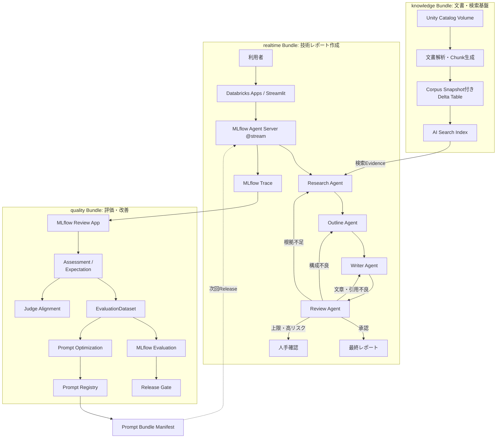
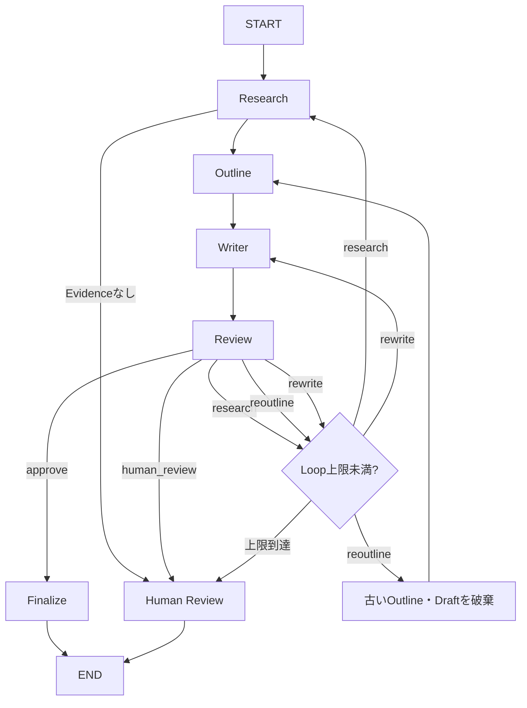
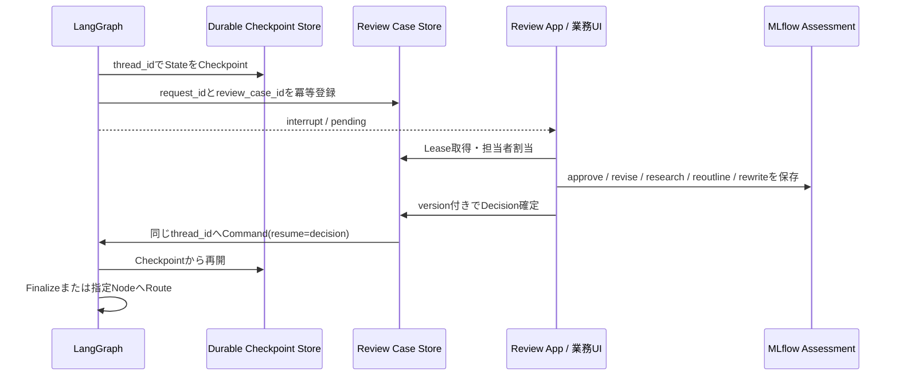
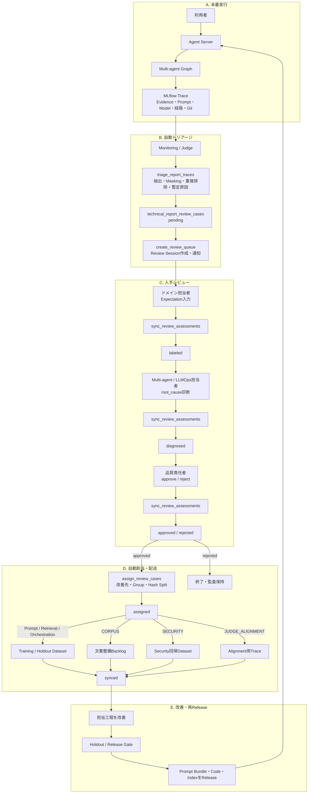
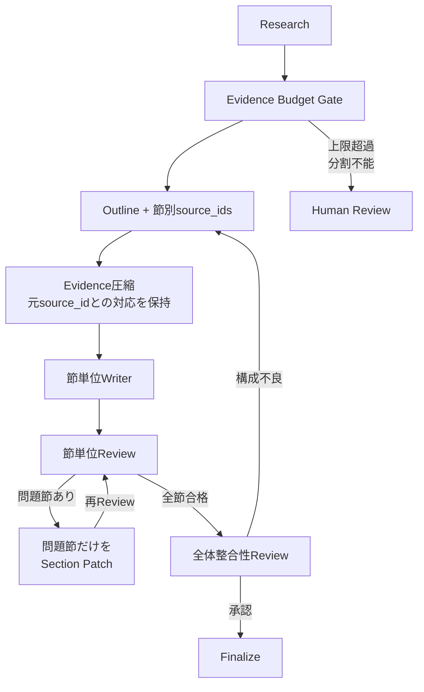

# 技術レポート作成マルチエージェント（完全版）

本章では、Unity Catalogで管理された社内技術文書を根拠として、調査、構成作成、執筆、レビューを分担し、レビュー結果に応じて再調査または改稿へ差し戻す技術レポート作成アプリケーションを構築する。単にLLMを4回順番に呼ぶのではなく、Evidence、構成案、Draft、Review判断をStateとして引き継ぎ、承認条件とLoop上限に基づいて実際の処理経路を変更する。

開発初期からすべてを同時に作らず、次の順序で段階的に構築する。

1. レポートの利用目的、対象読者、引用形式、自動公開可能範囲を定義する。
2. 共通PackageでEvidence、構成案、Review判断、Agent State、最終結果を定義する。
3. 調査、構成、執筆、レビューのPromptを役割ごとに登録する。
4. Corpus Snapshot、閲覧権限、公開可能範囲を固定して検索できるAI Search Indexを用意する。
5. LangGraphで調査、構成、執筆、レビュー、差し戻し、人手確認を実装する。
6. EvaluationDatasetと最終成果物・経路・協調品質のScorerを用意する。
7. Agent Serverの`@stream`とDatabricks Apps上のStreamlitを構築する。
8. 本番Traceへ専門家Assessmentを蓄積し、PromptとLLM Judgeを個別に改善する。
9. Holdout評価、Prompt Bundle Manifest、GitコミットでReleaseを管理する。

実装は1つのGitリポジトリで管理するが、デプロイ単位は`knowledge`、`quality`、`realtime`の3つのDatabricks Asset Bundleへ分割する。共通の型と判定値だけを`technical-report-common` Python Packageとして共有し、文書更新、品質改善、利用者向けアプリケーションを独立して変更できるようにする。

## アプリケーションの処理の流れ

### 全体構成

文書基盤、レポート作成、品質改善は実行周期と責任者が異なる。Corpus Snapshot、Prompt Version、モデル経路、GitコミットをTraceへ残し、後から同じ条件を再現できるようにする。



今回のResearch、Outline、Writer、Reviewは、独立したDatabricks Appsではなく、同じApplication内のLangGraph Nodeとして実装する。個別の権限境界、別TeamによるRelease、独立Scaling、他Applicationからの再利用が必要になった時点で、Apps AgentやServing Endpointへ分離する。

### レポート作成の流れ

| 手順 | 処理 | 主な保存内容 |
| --- | --- | --- |
| 1 | 利用者がテーマ、対象読者、目的、制約を入力する | `topic`、`audience`、`report_requirements` |
| 2 | Serverが認証済み利用者から閲覧権限を、業務Policyから公開範囲を決定する | `reader_entitlements`、`publication_scope`、`data_classification_ceiling` |
| 3 | 作成開始時点の全文書Version集合とPrompt Bundleを固定する | `corpus_snapshot_id`、`prompt_bundle_id` |
| 4 | Research Agentが検索Queryを作り、閲覧権限と公開範囲をFilterしてAI Searchを検索する | Query、Evidence、文書ID、版、公開区分、Score |
| 5 | Outline Agentが各節と利用するEvidenceを対応付ける | 見出し、目的、`source_ids` |
| 6 | Writer AgentがEvidenceにない事実を追加せずDraftを作る | 本文、引用、参考資料 |
| 7 | Review Agentが根拠、構成、禁止事項、読者適合性を判定する | `action`、指摘、未支持Claim |
| 8 | 根拠不足なら再調査、構成不良なら再構成、文章・引用不良なら改稿へ戻す | 経路、Loop回数 |
| 9 | 承認なら最終化し、上限到達または高リスクなら人手確認へ送る | `approved`、`requires_human_review` |
| 10 | Agent Serverが進捗と最終結果をSSEで返す | Responses API Event、Trace ID |

### Reviewと差し戻しの流れ



Review Agentの自由な判断だけで経路を決めず、Evidence 0件、Loop上限、機密区分、外部公開用途などはコードで強制する。意味的な品質はLLM Review、回数や権限など決定論的な条件はApplication Codeが担当する。

### 各エージェントの責務

| エージェント | 入力 | 出力 | やってはいけないこと |
| --- | --- | --- | --- |
| Research Agent | テーマ、Review指摘、Corpus Snapshot、閲覧権限、公開Policy | Evidence、調査メモ | 権限外・掲載不可文書の取得、出典の捏造 |
| Outline Agent | 調査メモ、Evidence、構成Review指摘 | 節構成、各節のEvidence ID | Evidenceにない節を根拠なく追加すること |
| Writer Agent | 構成案、Evidence、Review指摘 | 引用付きDraft | モデル内部知識による事実補完 |
| Review Agent | 要件、Evidence、構成案、Draft | 承認、再調査、再構成、改稿、人手確認 | 未支持Claimを残したまま承認すること |
| Finalizer | 承認済みDraft、Evidence | 最終レポート、参考資料一覧 | Draftの意味内容を変更すること |

### 各機能の責務

| 機能 | 所有Bundle | 責務 |
| --- | --- | --- |
| 文書Pipeline／AI Search | `knowledge` | 文書解析、Chunk、Corpus Snapshot、Index同期、Policy Filter付き検索を提供する。 |
| LangGraph | `realtime` | Agent State、差し戻し、Loop上限、人手確認経路を制御する。 |
| Foundation Model APIs | `realtime` | Research、Outline、Writer、Reviewの生成AI推論を提供する。 |
| MLflow Agent Server | `realtime` | Responses API、`@stream`、SSE、Trace集約を提供する。 |
| Streamlit | `realtime` | 要件入力、進捗、最終レポート、Feedback UIを提供する。 |
| Prompt Registry | `quality` | AgentごとのPromptを独立してVersion管理する。 |
| EvaluationDataset | `quality` | テーマ、制約、期待構成、期待Evidence、期待結果を保存する。 |
| MLflow Evaluation | `quality` | 最終品質、Evidence、経路、Agent協調を比較する。 |
| Review App／Assessment | `quality` | 専門家のFeedback、Expectation、原因診断、承認を収集する。 |
| Judge Alignment | `quality` | 自動Judgeを専門家のレポート評価基準へ合わせる。 |
| Git Version Tracking | 全Bundle | Code、DAB、Schema、Scorer、Prompt参照をGitコミットへ関連付ける。 |

## 開発段階で構築しておくべきもの

### 現実的な実装順序

開発段階では、次の順序で構築する。

1. レポート種別、対象読者、必須節、禁止事項、外部公開条件を決める。
2. Evidence、Outline、Review判断、Resultの共通Schemaを定義する。
3. 固定Corpus Snapshot、閲覧Entitlement、公開Policyを付けてAI Searchを検索できるようにする。
4. Agentごとの初期PromptをPrompt Registryへ登録する。
5. Research単体で期待文書を取得できることを確認する。
6. Outline、Writer、Reviewを順に追加し、各中間成果物を保存する。
7. 差し戻しとLoop上限をLangGraphで実装する。
8. 小さなEvaluationDatasetと決定論的Scorerを作る。
9. 最終品質とAgent協調を評価するJudgeを追加する。
10. Agent Serverの`@stream`とStreamlitを追加する。
11. DABで3 Bundleを独立してDeployできるようにする。

最初からReview Loopを複雑にせず、まずResearchが期待Evidenceを取得できることを確認する。検索できない事実をWriter Promptの工夫だけで補わせると、もっともらしい未支持Claimが増える。

### 開発段階で必要な成果物

```text
technical-report-agent/
├── packages/
│   └── technical-report-common/
│       ├── pyproject.toml
│       ├── src/technical_report_common/
│       │   ├── __init__.py
│       │   └── report_contracts.py
│       └── tests/
├── bundles/
│   ├── knowledge/
│   │   ├── databricks.yml
│   │   ├── resources/
│   │   │   ├── document_pipeline.yml
│   │   │   └── search_index_job.yml
│   │   ├── src/
│   │   │   ├── document_pipeline.py
│   │   │   ├── publish_corpus_snapshot.py
│   │   │   └── create_search_index.py
│   │   └── tests/
│   ├── quality/
│   │   ├── databricks.yml
│   │   ├── resources/
│   │   │   ├── evaluation_job.yml
│   │   │   ├── optimization_job.yml
│   │   │   ├── review_queue_job.yml
│   │   │   ├── monitoring_job.yml
│   │   │   └── judge_alignment_job.yml
│   │   ├── src/
│   │   │   ├── register_prompts.py
│   │   │   ├── seed_evaluation_dataset.py
│   │   │   ├── evaluate_report.py
│   │   │   ├── optimize_prompt.py
│   │   │   ├── release_gate.py
│   │   │   ├── publish_prompt_bundle.py
│   │   │   ├── create_review_queue.py
│   │   │   ├── sync_review_assessments.py
│   │   │   ├── assign_review_cases.py
│   │   │   ├── sync_evaluation_dataset.py
│   │   │   ├── register_monitoring.py
│   │   │   └── align_judge.py
│   │   └── tests/seed_evaluation_cases.json
│   └── realtime/
│       ├── databricks.yml
│       ├── resources/realtime_app.yml
│       ├── app/
│       │   ├── auth_context.py
│       │   ├── evidence_search.py
│       │   ├── prompt_bundle.py
│       │   ├── report_graph.py
│       │   ├── experiment_router.py
│       │   ├── agent.py
│       │   ├── start_server.py
│       │   ├── streamlit_app.py
│       │   ├── start.sh
│       │   ├── app.yaml
│       │   └── requirements.txt
│       └── tests/
└── tests/integration/
```

| Bundle／Package | 主な責務 | 独立させる理由 |
| --- | --- | --- |
| `technical-report-common` | Evidence、Outline、Review、State、Result | すべての工程で同じ契約を使うため |
| `knowledge` | 文書解析、Corpus Snapshot、AI Search Index | 文書更新をレポートApplicationのReleaseから分離するため |
| `quality` | Prompt、Dataset、評価、最適化、Review、Judge | 品質変更の権限と定期Jobを分離するため |
| `realtime` | LangGraph、Agent Server、Streamlit | 長時間Requestと利用者向けReleaseを独立管理するため |

独自のState、差し戻し先、Loop上限、Evidence固定が必要なため、本章ではLangGraphを使用する。既存の独立Agent、Genie Space、Serving Endpointを自然言語で束ねるだけならSupervisor Agentを先に検討し、独自の制御が必要な場合だけCustom Multi-agentへ進む。

### 実装例

#### 1. 共通のレポート契約を定義する

この実装では、Evidence、調査計画、構成案、Review判断、Graph State、最終結果を共通Packageへ定義する。`corpus_snapshot_id`は取り込みJob IDではなく、ある時点で検索対象となる全文書Version集合のIDである。`Evidence`には閲覧権限とは別に公開区分を保持し、外部成果物へ内部URIを出さない。`ReviewDecision`は`research`、`reoutline`、`rewrite`を分離し、構成不良をWriterだけで直そうとしない。`ReportResult`には決定論的Scorerが必要とする引用、Outline、経路、Policy情報も返す。

`packages/technical-report-common/src/technical_report_common/report_contracts.py`

```python
from __future__ import annotations

from typing import Literal, TypedDict

from pydantic import BaseModel, ConfigDict, Field


class Evidence(BaseModel):
    # AI Searchの検索結果を、引用・評価・監査で共通利用できる型へ正規化する。
    model_config = ConfigDict(extra="forbid")

    source_id: str = Field(description="レポート中で使用する安定した引用ID")
    chunk_id: str
    document_id: str
    document_version: str
    corpus_snapshot_id: str
    internal_title: str
    content: str
    internal_source_uri: str
    external_reference: str | None = None
    required_entitlement: str
    publication_scope: Literal["internal", "external"]
    data_classification: Literal["public", "internal", "confidential", "restricted"]
    publication_approved: bool
    has_conflict: bool = False
    page_number: int | None = None
    score: float | None = None


class ResearchPlan(BaseModel):
    # Research AgentがAI Searchへ送るQueryと確認観点を構造化する。
    model_config = ConfigDict(extra="forbid")

    queries: list[str] = Field(min_length=1, max_length=5)
    focus_points: list[str] = Field(default_factory=list)


class OutlineSection(BaseModel):
    # 各節の目的と利用Evidenceを対応付け、根拠のない節を検出可能にする。
    model_config = ConfigDict(extra="forbid")

    heading: str
    purpose: str
    source_ids: list[str] = Field(min_length=1)


class ReportOutline(BaseModel):
    # Writerへ渡す構成案を、自由文ではなく節の配列として保持する。
    model_config = ConfigDict(extra="forbid")

    title: str
    executive_summary_goal: str
    sections: list[OutlineSection] = Field(min_length=2, max_length=8)


class ReviewDecision(BaseModel):
    # ReviewコメントとGraphの次Actionを分離し、決定論的にRouteできるようにする。
    model_config = ConfigDict(extra="forbid")

    action: Literal["approve", "research", "reoutline", "rewrite", "human_review"]
    comments: str
    missing_topics: list[str] = Field(default_factory=list)
    unsupported_claims: list[str] = Field(default_factory=list)
    evidence_conflict: bool = False


class ReportState(TypedDict):
    # LangGraphの全Nodeが共有するStateを定義する。
    request_id: str
    topic: str
    audience: str
    report_requirements: str
    reader_entitlements: list[str]
    publication_scope: Literal["internal", "external"]
    data_classification_ceiling: Literal[
        "public", "internal", "confidential", "restricted"
    ]
    publication_policy_version: str
    corpus_snapshot_id: str
    prompt_bundle_id: str
    prompt_uris: dict[str, str]
    model_service: str
    source_git_commit: str
    experiment_id: str
    experiment_variant: str
    evidence: list[Evidence]
    research_notes: str
    outline: ReportOutline | None
    draft: str
    review_action: Literal[
        "approve", "research", "reoutline", "rewrite", "human_review"
    ]
    review_comments: str
    review_loop_count: int
    route_history: list[str]
    review_feedback_history: list[str]
    unsupported_claims_detected: list[str]
    evidence_conflict: bool
    context_budget_exceeded: bool
    approved: bool
    requires_human_review: bool
    review_case_id: str | None
    final_report: str


class ReportResult(BaseModel):
    # API利用者とEvaluationへ返す安定した出力契約を定義する。
    model_config = ConfigDict(extra="forbid")

    request_id: str
    report: str
    source_document_ids: list[str]
    evidence_source_ids: list[str]
    outline_source_ids: list[str]
    cited_source_ids: list[str]
    evidence_publication_scopes: list[str]
    route_history: list[str]
    review_feedback_history: list[str]
    unsupported_claims_detected: list[str]
    evidence_conflict: bool
    publication_scope: Literal["internal", "external"]
    publication_policy_version: str
    corpus_snapshot_id: str
    prompt_bundle_id: str
    experiment_id: str
    experiment_variant: str
    review_loop_count: int
    approved: bool
    requires_human_review: bool
    review_case_id: str | None
```

Pydanticを使用するのは、LLMの構造化出力、AI Search結果、Agent間の受け渡しを実行時に検証するためである。`TypedDict`の`ReportState`はLangGraphのState更新へ利用し、外部境界とLLM出力では検証機能を持つPydantic Modelを利用する。

#### 2. Agentごとの初期Promptを登録する

この実装では、Research計画、Researchメモ、Outline、Writer、Reviewerを別々のPromptとして登録する。1つの巨大なPromptへまとめると、Reviewer基準だけを変更したい場合でもResearchやWriterの挙動まで変化し、原因分析が難しくなる。各Promptは`@development`、`@candidate`、`@production`などのAliasで参照できるが、Alias自体にTraffic Splitはない。オンラインA/BテストではAgent ServerがVariantを固定し、Variantごとに明示的なPrompt Versionを選択する。

`bundles/quality/src/register_prompts.py`

```python
from __future__ import annotations

import mlflow


PROMPTS = {
    "main.llmops.report_research_plan": """
あなたは技術調査担当です。
テーマ、対象読者、要件、前回Review指摘から、社内AI Searchへ送る検索Queryを1〜5件作成してください。
同じ意味のQueryを重複させず、製品名、Version、エラーコードなど重要な固有語を保持してください。

テーマ: {{topic}}
対象読者: {{audience}}
要件: {{requirements}}
前回Review指摘: {{review_comments}}
""".strip(),
    "main.llmops.report_research_notes": """
あなたは技術調査担当です。
Evidenceだけを根拠として、テーマに関する調査メモを作成してください。
各記述へ[SRC-A1B2C3D4E5]形式で、提示された引用IDをそのまま付けてください。
Evidenceにない事実や新しい引用IDは追加しないでください。
文書間で内容が競合する場合は、Versionと競合内容を明示してください。

テーマ: {{topic}}
確認観点:
{{focus_points}}
Evidence:
{{evidence}}
""".strip(),
    "main.llmops.report_outline": """
あなたは技術レポートの構成担当です。
調査メモとEvidenceだけを利用し、対象読者と要件に合う構成案を作成してください。
各節には、その節で利用するsource_idsを最低1件指定してください。

テーマ: {{topic}}
対象読者: {{audience}}
要件: {{requirements}}
調査メモ:
{{research_notes}}
前回の構成Review指摘:
{{review_comments}}
""".strip(),
    "main.llmops.report_writer": """
あなたは技術レポートの執筆担当です。
構成案に従い、Evidenceに支持された内容だけでMarkdownレポートを作成してください。
技術的主張には[SRC-A1B2C3D4E5]形式で提示済みIDを引用し、未確認事項は未確認と記載してください。
前回Review指摘がある場合は、指摘された箇所を修正してください。

テーマ: {{topic}}
対象読者: {{audience}}
要件: {{requirements}}
構成案:
{{outline}}
Evidence:
{{evidence}}
前回Review指摘:
{{review_comments}}
""".strip(),
    "main.llmops.report_review": """
あなたは技術レポートの品質責任者です。
Evidenceへの忠実性、引用、必須節、論理構成、対象読者への適合性を確認してください。
根拠不足はresearch、章立て・節順・論理構成の問題はreoutline、
文章表現・引用・Draftだけの問題はrewrite、競合・高リスクはhuman_review、
問題がなければapproveを返してください。未支持Claimが1件でもあればapproveしてはいけません。

テーマ: {{topic}}
対象読者: {{audience}}
要件: {{requirements}}
Evidence:
{{evidence}}
構成案:
{{outline}}
Draft:
{{draft}}
""".strip(),
}


def register_initial_prompts() -> None:
    # AgentごとのPromptを独立したVersionとして登録し、初期Aliasを設定する。
    for name, template in PROMPTS.items():
        prompt = mlflow.genai.register_prompt(
            name=name,
            template=template,
            commit_message="Initial technical report prompt",
            tags={"application": "technical-report-agent"},
        )
        mlflow.genai.set_prompt_alias(
            name=name,
            alias="development",
            version=prompt.version,
        )


if __name__ == "__main__":
    register_initial_prompts()
```

Prompt RegistryはTemplateとVersionを管理する。実際の生成AIモデルはPrompt Bundle Manifestの`model_service`が指定するFoundation Model APIsのModel ServiceまたはServing Endpointであり、Prompt Registryからモデル推論が実行されるわけではない。`@development`、`@candidate`、`@production` AliasはQuality Jobが候補Versionを選び、後述する不変Version URIのManifestを作るまでにだけ利用する。RuntimeはAliasを解決しない。

#### 3. 全文書Version集合としてCorpus Snapshotを発行する

この実装では、取り込みJobの`ingestion_run_id`と、検索可能な全文書Version集合である`corpus_snapshot_id`を分離する。たとえば1件だけ更新した取り込みJobでも、新Snapshot Manifestには更新文書の新Versionと、更新されなかった全既存文書の有効Versionが含まれる。したがってAI Searchを`corpus_snapshot_id`でFilterしても既存文書が消えない。

Knowledge Bundleは次の2表を正本とする。

| 表 | 主な列 | 役割 |
| --- | --- | --- |
| `main.llmops.corpus_snapshot_manifest` | `corpus_snapshot_id`、`document_id`、`document_version`、`chunking_version`、`ingestion_run_id` | Snapshotに含まれる全文書Versionの対応を管理する。 |
| `main.llmops.corpus_snapshot_registry` | `corpus_snapshot_id`、`status`、`created_at`、`approved_at`、`search_index_sync_id` | `candidate`、`active`、`retired`とIndex同期・承認状態を管理する。 |

`bundles/knowledge/src/publish_corpus_snapshot.py`

```python
from __future__ import annotations

from pyspark.sql import SparkSession, Window, functions as F


MANIFEST_TABLE = "main.llmops.corpus_snapshot_manifest"
REGISTRY_TABLE = "main.llmops.corpus_snapshot_registry"
DOCUMENT_VERSION_TABLE = "main.llmops.document_versions"


def build_snapshot_manifest(
    spark: SparkSession,
    corpus_snapshot_id: str,
    cutoff_timestamp: str,
) -> None:
    # Cutoff時点で承認済みの最新Versionを文書ごとに1件選び、全文書集合を固定する。
    versions = spark.table(DOCUMENT_VERSION_TABLE).where(
        (F.col("approval_status") == "approved")
        & (F.col("effective_at") <= F.to_timestamp(F.lit(cutoff_timestamp)))
    )
    latest = (
        versions.withColumn(
            "version_rank",
            F.row_number().over(
                Window.partitionBy("document_id").orderBy(
                    F.col("effective_at").desc(), F.col("document_version").desc()
                )
            ),
        )
        .where(F.col("version_rank") == 1)
        .drop("version_rank")
        .withColumn("corpus_snapshot_id", F.lit(corpus_snapshot_id))
    )

    # 同じSnapshot IDの再実行を許さず、内容が後から変わることを防ぐ。
    if spark.table(MANIFEST_TABLE).where(
        F.col("corpus_snapshot_id") == corpus_snapshot_id
    ).limit(1).count():
        raise ValueError(f"Corpus Snapshot already exists: {corpus_snapshot_id}")
    latest.select(
        "corpus_snapshot_id",
        "document_id",
        "document_version",
        "chunking_version",
        "ingestion_run_id",
    ).write.mode("append").saveAsTable(MANIFEST_TABLE)


def register_candidate(spark: SparkSession, corpus_snapshot_id: str) -> None:
    # Search Index同期前のSnapshotをcandidateとしてRegistryへ登録する。
    spark.createDataFrame(
        [(corpus_snapshot_id, "candidate")],
        "corpus_snapshot_id string, status string",
    ).withColumn("created_at", F.current_timestamp()).write.mode("append").saveAsTable(
        REGISTRY_TABLE
    )
```

実運用ではManifestをChunk表へJoinし、Snapshot ID、閲覧Entitlement、公開区分、機密区分を持つ検索用Delta表を生成してAI Searchへ同期する。件数、欠落文書、ACL、公開区分を検証した後に、Registryの`active` Pointerを1 Transactionで候補へ切り替える。Request開始時に選んだSnapshot IDはStateへ固定し、途中でActive Pointerが変わっても再解決しない。Rollbackは文書を再取り込みせず、検証済みの前Snapshotを`active`へ戻す。Snapshot Manifest自体は不変であり、誤りは新しいSnapshotとして訂正する。

#### 4. Snapshot、閲覧権限、公開Policyを固定してEvidenceを検索する

この実装では、Research Agentが作った複数QueryをAI Searchへ送り、`reader_entitlements`、`publication_scope`、`data_classification_ceiling`、`corpus_snapshot_id`を検索前Filterへ適用する。閲覧可能でも外部掲載不可の文書は、外部向けRequestのLLM入力へ入れない。Clientの`audience`は文体指定にしか使わず、権限と公開区分は認証済みUser／GroupとServer側Policyから決定する。`source_id`は検索順ではなく文書、Version、Chunkから安定生成する。

`bundles/realtime/app/evidence_search.py`

```python
from __future__ import annotations

import hashlib
import os
from typing import Any, Literal

import mlflow
from databricks.ai_search.client import AISearchClient
from mlflow.entities import SpanType

from technical_report_common.report_contracts import Evidence


SEARCH_ENDPOINT = os.environ["AI_SEARCH_ENDPOINT_NAME"]
SEARCH_INDEX = os.environ["AI_SEARCH_INDEX_NAME"]

# Application起動時にClientとIndex Objectを取得し、Requestごとの再初期化を避ける。
search_client = AISearchClient()
search_index = search_client.get_index(
    endpoint_name=SEARCH_ENDPOINT,
    index_name=SEARCH_INDEX,
)


def build_source_id(document_id: str, version: str, chunk_id: str) -> str:
    # 文書・版・Chunkから短い安定IDを生成し、検索順位に依存しない引用IDを作る。
    raw = f"{document_id}:{version}:{chunk_id}".encode("utf-8")
    digest = hashlib.sha256(raw).hexdigest()[:10].upper()
    return f"SRC-{digest}"


def parse_rows(result: dict[str, Any]) -> list[Evidence]:
    # similarity_search()の配列形式を型付きEvidenceへ変換する。
    evidence = []
    for row in result.get("result", {}).get("data_array", []):
        evidence.append(
            Evidence(
                chunk_id=row[0],
                document_id=row[1],
                document_version=row[2],
                corpus_snapshot_id=row[3],
                internal_title=row[4],
                content=row[5],
                internal_source_uri=row[6],
                external_reference=row[7],
                required_entitlement=row[8],
                publication_scope=row[9],
                data_classification=row[10],
                publication_approved=row[11],
                has_conflict=row[12],
                page_number=row[13],
                score=row[-1],
                source_id=build_source_id(row[1], row[2], row[0]),
            )
        )
    return evidence


@mlflow.trace(name="search_report_evidence", span_type=SpanType.RETRIEVER)
def search_evidence(
    query: str,
    reader_entitlements: list[str],
    publication_scope: Literal["internal", "external"],
    data_classification_ceiling: str,
    corpus_snapshot_id: str,
) -> list[Evidence]:
    # 閲覧権限・公開Policy・Snapshotを検索前Filterへ適用し、LLM入力を決定論的に制限する。
    allowed_publication_scopes = (
        ["external"] if publication_scope == "external" else ["internal", "external"]
    )
    result = search_index.similarity_search(
        query_text=query,
        columns=[
            "chunk_id",
            "document_id",
            "document_version",
            "corpus_snapshot_id",
            "title",
            "chunk_to_retrieve",
            "source_uri",
            "external_reference",
            "required_entitlement",
            "publication_scope",
            "data_classification",
            "publication_approved",
            "has_conflict",
            "page_number",
        ],
        filters={
            "required_entitlement": reader_entitlements,
            "publication_scope": allowed_publication_scopes,
            "data_classification_rank <=": classification_rank(
                data_classification_ceiling
            ),
            "publication_approved": True,
            "corpus_snapshot_id": corpus_snapshot_id,
        },
        num_results=8,
        query_type="HYBRID",
    )
    evidence = parse_rows(result)
    if publication_scope == "external" and any(
        item.external_reference is None for item in evidence
    ):
        raise PermissionError("External Evidence requires a public reference")
    span = mlflow.get_current_active_span()
    if span is not None:
        # Scorerが取得内容を確認できるよう、EvidenceをRetriever Spanの出力へ残す。
        span.set_outputs([item.model_dump() for item in evidence])
    return evidence


def classification_rank(value: str) -> int:
    # 機密区分を比較可能な整数へ変換し、未知の値はFail Closedで拒否する。
    ranks = {"public": 0, "internal": 1, "confidential": 2, "restricted": 3}
    if value not in ranks:
        raise ValueError(f"Unknown data classification: {value}")
    return ranks[value]


def merge_evidence(items: list[Evidence]) -> list[Evidence]:
    # 複数Queryと再調査の結果をchunk_idで重複排除し、Scoreの高い順へ整列する。
    by_chunk: dict[str, Evidence] = {}
    for item in items:
        current = by_chunk.get(item.chunk_id)
        if current is None or (item.score or 0.0) > (current.score or 0.0):
            by_chunk[item.chunk_id] = item
    return sorted(
        by_chunk.values(),
        key=lambda item: item.score or 0.0,
        reverse=True,
    )
```

上記はStandard EndpointのFilter例である。Entitlement配列の一致方法や比較演算子は採用するIndex SchemaとEndpoint種別に合わせて事前検証し、必要ならFilter Adapterへ閉じ込める。外部向けでは`publication_scope=external`かつ`publication_approved=true`のEvidenceだけを取得する。検索後Filterは禁止し、Policy回帰Testには「閲覧可能だが掲載不可」の文書がLLM入力へ入らないことを含める。

#### 5. Prompt Bundle ManifestをRuntimeで解決する

この実装では、`PROMPT_BUNDLE_ID`からDelta表のManifestを1回取得し、5つの不変Prompt Version URI、Model Service、Corpus Snapshot、Git Commitを解決する。Manifestは`quality` Bundleが発行し、`realtime` Bundleは読み取り専用で利用する。1 RequestのStateへ解決結果をコピーするため、処理中のRelease切替やAlias変更でPromptが混在しない。

`main.llmops.technical_report_prompt_bundles`は次のSchemaを持つ。

| 列 | 内容 |
| --- | --- |
| `prompt_bundle_id` | 不変Bundle ID |
| `research_plan_uri`〜`review_uri` | `prompts:/name/version`形式の不変URI |
| `model_service` | Foundation Model APIs／Serving Endpoint名 |
| `corpus_snapshot_id` | 同Bundleで検証済みの全文書Version集合 |
| `source_git_commit` | 評価済みApplication Commit |
| `status` | `candidate`、`production`、`retired` |
| `created_at`、`approved_at` | 監査時刻 |

`bundles/realtime/app/prompt_bundle.py`

```python
from __future__ import annotations

import os
import re
from functools import lru_cache

from databricks.sdk import WorkspaceClient
from pydantic import BaseModel, ConfigDict


BUNDLE_TABLE = "main.llmops.technical_report_prompt_bundles"


class PromptBundle(BaseModel):
    # Runtimeが1 Requestで固定するPrompt・Model・Corpus・Codeの組を検証する。
    model_config = ConfigDict(extra="forbid", frozen=True)

    prompt_bundle_id: str
    prompt_uris: dict[str, str]
    model_service: str
    corpus_snapshot_id: str
    source_git_commit: str


@lru_cache(maxsize=32)
def load_prompt_bundle(prompt_bundle_id: str) -> PromptBundle:
    # SQL InjectionとAlias参照を防ぎ、完全一致する不変Manifestだけを取得する。
    if not re.fullmatch(r"[A-Za-z0-9._-]{1,128}", prompt_bundle_id):
        raise ValueError("Invalid prompt_bundle_id")
    statement = f"""
        SELECT research_plan_uri, research_notes_uri, outline_uri,
               writer_uri, review_uri, model_service,
               corpus_snapshot_id, source_git_commit
        FROM {BUNDLE_TABLE}
        WHERE prompt_bundle_id = '{prompt_bundle_id}'
    """
    response = WorkspaceClient().statement_execution.execute_statement(
        warehouse_id=os.environ["SQL_WAREHOUSE_ID"],
        statement=statement,
        wait_timeout="10s",
    )
    rows = response.result.data_array if response.result else []
    if len(rows) != 1:
        raise RuntimeError(f"Prompt Bundle must resolve to one row: {prompt_bundle_id}")
    row = rows[0]
    prompt_uris = dict(
        zip(
            ["research_plan", "research_notes", "outline", "writer", "review"],
            row[:5],
            strict=True,
        )
    )
    if any("@" in uri or not re.fullmatch(r"prompts:/[^/]+/[0-9]+", uri) for uri in prompt_uris.values()):
        raise RuntimeError("Runtime Prompt Bundle must contain immutable version URIs")
    return PromptBundle(
        prompt_bundle_id=prompt_bundle_id,
        prompt_uris=prompt_uris,
        model_service=row[5],
        corpus_snapshot_id=row[6],
        source_git_commit=row[7],
    )
```

Production切替は、Quality JobがHoldoutとRelease Gateを通過した候補Manifestを新規Insertし、Release Channel表の`production` Pointerを1 Transactionで新Bundle IDへ切り替える。Databricks Appへは解決済みの`PROMPT_BUNDLE_ID`を設定するか、Request開始時にChannel Pointerを解決する。Rollbackは前Bundle IDへPointerを戻すだけであり、Manifest行を上書きしない。Online Experimentでは`request_id`または`session_id`の安定HashでBundle IDを一度選び、StateとTraceへ固定する。`@production` AliasはManifest作成時の候補選択にだけ利用し、Runtimeでは利用しない。

Databricks SQL Statement Executionは標準機能だが、AtomicなRelease Channel更新、承認Workflow、Manifest不変性の制約は本資料で設計する運用実装である。

#### 6. 差し戻しを行うLangGraphマルチエージェント

この実装では、Research、Outline、Writer、ReviewをLangGraph Nodeとして分離する。Review Agentは`approve`、`research`、`reoutline`、`rewrite`、`human_review`を構造化出力で返す。`reoutline`では古いOutlineとDraftだけを破棄し、Research Evidenceと調査メモは維持する。Application CodeはLoop上限、Context上限、外部公開、Evidence競合をLLM判断より優先する。本コードはEvidenceを一括投入して全文生成する小〜中規模レポート向け最小実装であり、長文向け拡張は後述する。

実際のモデル推論は、`ChatDatabricks`の`ainvoke()`を呼ぶ5か所で発生する。`mlflow.genai.load_prompt()`はPrompt Templateの取得、`search_evidence()`はAI Searchの呼び出しであり、生成AIモデル推論ではない。

`bundles/realtime/app/report_graph.py`

```python
from __future__ import annotations

import asyncio
import re
import uuid
from functools import lru_cache
from typing import Any

import mlflow
from databricks_langchain import ChatDatabricks
from langchain_core.messages import HumanMessage
from langgraph.graph import END, START, StateGraph
from mlflow.entities import SpanType

from evidence_search import merge_evidence, search_evidence
from prompt_bundle import PromptBundle
from technical_report_common.report_contracts import (
    Evidence,
    ReportOutline,
    ReportResult,
    ReportState,
    ResearchPlan,
    ReviewDecision,
)


MAX_REVIEW_LOOPS = 2
MAX_EVIDENCE_ITEMS = 40
MAX_EVIDENCE_CHARACTERS = 120_000

# LangGraphとChatDatabricksの子Span、Token、Latency、Model情報を自動記録する。
mlflow.langchain.autolog()

@lru_cache(maxsize=8)
def get_llm(model_service: str) -> ChatDatabricks:
    # Manifestが固定したModel ServiceごとにClientを再利用する。ここでは推論は発生しない。
    return ChatDatabricks(endpoint=model_service, temperature=0.0)


def load_prompt(version_uri: str, **values: str) -> str:
    # Manifest内の不変Version URIからTemplateを取得し、実VersionをTraceへ記録する。
    if "@" in version_uri:
        raise ValueError("Runtime prompt URI must not use an alias")
    prompt = mlflow.genai.load_prompt(version_uri)
    mlflow.update_current_trace(
        tags={f"prompt.{prompt.name}.version": str(prompt.version)}
    )
    return prompt.format(**values)


def render_evidence(evidence: list[Evidence], publication_scope: str) -> str:
    # 外部向けでは内部TitleとURIを除外し、公開用参照だけをLLMへ渡す。
    return "\n\n".join(
        (
            f"[{item.source_id}] "
            f"{item.external_reference if publication_scope == 'external' else item.internal_title}\n"
            f"文書Version: {item.document_version}\n"
            f"出典: "
            f"{item.external_reference if publication_scope == 'external' else item.internal_source_uri}\n"
            f"本文: {item.content}"
        )
        for item in evidence
    )


def exceeds_context_budget(evidence: list[Evidence]) -> bool:
    # 最小実装では保守的な文字数上限を使い、超過時に黙ってEvidenceを切り捨てない。
    return len(evidence) > MAX_EVIDENCE_ITEMS or sum(
        len(item.content) for item in evidence
    ) > MAX_EVIDENCE_CHARACTERS


@mlflow.trace(name="research_agent", span_type=SpanType.AGENT)
async def research_node(state: ReportState) -> dict[str, Any]:
    # Review指摘を含めて検索計画を作り、複数QueryをAI Searchへ並列送信する。
    llm = get_llm(state["model_service"])
    instruction = load_prompt(
        state["prompt_uris"]["research_plan"],
        topic=state["topic"],
        audience=state["audience"],
        requirements=state["report_requirements"],
        review_comments=state["review_comments"] or "なし",
    )

    # 【モデル呼び出し1】検索Queryと確認観点をResearchPlan型で生成する。
    plan = await llm.with_structured_output(ResearchPlan).ainvoke(
        [HumanMessage(content=instruction)]
    )

    # AI Search SDKは同期APIなのでThreadへ逃がし、複数Queryを並列実行する。
    batches = await asyncio.gather(
        *[
            asyncio.to_thread(
                search_evidence,
                query,
                state["reader_entitlements"],
                state["publication_scope"],
                state["data_classification_ceiling"],
                state["corpus_snapshot_id"],
            )
            for query in plan.queries
        ]
    )
    combined = state["evidence"] + [item for batch in batches for item in batch]
    evidence = merge_evidence(combined)
    if not evidence:
        # Evidence 0件は後段のLLMへ送らず、条件分岐で人手確認へ進める。
        return {
            "evidence": [],
            "research_notes": "",
            "outline": None,
            "draft": "",
        }
    if exceeds_context_budget(evidence):
        # 上限超過を明示的なStateへ残し、後段でHuman Reviewへ強制する。
        return {
            "evidence": evidence,
            "research_notes": "",
            "outline": None,
            "draft": "",
            "context_budget_exceeded": True,
            "review_comments": "EvidenceがContext Budgetを超過しました。",
        }

    notes_instruction = load_prompt(
        state["prompt_uris"]["research_notes"],
        topic=state["topic"],
        focus_points="\n".join(f"- {item}" for item in plan.focus_points) or "指定なし",
        evidence=render_evidence(evidence, state["publication_scope"]),
    )

    # 【モデル呼び出し2】取得Evidenceだけに基づく引用付き調査メモを生成する。
    notes = await llm.ainvoke([HumanMessage(content=notes_instruction)])
    return {
        "evidence": evidence,
        "research_notes": str(notes.content),
        # 再調査後は古い構成案とDraftを破棄し、新Evidenceで作り直す。
        "outline": None,
        "draft": "",
    }


@mlflow.trace(name="outline_agent", span_type=SpanType.AGENT)
async def outline_node(state: ReportState) -> dict[str, Any]:
    # 調査メモから節構成を作り、各節へ利用Evidence IDを割り当てる。
    llm = get_llm(state["model_service"])
    instruction = load_prompt(
        state["prompt_uris"]["outline"],
        topic=state["topic"],
        audience=state["audience"],
        requirements=state["report_requirements"],
        research_notes=state["research_notes"],
        review_comments=state["review_comments"] or "なし",
    )

    # 【モデル呼び出し3】構成案をReportOutline型で生成する。
    outline = await llm.with_structured_output(ReportOutline).ainvoke(
        [HumanMessage(content=instruction)]
    )
    return {"outline": outline}


@mlflow.trace(name="writer_agent", span_type=SpanType.AGENT)
async def writer_node(state: ReportState) -> dict[str, Any]:
    # Evidence、構成案、前回Review指摘をまとめ、全文を再生成する。
    if state["outline"] is None:
        raise ValueError("Writer Agent requires an outline")
    llm = get_llm(state["model_service"])
    instruction = load_prompt(
        state["prompt_uris"]["writer"],
        topic=state["topic"],
        audience=state["audience"],
        requirements=state["report_requirements"],
        outline=state["outline"].model_dump_json(indent=2),
        evidence=render_evidence(state["evidence"], state["publication_scope"]),
        review_comments=state["review_comments"] or "なし",
    )

    # 【モデル呼び出し4】引用付きMarkdown Draftを生成する。
    response = await llm.ainvoke([HumanMessage(content=instruction)])
    return {"draft": str(response.content)}


@mlflow.trace(name="review_agent", span_type=SpanType.AGENT)
async def review_node(state: ReportState) -> dict[str, Any]:
    # EvidenceとDraftを同時に確認させ、次Actionと問題箇所を構造化して受け取る。
    if state["outline"] is None:
        raise ValueError("Review Agent requires an outline")
    llm = get_llm(state["model_service"])
    instruction = load_prompt(
        state["prompt_uris"]["review"],
        topic=state["topic"],
        audience=state["audience"],
        requirements=state["report_requirements"],
        evidence=render_evidence(state["evidence"], state["publication_scope"]),
        outline=state["outline"].model_dump_json(indent=2),
        draft=state["draft"],
    )

    # 【モデル呼び出し5】Review結果をReviewDecision型で生成する。
    decision = await llm.with_structured_output(ReviewDecision).ainvoke(
        [HumanMessage(content=instruction)]
    )
    policy_requires_human = (
        state["publication_scope"] == "external"
        or decision.evidence_conflict
        or any(item.has_conflict for item in state["evidence"])
        or any(
            item.data_classification in {"confidential", "restricted"}
            for item in state["evidence"]
        )
    )
    action = "human_review" if policy_requires_human else decision.action
    if action == "approve" and decision.missing_topics:
        # 必須Topic不足を報告しながらapproveする矛盾はResearch差し戻しへ補正する。
        action = "research"
    if action == "approve" and decision.unsupported_claims:
        # 構造化出力が矛盾した場合は承認せず、未支持Claimの改稿へ強制する。
        action = "rewrite"
    approved = action == "approve"
    loop_count = state["review_loop_count"] + int(
        action in {"research", "reoutline", "rewrite"}
    )
    return {
        "review_action": action,
        "review_comments": decision.comments,
        "review_loop_count": loop_count,
        "route_history": [*state["route_history"], action],
        "review_feedback_history": [
            *state["review_feedback_history"],
            decision.comments,
        ],
        "evidence_conflict": decision.evidence_conflict,
        "unsupported_claims_detected": decision.unsupported_claims,
        "approved": approved,
        "requires_human_review": action == "human_review",
    }


def route_after_research(state: ReportState) -> str:
    # Evidenceが1件もなければ、構成・執筆を行わず人手確認へ進める。
    if not state["evidence"] or state["context_budget_exceeded"]:
        return "human_review"
    return "outline"


def route_after_review(state: ReportState) -> str:
    # LLM判断へLoop上限を追加し、未承認Draftの無限改稿を防ぐ。
    if state["approved"]:
        return "finalize"
    if state["requires_human_review"]:
        return "human_review"
    if state["review_loop_count"] >= MAX_REVIEW_LOOPS:
        return "human_review"
    return state["review_action"]


def prepare_reoutline_node(state: ReportState) -> dict[str, Any]:
    # 構成不良時はEvidenceと調査メモを維持し、古いOutlineとDraftだけを破棄する。
    return {"outline": None, "draft": ""}


def finalize_node(state: ReportState) -> dict[str, Any]:
    # 公開範囲に応じた参照名だけを使い、内部URIを外部成果物へ露出させない。
    sources = "\n".join(
        (
            f"- [{item.source_id}] {item.external_reference}"
            if state["publication_scope"] == "external"
            else f"- [{item.source_id}] {item.internal_title} - {item.internal_source_uri}"
        )
        for item in state["evidence"]
    )
    return {
        "final_report": f"{state['draft']}\n\n## 参考資料\n{sources}",
        "requires_human_review": False,
    }


def human_review_node(state: ReportState) -> dict[str, Any]:
    # 最小構成ではReview Case IDを発行して未承認Draftを返し、Graphを終了する。
    reason = state["review_comments"] or "利用可能なEvidenceを取得できませんでした。"
    review_case_id = state["review_case_id"] or f"review-{state['request_id']}"
    route_history = state["route_history"]
    if not route_history or route_history[-1] != "human_review":
        route_history = [*route_history, "human_review"]
    return {
        "final_report": (
            "# 要人手確認\n\n"
            f"理由: {reason}\n\n"
            "以下は未承認Draftです。外部公開しないでください。\n\n"
            f"{state['draft']}"
        ),
        "approved": False,
        "requires_human_review": True,
        "review_case_id": review_case_id,
        "route_history": route_history,
    }


# ReportStateを共有するNodeとEdgeを定義する。
workflow = StateGraph(ReportState)
workflow.add_node("research", research_node)
workflow.add_node("outline", outline_node)
workflow.add_node("writer", writer_node)
workflow.add_node("review", review_node)
workflow.add_node("prepare_reoutline", prepare_reoutline_node)
workflow.add_node("finalize", finalize_node)
workflow.add_node("human_review", human_review_node)
workflow.add_edge(START, "research")
workflow.add_conditional_edges(
    "research",
    route_after_research,
    {"outline": "outline", "human_review": "human_review"},
)
workflow.add_edge("outline", "writer")
workflow.add_edge("writer", "review")
workflow.add_conditional_edges(
    "review",
    route_after_review,
    {
        "finalize": "finalize",
        "research": "research",
        "reoutline": "prepare_reoutline",
        "rewrite": "writer",
        "human_review": "human_review",
    },
)
workflow.add_edge("prepare_reoutline", "outline")
workflow.add_edge("finalize", END)
workflow.add_edge("human_review", END)
graph = workflow.compile()


def create_initial_state(
    topic: str,
    audience: str,
    report_requirements: str,
    reader_entitlements: list[str],
    publication_scope: str,
    data_classification_ceiling: str,
    publication_policy_version: str,
    prompt_bundle: PromptBundle,
    experiment_id: str = "offline",
    experiment_variant: str = "fixed",
) -> ReportState:
    # API入力から、すべてのNodeが期待する初期Stateを作成する。
    return ReportState(
        request_id=str(uuid.uuid4()),
        topic=topic,
        audience=audience,
        report_requirements=report_requirements,
        reader_entitlements=reader_entitlements,
        publication_scope=publication_scope,
        data_classification_ceiling=data_classification_ceiling,
        publication_policy_version=publication_policy_version,
        corpus_snapshot_id=prompt_bundle.corpus_snapshot_id,
        prompt_bundle_id=prompt_bundle.prompt_bundle_id,
        prompt_uris=prompt_bundle.prompt_uris,
        model_service=prompt_bundle.model_service,
        source_git_commit=prompt_bundle.source_git_commit,
        experiment_id=experiment_id,
        experiment_variant=experiment_variant,
        evidence=[],
        research_notes="",
        outline=None,
        draft="",
        review_action="rewrite",
        review_comments="",
        review_loop_count=0,
        route_history=[],
        review_feedback_history=[],
        unsupported_claims_detected=[],
        evidence_conflict=False,
        context_budget_exceeded=False,
        approved=False,
        requires_human_review=False,
        review_case_id=None,
        final_report="",
    )


def result_from_state(state: ReportState) -> ReportResult:
    # 内部StateからAPIとEvaluation用の安定したResultだけを抽出する。
    return ReportResult(
        request_id=state["request_id"],
        report=state["final_report"],
        source_document_ids=list(
            dict.fromkeys(item.document_id for item in state["evidence"])
        ),
        evidence_source_ids=[item.source_id for item in state["evidence"]],
        outline_source_ids=(
            list(
                dict.fromkeys(
                    source_id
                    for section in state["outline"].sections
                    for source_id in section.source_ids
                )
            )
            if state["outline"]
            else []
        ),
        cited_source_ids=list(
            dict.fromkeys(re.findall(r"\[(SRC-[A-F0-9]{10})\]", state["final_report"]))
        ),
        evidence_publication_scopes=list(
            dict.fromkeys(item.publication_scope for item in state["evidence"])
        ),
        route_history=state["route_history"],
        review_feedback_history=state["review_feedback_history"],
        unsupported_claims_detected=state["unsupported_claims_detected"],
        evidence_conflict=state["evidence_conflict"],
        publication_scope=state["publication_scope"],
        publication_policy_version=state["publication_policy_version"],
        corpus_snapshot_id=state["corpus_snapshot_id"],
        prompt_bundle_id=state["prompt_bundle_id"],
        experiment_id=state["experiment_id"],
        experiment_variant=state["experiment_variant"],
        review_loop_count=state["review_loop_count"],
        approved=state["approved"],
        requires_human_review=state["requires_human_review"],
        review_case_id=state["review_case_id"],
    )


@mlflow.trace(name="run_technical_report", span_type=SpanType.AGENT)
async def run_report(
    topic: str,
    audience: str,
    report_requirements: str,
    reader_entitlements: list[str],
    publication_scope: str,
    data_classification_ceiling: str,
    publication_policy_version: str,
    prompt_bundle: PromptBundle,
    experiment_id: str = "offline",
    experiment_variant: str = "fixed",
) -> ReportResult:
    # LangGraph全体を実行し、モデル・Snapshot・経路を1つのroot Traceへ集約する。
    initial_state = create_initial_state(
        topic,
        audience,
        report_requirements,
        reader_entitlements,
        publication_scope,
        data_classification_ceiling,
        publication_policy_version,
        prompt_bundle,
        experiment_id,
        experiment_variant,
    )
    mlflow.update_current_trace(
        tags={
            "report.model_service": prompt_bundle.model_service,
            "report.corpus_snapshot_id": prompt_bundle.corpus_snapshot_id,
            "report.prompt_bundle_id": prompt_bundle.prompt_bundle_id,
            "report.source_git_commit": prompt_bundle.source_git_commit,
            "report.publication_scope": publication_scope,
            "report.publication_policy_version": publication_policy_version,
            "report.experiment_id": experiment_id,
            "report.experiment_variant": experiment_variant,
        }
    )
    final_state = await graph.ainvoke(initial_state)
    result = result_from_state(final_state)
    mlflow.update_current_trace(
        tags={
            "needs_review": str(result.requires_human_review).lower(),
            "report.approved": str(result.approved).lower(),
            "report.review_loop_count": str(result.review_loop_count),
            "report.route_history": ",".join(result.route_history),
            "report.review_case_id": result.review_case_id or "",
        }
    )
    return result
```

モデル呼び出し経路は次のとおりである。

```text
Databricks Apps Resource
  ↓ PROMPT_BUNDLE_ID
Prompt Bundle Manifest.model_service
  ↓
ChatDatabricks(endpoint=state["model_service"])
  ↓ ainvoke()
Foundation Model APIsのModel Service／Serving Endpoint
  ↓
Endpointに構成された基盤モデル
```

Agent Serverは生成AIモデルをHostするServiceではない。Agent ServerはResponses API、`@stream`、SSE、Trace集約を提供し、実際の生成AI推論はGraph内の`ChatDatabricks`からFoundation Model APIsへ送る。

#### 7. 最小エスカレーションと再開可能なHuman-in-the-loopを分ける

上の`human_review_node()`は最小構成である。`review_case_id`を付けた未承認成果物を返し、自動公開せず、Graphを終了する。AgentはReview Case IDをTrace Tagへ残し、Quality Jobが同じIDでReview Queueへ冪等登録する。人間の判断後に同じGraphを再開する機能ではない。

金融機関向け本番構成では、LangGraphのdurable checkpointer、`thread_id`、`interrupt()`、`Command(resume=...)`を使い、Application Stateを永続化する。MLflow Agent ServerはTraceとResponses APIを提供するが、Application固有のLangGraph Checkpoint Store、Lease、再開冪等性を自動提供するものとして扱わない。これらは`realtime` Bundleと運用DBが責任を持つ。



| 項目 | 本番実装の責務 |
| --- | --- |
| 関連付け | `request_id`、`review_case_id`、LangGraph `thread_id`、Trace IDをReview Caseへ保存する。 |
| 二重処理 | `review_case_id`とDecision Versionに一意制約を設け、Lease所有者だけが状態を遷移させる。 |
| 冪等性 | Review Case登録、外部通知、公開処理へIdempotency Keyを渡し、`interrupt()`前の副作用を再実行可能にする。 |
| Timeout | SLA超過を監視し、担当者再割当、上位承認者Escalation、期限切れを記録する。 |
| 再開 | `approve`はFinalizer、`research`はResearch、`reoutline`は古いOutline・Draftを破棄してOutline、`rewrite`はWriterへ戻す。 |
| 監査 | 人間のDecision、理由、修正内容をMLflow Assessmentと業務Review表の両方へ保存する。 |

概念的には、同じ`thread_id`のConfigを使い、`Command(resume=decision)`をGraphへ渡してCheckpointから再開する。実際のCheckpointer製品、暗号化、DR、保持期間は金融機関のPlatform標準に従うため、この最小サンプルへ特定実装を埋め込まない。

#### 8. 開発用EvaluationDatasetとScorerを作る

この実装では、最終レポートの参照回答だけでなく、期待文書、必須節、禁止Claim、人手確認期待値をEvaluationDatasetへ保存する。全文一致ではなく、Evidence Recall、引用形式、Loop上限、人手確認判断、意味的品質を分けて評価する。

`bundles/quality/src/seed_evaluation_dataset.py`

```python
import mlflow
from mlflow.genai.datasets import create_dataset


def main() -> None:
    # 開発用Golden SetをUnity CatalogのEvaluationDatasetとして作成する。
    experiment = mlflow.set_experiment(
        "/Shared/llmops/technical-report-evaluation"
    )
    dataset = create_dataset(
        name="main.llmops.technical_report_golden",
        experiment_id=experiment.experiment_id,
    )
    dataset.merge_records(
        [
            {
                "inputs": {
                    "topic": "社内RAG基盤の設計と運用上の注意点",
                    "audience": "Platform Engineer",
                    "report_requirements": "構成、品質管理、権限、監視を含める",
                    "reader_entitlements": ["engineering"],
                    "publication_scope": "internal",
                    "data_classification_ceiling": "confidential",
                    "publication_policy_version": "publication-policy-v3",
                    "corpus_snapshot_id": "corpus-2026-08-01",
                    "prompt_bundle_id": "report-bundle-2026-08-01-a",
                },
                "expectations": {
                    "expected_document_ids": ["rag-architecture", "rag-operations"],
                    "expected_sections": ["構成", "品質管理", "アクセス制御", "監視"],
                    "prohibited_claims": ["根拠のない製品SLA"],
                    "expected_human_review": False,
                    "expected_routes": ["approve"],
                },
                "tags": {"case_family": "rag-architecture"},
            },
            {
                "inputs": {
                    "topic": "未公開Project Xの外部顧客向け仕様",
                    "audience": "External Customer",
                    "report_requirements": "公開可能な情報だけを利用する",
                    "reader_entitlements": ["engineering"],
                    "publication_scope": "external",
                    "data_classification_ceiling": "public",
                    "publication_policy_version": "publication-policy-v3",
                    "corpus_snapshot_id": "corpus-2026-08-01",
                    "prompt_bundle_id": "report-bundle-2026-08-01-a",
                },
                "expectations": {
                    "expected_document_ids": [],
                    "expected_sections": [],
                    "prohibited_claims": ["未公開仕様"],
                    "expected_human_review": True,
                    "expected_routes": ["human_review"],
                },
                "tags": {"case_family": "restricted-external-report"},
            },
            {
                "inputs": {
                    "topic": "基幹API移行の現状・移行案・Risk・承認条件",
                    "audience": "Architecture Review Board",
                    "report_requirements": "現状、移行案、Risk、承認条件の順序を必須とする",
                    "reader_entitlements": ["engineering"],
                    "publication_scope": "internal",
                    "data_classification_ceiling": "confidential",
                    "publication_policy_version": "publication-policy-v3",
                    "corpus_snapshot_id": "corpus-2026-08-01",
                    "prompt_bundle_id": "report-bundle-2026-08-01-a",
                },
                "expectations": {
                    "expected_document_ids": ["api-migration-plan"],
                    "expected_sections": ["現状", "移行案", "Risk", "承認条件"],
                    "prohibited_claims": [],
                    "expected_human_review": False,
                    "expected_routes": ["reoutline", "approve"],
                },
                "tags": {
                    "case_family": "outline-routing",
                    "evaluation_level": "routing",
                },
            },
        ]
    )


if __name__ == "__main__":
    main()
```

`outline-routing`は、過去Traceで初回Outlineの節順不良と`reoutline`後の修正が確認された回帰Caseとして登録する。新規作成した人工Caseへ必ず`reoutline`を期待すると生成揺らぎを経路不良と誤認するため、実際の運用では固定Evidenceと再現済みTraceから作成する。Graph Edge自体は、`ReviewDecision(action="reoutline")`を注入するUnit Testでも決定論的に検証する。

`bundles/quality/src/evaluate_report.py`

```python
import asyncio
import re

import mlflow
from mlflow.entities import Feedback
from mlflow.genai.datasets import get_dataset
from mlflow.genai.scorers import Correctness, Guidelines, scorer

from prompt_bundle import load_prompt_bundle
from report_graph import run_report


@scorer
def expected_source_recall(outputs: dict, expectations: dict) -> Feedback:
    # 期待文書IDに対して、実際に利用した文書IDのRecallを計算する。
    expected = set(expectations.get("expected_document_ids", []))
    actual = set(outputs.get("source_document_ids", []))
    if not expected:
        return Feedback(value=1.0, rationale="No source document is expected")
    recall = len(expected & actual) / len(expected)
    return Feedback(value=recall, rationale=f"expected={expected}, actual={actual}")


@scorer
def required_sections(outputs: dict, expectations: dict) -> Feedback:
    # 必須見出しがMarkdownレポートへすべて存在するか決定論的に確認する。
    report = outputs.get("report", "")
    expected = expectations.get("expected_sections", [])
    missing = [heading for heading in expected if heading.casefold() not in report.casefold()]
    return Feedback(value=not missing, rationale=f"missing_sections={missing}")


@scorer
def prohibited_claims_absent(outputs: dict, expectations: dict) -> Feedback:
    # 禁止Claimの文字列が成果物へ混入していないことをFail Closedで確認する。
    report = outputs.get("report", "").casefold()
    found = [
        claim
        for claim in expectations.get("prohibited_claims", [])
        if claim.casefold() in report
    ]
    return Feedback(value=not found, rationale=f"found_prohibited_claims={found}")


@scorer
def citation_syntax(outputs: dict) -> Feedback:
    # 引用候補がすべて[SRC-XXXXXXXXXX]形式であるかを形式だけ検証する。
    report = outputs.get("report", "")
    citations = re.findall(r"\[SRC-[A-F0-9]{10}\]", report)
    malformed = re.findall(r"\[SRC-[^\]]+\]", report)
    return Feedback(
        value=(bool(citations) and len(citations) == len(malformed))
        or outputs.get("requires_human_review", False),
        rationale=f"valid={len(citations)}, citation_like={len(malformed)}",
    )


@scorer
def citation_ids_exist(outputs: dict) -> Feedback:
    # Draftが引用したIDが実際に取得したEvidence IDの部分集合か確認する。
    cited = set(outputs.get("cited_source_ids", []))
    evidence = set(outputs.get("evidence_source_ids", []))
    missing = cited - evidence
    return Feedback(value=not missing, rationale=f"unknown_citation_ids={missing}")


@scorer
def outline_sources_used(outputs: dict) -> Feedback:
    # Outlineに割り当てたEvidence IDが最終Draftで引用されているか確認する。
    outlined = set(outputs.get("outline_source_ids", []))
    cited = set(outputs.get("cited_source_ids", []))
    missing = outlined - cited
    return Feedback(value=not missing, rationale=f"unused_outline_sources={missing}")


@scorer
def human_review_matches(outputs: dict, expectations: dict) -> Feedback:
    # Policy上期待するHuman Review判断と実経路を分離して比較する。
    expected_human = expectations.get("expected_human_review", False)
    actual_human = outputs.get("requires_human_review", False)
    return Feedback(
        value=expected_human == actual_human,
        rationale=f"expected={expected_human}, actual={actual_human}",
    )


@scorer
def loop_limit(outputs: dict) -> Feedback:
    # research、reoutline、rewriteを合算したReview Loopが上限内か確認する。
    loops = outputs.get("review_loop_count", 0)
    return Feedback(value=loops <= 2, rationale=f"review_loop_count={loops}")


@scorer
def routing_matches(outputs: dict, expectations: dict) -> Feedback:
    # 期待Actionが実際のRoute履歴へ含まれることを決定論的に確認する。
    expected = set(expectations.get("expected_routes", []))
    actual = set(outputs.get("route_history", []))
    return Feedback(value=expected <= actual, rationale=f"expected={expected}, actual={actual}")


@scorer
def reviewer_blocks_reported_unsupported_claims(outputs: dict) -> Feedback:
    # Reviewer自身が未支持Claimを検出したのにapproveした矛盾を決定論的に拒否する。
    claims = outputs.get("unsupported_claims_detected", [])
    approved = outputs.get("approved", False)
    return Feedback(
        value=not (claims and approved),
        rationale=f"unsupported_claims={claims}, approved={approved}",
    )


@scorer
def publication_policy(outputs: dict) -> Feedback:
    # 外部成果物では内部Evidence区分・内部URI・内部文書名の露出を拒否する。
    if outputs.get("publication_scope") != "external":
        return Feedback(value=True, rationale="Internal publication")
    report = outputs.get("report", "")
    external_only = set(outputs.get("evidence_publication_scopes", [])) <= {"external"}
    no_internal_reference = "dbfs:/" not in report and "main.llmops" not in report
    forced_human = outputs.get("requires_human_review", False)
    return Feedback(
        value=external_only and no_internal_reference and forced_human,
        rationale=(
            f"external_only={external_only}, no_internal_reference={no_internal_reference}, "
            f"forced_human={forced_human}"
        ),
    )


def predict_fn(**inputs) -> dict:
    # DatasetのBundle IDを不変Manifestへ解決し、本番と同じGraphへ渡す。
    bundle_id = inputs.pop("prompt_bundle_id")
    prompt_bundle = load_prompt_bundle(bundle_id)
    expected_snapshot = inputs.pop("corpus_snapshot_id")
    if prompt_bundle.corpus_snapshot_id != expected_snapshot:
        raise ValueError("Evaluation case and Prompt Bundle use different snapshots")
    return asyncio.run(run_report(prompt_bundle=prompt_bundle, **inputs)).model_dump()


professional_report = Guidelines(
    name="professional_report",
    guidelines=[
        "対象読者に適した専門的な文体であること。",
        "Evidenceにない断定を含まないこと。",
        "結論と根拠の対応が明確であること。",
    ],
)

claim_citation_support = Guidelines(
    name="claim_citation_support",
    guidelines=["各技術的主張が直後または同一段落の実在する引用で支持されていること。"],
)

reviewer_effectiveness = Guidelines(
    name="reviewer_effectiveness",
    guidelines=[
        "Review指摘後の改稿に指摘内容が反映されていること。",
        "ReviewerがEvidenceに支持されないClaimを承認していないこと。",
    ],
)

dataset = get_dataset(name="main.llmops.technical_report_golden")
mlflow.genai.evaluate(
    data=dataset,
    predict_fn=predict_fn,
    scorers=[
        expected_source_recall,
        required_sections,
        prohibited_claims_absent,
        citation_syntax,
        citation_ids_exist,
        outline_sources_used,
        human_review_matches,
        loop_limit,
        routing_matches,
        reviewer_blocks_reported_unsupported_claims,
        publication_policy,
        claim_citation_support,
        reviewer_effectiveness,
        professional_report,
        Correctness(),
    ],
)
```

検索設定を評価するときはPromptとモデルを固定し、期待文書Recallを比較する。Writer Promptを評価するときはEvidenceと構成案を固定し、文章品質とGroundednessを比較する。すべてを同時に変更すると、改善原因を特定できない。

| 評価Level | 主な対象 | 代表Scorer |
| --- | --- | --- |
| Agent単体 | Research、Outline、Writer、Reviewer | 期待文書Recall、必須節、未支持Claim検知 |
| Agent間Handoff | Evidence→Outline→Draft、Review→改稿 | Outline ID利用、Review指摘反映 |
| Routing | `research`、`reoutline`、`rewrite`、`human_review` | 期待Route、Loop上限、人手判断 |
| End-to-End | 公開する最終成果物 | 禁止Claim、引用実在、Claim支持、公開Policy、専門品質 |

必須節、禁止語、ID存在、集合包含、Loop、公開区分などはApplication Codeで決定論的に判定する。技術的主張と引用の意味的対応、指摘反映、Reviewerの見逃しだけをLLM Judgeへ任せる。Judge自体は専門家AssessmentでAlignmentし、Release Gateでは決定論的Security違反を平均Scoreで相殺しない。

#### 9. Agent Serverの`@stream`で進捗と最終結果を返す

この実装では、`graph.astream(..., stream_mode="updates")`でNode完了を受け取り、定型の進捗Eventだけを利用者へ送る。調査メモ、未承認Draft、Review内部指摘を途中表示すると機密情報や未承認内容を露出するため、内部成果物はTraceに限定する。最終レポートはReview完了後にのみSSEへ流す。`auth_context.current_principal()`はDatabricks Appsの認証済みRequest Contextを業務Principalへ変換するApplication固有Adapterであり、Client PayloadからUserやGroupを受け取らない。

`bundles/realtime/app/agent.py`

```python
from __future__ import annotations

import os
import uuid
from collections.abc import AsyncGenerator, Iterator
from typing import Any

import mlflow
from mlflow.genai.agent_server import stream
from mlflow.types.responses import ResponsesAgentRequest, ResponsesAgentStreamEvent

from auth_context import current_principal
from experiment_router import assign_variant
from prompt_bundle import load_prompt_bundle
from report_graph import create_initial_state, graph, result_from_state


PROGRESS_MESSAGES = {
    "research": "社内資料を調査しました。\n\n",
    "outline": "レポート構成を作成しました。\n\n",
    "writer": "Draftを作成しました。\n\n",
    "review": "品質Reviewを実行しました。\n\n",
    "prepare_reoutline": "Review指摘に基づき構成案を作り直します。\n\n",
    "finalize": "Reviewを通過しました。最終レポートを表示します。\n\n",
    "human_review": "自動処理を停止し、人手確認対象として返します。\n\n",
}


def get_user_topic(request: ResponsesAgentRequest) -> str:
    # Responses API入力を末尾から確認し、直近のUser Messageをテーマとして取得する。
    for item in reversed(request.input):
        message = item.model_dump() if hasattr(item, "model_dump") else item
        if message.get("role") == "user" and isinstance(message.get("content"), str):
            return message["content"]
    raise ValueError("Report topic was not provided")


def resolve_request_options(request: ResponsesAgentRequest) -> dict[str, Any]:
    # 認証MiddlewareのUser／GroupとServer Policyから閲覧権限・公開区分・機密上限を決める。
    custom = request.custom_inputs or {}
    principal = current_principal()
    requested_purpose = str(custom.get("publication_purpose", "internal_working"))
    if requested_purpose not in {"internal_working", "external_publication"}:
        raise ValueError("Unsupported publication purpose")
    publication_scope = (
        "external" if requested_purpose == "external_publication" else "internal"
    )
    reader_entitlements = sorted(
        set(principal.groups) & set(os.environ["ALLOWED_READER_GROUPS"].split(","))
    )
    if not reader_entitlements:
        raise PermissionError("No authorized document entitlement")
    stable_id = str(custom.get("session_id") or uuid.uuid4().hex)
    experiment_id = os.environ.get("ONLINE_EXPERIMENT_ID", "disabled")
    if experiment_id == "disabled":
        variant_name = "fixed"
        bundle_id = os.environ["PROMPT_BUNDLE_ID"]
    else:
        variant = assign_variant(stable_id)
        variant_name = variant.name
        bundle_id = variant.prompt_bundle_id
    prompt_bundle = load_prompt_bundle(bundle_id)
    if prompt_bundle.source_git_commit != os.environ["APP_GIT_COMMIT"]:
        raise RuntimeError("Prompt Bundle was not approved for this Git commit")
    return {
        "audience": str(custom.get("audience", "Technical Team")),
        "report_requirements": str(custom.get("requirements", "引用付きMarkdown")),
        "reader_entitlements": reader_entitlements,
        "publication_scope": publication_scope,
        "data_classification_ceiling": os.environ[
            f"{publication_scope.upper()}_CLASSIFICATION_CEILING"
        ],
        "publication_policy_version": os.environ["PUBLICATION_POLICY_VERSION"],
        "prompt_bundle": prompt_bundle,
        "experiment_id": experiment_id,
        "experiment_variant": variant_name,
    }


def chunk_text(text: str, size: int = 240) -> Iterator[str]:
    # 大きな最終レポートを一定長へ分け、SSE EventのPayloadを過大にしない。
    for start in range(0, len(text), size):
        yield text[start : start + size]


def text_delta(item_id: str, delta: str) -> ResponsesAgentStreamEvent:
    # Responses API互換のText Delta Eventを生成する。
    return ResponsesAgentStreamEvent(
        type="response.output_text.delta",
        item_id=item_id,
        delta=delta,
    )


@stream()
async def stream_report(
    request: ResponsesAgentRequest,
) -> AsyncGenerator[ResponsesAgentStreamEvent, None]:
    # Agent ServerへStreaming Handlerを登録し、Graph進捗と最終成果物をSSEで返す。
    topic = get_user_topic(request)
    options = resolve_request_options(request)
    state = create_initial_state(topic=topic, **options)
    item_id = f"msg_{uuid.uuid4().hex}"
    mlflow.update_current_trace(
        tags={
            "report.request_id": state["request_id"],
            "report.corpus_snapshot_id": state["corpus_snapshot_id"],
            "report.prompt_bundle_id": state["prompt_bundle_id"],
            "report.model_service": state["model_service"],
            "report.source_git_commit": state["source_git_commit"],
            "report.publication_scope": state["publication_scope"],
            "report.publication_policy_version": state[
                "publication_policy_version"
            ],
            "report.experiment_id": state["experiment_id"],
            "report.experiment_variant": state["experiment_variant"],
        }
    )
    streamed_text = "技術レポートの作成を開始します。\n\n"
    yield text_delta(item_id, streamed_text)

    # Nodeの更新だけを受け取り、中間本文を利用者へ露出せず進捗を通知する。
    async for update in graph.astream(state, stream_mode="updates"):
        for node_name, values in update.items():
            state.update(values)
            if message := PROGRESS_MESSAGES.get(node_name):
                streamed_text += message
                yield text_delta(item_id, message)

    result = result_from_state(state)
    mlflow.update_current_trace(
        tags={
            "needs_review": str(result.requires_human_review).lower(),
            "report.approved": str(result.approved).lower(),
            "report.review_loop_count": str(result.review_loop_count),
            "report.review_case_id": result.review_case_id or "",
            "report.route_history": ",".join(result.route_history),
        }
    )
    for chunk in chunk_text(result.report):
        # Review後の最終成果物だけを分割して送る。LLM生成中のToken Streamではない。
        streamed_text += chunk
        yield text_delta(item_id, chunk)

    yield ResponsesAgentStreamEvent(
        type="response.output_item.done",
        item={
            "id": item_id,
            "type": "message",
            "role": "assistant",
            "content": [
                {
                    "type": "output_text",
                    # Done Eventには、それまで送ったText Deltaを連結した完成本文を設定する。
                    "text": streamed_text,
                    "annotations": [],
                }
            ],
        },
    )
```

`@stream()`はAgent Server側のHandlerへ付ける。Streamlit側はSSE ClientなのでDecoratorを付けず、Payloadの`"stream": true`と`requests.post(stream=True)`で逐次受信する。本実装は未承認Draftを見せないため、最終本文のLLM Token Streamingではなく、Node進捗と承認後レポートのChunk Streamingを採用する。

#### 10. Agent Serverを起動しGitコミットへ関連付ける

この実装では、Agent ApplicationをModel Registryへ登録せず、GitコミットベースのVersion TrackingでTraceと実装を関連付ける。基盤LLMはFoundation Model APIs、PromptはPrompt Registry、Application CodeはGitという別々の正本を利用する。

`bundles/realtime/app/start_server.py`

```python
import os
import subprocess

import mlflow
from mlflow.genai.agent_server import (
    AgentServer,
    setup_mlflow_git_based_version_tracking,
)


def resolve_git_commit() -> str:
    # 実行中CodeのGitコミットを取得し、追跡不能な状態では起動を失敗させる。
    return subprocess.check_output(
        ["git", "rev-parse", "HEAD"],
        text=True,
    ).strip()


os.environ["APP_GIT_COMMIT"] = resolve_git_commit()
mlflow.set_tracking_uri("databricks")
mlflow.set_experiment(os.environ["MLFLOW_EXPERIMENT_NAME"])
setup_mlflow_git_based_version_tracking()

# Decoratorで登録されるStreaming HandlerをServer作成前にImportする。
import agent  # noqa: E402,F401


agent_server = AgentServer("ResponsesAgent")
app = agent_server.app


def main() -> None:
    # Databricks Apps内でResponses API互換のAgent Serverを起動する。
    agent_server.run(app_import_string="start_server:app")


if __name__ == "__main__":
    main()
```

#### 11. StreamlitからSSEを逐次表示する

この実装では、StreamlitがAgent Serverの`/invocations`へ`stream=true`でRequestを送り、`response.output_text.delta`だけを`st.write_stream()`へ渡す。利用者は対象読者、要件、利用目的を申告するが、`audience`は文体指定であって権限根拠ではない。Reader Entitlement、公開区分、機密上限、Corpus Snapshot、Prompt BundleはServer側で決定する。

`bundles/realtime/app/streamlit_app.py`

```python
from __future__ import annotations

import json

import requests
import streamlit as st


AGENT_SERVER_URL = "http://127.0.0.1:8001/invocations"


def stream_agent(
    topic: str,
    audience: str,
    requirements: str,
    publication_purpose: str,
):
    # Agent ServerのSSEから画面表示対象のText Deltaだけを順次返す。
    payload = {
        "input": [{"role": "user", "content": topic}],
        "custom_inputs": {
            "audience": audience,
            "requirements": requirements,
            "publication_purpose": publication_purpose,
        },
        "stream": True,
    }
    with requests.post(
        AGENT_SERVER_URL,
        json=payload,
        headers={"x-mlflow-return-trace-id": "true"},
        stream=True,
        timeout=900,
    ) as response:
        response.raise_for_status()
        for line in response.iter_lines(decode_unicode=True):
            if not line or not line.startswith("data: "):
                continue
            payload_text = line.removeprefix("data: ")
            if payload_text == "[DONE]":
                break
            event = json.loads(payload_text)
            if "error" in event:
                raise RuntimeError(event["error"])
            if event.get("type") == "response.output_text.delta":
                yield event.get("delta", "")
            if trace_id := event.get("trace_id"):
                st.session_state["last_trace_id"] = trace_id


st.set_page_config(page_title="技術レポート作成", layout="wide")
st.title("技術レポート作成マルチエージェント")
audience = st.text_input("対象読者", value="Technical Team")
requirements = st.text_area("レポート要件", value="引用付きMarkdown")
publication_purpose = st.selectbox(
    "利用目的",
    options=["internal_working", "external_publication"],
)

if topic := st.chat_input("レポートのテーマを入力してください"):
    with st.chat_message("user"):
        st.write(topic)
    try:
        with st.chat_message("assistant"):
            st.write_stream(
                stream_agent(topic, audience, requirements, publication_purpose)
            )
        if trace_id := st.session_state.get("last_trace_id"):
            st.caption(f"MLflow Trace ID: {trace_id}")
    except Exception as error:
        st.error(f"レポート作成に失敗しました: {error}")
```

#### 12. Databricks AppsでAgent ServerとStreamlitを起動する

この実装では、同じDatabricks App内でAgent Serverを内部Port 8001、Streamlitを公開Portで起動する。AI Search、Prompt Manifest参照用SQL Warehouse、Manifestに掲載可能なModel Service群をApps Resource／Service Principal権限で許可する。Manifestへ任意のEndpoint名を書けば呼べる設計にはしない。

`bundles/realtime/app/start.sh`

```bash
#!/usr/bin/env bash
set -euo pipefail

python start_server.py --port 8001 &
exec streamlit run streamlit_app.py \
  --server.address 0.0.0.0 \
  --server.port "${DATABRICKS_APP_PORT:-8000}" \
  --server.headless true
```

`bundles/realtime/app/app.yaml`

```yaml
command: ["bash", "start.sh"]

env:
  - name: AI_SEARCH_ENDPOINT_NAME
    value: internal-docs-search
  - name: AI_SEARCH_INDEX_NAME
    value: main.llmops.internal_docs_index
  - name: SQL_WAREHOUSE_ID
    valueFrom: prompt_manifest_warehouse
  - name: PROMPT_BUNDLE_ID
    value: report-bundle-2026-08-01-a
  - name: ONLINE_EXPERIMENT_ID
    value: disabled
  - name: ALLOWED_READER_GROUPS
    value: engineering,risk-review,external-publication-reviewers
  - name: INTERNAL_CLASSIFICATION_CEILING
    value: confidential
  - name: EXTERNAL_CLASSIFICATION_CEILING
    value: public
  - name: PUBLICATION_POLICY_VERSION
    value: publication-policy-v3
  - name: MLFLOW_EXPERIMENT_NAME
    value: /Shared/llmops/technical-report-realtime
```

`bundles/realtime/app/requirements.txt`

```text
./wheels/technical_report_common-0.1.0-py3-none-any.whl
databricks-ai-search
databricks-langchain
databricks-sdk
langgraph
mlflow>=3.6
pydantic>=2
requests
streamlit
```

Foundation Model APIsのPay-per-token Model Serviceを利用する場合、基盤モデルを自分たちのModel Registryへ登録しない。自社Fine-tuned ModelまたはCustom ModelをServingする場合だけUnity Catalog Model Registryが関与する。Agent ApplicationのVersionはGit、PromptはPrompt Registryで管理する。

## 運用段階で構築しておくべきもの

### 現実的な実装順序

運用開始後は、次の順番で改善Loopを構築する。

1. 本番TraceへEvidence、構成案、Review経路、Prompt Version、モデル経路を保存する。
2. 上限到達、人手確認、低評価、Judge不一致のTraceをReview Appへ送る。
3. ドメイン担当者が期待レポート、期待Evidence、必須節、公開可否を入力する。
4. Multi-agent／LLMOps担当者が最初に破綻した工程を`root_cause`として確定する。
5. 品質責任者がExpectationと原因診断を承認または却下する。
6. Quality Jobが改善先と`train`、`holdout`、`excluded`を固定Ruleで割り当てる。
7. Application改善ケースをEvaluationDatasetへ、文書・Security・Judge問題を専用Backlogへ配送する。
8. 1回のExperimentでは1つのAgent Promptまたは1つの検索設定だけを変更する。
9. Holdout Datasetで最終成果物、Evidence、経路、協調品質を比較する。
10. 合格したPrompt Bundle Manifestだけを段階的にReleaseする。
11. 本番TraceへProduction Monitoringと初期Judgeを設定する。
12. 人間とJudgeの同名Feedbackを蓄積し、Judgeを`align()`する。
13. PromptとモデルのOnline ExperimentはRequest／Session単位でVariantを固定する。

Application改善と評価器改善を分離する。Expectationは理想的なEvidence、構成、レポート、経路を示し、EvaluationDatasetとPrompt Optimizationへ利用する。Feedbackは実際のTraceに対する評価であり、LLM Judge Alignmentへ利用する。Judgeが誤っているケースまでWriter Prompt改善へ送らない。

### 運用段階で必要な成果物

| 成果物 | 所有Bundle | 用途 |
| --- | --- | --- |
| `technical_report_review_cases` | `quality` | Trace、期待値、原因、改善先、Split、承認、配送状態を管理する。 |
| Training EvaluationDataset | `quality` | Prompt Optimizationと検索設定探索へ利用する。 |
| Holdout EvaluationDataset | `quality` | 最終Release判定専用として隔離する。 |
| Review App／Assessment Schema | `quality` | 専門家のFeedback、Expectation、原因、承認を収集する。 |
| Prompt Optimization Job | `quality` | Agentごとの候補Prompt Versionを生成する。 |
| Prompt Bundle Manifest | `quality` | 5つのPrompt Version、モデル、Corpus Snapshot、Gitを1つのReleaseとして固定する。 |
| Release Gate Job | `quality` | 内容、Evidence、経路、ACL、性能、Costを判定する。 |
| Production Monitoring | `quality` | 本番TraceをSample評価し、全件の数値指標を集計する。 |
| Judge Alignment Job | `quality` | 専門家FeedbackからAligned Judge候補を作る。 |
| Experiment Assignment Table | `quality` | Prompt／モデルVariantの安定割当と期間を保存する。 |
| Git-based LoggedModel | `realtime` | Agent TraceとGitコミットを対応付ける。 |

### 実装例

#### 1. 本番レビュー結果を保存する

この実装では、本番Traceに対する専門家ReviewをDeltaテーブルへ正規化して保存する。ドメイン担当者は業務上の期待レポートとEvidence、Multi-agent／LLMOps担当者は技術原因、品質責任者は採用可否を担当する。`improvement_target`と`dataset_split`は承認後にQuality Jobが固定Ruleで決定し、Reviewerが都合よく変更できないようにする。

##### 人とシステムを含む全体像



各資産の役割を分離する。

| 資産 | 役割 | 主な書き込み主体 |
| --- | --- | --- |
| MLflow Trace | 本番実行のEvidence、Agent Span、Prompt、Model、経路を保持する証拠 | Realtime Agent、Monitoring、Reviewer |
| MLflow Review App | 人がExpectation、原因、承認を入力するUI | 3種類のReviewer |
| `technical_report_review_cases` | 現在状態、確定値、Split、配送結果を管理するWorkflowの正本 | Quality Job |
| EvaluationDataset | Prompt、検索、経路を改善・評価する再現可能なCase集合 | Quality Job |
| 専用Backlog／Dataset | 文書、Security、JudgeなどApplication Dataset外の改善先 | Router Job、担当Team |

工程ごとの分担は次のとおりである。

| 工程 | システムが行うこと | 人が行うこと | 終了状態 |
| --- | --- | --- | --- |
| 本番実行 | Agent Span、Evidence、Prompt、Model、経路をTrace化する | テーマと要件を入力する | 状態なし |
| 候補抽出 | 上限到達、低評価、Judge不一致、Evidence 0件を抽出する | なし | `pending` |
| Expectation入力 | Assessmentを検証してDeltaへ同期する | 期待レポート、Evidence、必須節、公開可否を入力する | `labeled` |
| 原因診断 | Trace、Span、Snapshot、Prompt Versionを提示する | 最初に破綻した工程を確定する | `diagnosed` |
| 承認 | 権限と必須項目を検証して判断を同期する | 品質責任者が採用または却下する | `approved`／`rejected` |
| 割当 | 固定Mappingと安定Hashで改善先・Splitを決める | なし | `assigned` |
| 配送 | Datasetまたは専用Backlogへ冪等に反映する | なし | `synced` |
| 改善・Release | EvaluationとRelease Gateを実行する | 担当者が修正し責任者がReleaseを承認する | 新Traceへ循環 |

Deltaテーブルには次の列を持たせる。

| 列 | 内容 | 誰が設定するか | いつ | 判断・方法 |
| --- | --- | --- | --- | --- |
| `review_case_id` | Review Case ID | Quality Job | 候補作成時 | Trace IDとReview Cycleから安定IDを生成する |
| `source_trace_id` | 元の本番Trace ID | Quality Job | 候補作成時 | `mlflow.search_traces()`のTrace IDを転記する |
| `topic_redacted` | Masking済みテーマ | Quality Job | Delta保存前 | 個人情報、Secret、顧客識別子を除去する |
| `audience` | 対象読者 | Realtime Agent | Trace生成時 | Requestの検証済み値を記録する |
| `report_requirements` | レポート要件 | Realtime Agent | Trace生成時 | Masking後の検証済み要件を記録する |
| `reader_entitlements` | 実行時の閲覧権限 | Realtime Agent | Request開始時 | 認証済みUser／Groupと許可Listの積集合をServer側で解決する |
| `publication_scope` | 成果物の公開範囲 | Realtime Agent | Request開始時 | 利用目的とServer Policyから`internal`／`external`を決める。Audienceは使わない |
| `data_classification_ceiling` | 利用可能な最高機密区分 | Realtime Agent | Request開始時 | Group、公開範囲、業務Policyの最も厳しい上限を採用する |
| `publication_policy_version` | 公開判定RuleのVersion | Realtime Agent | Request開始時 | Deploy済みServer PolicyのGit管理Versionを記録する |
| `corpus_snapshot_id` | 評価対象文書集合 | Knowledge Job | Index Release時 | 文書、Chunk、Indexの組合せを一意にする |
| `case_group_id` | 類似Caseの安定Group | Quality Job | Split前 | Topic Family、Snapshot、公開範囲、期待経路をHash化する |
| `expected_report_redacted` | 承認済み期待レポート | ドメイン担当者 | Labeling時 | 承認済み資料だけを根拠に入力する |
| `expected_document_ids` | 必要な文書ID | ドメイン担当者 | Labeling時 | 実際に検索された文書ではなく本来必要な文書を入力する |
| `expected_sections` | 必須節 | ドメイン担当者 | Labeling時 | 利用目的と対象読者から必要節を決める |
| `expected_human_review` | 人手確認が正解か | ドメイン担当者 | Labeling時 | 外部公開、競合Evidence、権限不足などPolicyで決める |
| `expected_routes` | 期待する差し戻し経路 | Multi-agent／LLMOps担当者 | 診断時 | `research`、`reoutline`、`rewrite`、`human_review`から選ぶ |
| `prohibited_claims` | 成果物へ含めてはいけないClaim | ドメイン担当者 | Labeling時 | 規制、契約、公開Policyから具体的に定義する |
| `proposed_root_cause` | 未確定原因候補 | Quality Job | 候補作成時 | Trace TagとAssessmentからRule Baseで付与する |
| `root_cause` | 確定原因 | Multi-agent／LLMOps担当者 | 診断時 | 最初に破綻した主要工程を選ぶ |
| `improvement_target` | 改善対象 | Quality Job | 承認後 | Git管理された固定Mappingで変換する |
| `dataset_split` | `train`、`holdout`、`excluded` | Quality Job | 承認後 | `case_group_id`の安定Hashで決める |
| `split_bucket` | 0〜99のHash値 | Quality Job | Split時 | `xxhash64(case_group_id) mod 100`で計算する |
| `split_policy_version` | Split Rule Version | Quality Job | Split時 | Git管理Versionを保存する |
| `review_status` | Review状態 | Quality Job | 各工程完了時 | 定義済み状態遷移だけを許可する |
| `review_rationale` | 判定・修正理由 | 各Reviewer | Review時 | Reviewer、時刻付きで追記する |
| `labeled_by` | Expectation入力者 | 同期Job | Label同期時 | Human Assessmentの`source_id`から設定する |
| `diagnosed_by` | 原因診断者 | 同期Job | 原因同期時 | Human Assessmentの`source_id`から設定する |
| `approved_by` | 承認者 | 同期Job | 承認同期時 | 承認Assessmentから設定する |
| `source_git_commit` | 問題発生時Git Commit | Realtime Agent | Trace生成時 | Git-based Version Trackingから転記する |
| `source_prompt_bundle_id` | Prompt組合せVersion | Realtime Agent | Trace生成時 | Requestで固定したRelease Manifest IDを記録する |
| `source_model_variant` | 実際のModel Variant | Realtime Agent | Trace生成時 | Experiment Assignmentと実Routeを記録する |

`root_cause`と改善先は次のように対応させる。

| 最初に破綻した工程 | `root_cause` | `improvement_target` |
| --- | --- | --- |
| 必要文書が管理対象にない | `DOCUMENT` | `CORPUS` |
| 文書はあるが解析・Chunk境界が不適切 | `CHUNK` | `INGESTION` |
| 文書はあるが検索されない | `RETRIEVAL` | `RETRIEVAL` |
| Queryまたは調査メモが不適切 | `RESEARCH` | `RESEARCH_PROMPT` |
| 必須節やEvidence対応が不適切で`reoutline`すべき | `OUTLINE` | `OUTLINE_PROMPT` |
| Evidence取得済みだが本文・引用が誤る | `WRITER` | `WRITER_PROMPT` |
| 正しいDraftをReviewerが誤って差し戻す | `REVIEWER` | `REVIEW_PROMPT` |
| 無意味なLoop、誤った差し戻し先 | `ROUTING` | `ORCHESTRATION` |
| 権限外文書を取得・引用した | `ACL` | `SECURITY` |
| 閲覧可能だが公開不可の情報を利用した | `PUBLICATION_POLICY` | `SECURITY` |
| Evidence上限超過や長文分割が不適切 | `CONTEXT_BUDGET` | `ORCHESTRATION` |
| Checkpoint、Lease、再開経路が誤る | `HITL` | `ORCHESTRATION` |
| Applicationは正しいが自動Judgeが誤判定 | `JUDGE` | `JUDGE_ALIGNMENT` |

Jobは人手入力を待機し続けず、個別Runへ分ける。

| Job Task | 実行契機 | 処理 |
| --- | --- | --- |
| `triage_report_traces` | 日次 | Review候補、Masking済み入力、暫定原因をDeltaへ保存する |
| `create_review_queue` | 候補作成後 | TraceをLabeling Sessionへ追加して担当Groupへ通知する |
| `sync_review_assessments` | 日次 | AssessmentをDeltaへ正規化し状態を進める |
| `assign_review_cases` | 承認同期後 | 改善先、Group、Splitを固定Ruleで設定する |
| `sync_evaluation_dataset` | 割当後 | Application改善CaseをTraining／Holdoutへ反映する |
| `route_specialized_cases` | 割当後 | Corpus、Security、Judgeを専用改善先へ反映する |

`synced`はEvaluationDataset登録済みだけを意味せず、決定された改善資産への配送が成功したことを意味する。配送失敗時は`assigned`のまま残し、同じ`review_case_id`で再実行する。

#### 2. MLflow EvaluationDatasetを育てる

この実装では、承認済みCaseをTrainingとHoldoutへ分けて継続追加する。TrainingはPrompt Optimizationや検索設定探索に利用し、Holdoutは候補の最終Release判定だけに利用する。同じ`case_group_id`に属する言い換えTopicを別Splitへ分散させない。

| Dataset | 用途 | 更新方針 |
| --- | --- | --- |
| `main.llmops.technical_report_train` | Prompt Optimization、検索・経路探索 | 承認済み失敗Caseと代表正常Caseを継続追加する |
| `main.llmops.technical_report_holdout` | 最終回帰・Release Gate | 最適化から隔離し、変更を品質責任者が承認する |

`bundles/quality/src/sync_evaluation_dataset.py`

```python
import mlflow
from mlflow.exceptions import MlflowException
from mlflow.genai.datasets import create_dataset, get_dataset
from pyspark.sql import SparkSession


EXPERIMENT = mlflow.set_experiment(
    "/Shared/llmops/technical-report-evaluation"
)
spark = SparkSession.builder.getOrCreate()


def get_or_create_dataset(name: str):
    # 定期Jobを再実行しても同じEvaluationDatasetを利用する。
    try:
        return get_dataset(name=name)
    except MlflowException:
        return create_dataset(
            name=name,
            experiment_id=EXPERIMENT.experiment_id,
        )


def to_record(row) -> dict:
    # Deltaの承認済みCaseをinputs、expectations、tagsへ正規化する。
    return {
        "inputs": {
            "topic": row.topic_redacted,
            "audience": row.audience,
            "report_requirements": row.report_requirements,
            "reader_entitlements": row.reader_entitlements,
            "publication_scope": row.publication_scope,
            "data_classification_ceiling": row.data_classification_ceiling,
            "publication_policy_version": row.publication_policy_version,
            "corpus_snapshot_id": row.corpus_snapshot_id,
            "prompt_bundle_id": row.source_prompt_bundle_id,
        },
        "expectations": {
            "expected_report": row.expected_report_redacted,
            "expected_document_ids": row.expected_document_ids,
            "expected_sections": row.expected_sections,
            "expected_human_review": row.expected_human_review,
            "expected_routes": row.expected_routes,
            "prohibited_claims": row.prohibited_claims,
        },
        "tags": {
            "review_case_id": row.review_case_id,
            "case_group_id": row.case_group_id,
            "root_cause": row.root_cause,
            "improvement_target": row.improvement_target,
            "source_trace_id": row.source_trace_id,
        },
    }


def main() -> None:
    # assigned状態のApplication改善CaseをSplit別Datasetへ冪等に反映する。
    rows = (
        spark.table("main.llmops.technical_report_review_cases")
        .filter(
            "review_status = 'assigned' AND "
            "dataset_split IN ('train', 'holdout')"
        )
        .collect()
    )
    train = get_or_create_dataset("main.llmops.technical_report_train")
    holdout = get_or_create_dataset("main.llmops.technical_report_holdout")
    train.merge_records([to_record(row) for row in rows if row.dataset_split == "train"])
    holdout.merge_records(
        [to_record(row) for row in rows if row.dataset_split == "holdout"]
    )


if __name__ == "__main__":
    main()
```

Prompt Optimization用`train_data`とJudge Alignment用Traceは目的が異なるため別資産として管理する。Prompt Datasetは理想出力を学習信号としてPrompt候補を選ぶために使い、Alignment Traceは実際のTraceに対する人間とJudgeの同名Feedback差分を使う。Aligned Judgeが見たCaseをそのJudge自身の最終検証へ再利用しない。

#### 3. Agent Promptを1つずつ最適化する

この実装では、Writer Promptだけを最適化し、Research、Outline、Reviewer、モデル、Snapshotを固定する。複数Promptを同時に最適化すると、最終品質が変化した原因とAgent間の責任境界が分からなくなる。次のExperimentでは別のPromptを対象にし、同じHoldoutで比較する。

`bundles/quality/src/optimize_prompt.py`

```python
import asyncio

import mlflow
from mlflow.genai.datasets import get_dataset
from mlflow.genai.optimize import GepaPromptOptimizer, optimize_prompts
from mlflow.genai.scorers import Correctness, Guidelines

from prompt_bundle import load_prompt_bundle
from report_graph import run_report

TARGET_PROMPT_URI = "prompts:/main.llmops.report_writer@candidate"

def build_candidate_bundle(base_bundle_id: str):
    # Optimization段階だけAliasを解決し、Graphへは不変Version URIを持つ候補Bundleを渡す。
    base = load_prompt_bundle(base_bundle_id)
    target = mlflow.genai.load_prompt(TARGET_PROMPT_URI)
    prompt_uris = dict(base.prompt_uris)
    prompt_uris["writer"] = f"prompts:/{target.name}/{target.version}"
    return base.model_copy(update={"prompt_uris": prompt_uris})


def predict_fn(**inputs) -> dict:
    # Datasetに記録された基準BundleのWriterだけを候補Versionへ置換してGraphを実行する。
    base_bundle_id = inputs.pop("prompt_bundle_id")
    candidate_bundle = build_candidate_bundle(base_bundle_id)
    expected_snapshot = inputs.pop("corpus_snapshot_id")
    if candidate_bundle.corpus_snapshot_id != expected_snapshot:
        raise ValueError("Training case and candidate Bundle use different snapshots")
    return asyncio.run(
        run_report(prompt_bundle=candidate_bundle, **inputs)
    ).model_dump()


def main() -> None:
    # Training Datasetだけを使い、Writer Prompt候補を生成する。Aliasはこの工程だけで利用する。
    train_dataset = get_dataset(name="main.llmops.technical_report_train")
    result = optimize_prompts(
        predict_fn=predict_fn,
        train_data=train_dataset,
        prompt_uris=[TARGET_PROMPT_URI],
        optimizer=GepaPromptOptimizer(
            reflection_model="databricks:/system.ai.claude-sonnet-4-5",
            max_metric_calls=100,
            display_progress_bar=False,
        ),
        scorers=[
            Correctness(),
            Guidelines(
                name="grounded_writer",
                guidelines=[
                    "Evidenceにない事実を追加しないこと。",
                    "技術的主張に[SRC-A1B2C3D4E5]形式の実在する引用があること。",
                ],
            ),
        ],
    )
    print(result)


if __name__ == "__main__":
    main()
```

OptimizerのReflection Model、Applicationが生成に使うModel、Evaluation Judgeは別の役割である。すべてのModel Service名とVersionをEvaluation Runへ記録し、基盤モデル変更による改善をPrompt改善として誤認しない。

#### 4. Holdout評価とRelease Gateを実行する

この実装では、現行Prompt Bundleと候補Bundleを同じHoldout Datasetで比較する。平均Scoreだけでなく、Security違反、未支持Claim、期待文書Recall、誤承認をBlockerとして扱う。

| Gate | 条件例 | 判定 |
| --- | --- | --- |
| ACL | 権限外Evidence取得0件 | 1件でも失敗なら不合格 |
| Publication Policy | 掲載不可Evidence・内部URI露出0件 | 1件でも失敗なら不合格 |
| Groundedness | 未支持Claim率0% | 1件でも重大Claimなら不合格 |
| Expected Source Recall | 現行以上、かつ下限0.85 | 下回れば不合格 |
| Human Review判断 | Precision／Recallが現行以上 | 誤自動承認を優先して防ぐ |
| Routing／Loop | 誤Route・上限超過0件 | `reoutline`をWriterへ誤配送した場合も不合格 |
| 内容品質 | Holdout平均が現行以上 | 改善幅と信頼区間を確認する |
| Latency／Cost | Agent別Token、Latency、Loop Costが予算内 | 品質向上とTrade-offを承認する |

`bundles/quality/src/release_gate.py`

```python
from dataclasses import dataclass


@dataclass(frozen=True)
class GateMetrics:
    # Release判定に必要な重大違反と集計指標を保持する。
    acl_violations: int
    publication_policy_violations: int
    unsupported_claims: int
    invalid_citation_ids: int
    loop_limit_violations: int
    source_recall: float
    quality_score: float
    p95_latency_seconds: float
    p95_tokens_by_agent: dict[str, int]
    p95_loop_cost: float


def assert_release_gate(candidate: GateMetrics, champion: GateMetrics) -> None:
    # 重大違反を最優先し、その後に品質・検索・Latencyを比較する。
    if candidate.acl_violations > 0:
        raise ValueError("ACL violation detected")
    if candidate.publication_policy_violations > 0:
        raise ValueError("Publication policy violation detected")
    if candidate.unsupported_claims > 0:
        raise ValueError("Unsupported claim detected")
    if candidate.invalid_citation_ids > 0:
        raise ValueError("Unknown citation ID detected")
    if candidate.loop_limit_violations > 0:
        raise ValueError("Loop limit violation detected")
    if candidate.source_recall < max(0.85, champion.source_recall):
        raise ValueError("Expected source recall regressed")
    if candidate.quality_score < champion.quality_score:
        raise ValueError("Report quality regressed")
    if candidate.p95_latency_seconds > champion.p95_latency_seconds * 1.20:
        raise ValueError("P95 latency exceeded the approved budget")
    for agent_name, candidate_tokens in candidate.p95_tokens_by_agent.items():
        champion_tokens = champion.p95_tokens_by_agent.get(agent_name, 0)
        if champion_tokens and candidate_tokens > champion_tokens * 1.20:
            raise ValueError(f"P95 token budget regressed for {agent_name}")
    if candidate.p95_loop_cost > champion.p95_loop_cost * 1.20:
        raise ValueError("Review loop cost exceeded the approved budget")
```

Holdout結果を確認した後でCaseをTrainingへ移動しない。Split変更が必要な場合は、理由、承認者、時刻、Policy Versionを別列へ保存し、元の割当を上書きしない。

#### 5. Prompt Bundle ManifestをReleaseする

Multi-agentでは5つのPromptが組み合わさるため、個別Aliasだけでは「本番でどの組合せだったか」を表しにくい。Release時に各Promptの不変Version URI、Model Service、Corpus Snapshot、Git Commitを`main.llmops.technical_report_prompt_bundles`へ1行のManifestとして固定する。

```json
{
  "prompt_bundle_id": "report-bundle-2026-08-11-01",
  "research_plan_uri": "prompts:/main.llmops.report_research_plan/3",
  "research_notes_uri": "prompts:/main.llmops.report_research_notes/2",
  "outline_uri": "prompts:/main.llmops.report_outline/4",
  "writer_uri": "prompts:/main.llmops.report_writer/7",
  "review_uri": "prompts:/main.llmops.report_review/5",
  "model_service": "system.ai.claude-sonnet-4-5",
  "corpus_snapshot_id": "corpus-2026-08-01",
  "source_git_commit": "<commit-sha>",
  "status": "candidate"
}
```

Quality JobはAliasを解決して上記の不変URIへ変換し、Holdout合格後にManifestをInsertする。`technical_report_release_channels`表の`production` PointerだけをDelta Transactionで切り替えるため、5つのPromptが部分更新されない。ApplicationはRequest開始時に`PROMPT_BUNDLE_ID`を解決し、Stateへ固定する。Rollbackは前Manifest IDをPointerまたはApp設定へ戻す。Online Experimentでは安定Hashで選んだManifest IDをRequest／Session中固定し、Traceへ`report.prompt_bundle_id`を残す。

#### 6. Production Monitoringを登録する

全Traceで計測できる数値と、Sample評価する意味的品質を分ける。

| 分類 | 全件／Sample | 指標 |
| --- | --- | --- |
| 経路 | 全件 | Research、Reoutline、Rewrite回数、Human Review率、上限到達率、再開失敗率 |
| 性能 | 全件 | Agent別Latency、全体Latency、Error率 |
| Cost | 全件 | Agent別Token、レポート1件当たりCost |
| Evidence | 全件 | 文書数、Corpus Snapshot、0件率、引用数、公開区分違反、Context上限超過 |
| 内容品質 | Sample | Groundedness、Completeness、Professional Tone |
| 協調品質 | Sample | Research→Outline→Writer→Reviewの反映 |

`bundles/quality/src/register_monitoring.py`

```python
from typing import Literal

import mlflow
from mlflow.genai.judges import make_judge
from mlflow.genai.scorers import ScorerSamplingConfig


def build_report_quality_judge():
    # Trace全体からEvidence忠実性、引用、Agent協調を評価するJudgeを生成する。
    return make_judge(
        name="technical_report_quality",
        instructions="""
{{ trace }}を確認し、次を評価してください。
1. Research EvidenceがOutlineへ反映されている。
2. OutlineとEvidenceが最終Reportへ反映されている。
3. 技術的主張がEvidenceに支持され、引用が正しい。
4. Review指摘が改稿後Reportへ反映されている。
すべて満たせばyes、重大な不足が1つでもあればnoを返してください。
""".strip(),
        feedback_value_type=Literal["yes", "no"],
        model="databricks:/system.ai.claude-sonnet-4-5",
    )


def main() -> None:
    # Judgeを本番Experimentへ登録し、Traceの10%を継続評価する。
    experiment = mlflow.set_experiment(
        "/Shared/llmops/technical-report-realtime"
    )
    registered = build_report_quality_judge().register(
        experiment_id=experiment.experiment_id
    )
    registered.start(
        experiment_id=experiment.experiment_id,
        sampling_config=ScorerSamplingConfig(sample_rate=0.10),
    )


if __name__ == "__main__":
    main()
```

Latency、Token、Loop回数はLLM Judgeへ尋ねず、SpanとSystem Tablesから集計する。Judgeは意味理解が必要なGroundedness、構成、指摘反映へ限定する。

#### 7. Traceに専門家Assessmentを収集する

Review Appでは、Judge Alignment用Feedback、Application改善用Expectation、原因診断、採用判断を分ける。

| Assessment | 種類 | 入力者 | 用途 |
| --- | --- | --- | --- |
| `technical_report_quality` | Feedback | ドメイン担当者 | Judge Alignment |
| `expected_report` | Expectation | ドメイン担当者 | 最終品質評価、Prompt改善 |
| `expected_document_ids` | Expectation | ドメイン担当者 | Retrieval評価 |
| `expected_sections` | Expectation | ドメイン担当者 | Outline評価 |
| `expected_human_review` | Expectation | ドメイン担当者 | 経路評価 |
| `expected_routes` | Expectation | Multi-agent／LLMOps担当者 | Research、Reoutline、Rewrite、Human Review経路評価 |
| `prohibited_claims` | Expectation | ドメイン担当者 | 規制・公開Policy回帰 |
| `root_cause` | Feedback | Multi-agent／LLMOps担当者 | 改善先決定 |
| `review_decision` | Feedback | 品質責任者 | Dataset採用・却下 |

`bundles/quality/src/create_review_queue.py`

```python
import mlflow
from mlflow.genai.label_schemas import InputCategorical, InputText, create_label_schema
from mlflow.genai.labeling import create_labeling_session


def create_schemas():
    # 役割別に入力するFeedbackとExpectationのSchemaを作成する。
    return [
        create_label_schema(
            name="technical_report_quality",
            type="feedback",
            title="Evidenceに忠実で、構成と引用は適切ですか？",
            input=InputCategorical(options=["yes", "no"]),
            enable_comment=True,
            overwrite=True,
        ),
        create_label_schema(
            name="expected_report",
            type="expectation",
            title="承認済み期待レポートを入力してください。",
            input=InputText(),
            overwrite=True,
        ),
        create_label_schema(
            name="expected_document_ids",
            type="expectation",
            title="必要文書IDをJSON配列で入力してください。",
            input=InputText(),
            overwrite=True,
        ),
        create_label_schema(
            name="expected_sections",
            type="expectation",
            title="必須節をJSON配列で入力してください。",
            input=InputText(),
            overwrite=True,
        ),
        create_label_schema(
            name="expected_human_review",
            type="expectation",
            title="人手確認へ送るべきCaseですか？",
            input=InputCategorical(options=["yes", "no"]),
            overwrite=True,
        ),
        create_label_schema(
            name="expected_routes",
            type="expectation",
            title="期待する差し戻しActionをJSON配列で入力してください。",
            input=InputText(),
            overwrite=True,
        ),
        create_label_schema(
            name="prohibited_claims",
            type="expectation",
            title="禁止ClaimをJSON配列で入力してください。",
            input=InputText(),
            overwrite=True,
        ),
        create_label_schema(
            name="root_cause",
            type="feedback",
            title="最初に破綻した工程を選択してください。",
            input=InputCategorical(
                options=[
                    "DOCUMENT", "CHUNK", "RETRIEVAL", "RESEARCH", "OUTLINE",
                    "WRITER", "REVIEWER", "ROUTING", "ACL",
                    "PUBLICATION_POLICY", "CONTEXT_BUDGET", "HITL", "JUDGE",
                ]
            ),
            enable_comment=True,
            overwrite=True,
        ),
        create_label_schema(
            name="review_decision",
            type="feedback",
            title="このCaseを改善資産へ採用しますか？",
            input=InputCategorical(options=["approve", "reject"]),
            enable_comment=True,
            overwrite=True,
        ),
    ]


def main() -> None:
    # 要確認TraceをReview Sessionへ追加し、担当者へ割り当てる。
    schemas = create_schemas()
    session = create_labeling_session(
        name="technical-report-weekly-review",
        assigned_users=[
            "domain-reviewers@example.com",
            "multi-agent-engineers@example.com",
            "quality-owners@example.com",
        ],
        label_schemas=[schema.name for schema in schemas],
    )
    experiment = mlflow.get_experiment_by_name(
        "/Shared/llmops/technical-report-realtime"
    )
    if experiment is None:
        raise ValueError("Realtime experiment was not found")
    traces = mlflow.search_traces(
        experiment_ids=[experiment.experiment_id],
        filter_string="tag.needs_review = 'true'",
        max_results=100,
    )
    session.add_traces(traces)
    print(session.url)


if __name__ == "__main__":
    main()
```

エンドユーザーの👍／👎は候補優先度には利用できるが、専門家の正解として自動採用しない。期待レポートや公開可否は、対象Domainと情報管理Policyを理解した担当者が確定する。

#### 8. AssessmentでLLM JudgeをAlignmentする

同じ`technical_report_quality`という名前にLLM Judgeと人間のFeedbackが揃ったTraceだけをAlignmentへ使う。Alignment用Traceと最終Judge検証用Traceは重複させない。

`bundles/quality/src/align_judge.py`

```python
import os

import mlflow
from mlflow.entities import AssessmentSourceType
from mlflow.genai.judges.optimizers import MemAlignOptimizer

from register_monitoring import build_report_quality_judge


JUDGE_NAME = "technical_report_quality"
MIN_ALIGNMENT_TRACES = 10


def has_alignment_pair(trace) -> bool:
    # 同名FeedbackにLLM Judgeと人間のSourceが揃うTraceだけを選択する。
    assessments = trace.search_assessments(name=JUDGE_NAME)
    source_types = {
        item.source.source_type
        for item in assessments
        if item.source is not None
    }
    return {
        AssessmentSourceType.LLM_JUDGE,
        AssessmentSourceType.HUMAN,
    }.issubset(source_types)


def main() -> None:
    # 人間FeedbackへJudge Instructionsを適応させ、候補Judgeとして登録する。
    traces = mlflow.search_traces(
        run_id=os.environ["LABELING_SESSION_RUN_ID"],
        return_type="list",
    )
    alignment_traces = [trace for trace in traces if has_alignment_pair(trace)]
    if len(alignment_traces) < MIN_ALIGNMENT_TRACES:
        raise ValueError("Not enough alignment traces")
    optimizer = MemAlignOptimizer(
        reflection_lm="databricks:/system.ai.claude-sonnet-4-5"
    )
    aligned = build_report_quality_judge().align(
        traces=alignment_traces,
        optimizer=optimizer,
    )
    experiment = mlflow.set_experiment(
        "/Shared/llmops/technical-report-realtime"
    )
    print(aligned.register(experiment_id=experiment.experiment_id))


if __name__ == "__main__":
    main()
```

Judge Alignmentは基盤LLMのWeightをFine-tuningする処理ではない。それでもAlignment Caseに合うInstructionsや例へ適応するため、未知Caseで人間一致率、False Positive、False Negativeを検証してからMonitoringへ反映する。

#### 9. PromptとモデルをRequest単位でカナリアテストする

Prompt Registry AliasにはTraffic Splitがない。Model Serving EndpointにはTraffic Splitがあるが、1つのレポート内で複数回モデルを呼ぶため、呼び出し単位のSplitではResearch、Writer、Reviewerが異なるModelへ分散する可能性がある。今回のEnd-to-End TestではAgent Serverが`request_id`または`session_id`を安定Hashし、Model Serviceを含むPrompt Bundle Manifestを1回だけ決定する。

`bundles/realtime/app/experiment_router.py`

```python
from __future__ import annotations

import hashlib
from dataclasses import dataclass


@dataclass(frozen=True)
class ExperimentVariant:
    # 1つのRequestで固定するManifest IDを保持し、ModelはManifestから解決する。
    name: str
    prompt_bundle_id: str


CHAMPION = ExperimentVariant(
    name="champion",
    prompt_bundle_id="report-bundle-2026-08-01",
)
CHALLENGER = ExperimentVariant(
    name="challenger",
    prompt_bundle_id="report-bundle-2026-08-11",
)


def assign_variant(stable_id: str, challenger_percent: int = 5) -> ExperimentVariant:
    # Python組み込みhash()ではなく安定Hashを使い、再起動後も同じ割当を維持する。
    bucket = int(hashlib.sha256(stable_id.encode()).hexdigest()[:8], 16) % 100
    return CHALLENGER if bucket < challenger_percent else CHAMPION
```

モデルだけを比較するときはPrompt URIとCorpus Snapshotが同じで`model_service`だけ異なる2 Manifestを作る。Promptだけを比較するときはModel ServiceとCorpus Snapshotが同じ2 Manifestを作る。モデルとPromptを同時に変えるTestは「組合せVariant」の比較であり、どちらが改善要因かは単独では判定できない。

#### 10. GitコミットベースでVersionを追跡する

| 対象 | 正本 | Trace・実行との関連付け |
| --- | --- | --- |
| `knowledge` Bundle | Git | Pipeline Run、Snapshot、Index設定 |
| `quality` Bundle | Git | Evaluation Run、Job Run、Scorer、Split Rule |
| `realtime` Bundle | Git | Git-based LoggedModel、Trace |
| 共通Package | Git | Wheel Version、Git Commit |
| Prompt | Prompt Registry | 不変Prompt Version、Manifest ID、Trace |
| Agent経路 | Git | LangGraph Node／Edge、Loop上限、Trace |
| 基盤モデル | Model Service／Serving Endpoint | Model Service名、実Variant、LLM Span |
| 自社Custom Model | Unity Catalog Model Registry | Model名、Version、Serving Endpoint |
| Judge | MLflow Scorer／Git | Judge ID、Version、Assessment、Git Commit |

Application CodeをModel Registryへ登録してVersion管理しない。Model Registryは自社Custom ModelのArtifactとVersionを管理する場所であり、Agent CodeはGit、PromptはPrompt Registry、Databricks管理基盤モデルはModel Serviceで管理する。

## 本番運用に向けた工夫

### 金融機関向け統制原則

- 検索、生成、公開、評価の各権限を分離し、Prompt／Corpus／Codeの変更者が単独でProduction承認できないようにする。
- 外部公開、高機密、Evidence競合、Policy判定不能はFail ClosedでHuman Reviewへ送り、LLMの`approve`で解除しない。
- Corpus Snapshot、Prompt Bundle、Git Commit、Model Service、Policy Version、Review承認を不変IDで監査証跡へ関連付ける。
- Trace、Checkpoint、Review Case、EvaluationDatasetへ個人情報・顧客情報の分類、Masking、保持、Legal Hold、削除Policyを個別に適用する。
- Foundation Model APIs、Reranker、Judgeを含む各Designated Serviceについて、データ所在地、越境、再学習、保持、委託先Riskの利用承認を取得する。
- Emergency停止、前Manifest／CorpusへのRollback、未処理Review Caseの再割当を定期的に演習する。

### Agent境界

- 同じTeam、権限、Release周期で動くResearch、Outline、Writer、Reviewは1つのApps内のNodeとして始める。
- 別権限、独立Scaling、再利用、別Ownerが必要になったAgentだけを別AppsまたはServing Endpointへ分離する。
- Databricks管理Toolと自然言語Routingだけで足りる場合はSupervisor Agentを優先し、独自差し戻しが必要な場合にCustom LangGraphを使う。

### EvidenceとSnapshot

- `corpus_snapshot_id`は取り込みRunではなく全文書Version集合とし、Manifestで文書IDとVersionを固定する。
- 文書ID、Version、Corpus Snapshot、Chunk、引用IDをStateへ保持する。
- 同じReport Request中にCorpus Snapshotを変更しない。
- 再調査でEvidenceを追加するときも、同じSnapshot、`reader_entitlements`、`publication_scope`、機密上限を使用する。
- 外部公開では公開承認済みEvidenceだけを検索し、内部TitleとURIを成果物へ出さない。

### Review Loopと人手確認

- 再調査、再構成、改稿を合算したLoop上限を設ける。
- `reoutline`では古いOutlineとDraftを破棄し、Evidenceと調査メモを維持する。
- Evidence 0件、文書競合、権限疑義、高リスクAudienceでは自動承認しない。
- 上限到達時のDraftへ`要人手確認`を付け、通常成果物として公開しない。
- Review Agent自身の誤判定率を独立して評価する。

### PromptとモデルExperiment

- Prompt Registry AliasはVersion参照でありTraffic Splitではない。
- Prompt A/BはAgent ServerでRequest／Session単位にVariantを固定する。
- Model Servingの呼び出し単位Splitを使う場合、1つのReport内でModelが混在しないか確認する。
- TraceへExperiment ID、Variant、Prompt Bundle、実Model Routeを記録する。
- 1回のExperimentではPrompt、Model、Retrievalのどれか1つだけを変更する。

### EvaluationDataset

- Topic文字列だけでなくAudience、要件、Reader Entitlement、Publication Scope、Corpus Snapshotを入力へ含める。
- 類似Topicは`case_group_id`で同じSplitへまとめる。
- HoldoutをPrompt Optimization、Judge Alignment、閾値調整へ使用しない。
- 期待レポート全文だけでなく、期待Evidence、必須節、禁止Claim、期待経路を保存する。

### AssessmentとJudge Alignment

- Expectation、Feedback、原因診断、承認を別Assessmentとして収集する。
- End User Feedbackを専門家の正解として自動採用しない。
- Alignment TraceとJudge Validation Traceを分ける。
- Applicationが正しくJudgeが誤るCaseをPrompt改善へ送らない。

### 長文レポートのContext・Cost・再開設計

開発コードの一括生成方式は、小〜中規模レポート向け最小実装である。WriterとReviewerへ全Evidenceと全文Draftを毎回渡す方式は、長文でContext、Latency、Cost、中央部の見落としが増えるため、本番の長文経路は節単位へ分割する。



| 制御 | 本番方針 |
| --- | --- |
| Evidence上限 | 件数とModel TokenizerによるToken Budgetを節ごと・Request全体へ設定する。 |
| 圧縮 | 要約文ごとに元`source_ids`を保持し、圧縮後IDから原文Chunkへ監査可能にする。 |
| Writer | Outline Sectionと割当Evidenceだけを入力し、節単位のDraft ArtifactをCheckpointする。 |
| Review | 節単位でClaim・引用・禁止事項を確認し、問題節だけをPatchする。 |
| 全体Review | 重複、矛盾、用語、結論、節間参照、公開Policyを最後に横断確認する。 |
| 超過時 | 黙って末尾を切り捨てず、追加Research、Outline分割、Background Job、人手確認へRouteする。 |
| Cost Gate | Agent別Input／Output Token、Latency、`research`／`reoutline`／`rewrite`ごとの追加CostをChampionと比較する。 |

同期SSEは、予測P95が組織のHTTP上限内で、切断後に同じRequestを再取得できる処理へ限定する。多数節、複数文書圧縮、数分超のReview Loop、外部承認待ちがある場合はBackground Jobへ分離し、即時に`202 Accepted`相当の`request_id`を返す。状態、節Artifact、Prompt Bundle、Corpus Snapshot、完了済みNodeをCheckpointし、再接続時は最後に確定したEvent Sequence以降だけを配信する。再実行で同じ節を二重公開しないよう、`request_id + section_id + attempt`を冪等Keyにする。

Agent Serverの`@stream`はNode進捗をSSEへ送るが、未承認Draft、調査メモ、内部Review指摘は途中表示しない。SSE切断は処理Cancelと同義にせず、Clientは`request_id`で状態を再取得する。本資料の最小コードはdurable CheckpointとBackground Queueを含まないため、長文・承認待ちを扱う前に本番向けHuman-in-the-loop構成へ拡張する。

### 機密情報とTrace

- Traceへ文書全文を無条件に保存せず、環境ごとにMaskingと保存範囲を定義する。
- Review DatasetにはMasking済みTopicと期待レポートを使用する。
- Trace、EvaluationDataset、Review App、Deltaテーブルの権限を別々に確認する。
- Secretや認証情報をPrompt、State、Trace Tagへ保存しない。

### 品質・性能・Cost

- 最終品質とAgent別品質を分けて監視する。
- Loop回数、Latency、Token、Errorは決定論的に集計する。
- Groundedness、構成、協調品質だけをSample Judgeで評価する。
- Reviewerの厳しさを上げてLoopとCostが増えた場合、品質向上とTrade-offをRelease Gateで承認する。

### DeployとRollback

- DAB、共通Wheel、Prompt Bundle Manifest、Corpus SnapshotをRelease単位として記録する。
- Prompt Aliasを複数個順番に切り替えるだけの非Atomic Releaseを避ける。
- RollbackではGit Commitだけでなく、Prompt Bundle、Model Variant、Corpus Snapshotも戻す。
- Corpus Snapshot更新だけの場合もGolden Topicで期待Evidenceを検索できることを確認する。

### 本番チェックリスト

#### Project境界

- [ ] `knowledge`、`quality`、`realtime`を別BundleとしてDeployできる。
- [ ] 共通Packageは型と定数だけを共有し、実行基盤を密結合させていない。
- [ ] Agent分離の条件が権限、Owner、Scaling、再利用で定義されている。

#### Evidence・レポート

- [ ] Corpus Snapshot Manifestが全文書IDとVersionを含み、取り込みRun IDと分離されている。
- [ ] 閲覧Entitlement、公開範囲、機密上限、Corpus Snapshotが検索前にFilterされる。
- [ ] Citation IDが文書版とChunkから安定生成される。
- [ ] 外部成果物へ内部URI、内部文書名、掲載不可Evidenceを出さない。
- [ ] Evidence 0件で本文を自動生成しない。
- [ ] 未承認Draftを外部公開しない。

#### Multi-agent経路

- [ ] Review判断が構造化出力である。
- [ ] `research`、`reoutline`、`rewrite`のEdgeがSchema、Prompt、Mermaidと一致する。
- [ ] `reoutline`で古いOutlineとDraftだけを破棄し、Evidenceを維持する。
- [ ] 再調査・再構成・改稿Loopに上限がある。
- [ ] Research、Outline、Writer、Reviewを個別評価できる。
- [ ] Traceから実際の経路とLoop回数を再現できる。

#### リアルタイム処理

- [ ] Agent Serverの`@stream`が登録されている。
- [ ] Streamlitが`stream=true`でSSEを受信する。
- [ ] 中間の未承認内容をSSEへ送っていない。
- [ ] Timeout、切断、Error、Trace IDを処理する。
- [ ] 本番HITLではCheckpoint、`thread_id`、Review Case、Lease、冪等再開を管理する。

#### 品質改善

- [ ] TrainingとHoldoutが分離されている。
- [ ] Datasetの全Expectationに対応するScorerがあり、決定論的項目をLLM Judgeへ任せていない。
- [ ] 1回のExperimentで変更する主要要因が1つである。
- [ ] Review Caseの人・Systemの状態遷移が定義されている。
- [ ] Judge AlignmentとJudge ValidationのTraceが分離されている。

#### Version・Experiment

- [ ] Git Commit、Prompt Bundle ID、Model Service、Corpus SnapshotをTraceへ記録する。
- [ ] Runtimeが`@production`ではなくManifest内の不変Prompt Version URIを読む。
- [ ] Candidate／Production切替がAtomicで、前Manifest IDへRollbackできる。
- [ ] Prompt Registry AliasをTraffic Splitとして扱っていない。
- [ ] Prompt／Model VariantがRequestまたはSession単位で固定される。
- [ ] Rollback対象にCode、Prompt、Model Route、Corpus Snapshotが含まれる。

#### 長文・Cost

- [ ] Evidence件数とToken Budgetを超えた場合に黙って切り捨てない。
- [ ] 節別Evidence、節別Writer／Review、問題節Patch、全体整合性Reviewを設計している。
- [ ] Agent別Token、Latency、Loop CostをRelease Gateで比較する。
- [ ] Background化基準、再接続、Checkpoint、節単位冪等Keyを定義している。

### 本サンプルの実装範囲

本章のサンプルコードは、全文書集合としてのCorpus Snapshot、Server側公開Policy、ManifestによるPrompt固定、`reoutline`を含むLangGraph、最小エスカレーション、SSE、評価・改善Loopまでを一貫して示す。一方、次は金融機関ごとのPlatform標準、認証基盤、業務Workflowへ依存するため、責務とInterfaceだけを示し、最小コードへは埋め込んでいない。

- Databricks Appsの認証ContextをGroupへ変換する`auth_context` Adapterの組織固有実装。
- Durable Checkpoint Storeの製品選定、暗号化、Backup、DR、保持・削除Policy。
- Review CaseのLease、Timeout、再割当、二重承認防止、`Command(resume=...)`を含む業務API。
- Release Channel表をAtomic更新する承認Workflowと本番変更管理連携。
- 節単位Artifact、Background Queue、Event再送を含む長文レポート実装。
- SIEM、DLP、Key Management、データ所在地、モデル利用申請など金融機関固有Control。

これらを省略したまま外部公開・高機密・長時間処理を本番化してはならない。最小サンプルの`human_review_node()`は自動公開停止までを保証するが、再開可能なHuman-in-the-loopを保証しない。

### 参考資料

- [MLflow Agent Server](https://mlflow.org/docs/latest/genai/serving/agent-server/)
- [MLflow Prompt Registry](https://mlflow.org/docs/latest/genai/prompt-registry/)
- [MLflow EvaluationDataset](https://mlflow.org/docs/latest/genai/datasets/)
- [MLflowでTraceを評価する](https://www.mlflow.org/docs/latest/genai/eval-monitor/running-evaluation/traces/)
- [MLflow Promptの不変Version](https://mlflow.org/docs/latest/genai/prompt-registry/create-and-edit-prompts/)
- [LangGraph Persistence](https://docs.langchain.com/oss/python/langgraph/persistence)
- [LangGraph Interrupts](https://docs.langchain.com/oss/python/langgraph/interrupts)
- [Databricks Appsでマルチエージェントを構築する](https://docs.databricks.com/aws/en/generative-ai/agent-framework/multi-agent-apps)
- [Databricks Supervisor Agent](https://docs.databricks.com/aws/en/agents/agent-bricks/multi-agent-supervisor)
- [Databricks AI SearchをQueryする](https://docs.databricks.com/aws/en/ai-search/query-ai-search)
- [Databricks Apps Resource](https://docs.databricks.com/aws/en/dev-tools/databricks-apps/resources)
