# 技術レポート作成マルチエージェント（完全版）

本章では、Unity Catalogで管理された社内技術文書を根拠として、調査、構成作成、執筆、レビューを分担し、レビュー結果に応じて再調査・再構成・改稿・人手確認へ実際の処理経路を変更する技術レポート作成アプリケーションを扱う。単にLLMを複数回順番に呼ぶのではなく、Evidence、構成案、Draft、Review判断をStateとして引き継ぎ、決定論的なPolicyとLoop上限をLLM判断より優先する。

最初に完成形を示し、その後、**PoC、本番導入、本番導入後**の順で、各段階に必要な設計と、実装判断に必要な主要コードを説明する。PoCではマルチエージェントとして成立する最小契約と評価を優先し、本番導入時にCorpus／Prompt／権限／Human-in-the-loop／Release／Monitoringの統制を追加する。本番導入後は、本番Traceと専門家Assessmentを根拠として必要な高度化だけを追加する。個別実装は、原則として**目的 → 物理的実体 → 入出力 → 実装 → 実行結果 → 確認方法**の順で読む。用語を後から確認する場合は第8章の索引を参照する。

## 1. システム全体像

### 1.1 解決する課題

技術レポート生成では、回答型RAGよりも処理が長く、Research、Outline、Writer、Reviewのどこで品質が崩れたかを切り分ける必要がある。また、閲覧可能な文書と成果物へ掲載可能な文書は同一とは限らず、外部公開、高機密、Evidence競合、Loop上限到達では自動承認を止める必要がある。

本システムは、**Evidenceの取得、構成、執筆、レビュー、差し戻しをStateとTraceで連結し、Corpus・Prompt・Model・Code・PolicyのVersionを固定して再現可能にすること**を目的とする。

### 1.2 基本フロー

| 手順 | 処理 | 主な保存内容 |
| --- | --- | --- |
| 1 | 利用者がテーマ、対象読者、目的、制約を入力する | `topic`、`audience`、`report_requirements` |
| 2 | Serverが認証済み利用者から閲覧権限を、業務Policyから公開範囲を決定する | `reader_entitlements`、`publication_scope`、`data_classification_ceiling` |
| 3 | 作成開始時点の全文書Version集合とPrompt Bundleを固定する | `corpus_snapshot_id`、`prompt_bundle_id` |
| 4 | Research Agentが検索Queryを作り、閲覧権限と公開範囲をFilterしてAI Searchを検索する | Query、Evidence、文書ID、版、公開区分、Score |
| 5 | Outline Agentが各節と利用するEvidenceを対応付ける | 見出し、目的、`source_ids` |
| 6 | Writer AgentがEvidenceにない事実を追加せずDraftを作る | 本文、引用、参考資料 |
| 7 | Review Agentが根拠、構成、禁止事項、読者適合性を判定する | `action`、指摘、未支持Claim |
| 8 | 根拠不足なら再調査、構成不良なら再構成、文章・引用不良なら改稿へ戻す | 経路、Loop回数 |
| 9 | 承認なら最終化し、上限到達または高リスクなら人手確認へ送る | `approved`、`requires_human_review` |
| 10 | Agent Serverが進捗と最終結果をSSEで返す | Responses API Event、Trace ID |

### 1.3 実行State・公開Policy・Release構成の分離

| 区分 | 何を保持するか | 変更主体 | 重要な考え方 |
| --- | --- | --- | --- |
| Request／Policy | Topic、Audience、要件、閲覧Entitlement、公開範囲、機密上限 | 利用者入力＋Server側Policy | Audienceを権限判定へ流用しない |
| Agent State | Evidence、Research Notes、Outline、Draft、Review Action、Loop回数 | LangGraph Node | 差し戻し先ごとに残すStateと破棄するStateを分ける |
| Release構成 | Prompt Version、Model Service、Corpus Snapshot、Git Commit | Quality／Release工程 | Request開始時に不変IDへ固定し、途中で再解決しない |
| 品質証跡 | Trace、Assessment、EvaluationDataset、Scorer結果 | Realtime／Quality／Reviewer | Application改善とJudge改善を分離する |

### 1.4 各エージェントと主要機能の責務

| エージェント | 入力 | 出力 | やってはいけないこと |
| --- | --- | --- | --- |
| Research Agent | テーマ、Review指摘、Corpus Snapshot、閲覧権限、公開Policy | Evidence、調査メモ | 権限外・掲載不可文書の取得、出典の捏造 |
| Outline Agent | 調査メモ、Evidence、構成Review指摘 | 節構成、各節のEvidence ID | Evidenceにない節を根拠なく追加すること |
| Writer Agent | 構成案、Evidence、Review指摘 | 引用付きDraft | モデル内部知識による事実補完 |
| Review Agent | 要件、Evidence、構成案、Draft | 承認、再調査、再構成、改稿、人手確認 | 未支持Claimを残したまま承認すること |
| Finalizer | 承認済みDraft、Evidence | 最終レポート、参考資料一覧 | Draftの意味内容を変更すること |

| 機能 | 所有Bundle | 責務 |
| --- | --- | --- |
| 文書Pipeline／AI Search | `knowledge` | 文書解析、Chunk、Corpus Snapshot、Index同期、Policy Filter付き検索を提供する。 |
| LangGraph | `realtime` | Agent State、差し戻し、Loop上限、人手確認経路を制御する。 |
| Foundation Model APIs | `realtime` | Research、Outline、Writer、Reviewの生成AI推論を提供する。 |
| MLflow Agent Server | `realtime` | Responses API、`@stream`、SSE、Trace集約を提供する。 |
| Streamlit | `realtime` | 要件入力、進捗、最終レポート、Feedback UIを提供する。 |
| Prompt Registry | `quality` | AgentごとのPromptを独立してVersion管理する。 |
| EvaluationDataset | `quality` | テーマ、制約、期待構成、期待Evidence、期待結果を保存する。 |
| MLflow Evaluation | `quality` | 最終品質、Evidence、経路、Agent協調を比較する。 |
| Review App／Assessment | `quality` | 専門家のFeedback、Expectation、原因診断、承認を収集する。 |
| Judge Alignment | `quality` | 自動Judgeを専門家のレポート評価基準へ合わせる。 |
| Git Version Tracking | 全Bundle | Code、DAB、Schema、Scorer、Prompt参照をGitコミットへ関連付ける。 |

### 1.5 完成形Architecture

文書基盤、レポート作成、品質改善は実行周期と責任者が異なる。Corpus Snapshot、Prompt Version、モデル経路、GitコミットをTraceへ残し、後から同じ条件を再現できるようにする。

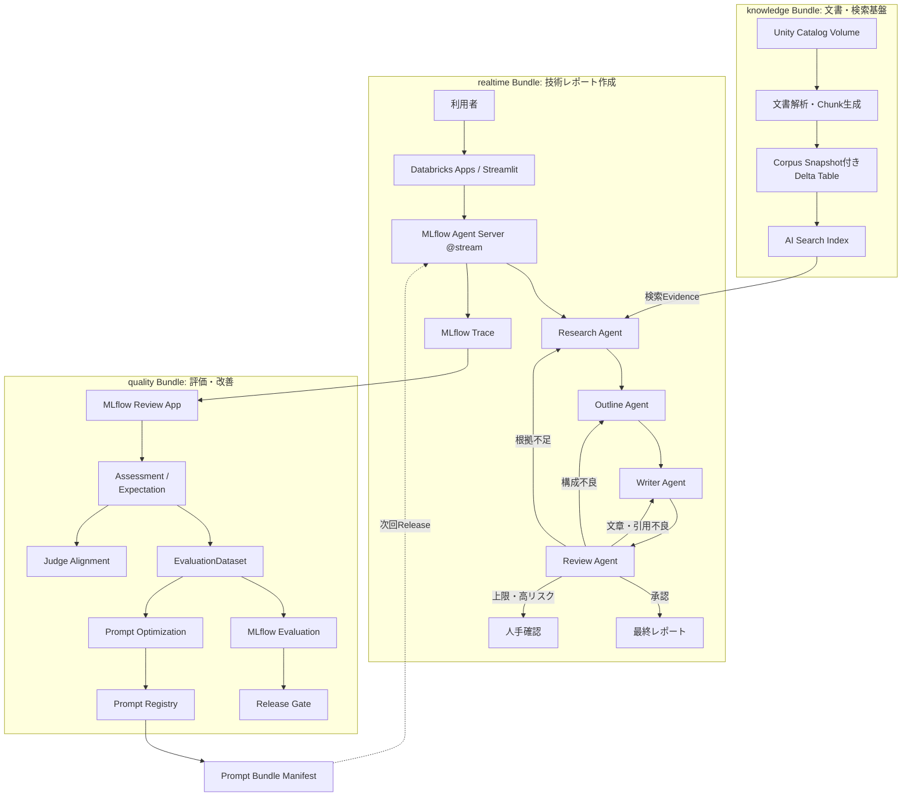

Research、Outline、Writer、Reviewは、独立したDatabricks Appsではなく、同じApplication内のLangGraph Nodeとして開始する。別権限、独立Scaling、別Owner、他Applicationからの再利用が必要になったAgentだけを後から分離する。


#### 1.5.1 公式Resourceと本資料独自ワークフローの境界

本資料では、MLflow／Databricksの公式Resourceと、技術レポート作成アプリケーション固有の管理Recordを混同しない。特に`Release Gate`、`Prompt Bundle Manifest`、`Review Case`は、複数の公式機能を組み合わせて運用判断を行うための本資料側のData Model／Workflowであり、単独の標準Resource名として扱わない。

| 区分 | 例 | 本資料での扱い |
| --- | --- | --- |
| Databricks／MLflow公式機能 | MLflow Trace、Assessment、EvaluationDataset、Scorer、Prompt Registry、Review App、Production Monitoring、Databricks Apps、AI Search | 実行証跡、評価、Prompt Version、UI、検索、Monitoringに優先利用する |
| 本資料独自のData Model／Workflow | Prompt Bundle Manifest、Release Channel、Release Gate、Runtime Review Case、Quality Review Case | 標準機能だけでは表せない「複数Versionの一括固定」「人の承認」「原因と改善先の追跡」に限定して使う |
| 外部運用システム | Jira、GitHub Issues、ServiceNow、Slack／Teams等 | Incident、作業チケット、通知の正本候補。Databricks側へ同じ状態を二重管理しない |

**意思決定記録（Decision Log、本資料独自用語）**は、PoCのGo／No-Go、本番Release、Rollback、Risk受容、利用範囲拡大、Human Review例外承認など、人間が行った重要な判断を、Evaluation Run ID、Trace ID、Prompt Bundle ID、Corpus Snapshot ID、承認者、理由とともに保存する追記型Recordである。実行Logそのものではなく、実行証跡を根拠として「誰が何を判断したか」を残す。

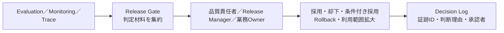

### 1.6 Reviewと差し戻しの基本契約

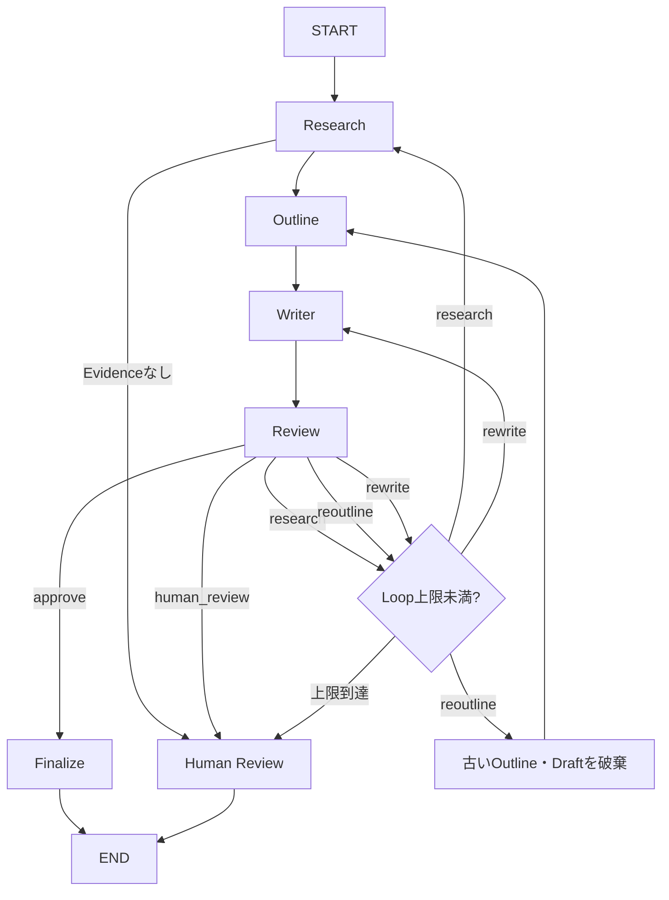

Review Agentの自由な判断だけで経路を決めず、Evidence 0件、Loop上限、機密区分、外部公開用途などはコードで強制する。意味的な品質はLLM Review、回数や権限など決定論的な条件はApplication Codeが担当する。

### 1.7 後続章を読むための最小用語

| 用語 | この章で押さえる意味 |
| --- | --- |
| Evidence | AI Searchから取得し、引用・評価・監査へ共通利用する根拠単位 |
| Corpus Snapshot | ある時点で検索対象となる全文書Version集合。取り込みRun IDとは分ける |
| Prompt Bundle | Research／Outline／Writer／Review等の不変Prompt Version、Model、Corpus、Gitを一組として固定したRelease構成 |
| Report State | LangGraph Node間で引き継ぐRequest、Evidence、中間成果物、経路、判定の集合 |
| Human-in-the-loop | 自動承認できないRequestを人へ渡し、必要に応じて同じStateから再開する仕組み |
| Assessment | Traceへ付与するFeedback／Expectation／原因診断／承認等の評価Record |
| Release Gate | Holdout、Security、Evidence、Routing、性能、CostからRelease可否の判定材料を作る独自ワークフロー |

#### 1.7.1 本資料の読み方

後続章はPoC、本番導入、本番導入後の順に読む。各フェーズでは、最初に**「まず理解する構成」**として5〜7要素程度へ畳んだ概念図を示し、その後にTable／Dataset／Resource一覧、管理系ER、データフロー、実装へ段階的に展開する。初読ではコードを上からすべて読む必要はない。各Sourceについて、**何を解決するか、何を入力し、どこへ保存し、何を出力し、どのTrace／Table／UIで確認するか**を先に理解し、その後に完全コードを参照する。

PoC章では「マルチエージェントとして成立するか」、本番導入章では「再現・統制・停止・復旧できるか」、本番導入後章では「本番証跡を改善へ安全に還流できるか」を中心に読む。資料作成者向けの整合性確認は本文の理解経路から外し、第9章へまとめる。

なお、EvaluationDatasetの一般的な育成、Judge Alignment、Prompt Optimization、Production TraceのDevelopment／Staging還流など、RAGエージェントと共通するLLMOpsの説明は**「社内技術文書検索システム（エージェント型RAG）_完成版.md」**を参照する。本資料では同じ説明を再掲せず、Agent間契約、State、Routing、Loop、HITL、Prompt BundleなどMulti-agent固有の差分だけを追加する。

## 2. 三段階の導入ロードマップ

本資料では、実装成熟度をPoC、本番導入、本番導入後の3段階へ分ける。**本番開始後に必要になる機能と、本番開始前に必ず作ってDry Runすべき機能を混同しない。**

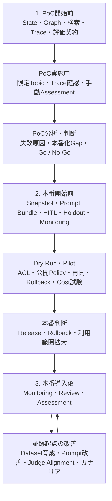

| 段階 | 開始前に構築する機能 | 実施中の監視・運用 | 結果の分析・改善 | 完了・移行判断 |
| --- | --- | --- | --- | --- |
| PoC | 共通Schema、初期Prompt、固定dev Corpus、AI Search、LangGraph、Trace、EvaluationDataset、Scorer、最小UI | Evidence件数、Agent経路、Loop、引用、Trace、限定Testerの結果を確認 | Research／Outline／Writer／Review／Routingに原因分解し、1要素ずつ比較 | マルチエージェントとして成立するか、本番化GapとGo／No-Goを決める |
| 本番導入／Pilot | Corpus Snapshot、Prompt Bundle、Server側権限・公開Policy、Durable HITL、Training／Holdout、Release Gate、Production Monitoring、Rollback | ACL、掲載可否、Checkpoint、Agent／Model／Search、Latency、Cost、Human Reviewを監視 | Dry Run／Pilot結果から閾値、手順、Policy、利用Scopeを調整 | Release継続、Rollback、No-Go、利用範囲拡大を責任者が承認 |
| 本番導入後 | Review Queue自動化、Dataset育成、Prompt Optimization、Judge Alignment、カナリア等を必要性に応じ追加 | 定常Monitoring、専門家Review、Assessment、滞留、Cost、品質Driftを確認 | 本番Traceを原因別に改善先へ配送し、Trainingで探索、Holdoutで判定 | 品質・Security・SLO・Cost・運用負荷から採否を判断 |

### 2.1 Architectureと手運用範囲の比較

| 比較軸 | PoC | 本番導入 | 本番導入後 |
| --- | --- | --- | --- |
| Corpus | dev用の固定Corpus／Indexを手動指定 | Corpus Snapshot Manifest／Registryで全文書Version集合を固定 | Snapshot更新履歴を継続し、品質問題時に前SnapshotへRollback |
| Prompt／Model | development Promptを固定し、比較RunごとにVersionを記録 | 不変Prompt URI＋Model＋Corpus＋GitをPrompt Bundleへ固定 | Optimization候補、Online Experiment、カナリアを追加 |
| Human Review | 上限・高Riskで未承認Draftを返して終了してよい | Checkpoint、thread_id、Lease、冪等Resumeを実装 | 滞留・再割当・SLA等を運用実績から高度化 |
| 評価 | 小規模EvaluationDataset、決定論的Scorer＋必要最小のJudge | Training／Holdout、Release Gate、Production Monitoringを本番前に用意 | 本番AssessmentでDatasetとJudgeを育成 |
| Identity／Policy | dev限定、固定Tester、実データならACL／Maskingを省略しない | 認証済みUser／GroupとServer PolicyからEntitlement・Publication Scopeを解決 | 監査・規制要件に応じて責務分割を追加 |

### 2.2 PoC版から本番版への置換

| PoC版 | 本番版での変更 | 理由 |
| --- | --- | --- |
| 固定文字列／環境変数の`corpus_snapshot_id` | `corpus_snapshot_manifest`／`registry`で不変Snapshotを発行 | 文書Version集合を再現・Rollback可能にする |
| dev Prompt URIの固定 | `technical_report_prompt_bundles`＋Release Channel | 複数Prompt、Model、Corpus、GitをAtomicにReleaseする |
| 最小`human_review_node()`で終了 | Durable Checkpoint＋Review Case＋`Command(resume=...)` | 外部承認待ちや長時間Requestを安全に再開する |
| 小規模Golden Dataset | Training／Holdoutへ分離 | 候補探索と最終判定の情報漏洩を防ぐ |
| 手動Trace確認 | Production Monitoring＋Alert／Runbook | 本番開始時点から品質・Cost・経路を監視する |
| 固定dev利用者 | 認証済みUser／Group＋Server側Publication Policy | Client入力による権限昇格を防ぐ |

### 2.3 フェーズ別データモデル差分

| 要素 | PoC | 本番導入 | 本番導入後 |
| --- | --- | --- | --- |
| MLflow EvaluationDataset | ○。小規模固定Dataset | ○。Training／Holdoutへ分離 | ○。承認済み本番Caseを継続追加 |
| Corpus Snapshot Manifest／Registry | －。固定dev値 | ○ | ○ |
| Prompt Bundle Manifest／Release Channel | －。固定dev値 | ○ | ○ |
| Runtime HITL Checkpoint／Review Case | 最小エスカレーションのみ | ○。外部公開・高Risk等で必要 | ○。SLA／再割当を高度化 |
| Production Monitoring | － | ○。本番前に設定・Dry Run | ○。Sampling／Thresholdを調整 |
| `technical_report_review_cases` | － | 任意の初期運用 | ○。定期Review自動化時に本格利用 |
| Prompt Optimization／Judge Alignment／カナリア | － | － | 条件付き高度化 |


### 2.4 共通のRAG／LLMOps改善ライフサイクルは別資料を参照する

EvaluationDataset、Scorer、Judge、Prompt、Retrievalをどの順序で成熟させるか、Production TraceをHuman ReviewしてDevelopmentへ戻し、Stagingで再評価して本番へ戻すかという**共通のRAG／LLMOps改善ライフサイクル**は、本資料では繰り返さない。

詳細は、**「社内技術文書検索システム（エージェント型RAG）_完成版.md」**の次の節を参照する。

- `2.4 LLM品質資産の成熟ライフサイクル`
- `2.5 開発・Staging・本番間のデータ還流`
- 本番導入後のEvaluationDataset育成、Judge Alignment、Prompt Optimization、Production Monitoringに関する節

本資料では、その共通基盤の上に、**マルチエージェントだから追加で必要になる設計と評価**だけを扱う。

#### 2.4.1 マルチエージェントで追加管理する品質資産

単一RAGでは、主に「検索結果と最終回答」の品質を評価すればよい。マルチエージェントでは、最終レポートが悪いときに、どのAgentまたはどの遷移で壊れたかを特定できなければ改善できない。

そのため、共通のEvaluationDataset／Scorer／Judgeに加えて、次を評価対象へ追加する。

| 追加対象 | 何を固定・評価するか | なぜ必要か |
| --- | --- | --- |
| Agent間契約 | Research、Outline、Writer、Reviewの入力／出力Schema | 上流の自由文変更で下流Agentが暗黙に壊れるのを防ぐ |
| State | Evidence、Outline、Draft、Review指摘、Loop回数 | 差し戻し後に残してよいStateと破棄すべきStateを区別する |
| Routing | `research`、`reoutline`、`rewrite`、`human_review` | 最終品質だけでは誤った差し戻し先を検出できない |
| Loop | Agent別Retry、全体Loop、停止理由 | Agent同士の往復が無限化・高Cost化するのを防ぐ |
| Provenance | Evidence → Outline Section → Draft Citation → Final Report | 途中Agentで根拠との対応が失われていないか確認する |
| HITL再開 | `thread_id`、Checkpoint、Decision、Resume先 | 人手確認後に別Stateや古いDraftから再開する事故を防ぐ |
| Prompt Bundle | AgentごとのPrompt VersionとModelを一組で固定 | 一部Agentだけが途中で新Versionへ変わるのを防ぐ |
| Agent別性能 | Agent別Token、Latency、Call回数 | End-to-End値だけではCost増加の原因を特定できない |

#### 2.4.2 「最終レポートが悪い」だけで改善を始めない

Multi-agentでは、同じ最終的な誤りでも原因が異なる。

```text
必要Evidenceが検索できなかった
        ↓
Researchが不十分
        ↓
Outlineに必要節が存在しない
        ↓
Writerが不足したDraftを書く
        ↓
Reviewerが差し戻す
```

このCaseでWriter Promptを直しても根本原因は解消しない。改善時は、**最初に期待状態から外れたAgent／遷移を主原因とする**。

逆に、ResearchとOutlineが正しく、Writerも正しいDraftを作っているのにReviewerが`rewrite`を返した場合は、ReviewerまたはRoutingが改善対象である。

したがって本資料では、End-to-End Scorerとは別にAgent別の期待値を持つ。

| Agent／処理 | 代表的な期待値 |
| --- | --- |
| Research | 期待文書ID、最低Evidence件数、検索不能時の停止条件 |
| Outline | 必須節、各節の`source_ids` |
| Writer | Citation、禁止Claim、Evidence外事実を追加しないこと |
| Review | 期待Action、誤承認してはいけない条件 |
| Routing | 期待Route、Loop上限、Human Review条件 |
| Finalizer | 承認済みDraftの意味内容を変更しないこと |

### 2.5 マルチエージェント固有の変更ライフサイクル

共通のProduction → Development → Staging → Productionの還流方法はRAG資料を参照する。本節では、その流れの中で**マルチエージェント変更時に追加で確認する順序**だけを示す。

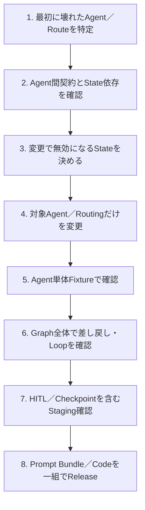

#### 2.5.1 Stateの保持・破棄規則を先に決める

差し戻し時に全Stateを保持すると、古い中間成果物を誤って再利用する。逆に全Stateを破棄すると、不要なResearch再実行によってLatencyとCostが増える。

本システムでは、基本規則を次のようにする。

| Review Action | 保持するState | 破棄・再生成するState |
| --- | --- | --- |
| `research` | Request、Policy、Release構成 | Evidence、Research Notes、Outline、Draft、Review結果 |
| `reoutline` | Request、Policy、Evidence、Research Notes | Outline、Draft、Review結果 |
| `rewrite` | Request、Policy、Evidence、Research Notes、Outline | Draft、Review結果 |
| `human_review` | その時点の全StateをCheckpoint | 人のDecisionに応じて再開時に決定 |
| `approve` | 承認済みState | Finalizerは意味内容を追加しない |

この規則はPromptに任せず、Graph Codeで実装する。

#### 2.5.2 Agent間契約をVersion管理する

PromptだけVersion管理しても、`Evidence`や`ReportOutline`のSchemaが変われば下流Agentが壊れる。共通PackageのPydantic Model、Graph Code、Prompt Bundleを同じGit Commit／Release構成へ関連付ける。

互換性のないSchema変更では、古いCheckpointを新しいGraphでそのままResumeしない。必要に応じてState Migrationを用意するか、旧Releaseで処理を完了させる。

#### 2.5.3 Request途中でAgent構成を変えない

複数Agentがあると、個別Prompt AliasやModel Endpointを実行のたびに解決すると、1つのRequest内でResearchは旧Version、Writerは新Versionという状態が起き得る。

そのためRequest開始時に、少なくとも次を1回だけ解決してStateへ固定する。

- Prompt Bundle ID
- 各Agentの不変Prompt Version
- AgentごとのModel Service
- Corpus Snapshot ID
- Graph／Policyを含むGit Commit

カナリアやA/Bでも、LLM Call単位ではなく**Request／Session単位でBundleを固定**する。

#### 2.5.4 DevelopmentとStagingで確認する内容もAgent単位に分ける

共通の環境間データ移送方法はRAG資料を参照する。マルチエージェント固有の違いは次のとおりである。

| 確認内容 | Development | Staging |
| --- | --- | --- |
| Research Prompt | 固定Request＋検索結果Fixtureで出力Schemaを確認 | 本番相当AI SearchでQueryとEvidence取得を確認 |
| Outline Prompt | 固定Evidenceで必須節・`source_ids`を確認 | Researchから連結してState受け渡しを確認 |
| Writer Prompt | 固定Outline＋EvidenceでCitationを確認 | Graph全体で実行しContext量も確認 |
| Review Prompt | 固定Draft＋Evidenceで期待Actionを確認 | 実際の差し戻しEdgeとLoopを確認 |
| Routing | State FixtureでEdge選択をUnit Test | Graph全体で往復、上限、停止を確認 |
| HITL | Resume DecisionのUnit Test | Durable Checkpoint、Lease、再開を結合確認 |
| Bundle | Manifest解決を確認 | Request途中でVersionが変わらないことを確認 |

Developmentでは局所的なAgent変更を速く確認し、Stagingでは**Agent間相互作用とState遷移**を重点的に確認する。


## 3. PoC時に実施するもの

### 3.1 PoCの目的・範囲・完了条件

| 項目 | 内容 |
| --- | --- |
| 目的 | 少数Topicと少数文書で、Evidence取得から構成、執筆、Review、差し戻し、最終化まで成立するか確認する |
| 手運用 | dev Corpus／Prompt Version固定、実行、Trace確認、Expectation入力、失敗原因分類 |
| 自動化 | AI Search、Research／Outline／Writer／Review、Loop上限、Trace、Evaluation、SSE |
| 実装しない | Corpus Snapshot台帳、Prompt Bundle Release Channel、Durable HITL、Production Monitoring定期実行、Prompt Optimization、Judge Alignment、カナリア |
| Security | dev限定・限定Tester。実データを使う場合はACL、公開Policy、Maskingを省略しない |
| 完了条件 | 期待Evidence、必須節、引用、差し戻し、回答拒否／人手確認、Trace、最小評価が再現可能に合格する |

PoCで確認する対象は「複数LLMを呼べること」ではない。次の7点が同じRequest ID／Traceでつながり、失敗箇所を説明できることを確認する。

1. Researchが期待Evidenceを取得できる。
2. OutlineがEvidenceと節を対応付けられる。
3. WriterがEvidence外の事実を追加せず引用付きDraftを作れる。
4. Reviewerが誤りを検出し、`research`／`reoutline`／`rewrite`を区別できる。
5. LangGraphがReviewerの意味判断と決定論的Policyを組み合わせ、正しいEdgeへ進める。
6. Loop上限・Evidence 0件・高Risk条件で自動承認を止められる。
7. TraceとEvaluationから、どのAgent／検索／Routingが原因か後から説明できる。

**PoCの非目的**は、本番レベルの職務分離、永続Review Queue、完全なRelease Workflow、全社Monitoringを完成させることである。これらはPoCの成立性が確認できた後に4章で追加する。

### 3.2 PoC時のデータモデル全体像

#### 3.2.1 まず理解する構成

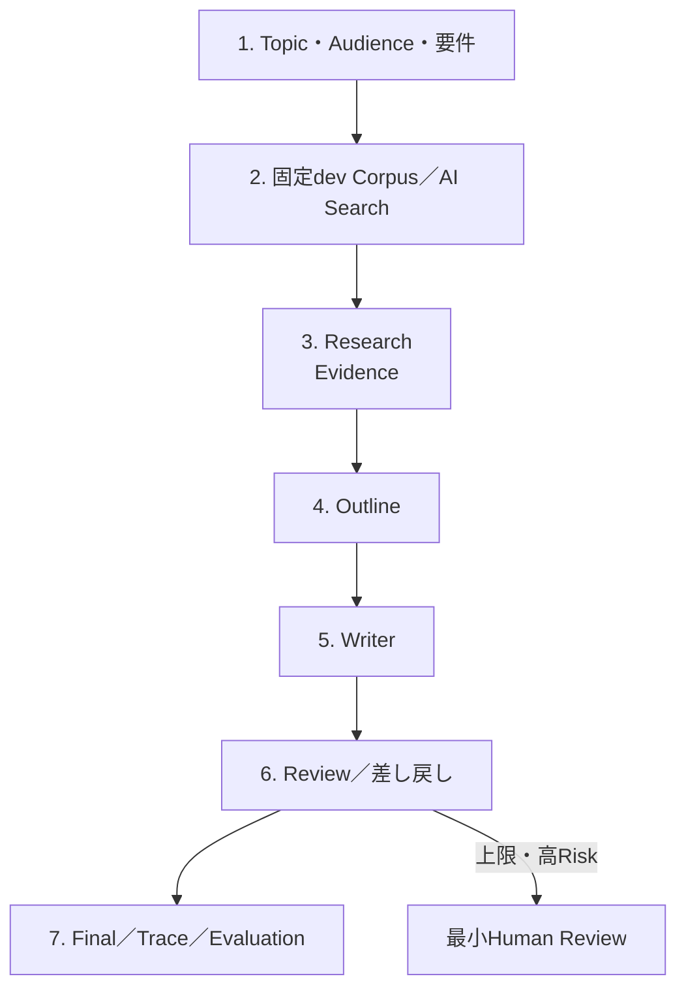

#### 3.2.2 PoC時のTable／Dataset一覧

| 分類 | 物理的な実体 | 役割 |
| --- | --- | --- |
| 評価 | MLflow EvaluationDataset（PoC Golden Set） | Topic、要件、期待文書、必須節、禁止Claim、期待Routeを保持 |
| Trace | MLflow Experiment／Trace | Agent Span、Evidence、Prompt、Model、Route、Loop、結果を保持 |
| Prompt | MLflow Prompt Registry | Agentごとの初期Prompt Versionを管理 |
| 検索 | dev AI Search Index | 固定したPoC CorpusからEvidenceを検索 |
| Runtime | LangGraph State | Request中のEvidence、Outline、Draft、Review判断を保持。PoCでは永続管理Tableではない |
| UI／API | Agent Server＋Databricks Apps／Streamlit | SSE進捗と最終結果を返す |

#### 3.2.3 PoC時の管理系ER図

**該当なし。** PoCではCorpus Snapshot Registry、Prompt Bundle Manifest、Release Channel、永続Review Case Storeを作らない。EvaluationDatasetとTraceは存在するが、本番の管理系ERをPoCへ持ち込まない。

#### 3.2.4 PoC時のデータフロー図


Review Agentの自由な判断だけで経路を決めず、Evidence 0件、Loop上限、機密区分、外部公開用途などはコードで強制する。意味的な品質はLLM Review、回数や権限など決定論的な条件はApplication Codeが担当する。

### 3.3 PoC開始前に構築する最小機能

PoCでは、まずResearchが期待Evidenceを取得できることを確認し、その後にOutline、Writer、Review、差し戻しを追加する。検索できない事実をWriter Promptの工夫で補わせない。


**この節の読み方**：PoCは次の4ブロックに分け、下記の順序で構築する。最初からStreamlitやReviewerまで読む必要はなく、**Evidence取得が成立してから後段Agentを追加する**。

```text
共通契約
  ↓
Prompt登録
  ↓
Evidence Search
  ↓
Prompt Bundle固定
  ↓
Research → Outline → Writer → Review Graph
  ↓
最小Human Review
  ↓
EvaluationDataset／Scorer
  ↓
Agent Server／SSE
  ↓
Streamlit／Apps Deploy
```

| 段階 | まず確認すること | 合格しない場合に先へ進まない理由 |
| --- | --- | --- |
| 契約 | Evidence／Outline／Review／Resultを構造化できる | Agent間の曖昧な自由文受渡しが後工程の原因分析を壊すため |
| Retrieval | 期待Evidenceを取得できる | Writer Promptで検索失敗を補完するとGrounding不能になるため |
| Graph | 期待ActionごとにEdgeが変わる | 単なる直列LLM呼出しではMulti-agentの価値を検証できないため |
| Evaluation | 期待Evidence／節／Routeを測れる | 感覚的なレポート品質だけでは改善比較できないため |
| Serving | Trace IDと最終結果をSSEで返せる | Runtime問題と品質問題を分けて観測できないため |

#### 3.3.1 PoC Project構成

```text
technical-report-agent-poc/
├── packages/technical-report-common/
│   └── src/technical_report_common/report_contracts.py
├── bundles/quality/
│   ├── src/register_prompts.py
│   ├── src/seed_evaluation_dataset.py
│   └── src/evaluate_report.py
└── bundles/realtime/
    ├── app/evidence_search.py
    ├── app/auth_context.py
    ├── app/experiment_router.py
    ├── app/prompt_bundle.py
    ├── app/report_graph.py
    ├── app/agent.py
    ├── app/start_server.py
    ├── app/streamlit_app.py
    ├── app/start.sh
    ├── app/app.yaml
    └── resources/realtime_app.yml
```

#### 3.3.2 PoC実行基盤を作る

最初のブロックでは、Agent同士が受け渡す型、Prompt、Evidence検索、固定Bundleを用意する。この段階ではGraphをまだ組まない。**各部品を単独で説明できる状態にしてから接続する。**

```text
共通契約 → Prompt → Evidence Search → 固定Prompt Bundle
```

##### 3.3.2.1 共通のレポート契約を定義する

この実装では、Evidence、調査計画、構成案、Review判断、Graph State、最終結果を共通Packageへ定義する。`corpus_snapshot_id`は取り込みJob IDではなく、ある時点で検索対象となる全文書Version集合のIDである。`Evidence`には閲覧権限とは別に公開区分を保持し、外部成果物へ内部URIを出さない。`ReviewDecision`は`research`、`reoutline`、`rewrite`を分離し、構成不良をWriterだけで直そうとしない。`ReportResult`には決定論的Scorerが必要とする引用、Outline、経路、Policy情報も返す。

`packages/technical-report-common/src/technical_report_common/report_contracts.py`

```python
from __future__ import annotations

from typing import Literal, TypedDict

from pydantic import BaseModel, ConfigDict, Field


class Evidence(BaseModel):
    # AI Searchの検索結果を、引用・評価・監査で共通利用できる型へ正規化する。
    model_config = ConfigDict(extra="forbid")

    source_id: str = Field(description="レポート中で使用する安定した引用ID")
    chunk_id: str
    document_id: str
    document_version: str
    corpus_snapshot_id: str
    internal_title: str
    content: str
    internal_source_uri: str
    external_reference: str | None = None
    required_entitlement: str
    publication_scope: Literal["internal", "external"]
    data_classification: Literal["public", "internal", "confidential", "restricted"]
    publication_approved: bool
    has_conflict: bool = False
    page_number: int | None = None
    score: float | None = None


class ResearchPlan(BaseModel):
    # Research AgentがAI Searchへ送るQueryと確認観点を構造化する。
    model_config = ConfigDict(extra="forbid")

    queries: list[str] = Field(min_length=1, max_length=5)
    focus_points: list[str] = Field(default_factory=list)


class OutlineSection(BaseModel):
    # 各節の目的と利用Evidenceを対応付け、根拠のない節を検出可能にする。
    model_config = ConfigDict(extra="forbid")

    heading: str
    purpose: str
    source_ids: list[str] = Field(min_length=1)


class ReportOutline(BaseModel):
    # Writerへ渡す構成案を、自由文ではなく節の配列として保持する。
    model_config = ConfigDict(extra="forbid")

    title: str
    executive_summary_goal: str
    sections: list[OutlineSection] = Field(min_length=2, max_length=8)


class ReviewDecision(BaseModel):
    # ReviewコメントとGraphの次Actionを分離し、決定論的にRouteできるようにする。
    model_config = ConfigDict(extra="forbid")

    action: Literal["approve", "research", "reoutline", "rewrite", "human_review"]
    comments: str
    missing_topics: list[str] = Field(default_factory=list)
    unsupported_claims: list[str] = Field(default_factory=list)
    evidence_conflict: bool = False


class ReportState(TypedDict):
    # LangGraphの全Nodeが共有するStateを定義する。
    request_id: str
    topic: str
    audience: str
    report_requirements: str
    reader_entitlements: list[str]
    publication_scope: Literal["internal", "external"]
    data_classification_ceiling: Literal[
        "public", "internal", "confidential", "restricted"
    ]
    publication_policy_version: str
    corpus_snapshot_id: str
    prompt_bundle_id: str
    prompt_uris: dict[str, str]
    model_service: str
    source_git_commit: str
    experiment_id: str
    experiment_variant: str
    evidence: list[Evidence]
    research_notes: str
    outline: ReportOutline | None
    draft: str
    review_action: Literal[
        "approve", "research", "reoutline", "rewrite", "human_review"
    ]
    review_comments: str
    review_loop_count: int
    route_history: list[str]
    review_feedback_history: list[str]
    unsupported_claims_detected: list[str]
    evidence_conflict: bool
    context_budget_exceeded: bool
    approved: bool
    requires_human_review: bool
    review_case_id: str | None
    final_report: str


class ReportResult(BaseModel):
    # API利用者とEvaluationへ返す安定した出力契約を定義する。
    model_config = ConfigDict(extra="forbid")

    request_id: str
    report: str
    source_document_ids: list[str]
    evidence_source_ids: list[str]
    outline_source_ids: list[str]
    cited_source_ids: list[str]
    evidence_publication_scopes: list[str]
    route_history: list[str]
    review_feedback_history: list[str]
    unsupported_claims_detected: list[str]
    evidence_conflict: bool
    publication_scope: Literal["internal", "external"]
    publication_policy_version: str
    corpus_snapshot_id: str
    prompt_bundle_id: str
    experiment_id: str
    experiment_variant: str
    review_loop_count: int
    approved: bool
    requires_human_review: bool
    review_case_id: str | None
```

Pydanticを使用するのは、LLMの構造化出力、AI Search結果、Agent間の受け渡しを実行時に検証するためである。`TypedDict`の`ReportState`はLangGraphのState更新へ利用し、外部境界とLLM出力では検証機能を持つPydantic Modelを利用する。

##### 3.3.2.2 Agentごとの初期Promptを登録する

この実装では、Research計画、Researchメモ、Outline、Writer、Reviewerを別々のPromptとして登録する。1つの巨大なPromptへまとめると、Reviewer基準だけを変更したい場合でもResearchやWriterの挙動まで変化し、原因分析が難しくなる。各Promptは`@development`、`@candidate`、`@production`などのAliasで参照できるが、Alias自体にTraffic Splitはない。オンラインA/BテストではAgent ServerがVariantを固定し、Variantごとに明示的なPrompt Versionを選択する。

`bundles/quality/src/register_prompts.py`

```python
from __future__ import annotations

import mlflow


PROMPTS = {
    "main.llmops.report_research_plan": """
あなたは技術調査担当です。
テーマ、対象読者、要件、前回Review指摘から、社内AI Searchへ送る検索Queryを1〜5件作成してください。
同じ意味のQueryを重複させず、製品名、Version、エラーコードなど重要な固有語を保持してください。

テーマ: {{topic}}
対象読者: {{audience}}
要件: {{requirements}}
前回Review指摘: {{review_comments}}
""".strip(),
    "main.llmops.report_research_notes": """
あなたは技術調査担当です。
Evidenceだけを根拠として、テーマに関する調査メモを作成してください。
各記述へ[SRC-A1B2C3D4E5]形式で、提示された引用IDをそのまま付けてください。
Evidenceにない事実や新しい引用IDは追加しないでください。
文書間で内容が競合する場合は、Versionと競合内容を明示してください。

テーマ: {{topic}}
確認観点:
{{focus_points}}
Evidence:
{{evidence}}
""".strip(),
    "main.llmops.report_outline": """
あなたは技術レポートの構成担当です。
調査メモとEvidenceだけを利用し、対象読者と要件に合う構成案を作成してください。
各節には、その節で利用するsource_idsを最低1件指定してください。

テーマ: {{topic}}
対象読者: {{audience}}
要件: {{requirements}}
調査メモ:
{{research_notes}}
前回の構成Review指摘:
{{review_comments}}
""".strip(),
    "main.llmops.report_writer": """
あなたは技術レポートの執筆担当です。
構成案に従い、Evidenceに支持された内容だけでMarkdownレポートを作成してください。
技術的主張には[SRC-A1B2C3D4E5]形式で提示済みIDを引用し、未確認事項は未確認と記載してください。
前回Review指摘がある場合は、指摘された箇所を修正してください。

テーマ: {{topic}}
対象読者: {{audience}}
要件: {{requirements}}
構成案:
{{outline}}
Evidence:
{{evidence}}
前回Review指摘:
{{review_comments}}
""".strip(),
    "main.llmops.report_review": """
あなたは技術レポートの品質責任者です。
Evidenceへの忠実性、引用、必須節、論理構成、対象読者への適合性を確認してください。
根拠不足はresearch、章立て・節順・論理構成の問題はreoutline、
文章表現・引用・Draftだけの問題はrewrite、競合・高リスクはhuman_review、
問題がなければapproveを返してください。未支持Claimが1件でもあればapproveしてはいけません。

テーマ: {{topic}}
対象読者: {{audience}}
要件: {{requirements}}
Evidence:
{{evidence}}
構成案:
{{outline}}
Draft:
{{draft}}
""".strip(),
}


def register_initial_prompts() -> None:
    # AgentごとのPromptを独立したVersionとして登録し、初期Aliasを設定する。
    for name, template in PROMPTS.items():
        prompt = mlflow.genai.register_prompt(
            name=name,
            template=template,
            commit_message="Initial technical report prompt",
            tags={"application": "technical-report-agent"},
        )
        mlflow.genai.set_prompt_alias(
            name=name,
            alias="development",
            version=prompt.version,
        )


if __name__ == "__main__":
    register_initial_prompts()
```

Prompt RegistryはTemplateとVersionを管理する。実際の生成AIモデルはPrompt Bundle Manifestの`model_service`が指定するFoundation Model APIsのModel ServiceまたはServing Endpointであり、Prompt Registryからモデル推論が実行されるわけではない。`@development`、`@candidate`、`@production` AliasはQuality Jobが候補Versionを選び、後述する不変Version URIのManifestを作るまでにだけ利用する。RuntimeはAliasを解決しない。

##### 3.3.2.3 固定dev Corpusと公開Policy契約でEvidenceを検索する

PoCでは`corpus_snapshot_id`を管理Tableから解決せず、検証対象のdev Corpusを表す固定値として実行設定へ注入する。`reader_entitlements`、`publication_scope`、`data_classification_ceiling`の検索前Filter契約は本番と同じ形を維持し、実データ利用時のSecurity検証を後回しにしない。

この実装では、Research Agentが作った複数QueryをAI Searchへ送り、`reader_entitlements`、`publication_scope`、`data_classification_ceiling`、`corpus_snapshot_id`を検索前Filterへ適用する。閲覧可能でも外部掲載不可の文書は、外部向けRequestのLLM入力へ入れない。Clientの`audience`は文体指定にしか使わず、権限と公開区分は認証済みUser／GroupとServer側Policyから決定する。`source_id`は検索順ではなく文書、Version、Chunkから安定生成する。

`bundles/realtime/app/evidence_search.py`

```python
from __future__ import annotations

import hashlib
import os
from typing import Any, Literal

import mlflow
from databricks.ai_search.client import AISearchClient
from mlflow.entities import SpanType

from technical_report_common.report_contracts import Evidence


SEARCH_ENDPOINT = os.environ["AI_SEARCH_ENDPOINT_NAME"]
SEARCH_INDEX = os.environ["AI_SEARCH_INDEX_NAME"]

# Application起動時にClientとIndex Objectを取得し、Requestごとの再初期化を避ける。
search_client = AISearchClient()
search_index = search_client.get_index(
    endpoint_name=SEARCH_ENDPOINT,
    index_name=SEARCH_INDEX,
)


def build_source_id(document_id: str, version: str, chunk_id: str) -> str:
    # 文書・版・Chunkから短い安定IDを生成し、検索順位に依存しない引用IDを作る。
    raw = f"{document_id}:{version}:{chunk_id}".encode("utf-8")
    digest = hashlib.sha256(raw).hexdigest()[:10].upper()
    return f"SRC-{digest}"


def parse_rows(result: dict[str, Any]) -> list[Evidence]:
    # similarity_search()の配列形式を型付きEvidenceへ変換する。
    evidence = []
    for row in result.get("result", {}).get("data_array", []):
        evidence.append(
            Evidence(
                chunk_id=row[0],
                document_id=row[1],
                document_version=row[2],
                corpus_snapshot_id=row[3],
                internal_title=row[4],
                content=row[5],
                internal_source_uri=row[6],
                external_reference=row[7],
                required_entitlement=row[8],
                publication_scope=row[9],
                data_classification=row[10],
                publication_approved=row[11],
                has_conflict=row[12],
                page_number=row[13],
                score=row[-1],
                source_id=build_source_id(row[1], row[2], row[0]),
            )
        )
    return evidence


@mlflow.trace(name="search_report_evidence", span_type=SpanType.RETRIEVER)
def search_evidence(
    query: str,
    reader_entitlements: list[str],
    publication_scope: Literal["internal", "external"],
    data_classification_ceiling: str,
    corpus_snapshot_id: str,
) -> list[Evidence]:
    # 閲覧権限・公開Policy・Snapshotを検索前Filterへ適用し、LLM入力を決定論的に制限する。
    allowed_publication_scopes = (
        ["external"] if publication_scope == "external" else ["internal", "external"]
    )
    result = search_index.similarity_search(
        query_text=query,
        columns=[
            "chunk_id",
            "document_id",
            "document_version",
            "corpus_snapshot_id",
            "title",
            "chunk_to_retrieve",
            "source_uri",
            "external_reference",
            "required_entitlement",
            "publication_scope",
            "data_classification",
            "publication_approved",
            "has_conflict",
            "page_number",
        ],
        filters={
            "required_entitlement": reader_entitlements,
            "publication_scope": allowed_publication_scopes,
            "data_classification_rank <=": classification_rank(
                data_classification_ceiling
            ),
            "publication_approved": True,
            "corpus_snapshot_id": corpus_snapshot_id,
        },
        num_results=8,
        query_type="HYBRID",
    )
    evidence = parse_rows(result)
    if publication_scope == "external" and any(
        item.external_reference is None for item in evidence
    ):
        raise PermissionError("External Evidence requires a public reference")
    span = mlflow.get_current_active_span()
    if span is not None:
        # Scorerが取得内容を確認できるよう、EvidenceをRetriever Spanの出力へ残す。
        span.set_outputs([item.model_dump() for item in evidence])
    return evidence


def classification_rank(value: str) -> int:
    # 機密区分を比較可能な整数へ変換し、未知の値はFail Closedで拒否する。
    ranks = {"public": 0, "internal": 1, "confidential": 2, "restricted": 3}
    if value not in ranks:
        raise ValueError(f"Unknown data classification: {value}")
    return ranks[value]


def merge_evidence(items: list[Evidence]) -> list[Evidence]:
    # 複数Queryと再調査の結果をchunk_idで重複排除し、Scoreの高い順へ整列する。
    by_chunk: dict[str, Evidence] = {}
    for item in items:
        current = by_chunk.get(item.chunk_id)
        if current is None or (item.score or 0.0) > (current.score or 0.0):
            by_chunk[item.chunk_id] = item
    return sorted(
        by_chunk.values(),
        key=lambda item: item.score or 0.0,
        reverse=True,
    )
```

上記はStandard EndpointのFilter例である。Entitlement配列の一致方法や比較演算子は採用するIndex SchemaとEndpoint種別に合わせて事前検証し、必要ならFilter Adapterへ閉じ込める。外部向けでは`publication_scope=external`かつ`publication_approved=true`のEvidenceだけを取得する。検索後Filterは禁止し、Policy回帰Testには「閲覧可能だが掲載不可」の文書がLLM入力へ入らないことを含める。

##### 3.3.2.4 PoC用Prompt Bundleを固定値から作る

PoCではRelease ChannelやDelta Manifestを作らず、評価する不変Prompt URI、Model Service、固定Corpus ID、Git Commitを環境変数から1つの`PromptBundle`へまとめる。本番章で同じ型を`technical_report_prompt_bundles`から読み込む実装へ置換する。

```python
import os

from pydantic import BaseModel, ConfigDict


class PromptBundle(BaseModel):
    model_config = ConfigDict(extra="forbid", frozen=True)
    prompt_bundle_id: str
    prompt_uris: dict[str, str]
    model_service: str
    corpus_snapshot_id: str
    source_git_commit: str


def load_prompt_bundle(prompt_bundle_id: str) -> PromptBundle:
    if prompt_bundle_id != "poc-fixed":
        raise ValueError("PoC accepts only the fixed prompt bundle")
    return PromptBundle(
        prompt_bundle_id=prompt_bundle_id,
        prompt_uris={
            "research_plan": os.environ["POC_RESEARCH_PLAN_URI"],
            "research_notes": os.environ["POC_RESEARCH_NOTES_URI"],
            "outline": os.environ["POC_OUTLINE_URI"],
            "writer": os.environ["POC_WRITER_URI"],
            "review": os.environ["POC_REVIEW_URI"],
        },
        model_service=os.environ["POC_MODEL_SERVICE"],
        corpus_snapshot_id=os.environ["POC_CORPUS_SNAPSHOT_ID"],
        source_git_commit=os.environ["GIT_COMMIT"],
    )
```

PoCの`auth_context.py`と`experiment_router.py`は、固定Testerで動かす最小Adapterでよい。本番では4.3.4.3（Identity／Policy）と5.2.6／5.7.3（Request単位カナリア）の設計へ置き換える。

`bundles/realtime/app/auth_context.py`

```python
import os
from dataclasses import dataclass

@dataclass(frozen=True)
class Principal:
    groups: list[str]

def current_principal() -> Principal:
    return Principal(groups=[g for g in os.environ["POC_READER_GROUPS"].split(",") if g])
```

`bundles/realtime/app/experiment_router.py`

```python
def assign_variant(_: str):
    raise RuntimeError("Online experiment is disabled in PoC")
```

#### 3.3.3 Graphと差し戻しを組み立てる

次に、Research、Outline、Writer、ReviewをLangGraphへ接続する。ここで初めて`research`、`reoutline`、`rewrite`、`human_review`の経路とLoop上限を扱う。

##### 3.3.3.1 差し戻しを行うLangGraphマルチエージェント

この実装では、Research、Outline、Writer、ReviewをLangGraph Nodeとして分離する。Review Agentは`approve`、`research`、`reoutline`、`rewrite`、`human_review`を構造化出力で返す。`reoutline`では古いOutlineとDraftだけを破棄し、Research Evidenceと調査メモは維持する。Application CodeはLoop上限、Context上限、外部公開、Evidence競合をLLM判断より優先する。本コードはEvidenceを一括投入して全文生成する小〜中規模レポート向け最小実装であり、長文向け拡張は後述する。

実際のモデル推論は、`ChatDatabricks`の`ainvoke()`を呼ぶ5か所で発生する。`mlflow.genai.load_prompt()`はPrompt Templateの取得、`search_evidence()`はAI Searchの呼び出しであり、生成AIモデル推論ではない。

`bundles/realtime/app/report_graph.py`

```python
from __future__ import annotations

import asyncio
import re
import uuid
from functools import lru_cache
from typing import Any

import mlflow
from databricks_langchain import ChatDatabricks
from langchain_core.messages import HumanMessage
from langgraph.graph import END, START, StateGraph
from mlflow.entities import SpanType

from evidence_search import merge_evidence, search_evidence
from prompt_bundle import PromptBundle
from technical_report_common.report_contracts import (
    Evidence,
    ReportOutline,
    ReportResult,
    ReportState,
    ResearchPlan,
    ReviewDecision,
)


MAX_REVIEW_LOOPS = 2
MAX_EVIDENCE_ITEMS = 40
MAX_EVIDENCE_CHARACTERS = 120_000

# LangGraphとChatDatabricksの子Span、Token、Latency、Model情報を自動記録する。
mlflow.langchain.autolog()

@lru_cache(maxsize=8)
def get_llm(model_service: str) -> ChatDatabricks:
    # Manifestが固定したModel ServiceごとにClientを再利用する。ここでは推論は発生しない。
    return ChatDatabricks(endpoint=model_service, temperature=0.0)


def load_prompt(version_uri: str, **values: str) -> str:
    # Manifest内の不変Version URIからTemplateを取得し、実VersionをTraceへ記録する。
    if "@" in version_uri:
        raise ValueError("Runtime prompt URI must not use an alias")
    prompt = mlflow.genai.load_prompt(version_uri)
    mlflow.update_current_trace(
        tags={f"prompt.{prompt.name}.version": str(prompt.version)}
    )
    return prompt.format(**values)


def render_evidence(evidence: list[Evidence], publication_scope: str) -> str:
    # 外部向けでは内部TitleとURIを除外し、公開用参照だけをLLMへ渡す。
    return "\n\n".join(
        (
            f"[{item.source_id}] "
            f"{item.external_reference if publication_scope == 'external' else item.internal_title}\n"
            f"文書Version: {item.document_version}\n"
            f"出典: "
            f"{item.external_reference if publication_scope == 'external' else item.internal_source_uri}\n"
            f"本文: {item.content}"
        )
        for item in evidence
    )


def exceeds_context_budget(evidence: list[Evidence]) -> bool:
    # 最小実装では保守的な文字数上限を使い、超過時に黙ってEvidenceを切り捨てない。
    return len(evidence) > MAX_EVIDENCE_ITEMS or sum(
        len(item.content) for item in evidence
    ) > MAX_EVIDENCE_CHARACTERS


@mlflow.trace(name="research_agent", span_type=SpanType.AGENT)
async def research_node(state: ReportState) -> dict[str, Any]:
    # Review指摘を含めて検索計画を作り、複数QueryをAI Searchへ並列送信する。
    llm = get_llm(state["model_service"])
    instruction = load_prompt(
        state["prompt_uris"]["research_plan"],
        topic=state["topic"],
        audience=state["audience"],
        requirements=state["report_requirements"],
        review_comments=state["review_comments"] or "なし",
    )

    # 【モデル呼び出し1】検索Queryと確認観点をResearchPlan型で生成する。
    plan = await llm.with_structured_output(ResearchPlan).ainvoke(
        [HumanMessage(content=instruction)]
    )

    # AI Search SDKは同期APIなのでThreadへ逃がし、複数Queryを並列実行する。
    batches = await asyncio.gather(
        *[
            asyncio.to_thread(
                search_evidence,
                query,
                state["reader_entitlements"],
                state["publication_scope"],
                state["data_classification_ceiling"],
                state["corpus_snapshot_id"],
            )
            for query in plan.queries
        ]
    )
    combined = state["evidence"] + [item for batch in batches for item in batch]
    evidence = merge_evidence(combined)
    if not evidence:
        # Evidence 0件は後段のLLMへ送らず、条件分岐で人手確認へ進める。
        return {
            "evidence": [],
            "research_notes": "",
            "outline": None,
            "draft": "",
        }
    if exceeds_context_budget(evidence):
        # 上限超過を明示的なStateへ残し、後段でHuman Reviewへ強制する。
        return {
            "evidence": evidence,
            "research_notes": "",
            "outline": None,
            "draft": "",
            "context_budget_exceeded": True,
            "review_comments": "EvidenceがContext Budgetを超過しました。",
        }

    notes_instruction = load_prompt(
        state["prompt_uris"]["research_notes"],
        topic=state["topic"],
        focus_points="\n".join(f"- {item}" for item in plan.focus_points) or "指定なし",
        evidence=render_evidence(evidence, state["publication_scope"]),
    )

    # 【モデル呼び出し2】取得Evidenceだけに基づく引用付き調査メモを生成する。
    notes = await llm.ainvoke([HumanMessage(content=notes_instruction)])
    return {
        "evidence": evidence,
        "research_notes": str(notes.content),
        # 再調査後は古い構成案とDraftを破棄し、新Evidenceで作り直す。
        "outline": None,
        "draft": "",
    }


@mlflow.trace(name="outline_agent", span_type=SpanType.AGENT)
async def outline_node(state: ReportState) -> dict[str, Any]:
    # 調査メモから節構成を作り、各節へ利用Evidence IDを割り当てる。
    llm = get_llm(state["model_service"])
    instruction = load_prompt(
        state["prompt_uris"]["outline"],
        topic=state["topic"],
        audience=state["audience"],
        requirements=state["report_requirements"],
        research_notes=state["research_notes"],
        review_comments=state["review_comments"] or "なし",
    )

    # 【モデル呼び出し3】構成案をReportOutline型で生成する。
    outline = await llm.with_structured_output(ReportOutline).ainvoke(
        [HumanMessage(content=instruction)]
    )
    return {"outline": outline}


@mlflow.trace(name="writer_agent", span_type=SpanType.AGENT)
async def writer_node(state: ReportState) -> dict[str, Any]:
    # Evidence、構成案、前回Review指摘をまとめ、全文を再生成する。
    if state["outline"] is None:
        raise ValueError("Writer Agent requires an outline")
    llm = get_llm(state["model_service"])
    instruction = load_prompt(
        state["prompt_uris"]["writer"],
        topic=state["topic"],
        audience=state["audience"],
        requirements=state["report_requirements"],
        outline=state["outline"].model_dump_json(indent=2),
        evidence=render_evidence(state["evidence"], state["publication_scope"]),
        review_comments=state["review_comments"] or "なし",
    )

    # 【モデル呼び出し4】引用付きMarkdown Draftを生成する。
    response = await llm.ainvoke([HumanMessage(content=instruction)])
    return {"draft": str(response.content)}


@mlflow.trace(name="review_agent", span_type=SpanType.AGENT)
async def review_node(state: ReportState) -> dict[str, Any]:
    # EvidenceとDraftを同時に確認させ、次Actionと問題箇所を構造化して受け取る。
    if state["outline"] is None:
        raise ValueError("Review Agent requires an outline")
    llm = get_llm(state["model_service"])
    instruction = load_prompt(
        state["prompt_uris"]["review"],
        topic=state["topic"],
        audience=state["audience"],
        requirements=state["report_requirements"],
        evidence=render_evidence(state["evidence"], state["publication_scope"]),
        outline=state["outline"].model_dump_json(indent=2),
        draft=state["draft"],
    )

    # 【モデル呼び出し5】Review結果をReviewDecision型で生成する。
    decision = await llm.with_structured_output(ReviewDecision).ainvoke(
        [HumanMessage(content=instruction)]
    )
    policy_requires_human = (
        state["publication_scope"] == "external"
        or decision.evidence_conflict
        or any(item.has_conflict for item in state["evidence"])
        or any(
            item.data_classification in {"confidential", "restricted"}
            for item in state["evidence"]
        )
    )
    action = "human_review" if policy_requires_human else decision.action
    if action == "approve" and decision.missing_topics:
        # 必須Topic不足を報告しながらapproveする矛盾はResearch差し戻しへ補正する。
        action = "research"
    if action == "approve" and decision.unsupported_claims:
        # 構造化出力が矛盾した場合は承認せず、未支持Claimの改稿へ強制する。
        action = "rewrite"
    approved = action == "approve"
    loop_count = state["review_loop_count"] + int(
        action in {"research", "reoutline", "rewrite"}
    )
    return {
        "review_action": action,
        "review_comments": decision.comments,
        "review_loop_count": loop_count,
        "route_history": [*state["route_history"], action],
        "review_feedback_history": [
            *state["review_feedback_history"],
            decision.comments,
        ],
        "evidence_conflict": decision.evidence_conflict,
        "unsupported_claims_detected": decision.unsupported_claims,
        "approved": approved,
        "requires_human_review": action == "human_review",
    }


def route_after_research(state: ReportState) -> str:
    # Evidenceが1件もなければ、構成・執筆を行わず人手確認へ進める。
    if not state["evidence"] or state["context_budget_exceeded"]:
        return "human_review"
    return "outline"


def route_after_review(state: ReportState) -> str:
    # LLM判断へLoop上限を追加し、未承認Draftの無限改稿を防ぐ。
    if state["approved"]:
        return "finalize"
    if state["requires_human_review"]:
        return "human_review"
    if state["review_loop_count"] >= MAX_REVIEW_LOOPS:
        return "human_review"
    return state["review_action"]


def prepare_reoutline_node(state: ReportState) -> dict[str, Any]:
    # 構成不良時はEvidenceと調査メモを維持し、古いOutlineとDraftだけを破棄する。
    return {"outline": None, "draft": ""}


def finalize_node(state: ReportState) -> dict[str, Any]:
    # 公開範囲に応じた参照名だけを使い、内部URIを外部成果物へ露出させない。
    sources = "\n".join(
        (
            f"- [{item.source_id}] {item.external_reference}"
            if state["publication_scope"] == "external"
            else f"- [{item.source_id}] {item.internal_title} - {item.internal_source_uri}"
        )
        for item in state["evidence"]
    )
    return {
        "final_report": f"{state['draft']}\n\n## 参考資料\n{sources}",
        "requires_human_review": False,
    }


def human_review_node(state: ReportState) -> dict[str, Any]:
    # 最小構成ではReview Case IDを発行して未承認Draftを返し、Graphを終了する。
    reason = state["review_comments"] or "利用可能なEvidenceを取得できませんでした。"
    review_case_id = state["review_case_id"] or f"review-{state['request_id']}"
    route_history = state["route_history"]
    if not route_history or route_history[-1] != "human_review":
        route_history = [*route_history, "human_review"]
    return {
        "final_report": (
            "# 要人手確認\n\n"
            f"理由: {reason}\n\n"
            "以下は未承認Draftです。外部公開しないでください。\n\n"
            f"{state['draft']}"
        ),
        "approved": False,
        "requires_human_review": True,
        "review_case_id": review_case_id,
        "route_history": route_history,
    }


# ReportStateを共有するNodeとEdgeを定義する。
workflow = StateGraph(ReportState)
workflow.add_node("research", research_node)
workflow.add_node("outline", outline_node)
workflow.add_node("writer", writer_node)
workflow.add_node("review", review_node)
workflow.add_node("prepare_reoutline", prepare_reoutline_node)
workflow.add_node("finalize", finalize_node)
workflow.add_node("human_review", human_review_node)
workflow.add_edge(START, "research")
workflow.add_conditional_edges(
    "research",
    route_after_research,
    {"outline": "outline", "human_review": "human_review"},
)
workflow.add_edge("outline", "writer")
workflow.add_edge("writer", "review")
workflow.add_conditional_edges(
    "review",
    route_after_review,
    {
        "finalize": "finalize",
        "research": "research",
        "reoutline": "prepare_reoutline",
        "rewrite": "writer",
        "human_review": "human_review",
    },
)
workflow.add_edge("prepare_reoutline", "outline")
workflow.add_edge("finalize", END)
workflow.add_edge("human_review", END)
graph = workflow.compile()


def create_initial_state(
    topic: str,
    audience: str,
    report_requirements: str,
    reader_entitlements: list[str],
    publication_scope: str,
    data_classification_ceiling: str,
    publication_policy_version: str,
    prompt_bundle: PromptBundle,
    experiment_id: str = "offline",
    experiment_variant: str = "fixed",
) -> ReportState:
    # API入力から、すべてのNodeが期待する初期Stateを作成する。
    return ReportState(
        request_id=str(uuid.uuid4()),
        topic=topic,
        audience=audience,
        report_requirements=report_requirements,
        reader_entitlements=reader_entitlements,
        publication_scope=publication_scope,
        data_classification_ceiling=data_classification_ceiling,
        publication_policy_version=publication_policy_version,
        corpus_snapshot_id=prompt_bundle.corpus_snapshot_id,
        prompt_bundle_id=prompt_bundle.prompt_bundle_id,
        prompt_uris=prompt_bundle.prompt_uris,
        model_service=prompt_bundle.model_service,
        source_git_commit=prompt_bundle.source_git_commit,
        experiment_id=experiment_id,
        experiment_variant=experiment_variant,
        evidence=[],
        research_notes="",
        outline=None,
        draft="",
        review_action="rewrite",
        review_comments="",
        review_loop_count=0,
        route_history=[],
        review_feedback_history=[],
        unsupported_claims_detected=[],
        evidence_conflict=False,
        context_budget_exceeded=False,
        approved=False,
        requires_human_review=False,
        review_case_id=None,
        final_report="",
    )


def result_from_state(state: ReportState) -> ReportResult:
    # 内部StateからAPIとEvaluation用の安定したResultだけを抽出する。
    return ReportResult(
        request_id=state["request_id"],
        report=state["final_report"],
        source_document_ids=list(
            dict.fromkeys(item.document_id for item in state["evidence"])
        ),
        evidence_source_ids=[item.source_id for item in state["evidence"]],
        outline_source_ids=(
            list(
                dict.fromkeys(
                    source_id
                    for section in state["outline"].sections
                    for source_id in section.source_ids
                )
            )
            if state["outline"]
            else []
        ),
        cited_source_ids=list(
            dict.fromkeys(re.findall(r"\[(SRC-[A-F0-9]{10})\]", state["final_report"]))
        ),
        evidence_publication_scopes=list(
            dict.fromkeys(item.publication_scope for item in state["evidence"])
        ),
        route_history=state["route_history"],
        review_feedback_history=state["review_feedback_history"],
        unsupported_claims_detected=state["unsupported_claims_detected"],
        evidence_conflict=state["evidence_conflict"],
        publication_scope=state["publication_scope"],
        publication_policy_version=state["publication_policy_version"],
        corpus_snapshot_id=state["corpus_snapshot_id"],
        prompt_bundle_id=state["prompt_bundle_id"],
        experiment_id=state["experiment_id"],
        experiment_variant=state["experiment_variant"],
        review_loop_count=state["review_loop_count"],
        approved=state["approved"],
        requires_human_review=state["requires_human_review"],
        review_case_id=state["review_case_id"],
    )


@mlflow.trace(name="run_technical_report", span_type=SpanType.AGENT)
async def run_report(
    topic: str,
    audience: str,
    report_requirements: str,
    reader_entitlements: list[str],
    publication_scope: str,
    data_classification_ceiling: str,
    publication_policy_version: str,
    prompt_bundle: PromptBundle,
    experiment_id: str = "offline",
    experiment_variant: str = "fixed",
) -> ReportResult:
    # LangGraph全体を実行し、モデル・Snapshot・経路を1つのroot Traceへ集約する。
    initial_state = create_initial_state(
        topic,
        audience,
        report_requirements,
        reader_entitlements,
        publication_scope,
        data_classification_ceiling,
        publication_policy_version,
        prompt_bundle,
        experiment_id,
        experiment_variant,
    )
    mlflow.update_current_trace(
        tags={
            "report.model_service": prompt_bundle.model_service,
            "report.corpus_snapshot_id": prompt_bundle.corpus_snapshot_id,
            "report.prompt_bundle_id": prompt_bundle.prompt_bundle_id,
            "report.source_git_commit": prompt_bundle.source_git_commit,
            "report.publication_scope": publication_scope,
            "report.publication_policy_version": publication_policy_version,
            "report.experiment_id": experiment_id,
            "report.experiment_variant": experiment_variant,
        }
    )
    final_state = await graph.ainvoke(initial_state)
    result = result_from_state(final_state)
    mlflow.update_current_trace(
        tags={
            "needs_review": str(result.requires_human_review).lower(),
            "report.approved": str(result.approved).lower(),
            "report.review_loop_count": str(result.review_loop_count),
            "report.route_history": ",".join(result.route_history),
            "report.review_case_id": result.review_case_id or "",
        }
    )
    return result
```

モデル呼び出し経路は次のとおりである。

```text
Databricks Apps Resource
  ↓ PROMPT_BUNDLE_ID
Prompt Bundle Manifest.model_service
  ↓
ChatDatabricks(endpoint=state["model_service"])
  ↓ ainvoke()
Foundation Model APIsのModel Service／Serving Endpoint
  ↓
Endpointに構成された基盤モデル
```

Agent Serverは生成AIモデルをHostするServiceではない。Agent ServerはResponses API、`@stream`、SSE、Trace集約を提供し、実際の生成AI推論はGraph内の`ChatDatabricks`からFoundation Model APIsへ送る。

##### 3.3.3.2 PoCの最小Human Review

PoCでは、Evidence 0件、Context上限、外部公開、高Risk、Review Loop上限到達時に未承認Draftへ`要人手確認`を付けてGraphを終了すればよい。人間の判断後に同じGraphを再開するDurable HITLは本番章で追加する。

#### 3.3.4 PoCの評価Baselineを作る

Graphが動いた後に、固定CaseとScorerを用意する。Prompt調整を先に始めず、まず「何を合格とするか」を固定する。

##### 3.3.4.1 開発用EvaluationDatasetとScorerを作る

この実装では、最終レポートの参照回答だけでなく、期待文書、必須節、禁止Claim、人手確認期待値をEvaluationDatasetへ保存する。全文一致ではなく、Evidence Recall、引用形式、Loop上限、人手確認判断、意味的品質を分けて評価する。

`bundles/quality/src/seed_evaluation_dataset.py`

```python
import mlflow
from mlflow.genai.datasets import create_dataset


def main() -> None:
    # 開発用Golden SetをUnity CatalogのEvaluationDatasetとして作成する。
    experiment = mlflow.set_experiment(
        "/Shared/llmops/technical-report-evaluation"
    )
    dataset = create_dataset(
        name="main.llmops.technical_report_golden",
        experiment_id=experiment.experiment_id,
    )
    dataset.merge_records(
        [
            {
                "inputs": {
                    "topic": "社内RAG基盤の設計と運用上の注意点",
                    "audience": "Platform Engineer",
                    "report_requirements": "構成、品質管理、権限、監視を含める",
                    "reader_entitlements": ["engineering"],
                    "publication_scope": "internal",
                    "data_classification_ceiling": "confidential",
                    "publication_policy_version": "publication-policy-v3",
                    "corpus_snapshot_id": "corpus-2026-08-01",
                    "prompt_bundle_id": "report-bundle-2026-08-01-a",
                },
                "expectations": {
                    "expected_document_ids": ["rag-architecture", "rag-operations"],
                    "expected_sections": ["構成", "品質管理", "アクセス制御", "監視"],
                    "prohibited_claims": ["根拠のない製品SLA"],
                    "expected_human_review": False,
                    "expected_routes": ["approve"],
                },
                "tags": {"case_family": "rag-architecture"},
            },
            {
                "inputs": {
                    "topic": "未公開Project Xの外部顧客向け仕様",
                    "audience": "External Customer",
                    "report_requirements": "公開可能な情報だけを利用する",
                    "reader_entitlements": ["engineering"],
                    "publication_scope": "external",
                    "data_classification_ceiling": "public",
                    "publication_policy_version": "publication-policy-v3",
                    "corpus_snapshot_id": "corpus-2026-08-01",
                    "prompt_bundle_id": "report-bundle-2026-08-01-a",
                },
                "expectations": {
                    "expected_document_ids": [],
                    "expected_sections": [],
                    "prohibited_claims": ["未公開仕様"],
                    "expected_human_review": True,
                    "expected_routes": ["human_review"],
                },
                "tags": {"case_family": "restricted-external-report"},
            },
            {
                "inputs": {
                    "topic": "基幹API移行の現状・移行案・Risk・承認条件",
                    "audience": "Architecture Review Board",
                    "report_requirements": "現状、移行案、Risk、承認条件の順序を必須とする",
                    "reader_entitlements": ["engineering"],
                    "publication_scope": "internal",
                    "data_classification_ceiling": "confidential",
                    "publication_policy_version": "publication-policy-v3",
                    "corpus_snapshot_id": "corpus-2026-08-01",
                    "prompt_bundle_id": "report-bundle-2026-08-01-a",
                },
                "expectations": {
                    "expected_document_ids": ["api-migration-plan"],
                    "expected_sections": ["現状", "移行案", "Risk", "承認条件"],
                    "prohibited_claims": [],
                    "expected_human_review": False,
                    "expected_routes": ["reoutline", "approve"],
                },
                "tags": {
                    "case_family": "outline-routing",
                    "evaluation_level": "routing",
                },
            },
        ]
    )


if __name__ == "__main__":
    main()
```

`outline-routing`は、過去Traceで初回Outlineの節順不良と`reoutline`後の修正が確認された回帰Caseとして登録する。新規作成した人工Caseへ必ず`reoutline`を期待すると生成揺らぎを経路不良と誤認するため、実際の運用では固定Evidenceと再現済みTraceから作成する。Graph Edge自体は、`ReviewDecision(action="reoutline")`を注入するUnit Testでも決定論的に検証する。

`bundles/quality/src/evaluate_report.py`

```python
import asyncio
import re

import mlflow
from mlflow.entities import Feedback
from mlflow.genai.datasets import get_dataset
from mlflow.genai.scorers import Correctness, Guidelines, scorer

from prompt_bundle import load_prompt_bundle
from report_graph import run_report


@scorer
def expected_source_recall(outputs: dict, expectations: dict) -> Feedback:
    # 期待文書IDに対して、実際に利用した文書IDのRecallを計算する。
    expected = set(expectations.get("expected_document_ids", []))
    actual = set(outputs.get("source_document_ids", []))
    if not expected:
        return Feedback(value=1.0, rationale="No source document is expected")
    recall = len(expected & actual) / len(expected)
    return Feedback(value=recall, rationale=f"expected={expected}, actual={actual}")


@scorer
def required_sections(outputs: dict, expectations: dict) -> Feedback:
    # 必須見出しがMarkdownレポートへすべて存在するか決定論的に確認する。
    report = outputs.get("report", "")
    expected = expectations.get("expected_sections", [])
    missing = [heading for heading in expected if heading.casefold() not in report.casefold()]
    return Feedback(value=not missing, rationale=f"missing_sections={missing}")


@scorer
def prohibited_claims_absent(outputs: dict, expectations: dict) -> Feedback:
    # 禁止Claimの文字列が成果物へ混入していないことをFail Closedで確認する。
    report = outputs.get("report", "").casefold()
    found = [
        claim
        for claim in expectations.get("prohibited_claims", [])
        if claim.casefold() in report
    ]
    return Feedback(value=not found, rationale=f"found_prohibited_claims={found}")


@scorer
def citation_syntax(outputs: dict) -> Feedback:
    # 引用候補がすべて[SRC-XXXXXXXXXX]形式であるかを形式だけ検証する。
    report = outputs.get("report", "")
    citations = re.findall(r"\[SRC-[A-F0-9]{10}\]", report)
    malformed = re.findall(r"\[SRC-[^\]]+\]", report)
    return Feedback(
        value=(bool(citations) and len(citations) == len(malformed))
        or outputs.get("requires_human_review", False),
        rationale=f"valid={len(citations)}, citation_like={len(malformed)}",
    )


@scorer
def citation_ids_exist(outputs: dict) -> Feedback:
    # Draftが引用したIDが実際に取得したEvidence IDの部分集合か確認する。
    cited = set(outputs.get("cited_source_ids", []))
    evidence = set(outputs.get("evidence_source_ids", []))
    missing = cited - evidence
    return Feedback(value=not missing, rationale=f"unknown_citation_ids={missing}")


@scorer
def outline_sources_used(outputs: dict) -> Feedback:
    # Outlineに割り当てたEvidence IDが最終Draftで引用されているか確認する。
    outlined = set(outputs.get("outline_source_ids", []))
    cited = set(outputs.get("cited_source_ids", []))
    missing = outlined - cited
    return Feedback(value=not missing, rationale=f"unused_outline_sources={missing}")


@scorer
def human_review_matches(outputs: dict, expectations: dict) -> Feedback:
    # Policy上期待するHuman Review判断と実経路を分離して比較する。
    expected_human = expectations.get("expected_human_review", False)
    actual_human = outputs.get("requires_human_review", False)
    return Feedback(
        value=expected_human == actual_human,
        rationale=f"expected={expected_human}, actual={actual_human}",
    )


@scorer
def loop_limit(outputs: dict) -> Feedback:
    # research、reoutline、rewriteを合算したReview Loopが上限内か確認する。
    loops = outputs.get("review_loop_count", 0)
    return Feedback(value=loops <= 2, rationale=f"review_loop_count={loops}")


@scorer
def routing_matches(outputs: dict, expectations: dict) -> Feedback:
    # 期待Actionが実際のRoute履歴へ含まれることを決定論的に確認する。
    expected = set(expectations.get("expected_routes", []))
    actual = set(outputs.get("route_history", []))
    return Feedback(value=expected <= actual, rationale=f"expected={expected}, actual={actual}")


@scorer
def reviewer_blocks_reported_unsupported_claims(outputs: dict) -> Feedback:
    # Reviewer自身が未支持Claimを検出したのにapproveした矛盾を決定論的に拒否する。
    claims = outputs.get("unsupported_claims_detected", [])
    approved = outputs.get("approved", False)
    return Feedback(
        value=not (claims and approved),
        rationale=f"unsupported_claims={claims}, approved={approved}",
    )


@scorer
def publication_policy(outputs: dict) -> Feedback:
    # 外部成果物では内部Evidence区分・内部URI・内部文書名の露出を拒否する。
    if outputs.get("publication_scope") != "external":
        return Feedback(value=True, rationale="Internal publication")
    report = outputs.get("report", "")
    external_only = set(outputs.get("evidence_publication_scopes", [])) <= {"external"}
    no_internal_reference = "dbfs:/" not in report and "main.llmops" not in report
    forced_human = outputs.get("requires_human_review", False)
    return Feedback(
        value=external_only and no_internal_reference and forced_human,
        rationale=(
            f"external_only={external_only}, no_internal_reference={no_internal_reference}, "
            f"forced_human={forced_human}"
        ),
    )


def predict_fn(**inputs) -> dict:
    # DatasetのBundle IDを不変Manifestへ解決し、本番と同じGraphへ渡す。
    bundle_id = inputs.pop("prompt_bundle_id")
    prompt_bundle = load_prompt_bundle(bundle_id)
    expected_snapshot = inputs.pop("corpus_snapshot_id")
    if prompt_bundle.corpus_snapshot_id != expected_snapshot:
        raise ValueError("Evaluation case and Prompt Bundle use different snapshots")
    return asyncio.run(run_report(prompt_bundle=prompt_bundle, **inputs)).model_dump()


professional_report = Guidelines(
    name="professional_report",
    guidelines=[
        "対象読者に適した専門的な文体であること。",
        "Evidenceにない断定を含まないこと。",
        "結論と根拠の対応が明確であること。",
    ],
)

claim_citation_support = Guidelines(
    name="claim_citation_support",
    guidelines=["各技術的主張が直後または同一段落の実在する引用で支持されていること。"],
)

reviewer_effectiveness = Guidelines(
    name="reviewer_effectiveness",
    guidelines=[
        "Review指摘後の改稿に指摘内容が反映されていること。",
        "ReviewerがEvidenceに支持されないClaimを承認していないこと。",
    ],
)

dataset = get_dataset(name="main.llmops.technical_report_golden")
mlflow.genai.evaluate(
    data=dataset,
    predict_fn=predict_fn,
    scorers=[
        expected_source_recall,
        required_sections,
        prohibited_claims_absent,
        citation_syntax,
        citation_ids_exist,
        outline_sources_used,
        human_review_matches,
        loop_limit,
        routing_matches,
        reviewer_blocks_reported_unsupported_claims,
        publication_policy,
        claim_citation_support,
        reviewer_effectiveness,
        professional_report,
        Correctness(),
    ],
)
```

検索設定を評価するときはPromptとモデルを固定し、期待文書Recallを比較する。Writer Promptを評価するときはEvidenceと構成案を固定し、文章品質とGroundednessを比較する。すべてを同時に変更すると、改善原因を特定できない。

| 評価Level | 主な対象 | 代表Scorer |
| --- | --- | --- |
| Agent単体 | Research、Outline、Writer、Reviewer | 期待文書Recall、必須節、未支持Claim検知 |
| Agent間Handoff | Evidence→Outline→Draft、Review→改稿 | Outline ID利用、Review指摘反映 |
| Routing | `research`、`reoutline`、`rewrite`、`human_review` | 期待Route、Loop上限、人手判断 |
| End-to-End | 公開する最終成果物 | 禁止Claim、引用実在、Claim支持、公開Policy、専門品質 |

必須節、禁止語、ID存在、集合包含、Loop、公開区分などはApplication Codeで決定論的に判定する。技術的主張と引用の意味的対応、指摘反映、Reviewerの見逃しだけをLLM Judgeへ任せる。Judge自体は専門家AssessmentでAlignmentし、Release Gateでは決定論的Security違反を平均Scoreで相殺しない。

#### 3.3.5 API・UI・Deployを接続する

最後に、完成したGraphをAgent ServerとStreamlitへ接続する。UIはGraphの業務ロジックを持たず、入力、進捗表示、最終結果表示に限定する。

##### 3.3.5.1 Agent Serverの`@stream`で進捗と最終結果を返す

この実装では、`graph.astream(..., stream_mode="updates")`でNode完了を受け取り、定型の進捗Eventだけを利用者へ送る。調査メモ、未承認Draft、Review内部指摘を途中表示すると機密情報や未承認内容を露出するため、内部成果物はTraceに限定する。最終レポートはReview完了後にのみSSEへ流す。`auth_context.current_principal()`はDatabricks Appsの認証済みRequest Contextを業務Principalへ変換するApplication固有Adapterであり、Client PayloadからUserやGroupを受け取らない。

`bundles/realtime/app/agent.py`

```python
from __future__ import annotations

import os
import uuid
from collections.abc import AsyncGenerator, Iterator
from typing import Any

import mlflow
from mlflow.genai.agent_server import stream
from mlflow.types.responses import ResponsesAgentRequest, ResponsesAgentStreamEvent

from auth_context import current_principal
from experiment_router import assign_variant
from prompt_bundle import load_prompt_bundle
from report_graph import create_initial_state, graph, result_from_state


PROGRESS_MESSAGES = {
    "research": "社内資料を調査しました。\n\n",
    "outline": "レポート構成を作成しました。\n\n",
    "writer": "Draftを作成しました。\n\n",
    "review": "品質Reviewを実行しました。\n\n",
    "prepare_reoutline": "Review指摘に基づき構成案を作り直します。\n\n",
    "finalize": "Reviewを通過しました。最終レポートを表示します。\n\n",
    "human_review": "自動処理を停止し、人手確認対象として返します。\n\n",
}


def get_user_topic(request: ResponsesAgentRequest) -> str:
    # Responses API入力を末尾から確認し、直近のUser Messageをテーマとして取得する。
    for item in reversed(request.input):
        message = item.model_dump() if hasattr(item, "model_dump") else item
        if message.get("role") == "user" and isinstance(message.get("content"), str):
            return message["content"]
    raise ValueError("Report topic was not provided")


def resolve_request_options(request: ResponsesAgentRequest) -> dict[str, Any]:
    # 認証MiddlewareのUser／GroupとServer Policyから閲覧権限・公開区分・機密上限を決める。
    custom = request.custom_inputs or {}
    principal = current_principal()
    requested_purpose = str(custom.get("publication_purpose", "internal_working"))
    if requested_purpose not in {"internal_working", "external_publication"}:
        raise ValueError("Unsupported publication purpose")
    publication_scope = (
        "external" if requested_purpose == "external_publication" else "internal"
    )
    reader_entitlements = sorted(
        set(principal.groups) & set(os.environ["ALLOWED_READER_GROUPS"].split(","))
    )
    if not reader_entitlements:
        raise PermissionError("No authorized document entitlement")
    stable_id = str(custom.get("session_id") or uuid.uuid4().hex)
    experiment_id = os.environ.get("ONLINE_EXPERIMENT_ID", "disabled")
    if experiment_id == "disabled":
        variant_name = "fixed"
        bundle_id = os.environ["PROMPT_BUNDLE_ID"]
    else:
        variant = assign_variant(stable_id)
        variant_name = variant.name
        bundle_id = variant.prompt_bundle_id
    prompt_bundle = load_prompt_bundle(bundle_id)
    if prompt_bundle.source_git_commit != os.environ["APP_GIT_COMMIT"]:
        raise RuntimeError("Prompt Bundle was not approved for this Git commit")
    return {
        "audience": str(custom.get("audience", "Technical Team")),
        "report_requirements": str(custom.get("requirements", "引用付きMarkdown")),
        "reader_entitlements": reader_entitlements,
        "publication_scope": publication_scope,
        "data_classification_ceiling": os.environ[
            f"{publication_scope.upper()}_CLASSIFICATION_CEILING"
        ],
        "publication_policy_version": os.environ["PUBLICATION_POLICY_VERSION"],
        "prompt_bundle": prompt_bundle,
        "experiment_id": experiment_id,
        "experiment_variant": variant_name,
    }


def chunk_text(text: str, size: int = 240) -> Iterator[str]:
    # 大きな最終レポートを一定長へ分け、SSE EventのPayloadを過大にしない。
    for start in range(0, len(text), size):
        yield text[start : start + size]


def text_delta(item_id: str, delta: str) -> ResponsesAgentStreamEvent:
    # Responses API互換のText Delta Eventを生成する。
    return ResponsesAgentStreamEvent(
        type="response.output_text.delta",
        item_id=item_id,
        delta=delta,
    )


@stream()
async def stream_report(
    request: ResponsesAgentRequest,
) -> AsyncGenerator[ResponsesAgentStreamEvent, None]:
    # Agent ServerへStreaming Handlerを登録し、Graph進捗と最終成果物をSSEで返す。
    topic = get_user_topic(request)
    options = resolve_request_options(request)
    state = create_initial_state(topic=topic, **options)
    item_id = f"msg_{uuid.uuid4().hex}"
    mlflow.update_current_trace(
        tags={
            "report.request_id": state["request_id"],
            "report.corpus_snapshot_id": state["corpus_snapshot_id"],
            "report.prompt_bundle_id": state["prompt_bundle_id"],
            "report.model_service": state["model_service"],
            "report.source_git_commit": state["source_git_commit"],
            "report.publication_scope": state["publication_scope"],
            "report.publication_policy_version": state[
                "publication_policy_version"
            ],
            "report.experiment_id": state["experiment_id"],
            "report.experiment_variant": state["experiment_variant"],
        }
    )
    streamed_text = "技術レポートの作成を開始します。\n\n"
    yield text_delta(item_id, streamed_text)

    # Nodeの更新だけを受け取り、中間本文を利用者へ露出せず進捗を通知する。
    async for update in graph.astream(state, stream_mode="updates"):
        for node_name, values in update.items():
            state.update(values)
            if message := PROGRESS_MESSAGES.get(node_name):
                streamed_text += message
                yield text_delta(item_id, message)

    result = result_from_state(state)
    mlflow.update_current_trace(
        tags={
            "needs_review": str(result.requires_human_review).lower(),
            "report.approved": str(result.approved).lower(),
            "report.review_loop_count": str(result.review_loop_count),
            "report.review_case_id": result.review_case_id or "",
            "report.route_history": ",".join(result.route_history),
        }
    )
    for chunk in chunk_text(result.report):
        # Review後の最終成果物だけを分割して送る。LLM生成中のToken Streamではない。
        streamed_text += chunk
        yield text_delta(item_id, chunk)

    yield ResponsesAgentStreamEvent(
        type="response.output_item.done",
        item={
            "id": item_id,
            "type": "message",
            "role": "assistant",
            "content": [
                {
                    "type": "output_text",
                    # Done Eventには、それまで送ったText Deltaを連結した完成本文を設定する。
                    "text": streamed_text,
                    "annotations": [],
                }
            ],
        },
    )
```

`@stream()`はAgent Server側のHandlerへ付ける。Streamlit側はSSE ClientなのでDecoratorを付けず、Payloadの`"stream": true`と`requests.post(stream=True)`で逐次受信する。本実装は未承認Draftを見せないため、最終本文のLLM Token Streamingではなく、Node進捗と承認後レポートのChunk Streamingを採用する。

##### 3.3.5.2 Agent Serverを起動しGitコミットへ関連付ける

この実装では、Agent ApplicationをModel Registryへ登録せず、GitコミットベースのVersion TrackingでTraceと実装を関連付ける。基盤LLMはFoundation Model APIs、PromptはPrompt Registry、Application CodeはGitという別々の正本を利用する。

`bundles/realtime/app/start_server.py`

```python
import os
import subprocess

import mlflow
from mlflow.genai.agent_server import (
    AgentServer,
    setup_mlflow_git_based_version_tracking,
)


def resolve_git_commit() -> str:
    # 実行中CodeのGitコミットを取得し、追跡不能な状態では起動を失敗させる。
    return subprocess.check_output(
        ["git", "rev-parse", "HEAD"],
        text=True,
    ).strip()


os.environ["APP_GIT_COMMIT"] = resolve_git_commit()
mlflow.set_tracking_uri("databricks")
mlflow.set_experiment(os.environ["MLFLOW_EXPERIMENT_NAME"])
setup_mlflow_git_based_version_tracking()

# Decoratorで登録されるStreaming HandlerをServer作成前にImportする。
import agent  # noqa: E402,F401


agent_server = AgentServer("ResponsesAgent")
app = agent_server.app


def main() -> None:
    # Databricks Apps内でResponses API互換のAgent Serverを起動する。
    agent_server.run(app_import_string="start_server:app")


if __name__ == "__main__":
    main()
```

##### 3.3.5.3 StreamlitからSSEを逐次表示する

この実装では、StreamlitがAgent Serverの`/invocations`へ`stream=true`でRequestを送り、`response.output_text.delta`だけを`st.write_stream()`へ渡す。利用者は対象読者、要件、利用目的を申告するが、`audience`は文体指定であって権限根拠ではない。Reader Entitlement、公開区分、機密上限、Corpus Snapshot、Prompt BundleはServer側で決定する。

`bundles/realtime/app/streamlit_app.py`

```python
from __future__ import annotations

import json

import requests
import streamlit as st


AGENT_SERVER_URL = "http://127.0.0.1:8001/invocations"


def stream_agent(
    topic: str,
    audience: str,
    requirements: str,
    publication_purpose: str,
):
    # Agent ServerのSSEから画面表示対象のText Deltaだけを順次返す。
    payload = {
        "input": [{"role": "user", "content": topic}],
        "custom_inputs": {
            "audience": audience,
            "requirements": requirements,
            "publication_purpose": publication_purpose,
        },
        "stream": True,
    }
    with requests.post(
        AGENT_SERVER_URL,
        json=payload,
        headers={"x-mlflow-return-trace-id": "true"},
        stream=True,
        timeout=900,
    ) as response:
        response.raise_for_status()
        for line in response.iter_lines(decode_unicode=True):
            if not line or not line.startswith("data: "):
                continue
            payload_text = line.removeprefix("data: ")
            if payload_text == "[DONE]":
                break
            event = json.loads(payload_text)
            if "error" in event:
                raise RuntimeError(event["error"])
            if event.get("type") == "response.output_text.delta":
                yield event.get("delta", "")
            if trace_id := event.get("trace_id"):
                st.session_state["last_trace_id"] = trace_id


st.set_page_config(page_title="技術レポート作成", layout="wide")
st.title("技術レポート作成マルチエージェント")
audience = st.text_input("対象読者", value="Technical Team")
requirements = st.text_area("レポート要件", value="引用付きMarkdown")
publication_purpose = st.selectbox(
    "利用目的",
    options=["internal_working", "external_publication"],
)

if topic := st.chat_input("レポートのテーマを入力してください"):
    with st.chat_message("user"):
        st.write(topic)
    try:
        with st.chat_message("assistant"):
            st.write_stream(
                stream_agent(topic, audience, requirements, publication_purpose)
            )
        if trace_id := st.session_state.get("last_trace_id"):
            st.caption(f"MLflow Trace ID: {trace_id}")
    except Exception as error:
        st.error(f"レポート作成に失敗しました: {error}")
```

##### 3.3.5.4 Databricks AppsへPoCをDeployする

この実装では、同じDatabricks App内でAgent Serverを内部Port 8001、Streamlitを公開Portで起動する。AI Search、Prompt Manifest参照用SQL Warehouse、Manifestに掲載可能なModel Service群をApps Resource／Service Principal権限で許可する。Manifestへ任意のEndpoint名を書けば呼べる設計にはしない。

`bundles/realtime/app/start.sh`

```bash
#!/usr/bin/env bash
set -euo pipefail

python start_server.py --port 8001 &
exec streamlit run streamlit_app.py \
  --server.address 0.0.0.0 \
  --server.port "${DATABRICKS_APP_PORT:-8000}" \
  --server.headless true
```

`bundles/realtime/app/app.yaml`

```yaml
command: ["bash", "start.sh"]

env:
  - name: AI_SEARCH_ENDPOINT_NAME
    value: internal-docs-search
  - name: AI_SEARCH_INDEX_NAME
    value: main.llmops.internal_docs_index
  - name: SQL_WAREHOUSE_ID
    valueFrom: prompt_manifest_warehouse
  - name: PROMPT_BUNDLE_ID
    value: report-bundle-2026-08-01-a
  - name: ONLINE_EXPERIMENT_ID
    value: disabled
  - name: ALLOWED_READER_GROUPS
    value: engineering,risk-review,external-publication-reviewers
  - name: INTERNAL_CLASSIFICATION_CEILING
    value: confidential
  - name: EXTERNAL_CLASSIFICATION_CEILING
    value: public
  - name: PUBLICATION_POLICY_VERSION
    value: publication-policy-v3
  - name: MLFLOW_EXPERIMENT_NAME
    value: /Shared/llmops/technical-report-realtime
```

`bundles/realtime/app/requirements.txt`

```text
./wheels/technical_report_common-0.1.0-py3-none-any.whl
databricks-ai-search
databricks-langchain
databricks-sdk
langgraph
mlflow>=3.6
pydantic>=2
requests
streamlit
```

Foundation Model APIsのPay-per-token Model Serviceを利用する場合、基盤モデルを自分たちのModel Registryへ登録しない。自社Fine-tuned ModelまたはCustom ModelをServingする場合だけUnity Catalog Model Registryが関与する。Agent ApplicationのVersionはGit、PromptはPrompt Registryで管理する。

### 3.4 PoC実施中の監視・運用

PoC実施中は、本番Monitoring基盤を作るのではなく、**各Runで何が起きたかを開発者と業務Reviewerが再現できる最小運用**を行う。Runごとに固定Corpus、Prompt Version、Model、Git Commit、入力条件を記録し、Traceを起点に工程別に確認する。

| 確認対象 | PoCで見るもの | 問題時の最初の確認先 | PoCで残す証跡 |
| --- | --- | --- | --- |
| Request | Topic、Audience、要件、Publication Scope | 入力Payload | Evaluation Case ID／Request ID |
| Research | 検索Query、Evidence件数、期待文書Recall、0件率 | AI Search結果、Retriever Span | Query、Evidence ID、Score |
| Outline | 必須節、各節`source_ids`、Evidence未割当 | Outline Agent Span | Structured Outline |
| Writer | 未知Citation、未支持Claim、禁止Claim | Writer Span、Evidence | Draft、Citation ID |
| Review | Action、指摘、誤承認／過剰差し戻し | Review Agent Span | ReviewDecision |
| Routing | `research`／`reoutline`／`rewrite`、Loop回数、上限到達 | LangGraph Trace | Route History |
| Human Review | 何が理由で自動承認を止めたか | Policy／Review Span | `requires_human_review` |
| Runtime | SSE、Timeout、Error、Trace ID | Agent Server／App Log | Trace ID、Error |
| Cost | Agent別Token、Loopによる追加Call | Trace Token Usage | Run単位Token概算 |

PoCでは全件Alertを作らなくてよい。各実行後にTraceとEvaluation結果を確認し、代表的な失敗だけを原因分類へ送る。Security違反、掲載不可Evidence混入、誤自動承認だけは通常の品質問題より優先して即時確認する。

### 3.5 PoC結果の分析観点

固定したCorpus、Prompt、Model、Git CommitでEvaluation Runを作り、文書種別、Topicカテゴリ、Publication Scope、期待Route、Human Review要否でSlice比較する。変更する場合はRetrieval、Prompt、Model、Routingのうち1種類に限定し、新しいEvaluation Runとして比較する。

| 分析軸 | 代表指標／確認内容 | 読み方 |
| --- | --- | --- |
| Research | Expected Evidence Recall、Evidence 0件率 | 低い場合はWriterより前段を直す |
| Outline | 必須節Coverage、Evidence未割当節 | 構成問題をWriterへ押し込まない |
| Writer | Citation Coverage、Unsupported Claim、禁止Claim | Evidenceが正しい前提で文章化品質を見る |
| Reviewer | Human一致率、誤承認、過剰差し戻し | Reviewer自身を独立評価する |
| Routing | Expected Route一致率、不要Loop率 | Review判断とGraph Edgeを分けて確認する |
| End-to-End | 最終承認率、Human Review率、品質Scorer | Agent別改善が全体品質へ効いたかを見る |
| Runtime | P50／P95、Error、SSE完了率 | 品質とは別の可用性軸として扱う |
| Cost | RequestあたりToken、Loop増分 | Reviewer厳格化等によるTrade-offを見る |

同じ最終品質低下でも、Researchが必要Evidenceを取れなかったCaseと、Reviewerが正しいDraftを誤って差し戻したCaseでは改善先が異なる。**最終スコアだけでPrompt全体を調整しない。**

### 3.6 マルチエージェント固有の原因分解

共通の「Traceから失敗CaseをReviewし、EvaluationDatasetへ追加して改善する」運用は、**「社内技術文書検索システム（エージェント型RAG）_完成版.md」**の改善ライフサイクルを参照する。

PoCで本資料が追加して確認するのは、**どのAgent／遷移が最初に壊れたか**である。

#### 3.6.1 最初に期待状態から外れた箇所を主原因にする

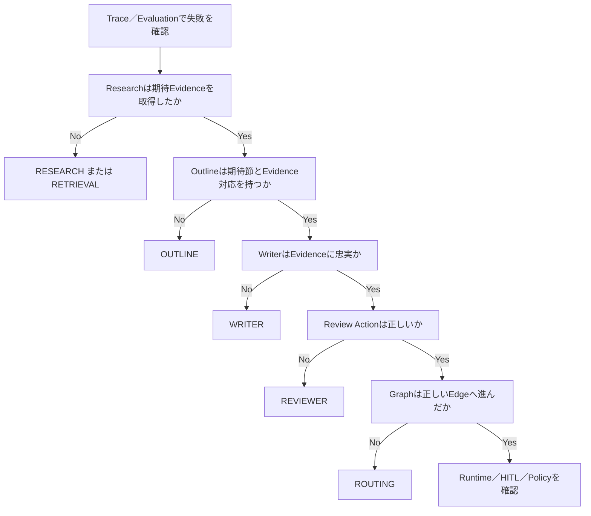

1 Caseを複数Agentの失敗として同時集計しない。上流の破綻が下流へ波及した場合は、最初の破綻を主原因とし、波及先は補足情報として残す。

#### 3.6.2 原因と改善対象の対応

| 最初に破綻した箇所 | 原因分類 | 主な改善先 |
| --- | --- | --- |
| 必要文書自体がない | `DOCUMENT` | Corpus整備。詳細はRAG資料参照 |
| 文書はあるが検索されない | `RETRIEVAL` | AI Search／Query。詳細はRAG資料参照 |
| ResearchのQuery・調査メモが不適切 | `RESEARCH` | Research Prompt／Node |
| 必須節・Evidence対応が不適切 | `OUTLINE` | Outline Prompt／Node |
| Evidence取得済みだが本文・引用が誤る | `WRITER` | Writer Prompt／Node |
| 正しいDraftを誤承認・誤差し戻し | `REVIEWER` | Review Prompt／Judge |
| ReviewDecisionは正しいがEdgeが誤る | `ROUTING` | LangGraph Edge／Policy |
| 往復が止まらない | `LOOP` | Loop Budget／停止条件 |
| 差し戻し後に古い成果物を再利用 | `STATE_INVALIDATION` | State破棄規則 |
| Checkpoint／Resumeが不正 | `HITL` | Checkpointer／Decision／Resume |
| 権限・公開範囲がAgent間で失われる | `POLICY_PROPAGATION` | State Contract／Server Policy |
| Agent間受け渡しSchemaが不整合 | `CONTRACT` | 共通Pydantic Model／Schema Version |

#### 3.6.3 PoCで最低限確認するMulti-agent Test

1. Researchが期待Evidenceを取得できる。
2. OutlineがEvidence IDを節へ正しく割り当てる。
3. WriterがOutlineで指定されたEvidenceだけで本文を作る。
4. Reviewerが意図したActionを返す。
5. `research`、`reoutline`、`rewrite`がそれぞれ正しいNodeへ戻る。
6. 差し戻し時に不要になったStateが破棄される。
7. Loop上限到達時に自動承認せずHuman Reviewへ移る。
8. Policy、Corpus Snapshot、Prompt Bundleが全Nodeで同じ値のまま維持される。
9. AgentごとのSpanとRoute Historyから、上記を後から再現できる。

この9点が成立して初めて、「複数LLMを順番に呼んでいる」状態ではなく、運用可能なMulti-agent Graphとして評価する。


### 3.7 PoC完了判定と本番化Gap

PoC完了時には、KPI、Evaluation Run、代表Trace、失敗原因、未解決Risk、Latency／Token／Loop Cost、本番化Gap、Go／No-Goを簡易なDecision Logへ残す。

| 判定軸 | 最低限確認すること |
| --- | --- |
| 機能成立 | Research→Outline→Writer→Review→Finalize／Human Reviewが期待経路で動く |
| Grounding | 期待EvidenceとCitationが追跡でき、Evidence 0件で自動本文を作らない |
| Routing | `research`／`reoutline`／`rewrite`を区別し、Loop上限が効く |
| 評価可能性 | Agent別とEnd-to-Endの両方をEvaluationで比較できる |
| 可観測性 | 代表失敗をTraceから原因分類できる |
| Security | PoCで要求したACL／Publication条件を破らない |
| Runtime | SSE完了、Error、Latency、TokenがPoC許容範囲 |
| 本番化Gap | 4章で追加する統制が列挙され、Ownerが決まる |

本番化Gapには、少なくともCorpus Snapshot管理、Prompt Bundle Release、認証／公開Policy、Durable HITL、Training／Holdout、Production Monitoring、Rollbackを含める。

### 3.8 PoCから本番へ持ち越すもの・置き換えるもの

| 持ち越す | 置き換える／強化する |
| --- | --- |
| Pydantic／TypedDict契約、LangGraph Node／Edge、Trace Schema、Scorer、SSE契約 | 固定Corpus ID→Snapshot Registry、固定Prompt→Prompt Bundle Manifest、最小Human Review→Durable HITL |
| PoC Golden Caseと失敗原因分類 | Training／Holdout、Release Gate、Production Monitoringへ拡張 |
| Agent別Prompt分離、期待Route | Release単位の不変Prompt VersionとRouting Policy Versionへ固定 |
| 代表TraceとHuman Assessment | Pilot Reviewと本番MonitoringのBaselineへ継承 |

#### 3.8.1 PoCでは持たず、本番で追加する管理資産と「なぜ必要か」

| 本番で追加する資産 | PoCで省略できる理由 | 本番で必要になる理由 | 無い場合に困ること |
| --- | --- | --- | --- |
| Corpus Snapshot Manifest／Registry | dev Corpusを人が固定できる | Requestが参照した全文書Version集合を再現・Rollbackする | 文書更新後に同じレポートを再評価できない |
| Prompt Bundle Manifest | 少数Prompt Versionを手で固定できる | 複数Agent Prompt、Model、Corpus、GitをAtomicに固定する | Researchだけ新Prompt、Reviewerだけ旧Prompt等の未評価組合せが生じる |
| Release Channel | PoCは直接Version指定で足りる | Productionが参照する不変Bundleを一か所で切替える | Rollback時に複数設定を別々に戻す必要がある |
| Durable Checkpoint | PoCはHuman Reviewで終了してよい | 外部承認待ち後に同じStateから安全にResumeする | 長時間Requestを最初から再実行し、二重処理や状態不整合が起きる |
| Runtime Review Case | 少人数なら手作業で扱える | Lease、Decision Version、再開状態を追跡する | 複数Reviewerによる二重承認や取りこぼしが起きる |
| Training／Holdout | 小規模Golden Setで成立性確認が目的 | 改善に使ったCaseと最終Release判定を分離する | Promptが評価Caseへ過適合しても検出しづらい |
| Release Gate／Decision Log | PoC責任者が直接判断できる | 品質・Security・Latency・Cost・HITLを同じ証跡で承認する | 「なぜこのBundleを本番に出したか」を監査できない |
| Production Monitoring | PoCは実行後確認で足りる | 本番Traceを継続的に評価し異常を早期発見する | 誤承認や品質Driftが利用者申告まで見えない |
| Rollback手順 | PoCはdev再Deployで戻せる | Code、Prompt、Model、Corpusを同時に前Releaseへ戻す | Codeだけ戻って検索CorpusやPromptが新しいまま残る |

##### まず理解する：本番Trace Tagは「そのRequestが何を使ったか」を指す

本番ではTraceに`prompt_bundle_id`、`corpus_snapshot_id`、`source_git_commit`、`publication_policy_version`等を残す。ただしTrace Tag自体をReleaseやCorpusの正本にはしない。

```text
Trace Tag = 「このRequestは何を使ったか」の証跡
Manifest / Registry = 「そのIDが何を意味するか」の正本
```

たとえばTraceに`corpus_snapshot_id = cs_20260823_01`が残っていても、Snapshot Manifestがなければ、どの文書Version集合だったかを再構成できない。

##### Corpus Snapshotを分ける理由の具体例

文書Aだけが更新されたとき、取り込みRun IDをそのまま検索Versionとして使うと、文書B、Cが同じRunに含まれず、検索対象集合を表せない。Corpus Snapshotは「その時点で検索可能だった**全文書Version集合**」を固定するために分ける。

##### Prompt Bundle Manifestを分ける理由の具体例

Research、Outline、Writer、ReviewのPromptを個別Aliasだけで管理すると、切替途中にResearchだけ新Version、Reviewerだけ旧Versionという未評価の組合せが生じる。Prompt Bundleは、複数PromptとModel、Corpus、Git Commitを1つのRelease構成として固定する。

##### Release Channelを分ける理由の具体例

Prompt Bundleは不変の構成情報であり、「現在ProductionがどのBundleを使うか」は別の可変Pointerである。Rollback時はManifestを書き換えず、Release ChannelのPointerだけを前Bundleへ戻す。

##### Durable CheckpointとRuntime Review Caseを分ける理由の具体例

Human Reviewが数分〜数時間かかる場合、Application ProcessのMemoryだけでStateを保持できない。CheckpointはGraph Stateを保存し、Runtime Review Caseは「誰がReview中か」「どのDecision Versionで再開するか」を管理する。両者の役割は異なる。

##### Training／Holdoutを分ける理由の具体例

同じCaseをPrompt改善と最終合否判定の両方に使うと、そのCaseへの過適合を検出できない。Trainingは改善に利用し、HoldoutはCandidate決定後の最終判定にだけ使う。

##### Release Gateと意思決定記録を分ける理由の具体例

Release Gateは品質、Security、Latency、Cost、HITL等の**判定材料を作る処理**である。最終的な採用、条件付き採用、却下、Risk受容は人の意思決定であり、その理由をDecision Logへ残す。

##### Production Monitoringを分ける理由の具体例

Offline Evaluationが合格しても、実利用ではTopic分布、文書量、Loop回数、Human Review率が変わる。本番Traceを継続評価し、Evidence 0件、誤承認、Loop上限、Latency／Cost等の変化を検知するためにProduction Monitoringを用意する。

##### RollbackをRelease単位で考える理由の具体例

Codeだけを前Versionへ戻しても、Prompt、Model、Corpus Snapshotが新しいままなら、評価済みの旧構成には戻らない。Rollback対象は個別ファイルではなく、**評価済みRelease構成全体**とする。

## 4. 本番導入時に実施するもの

### 4.1 本番導入の目的・完了条件

本番導入では、PoCのGraphを単にDeployするのではなく、**Corpus、Prompt、Model、Code、Policy、人手判断を不変IDと監査証跡で関連付け、外部公開・高Risk・長時間処理でもFail Closedにできること**を完了条件とする。Production Monitoringは本番開始後に考える機能ではなく、この段階で設定しStagingでDry Runする。

| 完了領域 | 本番開始前に満たす状態 |
| --- | --- |
| Reproducibility | `corpus_snapshot_id`、`prompt_bundle_id`、Model、Git、Policy Versionから実行条件を再現できる |
| Security／Publication | User入力ではなくServer側Identity／PolicyでEvidence Filterを強制する |
| HITL | 自動承認できないRequestを永続停止し、二重処理せずResumeできる |
| Quality | TrainingとHoldoutを分離し、未使用CaseでRelease可否を判定できる |
| Observability | Agent別Trace、Route、Loop、Token、Latency、Human Reviewを本番開始時点から取得する |
| Rollback | CodeだけでなくPrompt Bundle、Model Route、Corpus Snapshotを前Releaseへ戻せる |
| Operations | Dry Run、Alert、Runbook、責任者、Decision Logの入口が用意される |

### 4.2 本番導入時のデータモデル全体像

#### 4.2.1 まず理解する構成

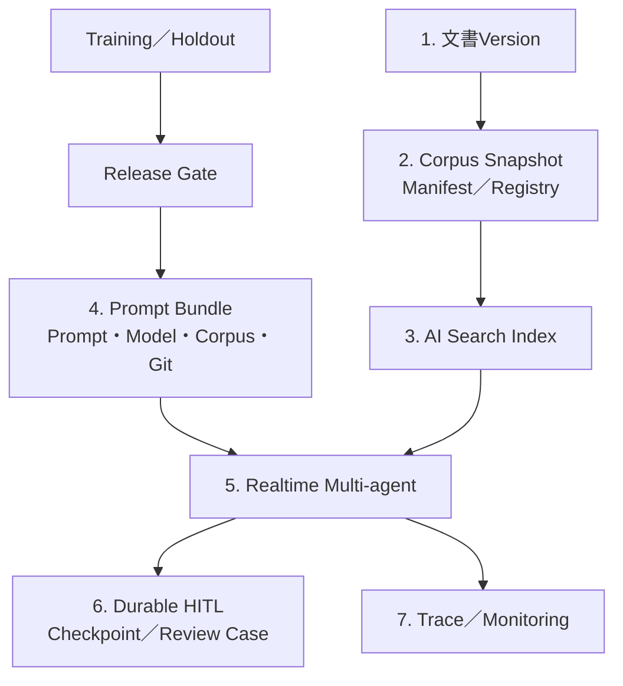

#### 4.2.2 本番導入時のTable／Dataset一覧

| 分類 | 物理名／実体 | 主な役割 |
| --- | --- | --- |
| Corpus | `main.llmops.corpus_snapshot_manifest` | Snapshotに含まれる全文書IDとVersionの対応を不変に保持 |
| Corpus | `main.llmops.corpus_snapshot_registry` | candidate／active／retired、Index同期・承認状態を管理 |
| Release | `main.llmops.technical_report_prompt_bundles` | 5 Prompt、Model Service、Corpus Snapshot、Git Commitを1 Releaseへ固定 |
| Release | `technical_report_release_channels` | `production`等のCurrent PointerをAtomicに切替 |
| 評価 | `main.llmops.technical_report_train` | 候補探索用Training Dataset |
| 評価 | `main.llmops.technical_report_holdout` | 最終Release Gate専用Holdout |
| HITL | Durable Checkpoint Store | `thread_id`単位でGraph Stateを永続化 |
| HITL | Runtime Review Case Store | Lease、Decision Version、再開状態を保持。物理製品はPlatform標準に従う |
| Monitoring | MLflow Production Monitoring／Registered Scorer | 本番TraceをSampling評価 |

#### 4.2.3 本番導入時の管理系ER図

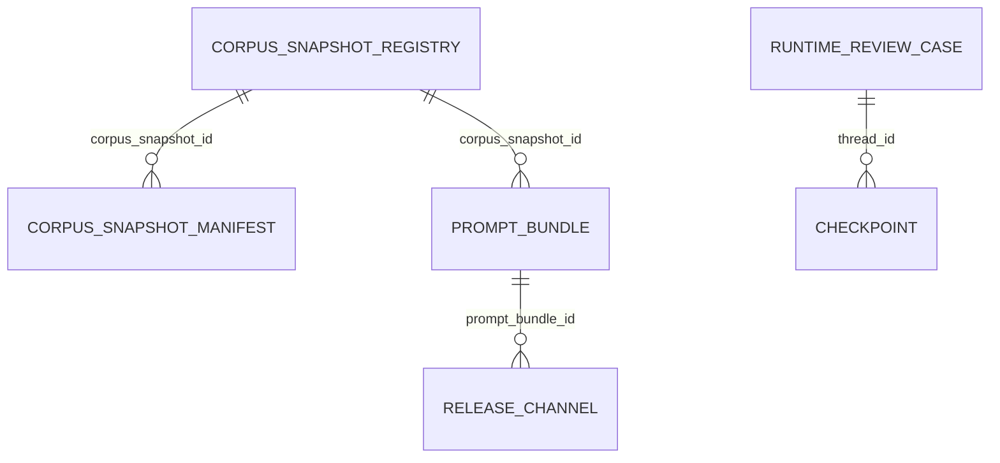

Runtime Review Case／Checkpointの物理Schemaは組織のPlatform標準へ依存するため、ここでは論理関係だけを示す。Quality改善用の`technical_report_review_cases`は本番後の定期Review自動化で本格利用するため、4章の管理ERへ混ぜない。

#### 4.2.4 本番導入時のデータフロー図

文書基盤、レポート作成、品質改善は実行周期と責任者が異なる。Corpus Snapshot、Prompt Version、モデル経路、GitコミットをTraceへ残し、後から同じ条件を再現できるようにする。


今回のResearch、Outline、Writer、Reviewは、独立したDatabricks Appsではなく、同じApplication内のLangGraph Nodeとして実装する。個別の権限境界、別TeamによるRelease、独立Scaling、他Applicationからの再利用が必要になった時点で、Apps AgentやServing Endpointへ分離する。

### 4.3 本番開始前に構築する運用・統制機能

PoCで動いたGraphへ本番機能を一度に足さない。まず変更点を理解し、次に構築順序を確認し、その後でProject構成と個別Sourceへ進む。

#### 4.3.1 PoCコードからの主な変更点

| PoC | 本番Baseline | 変更理由 |
| --- | --- | --- |
| 固定dev Corpus ID | Corpus Snapshot Manifest／Registry | 全文書Version集合を再現する |
| 個別Prompt Version指定 | Prompt Bundle Manifest | 複数Agent PromptをAtomicにReleaseする |
| 固定Tester | 認証済みUser／Group＋Server Policy | Client入力による権限昇格を防ぐ |
| Human Reviewで終了 | Durable Checkpoint＋Runtime Review Case＋Resume | 長時間承認待ちから安全に再開する |
| Golden Set | Training／Holdout | 探索と最終判定を分離する |
| 手動Trace確認 | Production Monitoring＋Alert | 本番開始直後から品質Driftを観測する |

ここでは「PoCを捨てて別システムを作る」のではない。**PoCの契約、Agent Node、Scorer、SSEを残し、再現性・権限・承認・監視を追加する**。

#### 4.3.2 本番版の構築順序

初読では、次の順序だけを把握する。

```text
1. Project／Bundle境界を分ける
        ↓
2. Workspace／MLflowの本番Resourceを準備する
        ↓
3. Corpus Snapshotで検索対象Version集合を固定する
        ↓
4. Prompt BundleでPrompt・Model・Corpus・Gitを固定する
        ↓
5. Identity／Publication PolicyをServer側で解決する
        ↓
6. Durable HITLで停止・再開を永続化する
        ↓
7. Training／HoldoutとRelease Gateを用意する
        ↓
8. Production Monitoringを本番前に登録する
        ↓
9. StagingでDry RunしてからProductionへReleaseする
```

詳細コードはこの順番で読めばよい。最初から4.3.4の全Sourceを読む必要はない。

#### 4.3.3 本番Project構成

本番Baselineは`knowledge`、`quality`、`realtime`を独立Deployし、共通の型だけを`technical-report-common`で共有する。PoCで使ったApplication Codeを捨てず、Corpus／Release／HITL／MonitoringのSourceを追加する。

```text
technical-report-agent/
├── packages/technical-report-common/
│   └── src/technical_report_common/report_contracts.py
├── bundles/knowledge/
│   ├── src/document_pipeline.py
│   ├── src/publish_corpus_snapshot.py
│   └── src/create_search_index.py
├── bundles/quality/
│   ├── src/register_prompts.py
│   ├── src/seed_evaluation_dataset.py
│   ├── src/evaluate_report.py
│   ├── src/release_gate.py
│   ├── src/publish_prompt_bundle.py
│   └── src/register_monitoring.py
└── bundles/realtime/
    ├── app/auth_context.py
    ├── app/evidence_search.py
    ├── app/prompt_bundle.py
    ├── app/report_graph.py
    ├── app/agent.py
    ├── app/start_server.py
    └── app/streamlit_app.py
```

| Bundle／Package | 本番Baselineでの責務 |
| --- | --- |
| `technical-report-common` | Evidence、Outline、Review、State、Resultの共通契約 |
| `knowledge` | 文書解析、Corpus Snapshot、AI Search Index |
| `quality` | Prompt、Training／Holdout、Release Gate、Monitoring |
| `realtime` | 認証Context、LangGraph、HITL、Agent Server、Streamlit |

Prompt Optimization、Judge Alignment、定期Review Queue、カナリアは本番開始条件にはせず、5章の高度化として追加する。

##### 4.3.3.1 本番Workspace・MLflow初期セットアップ

本番では、Realtime実行、Offline Evaluation、Human Labelingを同じExperimentへ混在させない。目的ごとに入口を分けると、Trace検索、権限、Retention、Monitoring対象を説明しやすい。

| Resource | 主な用途 |
| --- | --- |
| Realtime Experiment | Production／Pilotの実Request Trace |
| Evaluation Experiment | Training／Holdout、Candidate比較、Release Gate |
| Labeling／Review | 専門家Assessment、Expectation、原因診断 |
| Prompt Registry | Research／Outline／Writer／Review Prompt Version |
| EvaluationDataset | `technical_report_train`／`technical_report_holdout` |

初期セットアップでは、Resource作成だけでなく、Service Principal／実行IdentityからTrace、Prompt、Dataset、Model Serviceへ必要最小限のアクセスができることをSmoke Testする。

##### 4.3.3.2 AI Gateway／Model経路の事前設定

複数AgentがModelを呼ぶため、Model名を各Sourceへ直書きせず、Release構成から解決できるようにする。GatewayやServing側でUsage、Rate Limit、Fallback等を管理する場合も、Graph内部では`model_service`という安定した参照へ寄せる。

PoC段階では1 Model Serviceでもよいが、本番では少なくとも次をTraceで識別できるようにする。

- どのAgentが呼んだか
- どのModel Service／Variantを使ったか
- Token、Latency、Error
- Prompt Bundle IDとGit Commit

#### 4.3.4 本番ソースファイル

ここから個別Sourceへ進む。各節は「目的 → 物理的実体 → 実装 → 実行結果／確認方法」の順に読む。

| 順序 | Source／機能 | 先に理解すること |
| --- | --- | --- |
| 1 | Corpus Snapshot | 何を検索対象集合として固定するか |
| 2 | Prompt Bundle | 複数Agent Promptをどう一体でReleaseするか |
| 3 | Identity／Policy | 誰が何を検索・掲載できるか |
| 4 | Durable HITL | どこで止め、どう同じStateから再開するか |
| 5 | Training／Holdout | 改善Caseと最終判定Caseをどう分けるか |
| 6 | Release Gate／Release | 何を根拠に本番構成を切り替えるか |
| 7 | Monitoring | 本番開始後に何を自動評価するか |

##### 4.3.4.1 全文書Version集合としてCorpus Snapshotを発行する

この実装では、取り込みJobの`ingestion_run_id`と、検索可能な全文書Version集合である`corpus_snapshot_id`を分離する。たとえば1件だけ更新した取り込みJobでも、新Snapshot Manifestには更新文書の新Versionと、更新されなかった全既存文書の有効Versionが含まれる。したがってAI Searchを`corpus_snapshot_id`でFilterしても既存文書が消えない。

Knowledge Bundleは次の2表を正本とする。

| 表 | 主な列 | 役割 |
| --- | --- | --- |
| `main.llmops.corpus_snapshot_manifest` | `corpus_snapshot_id`、`document_id`、`document_version`、`chunking_version`、`ingestion_run_id` | Snapshotに含まれる全文書Versionの対応を管理する。 |
| `main.llmops.corpus_snapshot_registry` | `corpus_snapshot_id`、`status`、`created_at`、`approved_at`、`search_index_sync_id` | `candidate`、`active`、`retired`とIndex同期・承認状態を管理する。 |

`bundles/knowledge/src/publish_corpus_snapshot.py`

```python
from __future__ import annotations

from pyspark.sql import SparkSession, Window, functions as F


MANIFEST_TABLE = "main.llmops.corpus_snapshot_manifest"
REGISTRY_TABLE = "main.llmops.corpus_snapshot_registry"
DOCUMENT_VERSION_TABLE = "main.llmops.document_versions"


def build_snapshot_manifest(
    spark: SparkSession,
    corpus_snapshot_id: str,
    cutoff_timestamp: str,
) -> None:
    # Cutoff時点で承認済みの最新Versionを文書ごとに1件選び、全文書集合を固定する。
    versions = spark.table(DOCUMENT_VERSION_TABLE).where(
        (F.col("approval_status") == "approved")
        & (F.col("effective_at") <= F.to_timestamp(F.lit(cutoff_timestamp)))
    )
    latest = (
        versions.withColumn(
            "version_rank",
            F.row_number().over(
                Window.partitionBy("document_id").orderBy(
                    F.col("effective_at").desc(), F.col("document_version").desc()
                )
            ),
        )
        .where(F.col("version_rank") == 1)
        .drop("version_rank")
        .withColumn("corpus_snapshot_id", F.lit(corpus_snapshot_id))
    )

    # 同じSnapshot IDの再実行を許さず、内容が後から変わることを防ぐ。
    if spark.table(MANIFEST_TABLE).where(
        F.col("corpus_snapshot_id") == corpus_snapshot_id
    ).limit(1).count():
        raise ValueError(f"Corpus Snapshot already exists: {corpus_snapshot_id}")
    latest.select(
        "corpus_snapshot_id",
        "document_id",
        "document_version",
        "chunking_version",
        "ingestion_run_id",
    ).write.mode("append").saveAsTable(MANIFEST_TABLE)


def register_candidate(spark: SparkSession, corpus_snapshot_id: str) -> None:
    # Search Index同期前のSnapshotをcandidateとしてRegistryへ登録する。
    spark.createDataFrame(
        [(corpus_snapshot_id, "candidate")],
        "corpus_snapshot_id string, status string",
    ).withColumn("created_at", F.current_timestamp()).write.mode("append").saveAsTable(
        REGISTRY_TABLE
    )
```

実運用ではManifestをChunk表へJoinし、Snapshot ID、閲覧Entitlement、公開区分、機密区分を持つ検索用Delta表を生成してAI Searchへ同期する。件数、欠落文書、ACL、公開区分を検証した後に、Registryの`active` Pointerを1 Transactionで候補へ切り替える。Request開始時に選んだSnapshot IDはStateへ固定し、途中でActive Pointerが変わっても再解決しない。Rollbackは文書を再取り込みせず、検証済みの前Snapshotを`active`へ戻す。Snapshot Manifest自体は不変であり、誤りは新しいSnapshotとして訂正する。

##### 4.3.4.2 Prompt Bundle ManifestをRuntimeで解決する

この実装では、`PROMPT_BUNDLE_ID`からDelta表のManifestを1回取得し、5つの不変Prompt Version URI、Model Service、Corpus Snapshot、Git Commitを解決する。Manifestは`quality` Bundleが発行し、`realtime` Bundleは読み取り専用で利用する。1 RequestのStateへ解決結果をコピーするため、処理中のRelease切替やAlias変更でPromptが混在しない。

`main.llmops.technical_report_prompt_bundles`は次のSchemaを持つ。

| 列 | 内容 |
| --- | --- |
| `prompt_bundle_id` | 不変Bundle ID |
| `research_plan_uri`〜`review_uri` | `prompts:/name/version`形式の不変URI |
| `model_service` | Foundation Model APIs／Serving Endpoint名 |
| `corpus_snapshot_id` | 同Bundleで検証済みの全文書Version集合 |
| `source_git_commit` | 評価済みApplication Commit |
| `status` | `candidate`、`production`、`retired` |
| `created_at`、`approved_at` | 監査時刻 |

`bundles/realtime/app/prompt_bundle.py`

```python
from __future__ import annotations

import os
import re
from functools import lru_cache

from databricks.sdk import WorkspaceClient
from pydantic import BaseModel, ConfigDict


BUNDLE_TABLE = "main.llmops.technical_report_prompt_bundles"


class PromptBundle(BaseModel):
    # Runtimeが1 Requestで固定するPrompt・Model・Corpus・Codeの組を検証する。
    model_config = ConfigDict(extra="forbid", frozen=True)

    prompt_bundle_id: str
    prompt_uris: dict[str, str]
    model_service: str
    corpus_snapshot_id: str
    source_git_commit: str


@lru_cache(maxsize=32)
def load_prompt_bundle(prompt_bundle_id: str) -> PromptBundle:
    # SQL InjectionとAlias参照を防ぎ、完全一致する不変Manifestだけを取得する。
    if not re.fullmatch(r"[A-Za-z0-9._-]{1,128}", prompt_bundle_id):
        raise ValueError("Invalid prompt_bundle_id")
    statement = f"""
        SELECT research_plan_uri, research_notes_uri, outline_uri,
               writer_uri, review_uri, model_service,
               corpus_snapshot_id, source_git_commit
        FROM {BUNDLE_TABLE}
        WHERE prompt_bundle_id = '{prompt_bundle_id}'
    """
    response = WorkspaceClient().statement_execution.execute_statement(
        warehouse_id=os.environ["SQL_WAREHOUSE_ID"],
        statement=statement,
        wait_timeout="10s",
    )
    rows = response.result.data_array if response.result else []
    if len(rows) != 1:
        raise RuntimeError(f"Prompt Bundle must resolve to one row: {prompt_bundle_id}")
    row = rows[0]
    prompt_uris = dict(
        zip(
            ["research_plan", "research_notes", "outline", "writer", "review"],
            row[:5],
            strict=True,
        )
    )
    if any("@" in uri or not re.fullmatch(r"prompts:/[^/]+/[0-9]+", uri) for uri in prompt_uris.values()):
        raise RuntimeError("Runtime Prompt Bundle must contain immutable version URIs")
    return PromptBundle(
        prompt_bundle_id=prompt_bundle_id,
        prompt_uris=prompt_uris,
        model_service=row[5],
        corpus_snapshot_id=row[6],
        source_git_commit=row[7],
    )
```

Production切替は、Quality JobがHoldoutとRelease Gateを通過した候補Manifestを新規Insertし、Release Channel表の`production` Pointerを1 Transactionで新Bundle IDへ切り替える。Databricks Appへは解決済みの`PROMPT_BUNDLE_ID`を設定するか、Request開始時にChannel Pointerを解決する。Rollbackは前Bundle IDへPointerを戻すだけであり、Manifest行を上書きしない。Online Experimentでは`request_id`または`session_id`の安定HashでBundle IDを一度選び、StateとTraceへ固定する。`@production` AliasはManifest作成時の候補選択にだけ利用し、Runtimeでは利用しない。

Databricks SQL Statement Executionは標準機能だが、AtomicなRelease Channel更新、承認Workflow、Manifest不変性の制約は本資料で設計する運用実装である。

##### 4.3.4.3 認証済み利用者とServer側公開Policyを適用する

PoCで固定値としていた`reader_entitlements`、`publication_scope`、`data_classification_ceiling`は、本番ではDatabricks Appsの認証ContextとServer側業務Policyから解決する。Clientが指定するAudienceは文体指定に限定し、権限や掲載範囲の決定に使わない。閲覧可能でも外部掲載不可のEvidenceは、外部向けRequestではLLM入力へ入れない。

##### 4.3.4.4 再開可能なDurable Human-in-the-loopを構築する

上の`human_review_node()`は最小構成である。`review_case_id`を付けた未承認成果物を返し、自動公開せず、Graphを終了する。AgentはReview Case IDをTrace Tagへ残し、Quality Jobが同じIDでReview Queueへ冪等登録する。人間の判断後に同じGraphを再開する機能ではない。

金融機関向け本番構成では、LangGraphのdurable checkpointer、`thread_id`、`interrupt()`、`Command(resume=...)`を使い、Application Stateを永続化する。MLflow Agent ServerはTraceとResponses APIを提供するが、Application固有のLangGraph Checkpoint Store、Lease、再開冪等性を自動提供するものとして扱わない。これらは`realtime` Bundleと運用DBが責任を持つ。

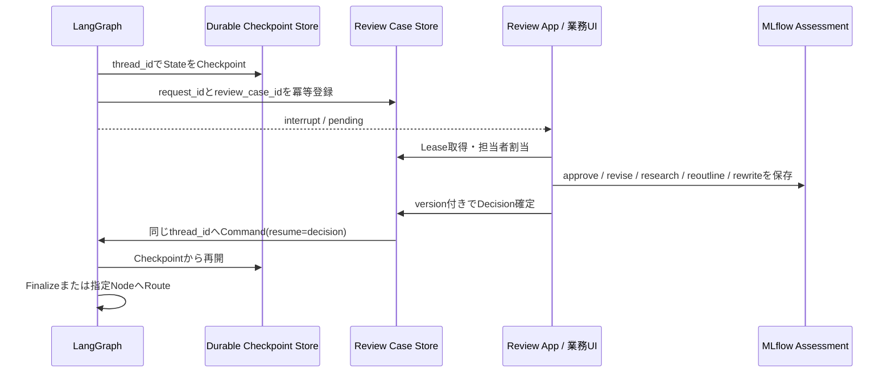

| 項目 | 本番実装の責務 |
| --- | --- |
| 関連付け | `request_id`、`review_case_id`、LangGraph `thread_id`、Trace IDをReview Caseへ保存する。 |
| 二重処理 | `review_case_id`とDecision Versionに一意制約を設け、Lease所有者だけが状態を遷移させる。 |
| 冪等性 | Review Case登録、外部通知、公開処理へIdempotency Keyを渡し、`interrupt()`前の副作用を再実行可能にする。 |
| Timeout | SLA超過を監視し、担当者再割当、上位承認者Escalation、期限切れを記録する。 |
| 再開 | `approve`はFinalizer、`research`はResearch、`reoutline`は古いOutline・Draftを破棄してOutline、`rewrite`はWriterへ戻す。 |
| 監査 | 人間のDecision、理由、修正内容をMLflow Assessmentと業務Review表の両方へ保存する。 |

概念的には、同じ`thread_id`のConfigを使い、`Command(resume=decision)`をGraphへ渡してCheckpointから再開する。実際のCheckpointer製品、暗号化、DR、保持期間は金融機関のPlatform標準に従うため、この最小サンプルへ特定実装を埋め込まない。

##### 4.3.4.5 TrainingとHoldoutを分離する

Training／Holdoutの基本的な分離方針、EvaluationDatasetの育成方法は、**「社内技術文書検索システム（エージェント型RAG）_完成版.md」**を参照する。本資料では同じ仕組みを再説明しない。

Multi-agent側で追加するExpectationは次である。

| 追加Expectation | 用途 |
| --- | --- |
| `expected_document_ids` | ResearchのEvidence取得を評価 |
| `expected_sections` | Outlineの必須節を評価 |
| `expected_section_source_ids` | OutlineのEvidence割当を評価 |
| `prohibited_claims` | WriterのGroundingを評価 |
| `expected_review_action` | Reviewer判断を評価 |
| `expected_routes` | Graphの差し戻し先を評価 |
| `expected_human_review` | 自動停止条件を評価 |

同じTopicの言い換えや同じFailure FamilyをTrainingとHoldoutへ跨がせない点もRAG資料と同じである。

##### 4.3.4.6 共通Release GateへMulti-agent固有条件を追加する

ACL、Groundedness、Citation、Latency、Cost等の共通GateはRAG資料のRelease Gateを利用する。本システムでは、そこへ次のMulti-agent固有条件を追加する。

| 追加Gate | Block条件の例 |
| --- | --- |
| Research | 期待Evidence Recallが現行より悪化 |
| Outline | 必須節欠落、Evidence未割当節が発生 |
| Writer | Evidence外Claim、未知Citation IDが発生 |
| Reviewer | 重大Caseを`approve`、正常Caseを恒常的に差し戻す |
| Routing | 期待Actionと実Edgeが不一致 |
| Loop | 上限超過、同じStateで同じNodeを反復 |
| State | `reoutline`後に旧Draftを再利用する等の無効State利用 |
| HITL | Pending Caseの二重Decision、誤`thread_id`再開 |
| Bundle | 1 Request内でPrompt／Model／Corpus Versionが変化 |

Release判定Jobは共通Gateの結果とこれらのMulti-agent Signalをまとめ、人が採用／却下を判断する。Release Gate自体の実装パターンはRAG資料を参照する。


##### 4.3.4.7 Prompt Bundle ManifestをReleaseする

Multi-agentでは5つのPromptが組み合わさるため、個別Aliasだけでは「本番でどの組合せだったか」を表しにくい。Release時に各Promptの不変Version URI、Model Service、Corpus Snapshot、Git Commitを`main.llmops.technical_report_prompt_bundles`へ1行のManifestとして固定する。

```json
{
  "prompt_bundle_id": "report-bundle-2026-08-11-01",
  "research_plan_uri": "prompts:/main.llmops.report_research_plan/3",
  "research_notes_uri": "prompts:/main.llmops.report_research_notes/2",
  "outline_uri": "prompts:/main.llmops.report_outline/4",
  "writer_uri": "prompts:/main.llmops.report_writer/7",
  "review_uri": "prompts:/main.llmops.report_review/5",
  "model_service": "system.ai.claude-sonnet-4-5",
  "corpus_snapshot_id": "corpus-2026-08-01",
  "source_git_commit": "<commit-sha>",
  "status": "candidate"
}
```

Quality JobはAliasを解決して上記の不変URIへ変換し、Holdout合格後にManifestをInsertする。`technical_report_release_channels`表の`production` PointerだけをDelta Transactionで切り替えるため、5つのPromptが部分更新されない。ApplicationはRequest開始時に`PROMPT_BUNDLE_ID`を解決し、Stateへ固定する。Rollbackは前Manifest IDをPointerまたはApp設定へ戻す。Online Experimentでは安定Hashで選んだManifest IDをRequest／Session中固定し、Traceへ`report.prompt_bundle_id`を残す。

##### 4.3.4.8 Production MonitoringへMulti-agent固有Signalを追加する

Production Monitoringの登録方法、Sampling、Alert、Judge運用の共通設計は、**「社内技術文書検索システム（エージェント型RAG）_完成版.md」**を参照する。

本システムでは、通常のRAG Signalに次を追加する。

| 分類 | 原則 | Multi-agent固有Signal |
| --- | --- | --- |
| Agent実行 | 全件 | Agent名、Call回数、Agent別Latency、Agent別Token |
| Routing | 全件 | Review Action、実際の遷移先、Route History |
| Loop | 全件 | `research`／`reoutline`／`rewrite`回数、上限到達 |
| State | 全件 | State Version、破棄イベント、Checkpoint ID |
| HITL | 全件 | Pending時間、Resume結果、Decision Version |
| Bundle | 全件 | Request開始時のPrompt Bundle／Corpus／Git Commit |
| 協調品質 | Sample | Evidence→Outline→Draft→Reviewの引継ぎが成立しているか |

Latency、Token、Loop回数、RouteはLLM Judgeで判定せずTrace／Spanから集計する。LLM Judgeを使う場合も、単なる最終文章品質ではなく、EvidenceがOutlineとDraftへ正しく引き継がれたか等、意味理解が必要な協調品質へ限定する。


##### 4.3.4.9 GitコミットベースでVersionを追跡する

| 対象 | 正本 | Trace・実行との関連付け |
| --- | --- | --- |
| `knowledge` Bundle | Git | Pipeline Run、Snapshot、Index設定 |
| `quality` Bundle | Git | Evaluation Run、Job Run、Scorer、Split Rule |
| `realtime` Bundle | Git | Git-based LoggedModel、Trace |
| 共通Package | Git | Wheel Version、Git Commit |
| Prompt | Prompt Registry | 不変Prompt Version、Manifest ID、Trace |
| Agent経路 | Git | LangGraph Node／Edge、Loop上限、Trace |
| 基盤モデル | Model Service／Serving Endpoint | Model Service名、実Variant、LLM Span |
| 自社Custom Model | Unity Catalog Model Registry | Model名、Version、Serving Endpoint |
| Judge | MLflow Scorer／Git | Judge ID、Version、Assessment、Git Commit |

Application CodeをModel Registryへ登録してVersion管理しない。Model Registryは自社Custom ModelのArtifactとVersionを管理する場所であり、Agent CodeはGit、PromptはPrompt Registry、Databricks管理基盤モデルはModel Serviceで管理する。

##### 4.3.4.10 長文レポートのContext・Cost・再開設計

開発コードの一括生成方式は、小〜中規模レポート向け最小実装である。WriterとReviewerへ全Evidenceと全文Draftを毎回渡す方式は、長文でContext、Latency、Cost、中央部の見落としが増えるため、本番の長文経路は節単位へ分割する。

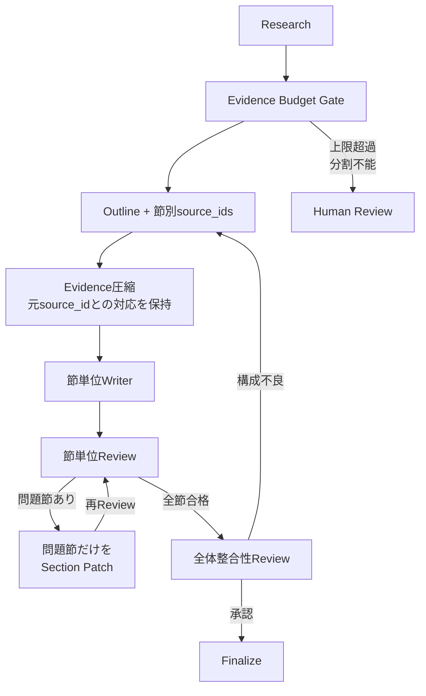

| 制御 | 本番方針 |
| --- | --- |
| Evidence上限 | 件数とModel TokenizerによるToken Budgetを節ごと・Request全体へ設定する。 |
| 圧縮 | 要約文ごとに元`source_ids`を保持し、圧縮後IDから原文Chunkへ監査可能にする。 |
| Writer | Outline Sectionと割当Evidenceだけを入力し、節単位のDraft ArtifactをCheckpointする。 |
| Review | 節単位でClaim・引用・禁止事項を確認し、問題節だけをPatchする。 |
| 全体Review | 重複、矛盾、用語、結論、節間参照、公開Policyを最後に横断確認する。 |
| 超過時 | 黙って末尾を切り捨てず、追加Research、Outline分割、Background Job、人手確認へRouteする。 |
| Cost Gate | Agent別Input／Output Token、Latency、`research`／`reoutline`／`rewrite`ごとの追加CostをChampionと比較する。 |

同期SSEは、予測P95が組織のHTTP上限内で、切断後に同じRequestを再取得できる処理へ限定する。多数節、複数文書圧縮、数分超のReview Loop、外部承認待ちがある場合はBackground Jobへ分離し、即時に`202 Accepted`相当の`request_id`を返す。状態、節Artifact、Prompt Bundle、Corpus Snapshot、完了済みNodeをCheckpointし、再接続時は最後に確定したEvent Sequence以降だけを配信する。再実行で同じ節を二重公開しないよう、`request_id + section_id + attempt`を冪等Keyにする。

Agent Serverの`@stream`はNode進捗をSSEへ送るが、未承認Draft、調査メモ、内部Review指摘は途中表示しない。SSE切断は処理Cancelと同義にせず、Clientは`request_id`で状態を再取得する。本資料の最小コードはdurable CheckpointとBackground Queueを含まないため、長文・承認待ちを扱う前に本番向けHuman-in-the-loop構成へ拡張する。

##### 4.3.4.11 金融機関向け統制・機密情報・ロールバック

- 検索、生成、公開、評価の各権限を分離し、Prompt／Corpus／Codeの変更者が単独でProduction承認できないようにする。
- 外部公開、高機密、Evidence競合、Policy判定不能はFail ClosedでHuman Reviewへ送り、LLMの`approve`で解除しない。
- Corpus Snapshot、Prompt Bundle、Git Commit、Model Service、Policy Version、Review承認を不変IDで監査証跡へ関連付ける。
- Trace、Checkpoint、Review Case、EvaluationDatasetへ個人情報・顧客情報の分類、Masking、保持、Legal Hold、削除Policyを個別に適用する。
- Foundation Model APIs、Reranker、Judgeを含む各Designated Serviceについて、データ所在地、越境、再学習、保持、委託先Riskの利用承認を取得する。
- Emergency停止、前Manifest／CorpusへのRollback、未処理Review Caseの再割当を定期的に演習する。

- `corpus_snapshot_id`は取り込みRunではなく全文書Version集合とし、Manifestで文書IDとVersionを固定する。
- 文書ID、Version、Corpus Snapshot、Chunk、引用IDをStateへ保持する。
- 同じReport Request中にCorpus Snapshotを変更しない。
- 再調査でEvidenceを追加するときも、同じSnapshot、`reader_entitlements`、`publication_scope`、機密上限を使用する。
- 外部公開では公開承認済みEvidenceだけを検索し、内部TitleとURIを成果物へ出さない。

- Traceへ文書全文を無条件に保存せず、環境ごとにMaskingと保存範囲を定義する。
- Review DatasetにはMasking済みTopicと期待レポートを使用する。
- Trace、EvaluationDataset、Review App、Deltaテーブルの権限を別々に確認する。
- Secretや認証情報をPrompt、State、Trace Tagへ保存しない。

- DAB、共通Wheel、Prompt Bundle Manifest、Corpus SnapshotをRelease単位として記録する。
- Prompt Aliasを複数個順番に切り替えるだけの非Atomic Releaseを避ける。
- RollbackではGit Commitだけでなく、Prompt Bundle、Model Variant、Corpus Snapshotも戻す。
- Corpus Snapshot更新だけの場合もGolden Topicで期待Evidenceを検索できることを確認する。

### 4.4 本番開始前のDry Run・運用試験

本番開始前は正常系だけでなく、**止めるべき時に止まり、前Releaseへ戻せること**を試験する。Dry RunはApplicationの機能テストではなく、Identity、Policy、Checkpoint、Release、Monitoring、Runbookを含む運用試験である。

| 試験 | 実施内容 | 合格条件の例 | 主な証跡 |
| --- | --- | --- | --- |
| ACL／Publication Policy | 権限不足User、外部公開不可Evidenceを含むCase | 権限外・掲載不可EvidenceがLLM入力と成果物へ0件 | Trace Filter条件、Result |
| Snapshot固定 | 実行途中に新Snapshotを発行 | Request中は開始時Snapshotを使い続ける | Trace `corpus_snapshot_id` |
| Prompt Bundle固定 | 実行途中にProduction Channelを切替 | Request中のPrompt／Modelが変わらない | `prompt_bundle_id`、Prompt URI |
| Rollback | 前BundleへChannelを戻す | 前Code／Prompt／Model／Corpus組合せで再実行できる | Release／Decision Log |
| Routing | 代表的な`research`／`reoutline`／`rewrite` Case | 期待Edgeへ進み不要Stateを破棄する | Route History |
| Loop上限 | Reviewerが継続差し戻しするFixture | 上限到達でHuman ReviewへFail Closed | Loop Count、Review Case |
| Durable HITL | interrupt→Lease→Decision→Resume | 同じ`thread_id`で冪等に完了し二重確定しない | Checkpoint／Decision Version |
| Search障害 | Retriever Timeout／Error | 未承認Draftを返さずError／Human経路へ進む | Error Span |
| Model障害 | Agent呼出し失敗 | 後段が誤って古いStateを承認しない | Agent Span、Graph State |
| SSE切断 | Client切断／再接続 | Server側Stateと最終結果が破損しない | Request／Trace ID |
| Monitoring | Scorer／Judge／AlertをStaging Traceへ適用 | 指定SignalがDashboard／Alertへ出る | Monitoring Run |
| Cost／Latency | 長文・最大Loop Fixture | P95、Agent別Token、Loop Costが予算内 | Trace Usage |

Dry Runで失敗した場合、単に閾値を緩めて合格させない。Security／Grounding／HITLは本番利用範囲を縮小してでもFail Closedを優先する。

### 4.5 Pilot／本番開始時の監視・運用

Pilotでは、Production Monitoringを「後から設定する」のではなく開始時点から有効化する。Corpus Snapshot、Prompt Bundle、実Model Route、Git Commit、Publication Policy Version、Agent経路、Human Review、Latency／Token／Costを同じTraceへ関連付ける。

| 運用対象 | Pilotでの確認 | しきい値超過時の扱い |
| --- | --- | --- |
| Security／Publication | 権限外Evidence、掲載不可情報 | 即時停止／Incident候補 |
| Grounding | Evidence 0件、Unknown Citation、Unsupported Claim | 自動承認停止、Reviewへ |
| Reviewer | 誤承認、過剰差し戻し | Review Prompt／Judge Caseへ分類 |
| Routing | Loop増大、Human Review率、Expected Route | Graph／Policy Caseへ分類 |
| HITL | Review待ち件数、Resume失敗 | 運用Runbook／Platform確認 |
| Runtime | Error、P95、SSE完了率 | SLOに応じてRollback判断 |
| Cost | Request／Agent別Token、Loop Cost | 利用範囲／Budget見直し |
| Quality | 最終品質とAgent別Scorer | Training改善候補へ送る |

未承認Draft、Research Notes、内部Review指摘は、公開可否が確定する前に一般利用者向けSSEへ途中表示しない。進捗Eventと成果物本文を分ける。

### 4.6 Release・ロールバック・利用拡大の判断基準

Release継続、Rollback、No-Go、利用範囲拡大は、Holdout、Security、誤自動承認、Expected Evidence Recall、Routing、Latency、Cost、HITL再開成功率から判断する。単一の平均品質Scoreだけで判断しない。

| 判断 | 代表条件 | 操作 |
| --- | --- | --- |
| Release継続 | Holdout合格、Security違反0、SLO／Cost内、重大HITL失敗なし | Production Channelを維持 |
| 条件付き継続 | 品質は合格だが特定Audience／文書種でRisk | 利用Scopeを限定しMonitoring強化 |
| Rollback | 誤自動承認、Security違反、重大Regression、Checkpoint障害 | 前Prompt Bundle／Corpus／Codeへ一体Rollback |
| No-Go | 必須Control未実装、Dry Run不合格 | 本番開始しない |
| 利用範囲拡大 | 限定Pilotで品質・Cost・運用負荷が安定 | 対象User／Audience／用途を段階拡大 |

RollbackではGit Commitだけを戻さない。**Prompt Bundle、Model Route、Corpus Snapshot、Policy参照を含む評価済みRelease構成**へ戻す。判断理由と証跡IDはDecision Logへ残す。


## 5. 本番導入後の監視・運用・継続的改善

本番導入後は4章のBaselineを作り直さない。本番Trace、Assessment、Cost、Latency、Human Review実績から必要性が確認できたReview自動化、Dataset育成、Prompt Optimization、Judge Alignment、カナリアを外側へ追加する。

### 5.1 本番導入後のデータモデル全体像

本番導入後は4章のBaselineを作り直さない。Snapshot、Prompt Bundle、Release Channel、Training／Holdout、Checkpoint、Monitoringはそのまま継続し、運用実績から必要性が確認できたReview／改善用Resourceだけを追加する。

#### 5.1.1 まず理解する構成

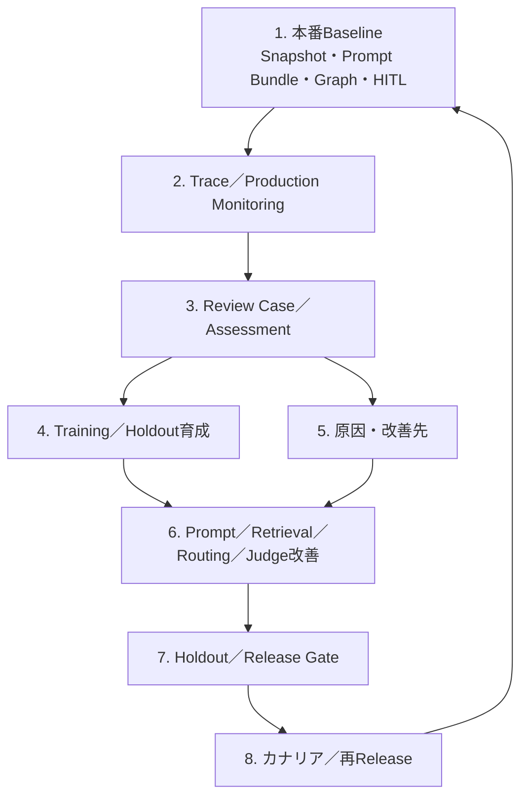

#### 5.1.2 本番導入後のTable／Dataset一覧

**本番導入時から継続するBaseline**

| 分類 | 物理名／実体 | 継続する役割 |
| --- | --- | --- |
| Corpus | `corpus_snapshot_manifest`／`registry` | レポートが参照した全文書Version集合を固定 |
| Release | `technical_report_prompt_bundles` | Agent Prompt、Model、Corpus、Gitを不変Releaseへ固定 |
| Release | `technical_report_release_channels` | `production`等のCurrent Bundle参照 |
| 評価 | `technical_report_train`／`technical_report_holdout` | Candidate探索と最終判定を分離 |
| Runtime | Durable Checkpoint Store | `thread_id`単位のGraph State永続化 |
| Runtime | Runtime Review Case Store | 人手判断待ち、Lease、Decision、Resume状態 |
| Trace | MLflow Experiment／UC Trace | Agent Span、Evidence、Route、Token、結果 |
| Monitoring | Production Monitoring／Registered Scorer | 本番Traceの継続評価 |

**本番導入後に追加・高度化するもの**

| 分類 | 物理名／実体 | 役割 | 導入条件 |
| --- | --- | --- | --- |
| Quality Review | `technical_report_review_cases` | Trace、Expectation、原因、改善先、Split、承認、配送状態 | Review件数と担当者が増えた場合 |
| Review UI | MLflow Review App／Labeling Session | 専門家Assessment収集 | 定期Reviewをチーム運用する場合 |
| Evaluation | Training／Holdoutへの追加Record | 承認済み本番CaseでCoverageを拡大 | 新しいFailure Modeが確認された場合 |
| Optimization | Prompt Optimization Run＋Prompt候補 | 原因がPromptのAgentだけを改善 | Scorer／Judgeが安定しPrompt原因と確認済み |
| Judge | Alignment Run＋候補Judge | Human基準との差を縮める | 同一基準の専門家Feedbackが十分ある場合 |
| Experiment | Request固定Variant／Assignment | Prompt／Model Bundleの限定本番比較 | Offline Holdout合格後に必要な場合 |
| Operations | Review SLA／再割当／Quality Alert | 滞留を運用可能にする | Review件数・SLA要求が増えた場合 |

#### 5.1.3 本番導入後の管理系ER図

本番導入後は、RuntimeとQualityの関係を1枚へ詰め込まず、目的ごとに分けて見る。

##### Runtime／Release ER図

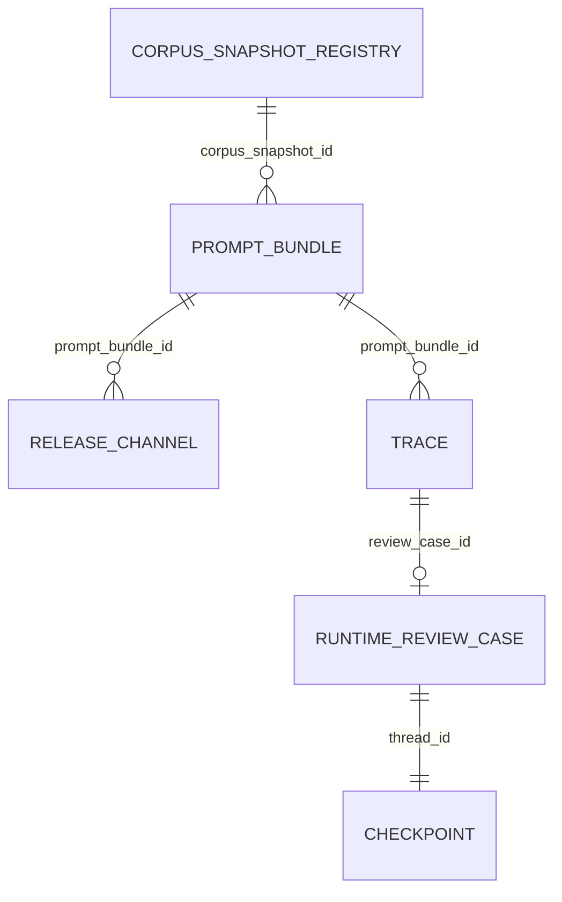

この図は「実RequestがどのReleaseを使い、Human Review待ちならどのCheckpointへ戻るか」を表す。

##### Quality／Monitoring ER図

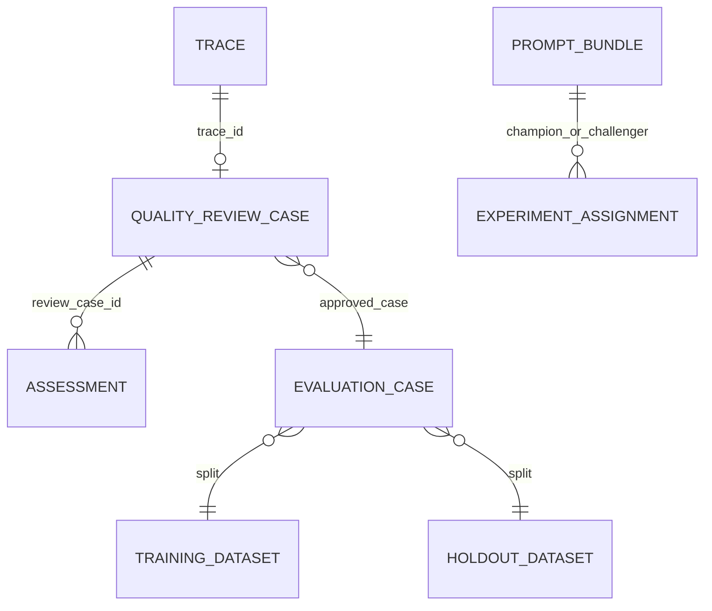

Runtime Review CaseとQuality Review Caseは別目的である。Runtime Review Caseは**今止まっているRequestを再開するための運用State**、Quality Review Caseは**完了済みTraceを改善へ配送するための品質管理Record**である。同じTableへ統合しない。

#### 5.1.4 本番導入後のデータフロー図

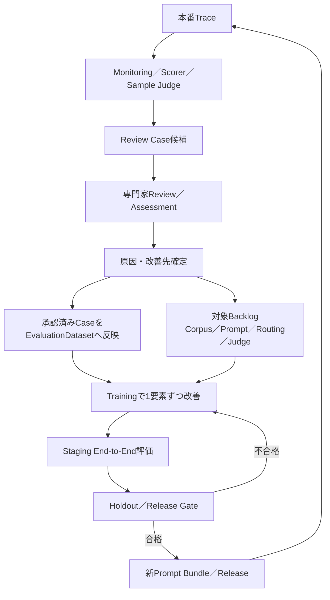

### 5.2 本番TraceからMulti-agent固有の問題だけを切り出す

Production TraceのReview、EvaluationDatasetへの追加、Development／Stagingへの還流そのものは、**「社内技術文書検索システム（エージェント型RAG）_完成版.md」**の改善ライフサイクルをそのまま利用する。

本資料で追加するのは、Review時に**Agent／Route／Stateのどこで最初に破綻したか**を残すことである。

#### 5.2.1 Runtime ReviewとQuality Reviewを分ける

この2つは目的が異なるため、同じCaseとして扱わない。

| 種類 | 目的 | 必要なState |
| --- | --- | --- |
| Runtime Review | 今止まっているRequestを安全に再開する | `thread_id`、Checkpoint、Decision Version、現在State |
| Quality Review | 完了済みTraceを将来の改善へ使う | Trace ID、Root Cause、期待値、改善対象 |

Runtime ReviewのDecisionをそのままEvaluationDatasetの正解へ自動採用しない。Quality Reviewでは専門家が改めて期待Evidence、期待Route、最初の破綻箇所を確認する。

#### 5.2.2 Review Caseへ追加するMulti-agent固有項目

RAG資料で定義する一般的なReview／Assessment項目に加えて、次を保持する。

| 項目 | 内容 |
| --- | --- |
| `source_prompt_bundle_id` | 問題発生時に固定されていたAgent構成 |
| `source_git_commit` | Graph／State Contract／PolicyのCode Version |
| `expected_routes` | 本来通るべき差し戻しAction |
| `actual_route_history` | 実際に通ったNode／Edge |
| `root_cause_agent` | 最初に期待状態から外れたAgent |
| `state_invalidation_error` | 古いState再利用の有無 |
| `loop_count_by_action` | 差し戻し種別ごとの回数 |
| `checkpoint_id` | HITL問題時の再現対象 |
| `resume_decision` | 人が返したDecision |
| `improvement_target` | Agent Prompt／Routing／State／HITL等の改善先 |

一般的な`expected_answer`だけでは、正しいレポートが偶然生成されたが途中Routeは誤っていたCaseを検出できない。そのため、**中間StateとRouteを評価資産として残す**。

#### 5.2.3 Agent変更は固定State Fixtureから始める

Productionの全文書や全GraphをDevelopmentへ毎回持ち込まず、原因Agentの入力StateをFixture化する。

| 改善対象 | Developmentへ戻す最小Fixture | Stagingで追加確認するもの |
| --- | --- | --- |
| Research | Request、前回Review指摘、期待Evidence | 本番相当AI Search／Filter |
| Outline | 固定Evidence、Research Notes、必須節 | Researchからの実State受け渡し |
| Writer | 固定Evidence、Outline、禁止Claim | Context Budget、Graph全体 |
| Reviewer | Evidence、Outline、Draft、期待Action | 実EdgeとLoop |
| Routing | ReviewDecision、Loop Count、State | LangGraph全体 |
| State破棄 | 差し戻し前State、期待残存Field | Checkpointからの再開 |
| HITL | Checkpoint、Decision、期待Resume先 | Lease、冪等Resume、Timeout |

これにより、Writer Prompt問題を調べるためにResearch／AI Searchまで毎回再実行する必要がなくなる。一方、最終採用前はStagingでGraph全体を通し、局所改善が別Agentへ悪影響を与えていないことを確認する。

#### 5.2.4 Agent間ContractのRegressionを独立して確認する

Promptの自然言語品質だけでなく、構造化出力のSchema Compatibilityを回帰テストする。

- `Evidence`に必要Fieldが欠けていないか
- Outlineの全`source_ids`が現在のEvidenceに存在するか
- Writerが未知のCitation IDを生成していないか
- `ReviewDecision.action`が定義済みEnum以外になっていないか
- Graph Stateの必須FieldがNode遷移ごとに維持されるか
- Policy／Release IDがNode更新で上書きされていないか

LLMの出力検証はPydantic等でFail Closedにし、Schema違反を「文章品質が少し悪い」Caseとして扱わない。

#### 5.2.5 State ReplayでRoutingとLoopを再現する

Routing問題は最終レポートだけを保存しても再現できない。問題発生直前のStateをMaskingしてFixture化し、同じReviewDecisionからどのEdgeへ進むかを再実行できるようにする。

```text
保存済みState Fixture
  + ReviewDecision
  + Graph／Policy Version
        ↓
Routeを再実行
        ↓
期待Node、State破棄、Loop Countを比較
```

特に`reoutline`と`rewrite`は混同しやすいため、Routeだけでなく**どのStateが消えたか**までTestする。

#### 5.2.6 Request単位のBundle固定をカナリアでも維持する

Prompt Registry AliasやModel Serving側のCall単位Traffic Splitだけに依存すると、1 Request内でAgentごとにVariantが混在し得る。

Multi-agentのカナリアでは`request_id`または`session_id`を安定Hashし、Prompt、Model、Corpus、Graph Versionを含むBundleをRequest開始時に一度だけ選択する。

```text
request_id
   ↓ stable hash
champion / challenger Bundleを1つ選択
   ↓
Research → Outline → Writer → Review
   ↓
Request終了まで同じBundle
```

モデルだけを比較するときはPrompt／Corpus／Graphを固定し、Promptだけを比較するときはModel／Corpus／Graphを固定する。複数要素を同時変更した場合は「組合せVariant」の比較として扱い、どの要素が効いたかを単独では断定しない。

#### 5.2.7 Durable HITLはResume後のState整合性まで評価する

Human Reviewの高度化では、SLAや再割当だけでなく、Resume後に正しいNodeへ戻り、State破棄規則が適用されたかを確認する。

| Decision | 期待Resume先 | 追加確認 |
| --- | --- | --- |
| `approve` | Finalizer | Draft内容を勝手に変更しない |
| `research` | Research | Evidence以降を再生成 |
| `reoutline` | Outline | 旧Outline／Draftを破棄 |
| `rewrite` | Writer | Evidence／Outlineを保持 |
| `reject` | END | 自動公開しない |

古いCheckpointを新しい互換性のないGraph VersionでResumeしない。長時間Pendingがあり得る場合は、Release切替時に「旧Graphで完了」「State Migration」「Case再開始」のどれを許可するかを事前に決める。

#### 5.2.8 Agent分離は運用境界が生じた後に行う

Research、Outline、Writer、Reviewを最初から別Application／Endpointへ分離しない。次のいずれかが必要になったAgentだけを分離する。

- 別Teamが独立Releaseする
- 権限境界を分ける必要がある
- Scaling特性が大きく異なる
- 他Applicationから再利用する
- 独立SLO／Cost責任を持たせる

分離後はNetwork Call、Timeout、Retry、Schema Version、分散Trace Contextが新たなFailure Pointになるため、単純な「高度化」とはみなさない。


### 5.3 定常監視

4章で開始したProduction Monitoringを継続し、**全件で取る決定論的Signal**と**Samplingする意味評価**を分ける。Judgeを全件に適用すること自体を目的にしない。

| Signal | 原則 | 例 |
| --- | --- | --- |
| 全件 | 安価で決定論的に取れる | Error、Latency、Token、Loop、Evidence件数、Citation ID、Route、Human Review、Policy Version |
| Sampling | LLM Judge等のCostがある | Groundedness、構成品質、読者適合、Reviewer品質 |
| 専門家Review | 高Risk／代表Case／Judge不一致 | 外部公開、高機密、誤承認候補、新Failure Mode |

#### 5.3.1 Workspace／MLflow Resourceの継続運用

- Realtime／Evaluation／LabelingのExperimentを混在させず、用途別のTraceを追跡できる状態を維持する。
- Registered ScorerのVersion変更をRelease構成へ記録する。
- Review App／Labeling SessionのReviewer権限を定期確認する。
- Prompt Registry Aliasだけを本番構成の正本にせず、Prompt Bundleの不変VersionをTraceへ記録する。
- MonitoringのSampling Rate、Judge Cost、Alert閾値は運用実績から調整し、変更理由をDecision Logへ残す。

### 5.4 Alert・障害・品質問題への対応

Evidence 0件、ACL／Publication Policy違反、誤自動承認、Loop上限、Checkpoint再開失敗、Latency／Cost超過は、通常の文章品質改善と同列に扱わない。

| 種別 | 例 | 初動 | 改善経路 |
| --- | --- | --- | --- |
| Security／Publication | 権限外Evidence、掲載不可情報 | 利用停止／Incident判断 | Policy／Identity修正＋回帰Test |
| Grounding | Evidence 0件なのに承認、未知Citation | 自動承認停止 | Research／Writer／Reviewer原因分類 |
| Runtime | Search／Model／Checkpoint障害 | Fail Closed、Runbook | Platform／Graph修正 |
| HITL | Review待ち滞留、二重Decision、Resume失敗 | Case凍結／再割当 | Review Workflow改善 |
| Quality | 構成不良、読者不適合 | Review Case化 | Prompt／Retrieval等へ配送 |
| Cost／Performance | Loop増大、P95超過 | Scope／Budget確認 | Context、Model、Routing最適化 |

Security・可用性へ即時影響する事象はWeekly Quality Reviewを待たずIncident経路を開始し、再発防止の品質Caseだけを後から関連付ける。

### 5.5 Multi-agent固有の品質レビュー項目

Assessment、Review App、Labeling Session、EvaluationDatasetへの反映方法は、**「社内技術文書検索システム（エージェント型RAG）_完成版.md」**を参照する。

本資料では、専門家Review時に次のMulti-agent項目を追加する。

- 最初に期待状態から外れたAgentはどこか
- 上流Agentの失敗が下流へ波及しただけではないか
- Review Action自体は正しかったか
- Review Actionと実際のGraph Edgeは一致したか
- 差し戻し後に古いOutline／Draftを再利用していないか
- Loopは必要だったか、同じ状態を往復していないか
- Human Reviewへ送る条件とResume先は正しかったか
- AgentごとのPrompt／Model／Corpus／Graph VersionはRequest中に固定されていたか

End Userの👍／👎だけでこれらを判定できないため、RouteやStateを読めるMulti-agent／LLMOps担当者が技術原因を確定する。

### 5.6 本番証跡に基づくMulti-agent改善

共通の「Production TraceをReviewしてTrainingへ追加し、Holdout／Stagingを通してReleaseする」CycleはRAG資料を参照する。

Multi-agent側では、改善対象を次のいずれか1つへ絞る。

| 改善対象 | 変更例 | まず固定するもの |
| --- | --- | --- |
| `RESEARCH_PROMPT` | Query計画、調査メモ | Request、Corpus結果 |
| `OUTLINE_PROMPT` | 必須節、Evidence割当 | Evidence |
| `WRITER_PROMPT` | Grounding、Citation、文体 | Evidence、Outline |
| `REVIEW_PROMPT` | 誤承認、過剰差し戻し | Evidence、Draft |
| `ROUTING` | Edge条件、停止条件 | ReviewDecision、State |
| `STATE_CONTRACT` | Field、破棄規則 | Prompt／Model |
| `HITL` | Checkpoint、Resume | Agent Prompt |
| `BUNDLE` | AgentごとのModel組合せ | Corpus、Graph |

一度にResearch PromptとReviewer PromptとRoutingを同時変更すると、改善理由を追えなくなる。まず局所Fixtureで1要素を改善し、その後にEnd-to-End Graphで副作用を確認する。

### 5.7 Multi-agentで追加する高度化

Judge Alignment、Prompt Optimization自体の一般的な方法はRAG資料を参照する。本資料で追加する高度化は次である。

#### 5.7.1 Agent別Model Routing

Agentごとに必要能力が異なる場合、Research／Writerは高性能Model、Outline／Reviewerは小型Modelなどへ分けられる。ただしModel選択もPrompt Bundleへ含め、Request途中で変えない。

#### 5.7.2 Parallel Agentを導入する場合のMerge Policy

将来Researchを複数Agentへ並列化する場合は、単純に結果を結合しない。追加で次を定義する。

- Evidence重複排除Key
- 競合Evidenceの表現方法
- どのAgent結果を優先するか
- State Mergeの決定論的Rule
- 並列Agentの一部失敗時に全体を続行する条件
- Fan-out数とToken／Latency Budget

並列化はLatency短縮になる場合もあるが、Evidence競合とCostを増やすため、必要性が確認できるまでは直列Graphを基本とする。

#### 5.7.3 Request単位カナリア

Call単位ではなくBundle単位でVariantを固定する。1つのReport内でResearchだけchallenger、Writerはchampionという混在を避ける。

#### 5.7.4 Agent分離後の分散Trace

Agentを別Endpointへ分離した場合は、`request_id`、`trace_id`、`parent_span_id`、Bundle IDをサービス間で引き継ぎ、1 ReportをEnd-to-Endで追跡できるようにする。


### 5.8 本番運用上の設計判断

#### 5.8.1 Agent Stateと差し戻し

- 再調査、再構成、改稿を合算したLoop上限を設ける。
- `research`では新Evidenceを追加した後、古いOutline／Draftを再評価する。
- `reoutline`では古いOutlineとDraftを破棄し、EvidenceとResearch Notesを維持する。
- `rewrite`ではEvidenceとOutlineを固定し、Draftだけを作り直す。
- State破棄RuleをPromptへ任せずApplication Codeで実装する。

#### 5.8.2 Retrieval・Evidence

- Topic文字列だけでなくReview指摘、Audience、要件、Reader Entitlement、Publication Scope、Corpus Snapshotを検索条件へ反映する。
- Evidence 0件ではWriterへ進めない。
- Citation IDは文書VersionとChunkを追跡できる安定IDとする。
- Evidence競合が解消できない場合は自動承認しない。

#### 5.8.3 アクセス制御・公開Policy

- AudienceをIdentityの代用にしない。
- Clientが`publication_scope=external`等を自由指定して権限を拡張できないようServer側Policyで決める。
- 閲覧可能と成果物掲載可能を分離する。
- 外部公開では内部URI、内部タイトル、高機密Evidenceを成果物へ出さない。

#### 5.8.4 Review、Routing、Human-in-the-loop

- Reviewerの意味判断と決定論的Policyを分離する。
- Evidence 0件、Loop上限、Security条件等はLLM ActionよりApplication Codeを優先する。
- Human Reviewへ送るDraftは未承認状態を明示し通常成果物として扱わない。
- Runtime Review CaseにはLease／Decision Version／冪等Resumeを持たせる。

#### 5.8.5 EvaluationDatasetで追加するMulti-agent項目

Training／Holdoutの一般的な品質管理はRAG資料を参照する。本資料では、Topicや期待回答に加えて、**期待Evidence、必須節、期待Route、Human Review条件、State／Loop条件**を保存し、Agent別・Routing別の回帰テストを可能にする。

#### 5.8.6 Assessmentで追加するMulti-agent診断

Assessment／Judge Alignmentの一般的な運用はRAG資料を参照する。Multi-agentでは、Application全体の良否だけでなく、**最初に破綻したAgent、Review Action、実Route、State破棄、HITL Resume**を診断項目へ追加する。

#### 5.8.7 ストリーミング

- SSEで進捗を返しても、未承認Draftや機密Review Notesを一般利用者へ流さない。
- EventにはRequest／Trace IDを含め、Client再接続時に重複成果物を作らない設計にする。
- 長時間処理ではUI接続とGraph実行Stateを同一視しない。

#### 5.8.8 機密情報とTrace

- Traceへ必要以上の文書本文、Credential、個人情報を残さない。
- Evidence本文を残す場合は保持期間、Masking、Reviewer権限を定義する。
- 外部公開用途では、内部用Traceと利用者へ返すReference情報を分ける。

#### 5.8.9 品質・安定性・性能・コスト

- 最終品質だけでなくAgent別品質を測る。
- Loop増加による品質向上とLatency／Cost増加を同じRelease判断で評価する。
- Context Budget超過は長文Evidenceを無条件に削るのではなく、節分割、Evidence選択、再調査単位を見直す。
- Model変更時はPrompt／Corpusを固定し、単独効果を測る。

#### 5.8.10 デプロイとロールバック

- DAB、共通Wheel、Prompt Bundle Manifest、Corpus Snapshot、Policy VersionをRelease証跡へ関連付ける。
- Prompt Aliasを複数個順番に切り替えるだけの非Atomic Releaseを避ける。
- RollbackではGit CommitだけでなくPrompt Bundle、Model Variant、Corpus Snapshotを戻す。
- Corpus Snapshotだけを更新するReleaseでもGolden Topicで期待Evidenceを検索できることを確認する。

#### 5.8.11 Agent分離の判断

Research、Outline、Writer、Reviewを最初からMicroservice化しない。同じTeam、権限、Release周期であれば1 Application内のNodeの方がState、Trace、Releaseを一貫させやすい。別権限、独立Scaling、別Owner、他Applicationからの再利用、独立SLOが必要になったAgentだけを分離する。

本資料のサンプルコードは、Corpus Snapshot、Server側公開Policy、Prompt Bundle、`reoutline`を含むLangGraph、最小エスカレーション、SSE、評価・改善Loopまでを一貫して示す。一方、金融機関ごとの認証Adapter、Checkpoint Store製品選定、Review Case Lease API、SIEM／DLP等はPlatform標準へ依存するためInterfaceと責務までを示す。


## 6. 本番チェックリスト

### 6.1 Identity／初期セットアップ

- [ ] Realtime、Quality、Knowledgeの実行Identityと人のReviewer権限が定義されている。
- [ ] 認証済みUser／Groupから`reader_entitlements`をServer側で解決する。
- [ ] `publication_scope`、`data_classification_ceiling`をClient入力だけで決めない。
- [ ] Secret、Token、CredentialをTraceやSSEへ出さない。
- [ ] 本番Resourceへの最小Read／Write／InferenceをPilot前に検証している。

### 6.2 プロジェクト境界

- [ ] `knowledge`、`quality`、`realtime`を別BundleとしてDeployできる。
- [ ] 共通Packageは型と定数を中心に共有し、実行基盤を密結合させていない。
- [ ] Agent分離の条件が権限、Owner、Scaling、再利用、独立SLOで定義されている。

### 6.3 Corpus・Evidence・AI Search

- [ ] Corpus Snapshot Manifestが全文書IDとVersionを含み、取り込みRun IDと分離されている。
- [ ] Snapshot更新時に未更新文書が集合から消えない。
- [ ] 閲覧Entitlement、公開範囲、機密上限、Corpus Snapshotが検索前にFilterされる。
- [ ] Citation IDが文書版とChunkから追跡可能である。
- [ ] Evidence 0件で本文を自動生成しない。
- [ ] 外部成果物へ内部URI、掲載不可Evidenceを出さない。

### 6.4 Multi-agent／Routing

- [ ] Research、Outline、Writer、Reviewの入出力が構造化されている。
- [ ] Outline各節がEvidence `source_ids`を持つ。
- [ ] `research`、`reoutline`、`rewrite`、`human_review`を区別する。
- [ ] `reoutline`等のState破棄RuleをApplication Codeで実装している。
- [ ] Loop上限が全差し戻しに対して機能する。
- [ ] Reviewer自身の誤判定を独立評価できる。

### 6.5 Human-in-the-loop／リアルタイム処理

- [ ] 本番ではDurable Checkpointを利用する。
- [ ] `thread_id`、Lease、Decision Version、Resumeの冪等性を確認している。
- [ ] Human Review待ちDraftを通常成果物として公開しない。
- [ ] 未承認Draft／内部Review Notesを一般利用者向けSSEへ出さない。
- [ ] Client切断とGraph Stateを分離している。

### 6.6 Multi-agent評価の追加項目

EvaluationDataset／Scorerの一般項目はRAG資料の本番チェックリストを参照する。ここでは次だけ追加確認する。

- [ ] 期待Evidence、必須節、期待Review Action、期待Routeを保存する。
- [ ] Agent別ScorerとEnd-to-End Scorerを分ける。
- [ ] Routing／Loop／State破棄を決定論的にTestできる。
- [ ] 上流Agentの失敗を下流Agentの失敗として二重計上しない。

### 6.7 Multi-agent Review／Judgeの追加項目

Assessment／Judgeの一般項目はRAG資料を参照する。ここでは次だけ追加確認する。

- [ ] Reviewerの意味判断とGraph Edgeの正しさを別々に評価する。
- [ ] 最初に破綻したAgent／Routeを専門家が診断できる。
- [ ] Human Review後のResume先とState破棄を確認できる。
- [ ] 協調品質Judgeを使う場合、最終文章だけでなくEvidence→Outline→Draftの引継ぎを見る。

### 6.8 Production Monitoring／運用

- [ ] 本番開始前にProduction Monitoringを登録しStagingでDry Runした。
- [ ] 全件SignalとSampling Judgeを分ける。
- [ ] Evidence 0件、誤承認、Loop上限、HITL失敗、Latency／Costを監視する。
- [ ] Security／Publication違反は通常品質Reviewより優先する。
- [ ] Review Queueの滞留と再割当条件を必要に応じて監視する。

### 6.9 Version・Release・ロールバック

- [ ] Prompt Bundle ManifestがAgent Prompt、Model、Corpus、Gitを不変Versionで固定する。
- [ ] Request開始後にAliasやChannelを再解決しない。
- [ ] HoldoutとSecurity／Latency／Cost／HITLからRelease判断する。
- [ ] Decision Logに採否理由と証跡IDを残す。
- [ ] RollbackでCodeだけでなくPrompt Bundle、Model、Corpus Snapshotを前構成へ戻す。
- [ ] カナリアではRequest／Session単位でVariantを固定する。

### 6.10 長文・Cost・設計書整合性

- [ ] Agent別Token、Latency、Loop CostをTraceで確認できる。
- [ ] Context Budget超過時の節分割／Evidence選択方針がある。
- [ ] 長時間処理ではCheckpoint／ResumeとUI接続を分離する。
- [ ] 各フェーズでTable／Dataset／Resource一覧、ER、データフローがコードより前にある。
- [ ] PoC、本番導入、本番導入後のどこでResourceが追加されるか説明できる。
- [ ] 本資料独自用語とMLflow／Databricks公式Resourceを区別している。
- [ ] 初見の担当者が、各フェーズで何を作り、何を保存し、何を人が判断するか説明できる。

## 7. 参考資料

### 7.1 関連する社内設計資料

- **社内技術文書検索システム（エージェント型RAG）_完成版.md**：RAG／LLMOps共通のEvaluationDataset育成、Judge Alignment、Prompt Optimization、Production Monitoring、Development／Staging／Production間のデータ還流はこの資料を参照する。

### 7.2 公式資料

- [MLflow Agent Server](https://mlflow.org/docs/latest/genai/serving/agent-server/)
- [MLflow Prompt Registry](https://mlflow.org/docs/latest/genai/prompt-registry/)
- [MLflow EvaluationDataset](https://mlflow.org/docs/latest/genai/datasets/)
- [MLflowでTraceを評価する](https://www.mlflow.org/docs/latest/genai/eval-monitor/running-evaluation/traces/)
- [MLflow Promptの不変Version](https://mlflow.org/docs/latest/genai/prompt-registry/create-and-edit-prompts/)
- [LangGraph Persistence](https://docs.langchain.com/oss/python/langgraph/persistence)
- [LangGraph Interrupts](https://docs.langchain.com/oss/python/langgraph/interrupts)
- [Databricks Appsでマルチエージェントを構築する](https://docs.databricks.com/aws/en/generative-ai/agent-framework/multi-agent-apps)
- [Databricks Supervisor Agent](https://docs.databricks.com/aws/en/agents/agent-bricks/multi-agent-supervisor)
- [Databricks AI SearchをQueryする](https://docs.databricks.com/aws/en/ai-search/query-ai-search)
- [Databricks Apps Resource](https://docs.databricks.com/aws/en/dev-tools/databricks-apps/resources)

## 8. 用語・物理実体索引

この章は本文を読む前の前提知識ではなく、正式名称、物理的な実体、導入段階を後から確認するための索引である。

| 用語 | 短い定義 | 物理的な実体 | 主な導入段階 |
| --- | --- | --- | --- |
| Evidence | 検索根拠を引用・評価・監査へ共通利用する型 | `Evidence` Pydantic Model＋Retriever出力 | PoC |
| Report State | Agent間で共有する実行状態 | `ReportState` TypedDict／LangGraph State | PoC |
| Corpus Snapshot | 全文書Version集合を固定した検索Corpus版 | `corpus_snapshot_manifest`／`registry` | 本番導入 |
| Prompt Registry | Agent PromptをVersion管理するMLflow Resource | UC-backed Prompt | PoC |
| Prompt Bundle Manifest | 複数Prompt、Model、Corpus、Gitを一体固定したRelease | `technical_report_prompt_bundles` | 本番導入 |
| Release Channel | Production等のCurrent Bundle参照 | `technical_report_release_channels` | 本番導入 |
| LangGraph | Node、State、差し戻しEdgeを制御するGraph | `report_graph.py` | PoC |
| Human-in-the-loop | 人の判断へ停止・再開する実行方式 | Checkpointer、`thread_id`、Review Case、`interrupt()`／`Command(resume=...)` | 本番導入 |
| EvaluationDataset | Topic、入力条件、Expectationを保持する評価Dataset | MLflow EvaluationDataset | PoC〜 |
| Training Dataset | 改善候補探索に使う評価Case集合 | `main.llmops.technical_report_train` | 本番導入〜 |
| Holdout Dataset | 最終Release判定専用の未使用Case集合 | `main.llmops.technical_report_holdout` | 本番導入〜 |
| Assessment | Traceへ付与するFeedback／Expectation等 | MLflow Assessment Record | PoC〜 |
| Production Monitoring | 本番Traceを登録Scorerで継続評価する機能 | Registered Scorer、Monitoring実行 | 本番導入〜 |
| Review Case | 本番Traceの期待値、原因、改善先、承認、配送を追跡するRecord | `technical_report_review_cases` | 本番導入後 |
| Prompt Optimization | Training CaseからPrompt候補を探索する改善処理 | Optimization Run＋Prompt Version候補 | 本番導入後 |
| Judge Alignment | 人間FeedbackへJudge定義を合わせる処理 | Alignment Run＋候補Judge | 本番導入後 |
| カナリアテスト | 候補Bundle／Modelを限定Requestへ固定して本番確認する方式 | Assignment Table＋Trace Variant | 本番導入後 |
| Runtime Review Case | 実行中RequestのHuman Review停止・再開状態 | Review Case Store＋Checkpointの参照 | 本番導入 |
| Quality Review Case | 完了済みTraceの原因・改善先・配送を追跡する品質Record | `technical_report_review_cases` | 本番導入後 |
| Decision Log | Release／Rollback／Go-No-Go等の人の意思決定を証跡IDと共に残す追記Record | Delta Table／外部Change Record等 | PoC〜 |
| Route History | Research／Reoutline／Rewrite／Human Review等の実経路履歴 | `ReportState.route_history`＋MLflow Trace | PoC〜 |
| Publication Policy | 閲覧可否とは別に成果物への掲載可否を決めるServer側Policy | Policy Version＋Retriever Filter／Finalizer | PoC〜 |
| Context Budget | 1 RequestでEvidence／中間成果物／LLM Callへ許容するContext量 | Application設定＋Trace Usage | PoC〜 |


## 9. 付録：資料作成・レビュー用チェックリスト

### 9.1 フェーズ別データモデルのセルフレビュー

- PoCにTable／Dataset／Resource一覧があり、本番用Snapshot／Release／HITL管理を実装済みのように描いていない。
- 本番導入時にCorpus Snapshot、Prompt Bundle、Training／Holdout、HITL、Monitoringの全体像がある。
- 本番導入後はRAG資料と同じDataset育成／Optimization／Alignmentを再掲せず、Agent／Route／State／HITL／Request単位カナリアの追加点を中心に説明している。
- 各フェーズで個別コードより先に「まず理解する構成」とデータフローがある。
- PoC→本番導入→本番導入後で、何を持ち越し、何を置き換え、何を後から高度化するかを2章だけで説明できる。
- RAG／LLMOps共通の改善ライフサイクルはRAG資料へ参照を寄せ、第2章ではState破棄、Agent間契約、Request単位Bundle固定などMulti-agent固有の変更順序だけを説明している。
- Runtime Review CaseとQuality Review Case、公式Resourceと本資料独自Workflowの境界が混ざっていない。

### 9.2 資料だけで答えられるべき最終確認

1. **PoC**：固定dev CorpusとPromptで、どのStateがResearch→Outline→Writer→Reviewを流れ、どこで差し戻され、どのTrace／Scorerで原因を切り分けるか。
2. **本番導入**：Corpus、Prompt、Model、Code、Policy、人手判断をどの不変ID／Storeで固定し、どの条件でFail Closedにし、どうRollbackするか。
3. **本番導入後**：RAG資料の共通改善Cycleに対し、Agent／Route／State／HITLのどの追加情報を残し、どのFixtureで再現するか。
4. **環境間還流**：RAG資料の環境間還流を前提に、Agent単体Fixtureで済む確認と、Graph／Checkpointまで必要なStaging確認をどう分けるか。
5. **責務境界**：MLflow／Databricks公式Resource、本資料独自Workflow、外部Issue／Change管理の境界を説明できるか。
