# 技術レポート作成マルチエージェント（完全版）

本章では、Unity Catalogで管理された社内技術文書を根拠として、調査、構成作成、執筆、レビューを分担し、レビュー結果に応じて再調査・再構成・改稿・人手確認へ実際の処理経路を変更する技術レポート作成アプリケーションを扱う。単にLLMを複数回順番に呼ぶのではなく、根拠情報、構成案、下書き、Review判断を実行状態として引き継ぎ、決定論的なポリシーと繰り返し上限をLLM判断より優先する。

最初に完成形を示し、その後、**PoC、本番導入、本番導入後**の順で、各段階に必要な設計と、実装判断に必要な主要コードを説明する。PoCではマルチエージェントとして成立する最小契約と評価を優先し、本番導入時に文書集合、Prompt、権限、人手確認、リリース、Monitoringの統制を追加する。本番導入後は、本番Traceと専門家Assessmentを根拠として必要な高度化だけを追加する。

なお、EvaluationDataset、Scorer、Judge、Prompt、Retrievalの一般的な改善ライフサイクル、Production → Development → Staging → Productionの環境間還流、文書集合スナップショットやRAGリリース構成台帳など**RAGエージェントと共通する設計は「社内技術文書検索システム（エージェント型RAG）_完成版.md」を正とする**。本資料では同じ説明を繰り返さず、マルチエージェントで追加になるAgent間契約、実行状態、処理経路、繰り返し、人手確認、複数Promptの一括固定を中心に説明する。

**表記方針**：Databricks／MLflow／LangGraphの正式なResource名、API名、コード識別子は原語を維持する。ただし、本文・表・箇条書きで物理名やコード識別子を使う場合は、原則として直後に括弧でその意味を併記し、コードを読まなくてもその場で役割を理解できるようにする。一方、本資料独自の説明用語は日本語を優先する。たとえば、`prompt_bundle_id`（各エージェントで使うPrompt・Model等の固定組合せを特定するID）が指す複数Prompt・Model・文書集合・Gitの固定組合せは「実行構成セット」、`ReportState`（Agent間で引き継ぐレポート実行状態の型）で保持する内容は「実行状態」、人の判断待ちで処理を止めて後から再開する仕組みは「中断・再開可能な人手確認」と表記する。

個別実装は、原則として**目的 → 物理的実体 → 入出力 → 実装 → 実行結果 → 確認方法**の順で読む。用語を後から確認する場合は第8章の索引を参照する。

## 1. システム全体像

### 1.1 解決する課題

本資料では、技術レポート作成を次の4つの役割へ分ける。**Research、Outline、Writer、Reviewはいずれもエージェントである。** ただし、PoCや本番導入の初期段階では4つの独立Serviceとして動かすのではなく、同じLangGraph内のNodeとして実装し、それぞれに異なる役割を持たせる。

| エージェント | この段階で担当すること |
| --- | --- |
| Research Agent | テーマに必要な社内文書を検索し、レポートの根拠となる情報を集める |
| Outline Agent | 集めた根拠情報をもとに、章・節の構成と各節で使う根拠を決める |
| Writer Agent | 構成と根拠情報に沿って、引用付きの下書きを作る |
| Review Agent | 下書きを確認し、承認するか、再調査・再構成・改稿のどこへ戻すかを判断する |

このように複数のエージェントへ処理を分けると、回答型RAGより処理が長くなり、**どのエージェントで品質が崩れたか**を切り分ける必要がある。また、閲覧可能な文書と成果物へ掲載可能な文書は同一とは限らず、外部公開、高機密、根拠情報競合、繰り返し上限到達では自動承認を止める必要がある。

本システムは、**根拠情報の取得、構成、執筆、レビュー、差し戻しを実行状態とTraceで連結し、文書集合・Prompt・Model・Code・ポリシーのVersionを固定して再現可能にすること**を目的とする。

#### 1.1.1 RAGエージェントとの違い

「社内技術文書検索システム（エージェント型RAG）_完成版.md」で扱うRAGエージェントと、本資料のマルチエージェントは、**社内文書をAI Searchで検索し、根拠に基づいて生成する点は共通**である。違いは、RAGエージェントが「質問へ回答すること」を中心に処理するのに対し、本資料では技術レポート作成を複数の役割へ分け、中間成果物を引き継ぎながら完成させる点にある。

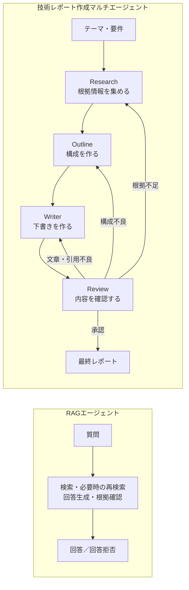
```mermaid
flowchart LR
    subgraph RAG["RAGエージェント"]
        direction TB
        RQ["質問"] --> RA["検索・必要時の再検索<br/>回答生成・根拠確認"]
        RA --> RO["回答／回答拒否"]
    end

    subgraph MULTI["技術レポート作成マルチエージェント"]
        direction TB
        MT["テーマ・要件"] --> MR["Research<br/>根拠情報を集める"]
        MR --> MO["Outline<br/>構成を作る"]
        MO --> MW["Writer<br/>下書きを作る"]
        MW --> MV["Review<br/>内容を確認する"]
        MV -->|承認| MF["最終レポート"]
        MV -->|根拠不足| MR
        MV -->|構成不良| MO
        MV -->|文章・引用不良| MW
    end
```

初読では、次の3点だけ押さえればよい。

| 観点 | RAGエージェント | 本資料のマルチエージェント |
| --- | --- | --- |
| 処理の中心 | 文書を検索し、質問へ根拠付きで回答する | 調査、構成、執筆、レビューを分担してレポートを完成させる |
| 途中成果物 | 検索結果と回答生成に必要な状態 | 根拠情報、調査メモ、構成案、下書き、Review結果を次のAgentへ引き継ぐ |
| やり直し | RAG Agent内で必要に応じて再検索・回答拒否を行う | Review結果に応じてResearch／Outline／Writerの適切な地点へ戻る |

したがって、マルチエージェントではRAGの検索・回答品質に加えて、**「どのエージェントが何を受け渡すか」「差し戻したときにどの実行状態を残すか」「同じ処理を何度まで繰り返すか」**を設計する必要がある。これらが本資料で追加して扱う主な論点である。

AI Search、文書公開、ACL、出典、EvaluationDataset、Scorer、Judge、Production MonitoringなどRAGエージェントと共通する仕組みは、**「社内技術文書検索システム（エージェント型RAG）_完成版.md」**を参照する。本資料では、それらを利用できることを前提としてマルチエージェント固有の差分を説明する。

### 1.2 基本フロー

この表では、コード上の物理名を示す場合も、**その直後の括弧内に「何を表す情報か」**を併記する。物理名そのものを覚える必要はなく、まず括弧内の意味を理解すればよい。

| 手順 | 処理 | 主な保存内容（物理名／意味） |
| --- | --- | --- |
| 1 | 利用者がテーマ、対象読者、目的、制約を入力する | `topic`（レポートのテーマ）、`audience`（対象読者）、`report_requirements`（目的・制約などの作成要件） |
| 2 | Serverが認証済み利用者から閲覧権限を、業務ポリシーから公開範囲を決定する | `reader_entitlements`（利用者が閲覧できる権限一覧）、`publication_scope`（成果物を内部向け／外部向けのどちらとして扱うか）、`data_classification_ceiling`（利用できる機密区分の上限） |
| 3 | 作成開始時点の全文書Version集合と実行構成セットを固定する | `corpus_snapshot_id`（今回のRequestで使う文書集合の版を特定するID）、`prompt_bundle_id`（各エージェントで使うPrompt・Model等の固定組合せを特定するID） |
| 4 | Research Agentが検索Queryを作り、閲覧権限と公開範囲をFilterしてAI Searchを検索する | 検索Query（AI Searchへ送った検索条件）、根拠情報（取得した文書Chunkと出典情報）、文書ID・版・公開区分・Score（どの文書のどの版をどの程度関連すると判断したか） |
| 5 | Outline Agentが各節と利用する根拠情報を対応付ける | 見出し・目的（各節で何を書くか）、`source_ids`（各節で利用する根拠情報を指すID） |
| 6 | Writer Agentが根拠情報にない事実を追加せず下書きを作る | 下書き本文（作成途中のレポート）、引用・参考資料（どの根拠情報を使ったか） |
| 7 | Review Agentが根拠、構成、禁止事項、読者適合性を判定する | `review_action`（承認／再調査／再構成／改稿／人手確認のどこへ進むか）、`review_comments`（Reviewの指摘内容）、未支持Claim（根拠情報で裏付けられていない主張） |
| 8 | 根拠不足なら再調査、構成不良なら再構成、文章・引用不良なら改稿へ戻す | `route_history`（実際に通った処理経路）、`review_loop_count`（差し戻しを行った回数） |
| 9 | 承認なら最終化し、上限到達または高リスクなら人手確認へ送る | `approved`（自動承認済みか）、`requires_human_review`（人による確認が必要か） |
| 10 | Agent Serverが進捗と最終結果をSSEで返す | 最終レポート（利用者へ返す完成内容）、Responses API Event（進捗通知）、Trace ID（MLflow上の実行証跡を特定するID） |

### 1.3 実行状態・公開ポリシー・リリース構成の分離

| 区分 | 何を保持するか | 変更主体 | 重要な考え方 |
| --- | --- | --- | --- |
| Request／ポリシー | Topic、Audience、要件、閲覧Entitlement、公開範囲、機密上限 | 利用者入力＋Server側ポリシー | Audienceを権限判定へ流用しない |
| エージェント実行状態 | 根拠情報、Research Notes、Outline、下書き、Review Action、繰り返し回数 | LangGraph Node | 差し戻し先ごとに残す実行状態と破棄する実行状態を分ける |
| リリース構成 | Prompt Version、Model Service、文書集合スナップショット、Git Commit | Quality／リリース工程 | Request開始時に不変IDへ固定し、途中で再解決しない |
| 品質証跡 | Trace、Assessment、EvaluationDataset、Scorer結果 | Realtime／Quality／Reviewer | Application改善とJudge改善を分離する |

### 1.4 各エージェントと主要機能の責務

| エージェント | 入力 | 出力 | やってはいけないこと |
| --- | --- | --- | --- |
| Research Agent | テーマ、Review指摘、文書集合スナップショット、閲覧権限、公開ポリシー | 根拠情報、調査メモ | 権限外・掲載不可文書の取得、出典の捏造 |
| Outline Agent | 調査メモ、根拠情報、構成Review指摘 | 節構成、各節の根拠情報 ID | 根拠情報にない節を根拠なく追加すること |
| Writer Agent | 構成案、根拠情報、Review指摘 | 引用付き下書き | モデル内部知識による事実補完 |
| Review Agent | 要件、根拠情報、構成案、下書き | 承認、再調査、再構成、改稿、人手確認 | 未支持Claimを残したまま承認すること |
| Finalizer | 承認済み下書き、根拠情報 | 最終レポート、参考資料一覧 | 下書きの意味内容を変更すること |

| 機能 | 所有DAB Bundle | 責務 |
| --- | --- | --- |
| 文書Pipeline／AI Search | `knowledge`（文書取込・検索基盤を配備するDAB Bundle名） | 文書解析、Chunk、文書集合スナップショット、Index同期、ポリシー Filter付き検索を提供する。 |
| LangGraph | `realtime`（レポート生成Applicationを配備するDAB Bundle名） | エージェント実行状態、差し戻し、繰り返し上限、人手確認経路を制御する。 |
| Foundation Model APIs | `realtime`（レポート生成Applicationを配備するDAB Bundle名） | Research、Outline、Writer、Reviewの生成AI推論を提供する。 |
| MLflow Agent Server | `realtime`（レポート生成Applicationを配備するDAB Bundle名） | Responses API、`@stream`（Agent Serverで逐次応答を有効にするDecorator）、SSE、Trace集約を提供する。 |
| Streamlit | `realtime`（レポート生成Applicationを配備するDAB Bundle名） | 要件入力、進捗、最終レポート、Feedback UIを提供する。 |
| Prompt Registry | `quality`（評価・Prompt管理・リリース判定を配備するDAB Bundle名） | AgentごとのPromptを独立してVersion管理する。 |
| EvaluationDataset | `quality`（評価・Prompt管理・リリース判定を配備するDAB Bundle名） | テーマ、制約、期待構成、期待根拠情報、期待結果を保存する。 |
| MLflow Evaluation | `quality`（評価・Prompt管理・リリース判定を配備するDAB Bundle名） | 最終品質、根拠情報、経路、Agent協調を比較する。 |
| Review App／Assessment | `quality`（評価・Prompt管理・リリース判定を配備するDAB Bundle名） | 専門家のFeedback、Expectation、原因診断、承認を収集する。 |
| Judge Alignment | `quality`（評価・Prompt管理・リリース判定を配備するDAB Bundle名） | 自動Judgeを専門家のレポート評価基準へ合わせる。 |
| Git Version Tracking | 全DAB Bundle | Code、DAB、Schema、Scorer、Prompt参照をGitコミットへ関連付ける。 |

### 1.5 完成形Architecture

文書基盤、レポート作成、品質改善は実行周期と責任者が異なる。文書集合スナップショット、Prompt Version、モデル経路、GitコミットをTraceへ残し、後から同じ条件を再現できるようにする。

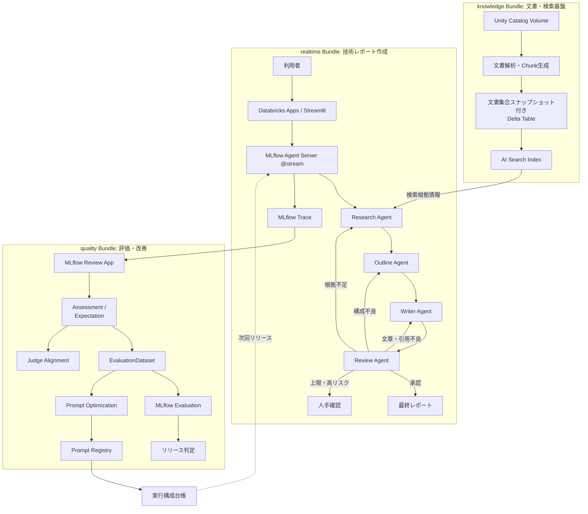
```mermaid
flowchart TB
    subgraph Knowledge["knowledge Bundle: 文書・検索基盤"]
        direction TB
        V["Unity Catalog Volume"] --> P["文書解析・Chunk生成"]
        P --> D["文書集合スナップショット付き<br/>Delta Table"]
        D --> I["AI Search Index"]
    end

    subgraph Realtime["realtime Bundle: 技術レポート作成"]
        direction TB
        U["利用者"] --> UI["Databricks Apps / Streamlit"]
        UI --> AS["MLflow Agent Server @stream"]
        AS --> RA["Research Agent"]
        I -->|検索根拠情報| RA
        RA --> OA["Outline Agent"]
        OA --> WA["Writer Agent"]
        WA --> RV["Review Agent"]
        RV -->|承認| FR["最終レポート"]
        RV -->|根拠不足| RA
        RV -->|構成不良| OA
        RV -->|文章・引用不良| WA
        RV -->|上限・高リスク| HR["人手確認"]
        AS --> T["MLflow Trace"]
    end

    subgraph Quality["quality Bundle: 評価・改善"]
        direction TB
        T --> APP["MLflow Review App"]
        APP --> A["Assessment /<br/>Expectation"]
        A --> ED["EvaluationDataset"]
        ED --> EV["MLflow Evaluation"]
        ED --> PO["Prompt Optimization"]
        A --> JA["Judge Alignment"]
        PO --> PR["Prompt Registry"]
        EV --> G["リリース判定"]
    end

    PR --> PB["実行構成台帳"]
    PB -.->|次回リリース| AS
```

Research、Outline、Writer、Reviewは、独立したDatabricks Appsではなく、同じApplication内のLangGraph Nodeとして開始する。別権限、独立Scaling、別Owner、他Applicationからの再利用が必要になったAgentだけを後から分離する。


#### 1.5.1 公式Resourceと本資料独自ワークフローの境界

本資料では、MLflow／Databricksの公式Resourceと、技術レポート作成アプリケーション固有の管理Recordを混同しない。特に**実行構成台帳、本番構成参照、リリース判定、実行時人手確認記録、品質レビュー記録**は、複数の公式機能を組み合わせて運用判断を行うための本資料側のData Model／Workflowであり、単独のDatabricks／MLflow標準Resource名ではない。

| 区分 | 例 | 本資料での扱い |
| --- | --- | --- |
| Databricks／MLflow公式機能 | MLflow Trace、Assessment、EvaluationDataset、Scorer、Prompt Registry、Review App、Production Monitoring、Databricks Apps、AI Search | 実行証跡、評価、Prompt Version、UI、検索、Monitoringに優先利用する |
| 本資料独自のData Model／Workflow | 実行構成台帳、本番構成参照、リリース判定、実行時人手確認記録、品質レビュー記録 | 標準機能だけでは表せない「複数Versionの一括固定」「人の承認」「原因と改善先の追跡」に限定して使う |
| 外部運用システム | Jira、GitHub Issues、ServiceNow、Slack／Teams等 | Incident、作業チケット、通知の正本候補。Databricks側へ同じ状態を二重管理しない |

**意思決定記録（本資料独自用語）**は、PoCのGo／No-Go、本番リリース、ロールバック、リスク受容、利用範囲拡大、人手確認例外承認など、人間が行った重要な判断を、Evaluation Run ID、Trace ID、実行構成セットID、文書集合スナップショットID、承認者、理由とともに保存する追記型Recordである。実行Logそのものではなく、実行証跡を根拠として「誰が何を判断したか」を残す。

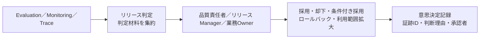
```mermaid
flowchart LR
    E["Evaluation／Monitoring／Trace"] --> G["リリース判定<br/>判定材料を集約"]
    G --> H["品質責任者／リリース Manager／業務Owner"]
    H --> D["採用・却下・条件付き採用<br/>ロールバック・利用範囲拡大"]
    D --> L["意思決定記録<br/>証跡ID・判断理由・承認者"]
```
### 1.6 Reviewと差し戻しの基本契約

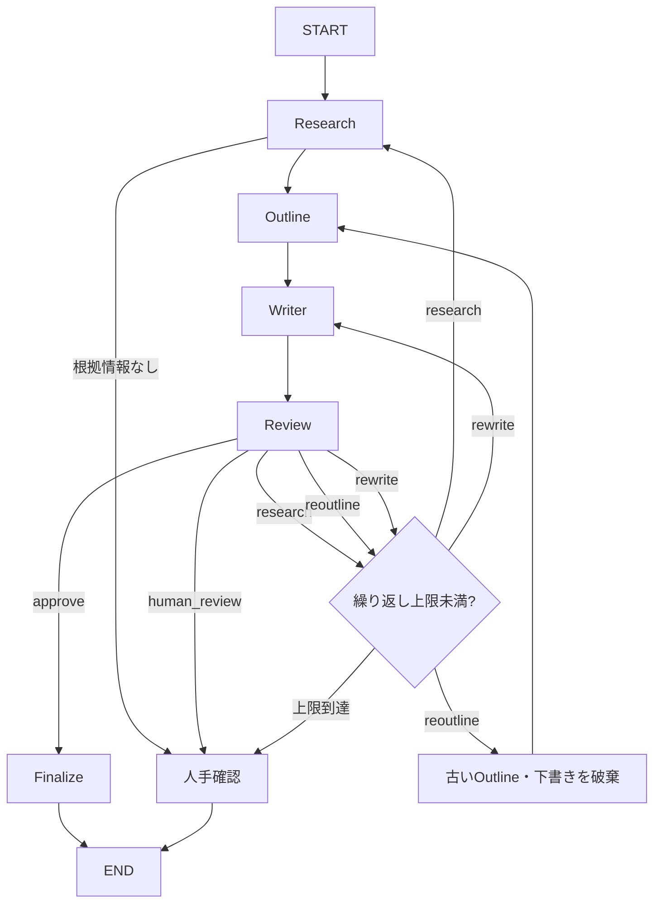
```mermaid
flowchart TD
    S["START"] --> R["Research"]
    R -->|根拠情報なし| H["人手確認"]
    R --> O["Outline"]
    O --> W["Writer"]
    W --> V["Review"]
    V -->|approve| F["Finalize"]
    V -->|research| L{"繰り返し上限未満?"}
    V -->|reoutline| L
    V -->|rewrite| L
    V -->|human_review| H
    L -->|research| R
    L -->|reoutline| C["古いOutline・下書きを破棄"]
    C --> O
    L -->|rewrite| W
    L -->|上限到達| H
    F --> E["END"]
    H --> E
```

Review Agentの自由な判断だけで経路を決めず、根拠情報 0件、繰り返し上限、機密区分、外部公開用途などはコードで強制する。意味的な品質はLLM Review、回数や権限など決定論的な条件はApplication Codeが担当する。

### 1.7 後続章を読むための最小用語

| 用語 | この章で押さえる意味 |
| --- | --- |
| 根拠情報 | AI Searchから取得し、引用・評価・監査へ共通利用する根拠単位 |
| 文書集合スナップショット | ある時点で検索対象となる全文書Version集合。取り込みRun IDとは分ける。物理名は`corpus_snapshot_id`（今回のRequestで使う文書集合の版を特定するID）等を維持する |
| 実行構成セット | Research／Outline／Writer／Review等の不変Prompt Version、Model、文書集合、Gitを一組として固定したリリース構成 |
| 実行構成台帳 | 実行構成セットの不変構成を保存する本資料独自の管理Record。物理実体は`technical_report_prompt_bundles`（実行構成セットを不変な1組として保存する管理Table） |
| 本番構成参照 | `production`（本番で現在利用する参照先）等が現在どの実行構成セットを使うかを指す可変参照先。物理実体は`technical_report_release_channels`（production等が現在使う実行構成セットを指す管理Table） |
| レポート実行状態 | LangGraph Node間で引き継ぐRequest、根拠情報、中間成果物、経路、判定の集合 |
| 人手確認 | 自動承認できないRequestを人へ渡し、必要に応じて同じ実行状態から再開する仕組み |
| Checkpoint | LangGraphが実行状態を保存し、同じ処理を後から再開するための保存点。本文では正式用語を維持する |
| Assessment | Traceへ付与するFeedback／Expectation／原因診断／承認等の評価Record |
| リリース判定 | 最終評価用Dataset、Security、根拠情報、処理経路、性能、Costからリリース可否の判定材料を作る本資料独自ワークフロー |

#### 1.7.1 本資料の読み方

後続章はPoC、本番導入、本番導入後の順に読む。各フェーズでは、最初に**「まず理解する構成」**として5〜7要素程度へ畳んだ概念図を示し、その後にTable／Dataset／Resource一覧、管理系ER、データフロー、実装へ段階的に展開する。初読ではコードを上からすべて読む必要はない。各Sourceについて、**何を解決するか、何を入力し、どこへ保存し、何を出力し、どのTrace／Table／UIで確認するか**を先に理解し、その後にコードを参照する。

PoC章では「マルチエージェントとして成立するか」、本番導入章では「再現・統制・停止・復旧できるか」、本番導入後章では「本番証跡からAgent／実行状態／処理経路の問題を切り出せるか」を中心に読む。

EvaluationDatasetの一般的な育成、Judge Alignment、Prompt Optimization、Production TraceのDevelopment／Staging還流、文書集合スナップショットの作り方、RAG基盤のProduction Monitoring等は、**「社内技術文書検索システム（エージェント型RAG）_完成版.md」**を参照する。本資料では、そこで定義された共通基盤を利用する前提で、マルチエージェント固有の差分だけを追加する。
## 2. 三段階の導入ロードマップ

本資料では、実装成熟度をPoC、本番導入、本番導入後の3段階へ分ける。**本番開始後に必要になる機能と、本番開始前に必ず作って事前通し試験すべき機能を混同しない。**

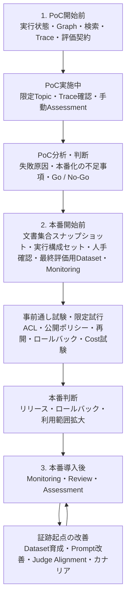
```mermaid
flowchart TD
    P1["1. PoC開始前<br/>実行状態・Graph・検索・Trace・評価契約"] --> P2["PoC実施中<br/>限定Topic・Trace確認・手動Assessment"]
    P2 --> P3["PoC分析・判断<br/>失敗原因・本番化の不足事項・Go / No-Go"]
    P3 --> B1["2. 本番開始前<br/>文書集合スナップショット・実行構成セット・人手確認・最終評価用Dataset・Monitoring"]
    B1 --> B2["事前通し試験・限定試行<br/>ACL・公開ポリシー・再開・ロールバック・Cost試験"]
    B2 --> B3["本番判断<br/>リリース・ロールバック・利用範囲拡大"]
    B3 --> O1["3. 本番導入後<br/>Monitoring・Review・Assessment"]
    O1 --> O2["証跡起点の改善<br/>Dataset育成・Prompt改善・Judge Alignment・カナリア"]
    O2 --> O1
```

| 段階 | 開始前に構築する機能 | 実施中の監視・運用 | 結果の分析・改善 | 完了・移行判断 |
| --- | --- | --- | --- | --- |
| PoC | 共通Schema、初期Prompt、固定した開発用文書集合、AI Search、LangGraph、Trace、EvaluationDataset、Scorer、最小UI | 根拠情報件数、Agent経路、繰り返し、引用、Trace、限定Testerの結果を確認 | Research／Outline／Writer／Review／処理経路に原因分解し、1要素ずつ比較 | マルチエージェントとして成立するか、本番化の不足事項とGo／No-Goを決める |
| 本番導入／限定試行 | 文書集合スナップショット、実行構成セット、Server側権限・公開ポリシー、中断・再開可能な人手確認、改善用Dataset／最終評価用Dataset、リリース判定、Production Monitoring、ロールバック | ACL、掲載可否、Checkpoint、Agent／Model／Search、Latency、Cost、人手確認を監視 | 事前通し試験／限定試行結果から閾値、手順、ポリシー、利用範囲を調整 | リリース継続、ロールバック、No-Go、利用範囲拡大を責任者が承認 |
| 本番導入後 | レビュー待ちキュー自動化、Dataset育成、Prompt Optimization、Judge Alignment、段階的リリース等を必要性に応じ追加 | 定常Monitoring、専門家Review、Assessment、滞留、Cost、品質Driftを確認 | 本番Traceを原因別に改善先へ配送し、改善用Datasetで探索、最終評価用Datasetで判定 | 品質・Security・SLO・Cost・運用負荷から採否を判断 |

### 2.1 Architectureと手運用範囲の比較

| 比較軸 | PoC | 本番導入 | 本番導入後 |
| --- | --- | --- | --- |
| 文書集合 | 開発用の固定文書集合／Indexを手動指定 | RAG基盤の文書集合スナップショットで全文書Version集合を固定 | 更新履歴を継続し、品質問題時に検証済み前版へロールバック |
| Prompt／Model | 開発用Promptを固定し、比較RunごとにVersionを記録 | 不変Prompt URI＋Model＋文書集合＋Gitを実行構成セットへ固定 | Optimization候補、オンライン比較実験、カナリアを追加 |
| 人手確認 | 上限・高リスクで未承認下書きを返して終了してよい | Checkpoint、thread_id、一時的な処理権、冪等再開を実装 | 滞留・再割当・SLA等を運用実績から高度化 |
| 評価 | 小規模EvaluationDataset、決定論的Scorer＋必要最小のJudge | 改善用Dataset／最終評価用Dataset、リリース判定、Production Monitoringを本番前に用意 | 本番AssessmentでDatasetとJudgeを育成 |
| Identity／ポリシー | 開発環境限定、固定Tester、実データならACL／マスキングを省略しない | 認証済みUser／GroupとServer側ポリシーからEntitlement・成果物公開範囲を解決 | 監査・規制要件に応じて責務分割を追加 |

### 2.2 PoC版から本番版への置換

| PoC版 | 本番版での変更 | 理由 |
| --- | --- | --- |
| 固定文字列／環境変数の`corpus_snapshot_id`（今回のRequestで使う文書集合の版を特定するID） | `corpus_snapshot_manifest`（文書集合スナップショットの構成を管理する台帳）／`registry`（文書集合スナップショットのIDと構成を参照する台帳）で不変な文書集合スナップショットを発行 | 文書Version集合を再現・ロールバック可能にする |
| 開発用Prompt URIの固定 | `technical_report_prompt_bundles`（実行構成セットを不変な1組として保存する管理Table）＋本番構成参照 | 複数Prompt、Model、文書集合、Gitを一括にリリースする |
| 最小`human_review_node()`（人手確認へ送るための最小Node関数）で終了 | 実行状態を永続保存するCheckpoint＋実行時人手確認記録＋`Command(resume=...)`（LangGraphへ人手判断を渡して中断地点から再開する命令） | 外部承認待ちや長時間Requestを安全に再開する |
| 小規模基準評価Dataset | 改善用Datasetと最終評価用Datasetへ分離 | 候補探索と最終判定の情報漏洩を防ぐ |
| 手動Trace確認 | Production Monitoring＋Alert／運用手順書 | 本番開始時点から品質・Cost・経路を監視する |
| 固定した開発用利用者 | 認証済みUser／Group＋Server側成果物公開ポリシー | Client入力による権限昇格を防ぐ |

### 2.3 フェーズ別データモデル差分

ここでは、RAG資料と共通する資産と、マルチエージェントで追加する資産を分けて見る。

| 要素 | PoC | 本番導入 | 本番導入後 |
| --- | --- | --- | --- |
| MLflow EvaluationDataset | ○。小規模固定Dataset | ○。改善用Datasetと最終評価用Datasetへ分離 | ○。承認済み本番Caseを継続追加 |
| 文書集合スナップショット | 開発環境で固定した値 | ○。RAG資料の共通基盤を利用 | ○ |
| 実行構成台帳／本番構成参照 | －。開発環境で固定した値 | ○。マルチエージェント固有 | ○ |
| 実行状態を永続保存するCheckpoint／実行時人手確認記録 | 最小エスカレーションのみ | ○。外部公開・高リスク等で必要 | ○。SLA／再割当を高度化 |
| Production Monitoring | － | ○。RAG資料の共通基盤へAgent／処理経路／繰り返し Signalを追加 | ○。Sampling／Thresholdを調整 |
| 品質レビュー記録 `technical_report_review_cases`（完了済みTraceのレビュー結果と改善先を管理するTable） | － | 必要に応じ最小利用 | ○。定期Review自動化時に本格利用 |
| Prompt Optimization／Judge Alignment | － | 共通手順はRAG資料参照 | 条件付き高度化 |
| Request単位の段階的リリース／保存した実行状態からの再実行 | － | － | 条件付き高度化 |
### 2.4 共通のRAG／LLMOps改善ライフサイクルは別資料を参照する

EvaluationDataset、Scorer、Judge、Prompt、Retrievalをどの順序で成熟させるか、Production Traceを人手確認してDevelopmentへ戻し、Stagingで再評価して本番へ戻すかという**共通のRAG／LLMOps改善ライフサイクル**は、本資料では繰り返さない。

詳細は、**「社内技術文書検索システム（エージェント型RAG）_完成版.md」**の次の節を参照する。

- `2.4 LLM品質資産の成熟ライフサイクル`
- `2.5 開発・Staging・本番間のデータ還流`
- 第5章の本番証跡、レビュー記録、EvaluationDataset、Prompt／Retrieval／Judge改善、Production Monitoring

本資料では、その共通基盤の上に、**マルチエージェントだから追加で必要になる設計と評価**だけを扱う。

#### 2.4.1 マルチエージェントで追加管理する品質資産

単一RAGでは、主に「検索結果と最終回答」の品質を評価する。マルチエージェントでは、最終レポートが悪いときに、どのAgentまたはどの遷移で壊れたかを特定できなければ改善できない。

そのため、共通のEvaluationDataset／Scorer／Judgeに加えて、次を評価対象へ追加する。

| 追加対象 | 何を固定・評価するか | なぜ必要か |
| --- | --- | --- |
| Agent間契約 | Research、Outline、Writer、Reviewの入力／出力Schema | 上流の自由文変更で下流Agentが暗黙に壊れるのを防ぐ |
| 実行状態 | 根拠情報、Outline、下書き、Review指摘、繰り返し回数 | 差し戻し後に残してよい実行状態と破棄すべき実行状態を区別する |
| 処理経路 | `research`（再調査へ戻す処理指定）、`reoutline`（構成作成へ戻す処理指定）、`rewrite`（文章作成へ戻す処理指定）、`human_review`（人手確認へ送る処理指定） | 最終品質だけでは誤った差し戻し先を検出できない |
| 繰り返し | Agent別Retry、全体繰り返し、停止理由 | Agent同士の往復が無限化・高Cost化するのを防ぐ |
| Provenance | 根拠情報 → Outline Section → 下書きの引用 → Final Report | 途中Agentで根拠との対応が失われていないか確認する |
| 人手確認再開 | `thread_id`（中断した同一Graph実行を再開するための識別子）、Checkpoint、判断、再開先 | 人手確認後に別実行状態や古い下書きから再開する事故を防ぐ |
| 実行構成セット | AgentごとのPrompt VersionとModelを一組で固定 | 一部Agentだけが途中で新Versionへ変わるのを防ぐ |
| Agent別性能 | Agent別Token、Latency、Call回数 | 全体値だけではCost増加の原因を特定できない |

#### 2.4.2 「最終レポートが悪い」だけで改善を始めない

マルチエージェントでは、後段のAgentが悪く見えても、実際には上流の不足がそのまま伝播していることがある。**最終結果ではなく、最初に期待状態から外れた場所を主原因として見る**。

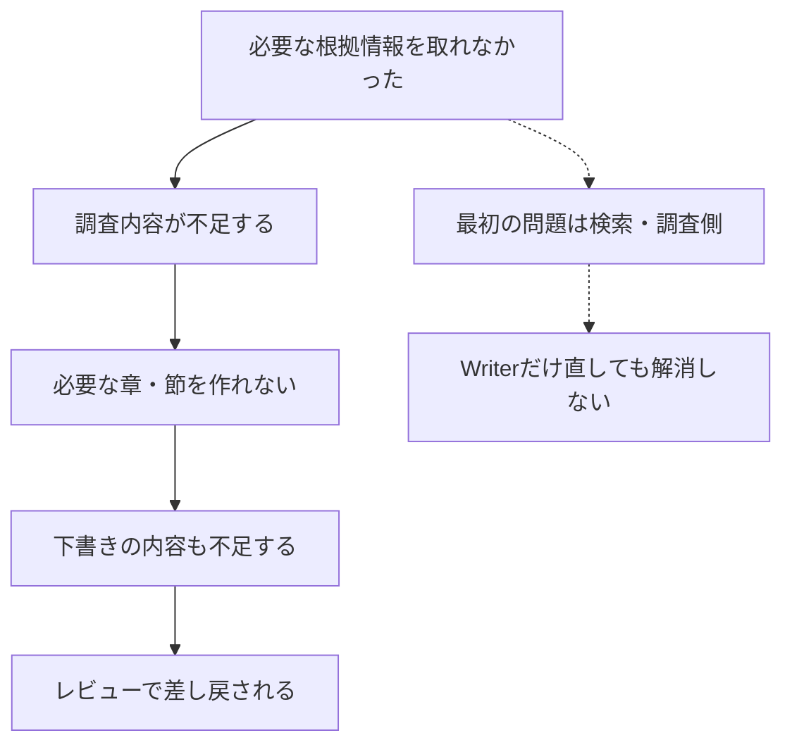
```mermaid
flowchart TD
    A["必要な根拠情報を取れなかった"] --> B["調査内容が不足する"]
    B --> C["必要な章・節を作れない"]
    C --> D["下書きの内容も不足する"]
    D --> E["レビューで差し戻される"]

    A -.-> F["最初の問題は検索・調査側"]
    F -.-> G["Writerだけ直しても解消しない"]
```

逆に、根拠情報、構成、下書きが正しいのにReview Agentが誤って差し戻した場合は、Reviewまたは処理経路が改善対象になる。

| まず見る場所 | 期待する状態 |
| --- | --- |
| 根拠情報・調査 | 必要な文書を取得し、調査メモへ必要事項を残せている |
| 構成 | 必須の章・節があり、各節へ使う根拠情報が割り当てられている |
| 本文 | 指定された根拠情報だけで、引用付きの本文を作れている |
| レビュー | 問題の種類に応じて、承認・再調査・再構成・改稿を正しく選べている |
| 処理経路 | Review判断どおりの場所へ戻り、不要な繰り返しをしていない |
| 最終化 | 承認済み下書きの意味内容を勝手に変更していない |

Evaluation結果からどこを疑い、次に何を確認するかは、**3.6「マルチエージェント固有の原因分解」**で全体像と詳細に分けて説明する。
### 2.5 マルチエージェント固有の変更ライフサイクル

共通のProduction → Development → Staging → Productionの還流方法はRAG資料を参照する。本節では、その流れの中で**マルチエージェント変更時に追加で確認する順序**だけを示す。

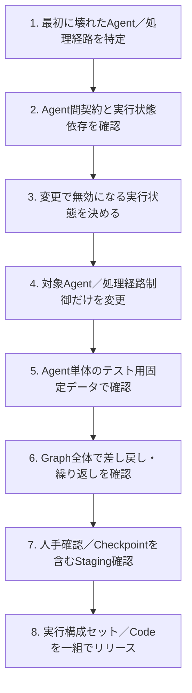
```mermaid
flowchart TD
    C["1. 最初に壊れたAgent／処理経路を特定"] --> K["2. Agent間契約と実行状態依存を確認"]
    K --> I["3. 変更で無効になる実行状態を決める"]
    I --> U["4. 対象Agent／処理経路制御だけを変更"]
    U --> A["5. Agent単体のテスト用固定データで確認"]
    A --> G["6. Graph全体で差し戻し・繰り返しを確認"]
    G --> H["7. 人手確認／Checkpointを含むStaging確認"]
    H --> B["8. 実行構成セット／Codeを一組でリリース"]
```

#### 2.5.1 実行状態の保持・破棄規則を先に決める

差し戻し時に全実行状態を保持すると、古い中間成果物を誤って再利用する。逆に全実行状態を破棄すると、不要なResearch再実行によってLatencyとCostが増える。

本システムでは、基本規則を次のようにする。

| Review Action | 保持する実行状態 | 破棄・再生成する実行状態 |
| --- | --- | --- |
| `research`（再調査へ戻す処理指定） | Request、ポリシー、リリース構成 | 根拠情報、Research Notes、Outline、下書き、Review結果 |
| `reoutline`（構成作成へ戻す処理指定） | Request、ポリシー、根拠情報、Research Notes | Outline、下書き、Review結果 |
| `rewrite`（文章作成へ戻す処理指定） | Request、ポリシー、根拠情報、Research Notes、Outline | 下書き、Review結果 |
| `human_review`（人手確認へ送る処理指定） | その時点の全実行状態をCheckpoint | 人の判断に応じて再開時に決定 |
| `approve`（承認して最終化する処理指定） | 承認済み実行状態 | Finalizerは意味内容を追加しない |

この規則はPromptに任せず、Graph Codeで実装する。

#### 2.5.2 Agent間契約をVersion管理する

PromptだけVersion管理しても、`Evidence`（検索で取得した根拠情報を表すデータ型）や`ReportOutline`（章・節構成と各節の根拠情報を表すデータ型）のSchemaが変われば下流Agentが壊れる。共通PackageのPydantic Model、Graph Code、実行構成セットを同じGit Commit／リリース構成へ関連付ける。

互換性のないSchema変更では、古いCheckpointを新しいGraphでそのまま再開しない。必要に応じて実行状態 Migrationを用意するか、旧リリースで処理を完了させる。

#### 2.5.3 Request途中でAgent構成を変えない

複数Agentがあると、個別Prompt AliasやModel Endpointを実行のたびに解決すると、1つのRequest内でResearchは旧Version、Writerは新Versionという状態が起き得る。

そのためRequest開始時に、少なくとも次を1回だけ解決して実行状態へ固定する。

- 実行構成セットID
- 各Agentの不変Prompt Version
- AgentごとのModel Service
- 文書集合スナップショット ID
- Graph／ポリシーを含むGit Commit

段階的リリース（カナリア）やA/B比較でも、LLM Call単位ではなく**Request／Session単位で実行構成セットを固定**する。

#### 2.5.4 DevelopmentとStagingで確認する内容もAgent単位に分ける

共通の環境間データ移送方法はRAG資料を参照する。マルチエージェント固有の違いは次のとおりである。

| 確認内容 | Development | Staging |
| --- | --- | --- |
| Research Prompt | 固定Request＋検索結果テスト用固定データで出力Schemaを確認 | 本番相当AI SearchでQueryと根拠情報取得を確認 |
| Outline Prompt | 固定根拠情報で必須節・`source_ids`（各節や文章が利用する根拠情報を指すID一覧）を確認 | Researchから連結して実行状態受け渡しを確認 |
| Writer Prompt | 固定Outline＋根拠情報で引用を確認 | Graph全体で実行しコンテキスト量も確認 |
| Review Prompt | 固定下書き＋根拠情報で期待Actionを確認 | 実際の差し戻しEdgeと繰り返しを確認 |
| 処理経路制御 | 固定した実行状態（テスト用）でEdge選択を単体テスト | Graph全体で往復、上限、停止を確認 |
| 人手確認 | 再開判断の単体テスト | 実行状態を永続保存するCheckpoint、一時的な処理権、再開を結合確認 |
| 実行構成セット | 構成台帳の解決を確認 | Request途中でVersionが変わらないことを確認 |

Developmentでは局所的なAgent変更を速く確認し、Stagingでは**Agent間相互作用と実行状態遷移**を重点的に確認する。


## 3. PoC時に実施するもの

### 3.1 PoCの目的・範囲・完了条件

| 項目 | 内容 |
| --- | --- |
| 目的 | 少数Topicと少数文書で、根拠情報取得から構成、執筆、Review、差し戻し、最終化まで成立するか確認する |
| 手運用 | 開発用文書集合／Prompt Version固定、実行、Trace確認、Expectation入力、失敗原因分類 |
| 自動化 | AI Search、Research／Outline／Writer／Review、繰り返し上限、Trace、Evaluation、SSE |
| 実装しない | 文書集合スナップショット台帳、実行構成台帳／本番構成参照、中断・再開可能な人手確認、Production Monitoring定期実行、Prompt Optimization、Judge Alignment、カナリア |
| Security | 開発環境限定・限定Tester。実データを使う場合はACL、公開ポリシー、マスキングを省略しない |
| 完了条件 | 期待根拠情報、必須節、引用、差し戻し、回答拒否／人手確認、Trace、最小評価が再現可能に合格する |

PoCで確認する対象は「複数LLMを呼べること」ではない。次の7点が同じRequest ID／Traceでつながり、失敗箇所を説明できることを確認する。

1. Researchが期待根拠情報を取得できる。
2. Outlineが根拠情報と節を対応付けられる。
3. Writerが根拠情報外の事実を追加せず引用付き下書きを作れる。
4. Reviewerが誤りを検出し、`research`（再調査へ戻す処理指定）／`reoutline`（構成作成へ戻す処理指定）／`rewrite`（文章作成へ戻す処理指定）を区別できる。
5. LangGraphがReviewerの意味判断と決定論的ポリシーを組み合わせ、正しいEdgeへ進める。
6. 繰り返し上限・根拠情報 0件・高リスク条件で自動承認を止められる。
7. TraceとEvaluationから、どのAgent／検索／処理経路が原因か後から説明できる。

**PoCの非目的**は、本番レベルの職務分離、永続的なレビュー待ちキュー、完全なリリース Workflow、全社Monitoringを完成させることである。これらはPoCの成立性が確認できた後に4章で追加する。

### 3.2 PoC時のデータモデル全体像

#### 3.2.1 まず理解する構成

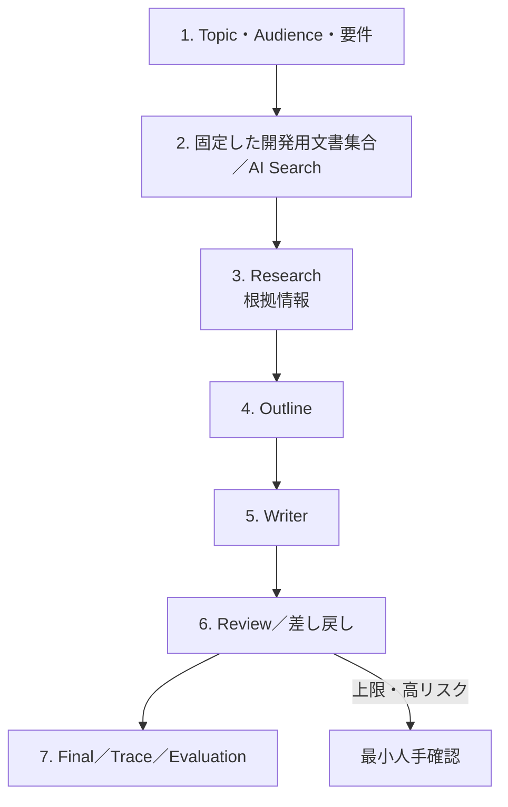
```mermaid
flowchart TD
    U["1. Topic・Audience・要件"] --> S["2. 固定した開発用文書集合／AI Search"]
    S --> R["3. Research<br/>根拠情報"]
    R --> O["4. Outline"]
    O --> W["5. Writer"]
    W --> V["6. Review／差し戻し"]
    V --> F["7. Final／Trace／Evaluation"]
    V -->|上限・高リスク| H["最小人手確認"]
```

#### 3.2.2 PoC時のTable／Dataset一覧

| 分類 | 物理的な実体 | 役割 |
| --- | --- | --- |
| 評価 | MLflow EvaluationDataset（PoC 基準評価セット） | Topic、要件、期待文書、必須節、禁止Claim、期待処理経路を保持 |
| Trace | MLflow Experiment／Trace | Agent Span、根拠情報、Prompt、Model、処理経路、繰り返し、結果を保持 |
| Prompt | MLflow Prompt Registry | Agentごとの初期Prompt Versionを管理 |
| 検索 | 開発用AI Search Index | 固定したPoC 文書集合から根拠情報を検索 |
| 実行時 | LangGraphの実行状態 | Request中の根拠情報、Outline、下書き、Review判断を保持。PoCでは永続管理Tableではない |
| UI／API | Agent Server＋Databricks Apps／Streamlit | SSE進捗と最終結果を返す |

#### 3.2.3 PoC時の管理系ER図

**該当なし。** PoCでは文書集合スナップショット台帳、実行構成台帳、本番構成参照、永続的な実行時人手確認Storeを作らない。EvaluationDatasetとTraceは存在するが、本番の管理系ERをPoCへ持ち込まない。

#### 3.2.4 PoC時のデータフロー図


```mermaid
flowchart TD
    S["START"] --> R["Research"]
    R -->|根拠情報なし| H["人手確認"]
    R --> O["Outline"]
    O --> W["Writer"]
    W --> V["Review"]
    V -->|approve| F["Finalize"]
    V -->|research| L{"繰り返し上限未満?"}
    V -->|reoutline| L
    V -->|rewrite| L
    V -->|human_review| H
    L -->|research| R
    L -->|reoutline| C["古いOutline・下書きを破棄"]
    C --> O
    L -->|rewrite| W
    L -->|上限到達| H
    F --> E["END"]
    H --> E
```

Review Agentの自由な判断だけで経路を決めず、根拠情報 0件、繰り返し上限、機密区分、外部公開用途などはコードで強制する。意味的な品質はLLM Review、回数や権限など決定論的な条件はApplication Codeが担当する。

### 3.3 PoC開始前に構築する最小機能

PoCでは、まずResearchが期待根拠情報を取得できることを確認し、その後にOutline、Writer、Review、差し戻しを追加する。検索できない事実をWriter Promptの工夫で補わせない。


**この節の読み方**：PoCは次の4ブロックに分け、下記の順序で構築する。最初からStreamlitやReviewerまで読む必要はなく、**根拠情報取得が成立してから後段Agentを追加する**。

```text
共通契約
  ↓
Prompt登録
  ↓
根拠情報検索
  ↓
実行構成セット固定
  ↓
Research → Outline → Writer → Review Graph
  ↓
最小人手確認
  ↓
EvaluationDataset／Scorer
  ↓
Agent Server／SSE
  ↓
Streamlit／Apps Deploy
```

| 段階 | まず確認すること | 合格しない場合に先へ進まない理由 |
| --- | --- | --- |
| 契約 | 根拠情報／Outline／Review／Resultを構造化できる | Agent間の曖昧な自由文受渡しが後工程の原因分析を壊すため |
| Retrieval | 期待根拠情報を取得できる | Writer Promptで検索失敗を補完するとGrounding不能になるため |
| Graph | 期待ActionごとにEdgeが変わる | 単なる直列LLM呼出しではマルチエージェントの価値を検証できないため |
| Evaluation | 期待根拠情報／節／処理経路を測れる | 感覚的なレポート品質だけでは改善比較できないため |
| Serving | Trace IDと最終結果をSSEで返せる | 実行時問題と品質問題を分けて観測できないため |

#### 3.3.1 PoC Project構成

```text
technical-report-agent-poc/
├── packages/technical-report-common/
│   └── src/technical_report_common/report_contracts.py
├── bundles/quality/
│   ├── prompts/
│   │   ├── research_plan.md
│   │   ├── research_notes.md
│   │   ├── outline.md
│   │   ├── writer.md
│   │   └── review.md
│   ├── src/register_prompts.py
│   ├── src/seed_evaluation_dataset.py
│   └── src/evaluate_report.py
└── bundles/realtime/
    ├── app/evidence_search.py
    ├── app/auth_context.py
    ├── app/experiment_router.py
    ├── app/prompt_bundle.py
    ├── app/report_graph.py
    ├── app/agent.py
    ├── app/start_server.py
    ├── app/streamlit_app.py
    ├── app/start.sh
    ├── app/app.yaml
    └── resources/realtime_app.yml
```

#### 3.3.2 PoC実行基盤を作る

最初のブロックでは、Agent同士が受け渡す型、Prompt、根拠情報検索、固定した実行構成セットを用意する。この段階ではGraphをまだ組まない。**各部品を単独で説明できる状態にしてから接続する。**

```text
共通契約 → Prompt → 根拠情報検索 → 固定した実行構成セット
```

##### 3.3.2.1 共通のレポート契約を定義する

この実装では、根拠情報、調査計画、構成案、Review判断、Graphの実行状態、最終結果を共通Packageへ定義する。`corpus_snapshot_id`（今回のRequestで使う文書集合の版を特定するID）は取り込みJob IDではなく、ある時点で検索対象となる全文書Version集合のIDである。`Evidence`（検索で取得した根拠情報を表すデータ型）には閲覧権限とは別に公開区分を保持し、外部成果物へ内部URIを出さない。`ReviewDecision`（Review Agentの判定結果を表すデータ型）は`research`（再調査へ戻す処理指定）、`reoutline`（構成作成へ戻す処理指定）、`rewrite`（文章作成へ戻す処理指定）を分離し、構成不良をWriterだけで直そうとしない。`ReportResult`（APIへ返す最終レポート結果のデータ型）には決定論的Scorerが必要とする引用、Outline、経路、ポリシー情報も返す。

`packages/technical-report-common/src/technical_report_common/report_contracts.py`（Agent間で共有するデータ型を定義する共通契約ファイル）

```python
from __future__ import annotations

from typing import Literal, TypedDict

from pydantic import BaseModel, ConfigDict, Field


class Evidence(BaseModel):
    # AI Searchの検索結果を、引用・評価・監査で共通利用できる型へ正規化する。
    model_config = ConfigDict(extra="forbid")

    source_id: str = Field(description="レポート中で使用する安定した引用ID")
    chunk_id: str
    document_id: str
    document_version: str
    corpus_snapshot_id: str
    internal_title: str
    content: str
    internal_source_uri: str
    external_reference: str | None = None
    required_entitlement: str
    publication_scope: Literal["internal", "external"]
    data_classification: Literal["public", "internal", "confidential", "restricted"]
    publication_approved: bool
    has_conflict: bool = False
    page_number: int | None = None
    score: float | None = None


class ResearchPlan(BaseModel):
    # Research AgentがAI Searchへ送るQueryと確認観点を構造化する。
    model_config = ConfigDict(extra="forbid")

    queries: list[str] = Field(min_length=1, max_length=5)
    focus_points: list[str] = Field(default_factory=list)


class OutlineSection(BaseModel):
    # 各節の目的と利用Evidenceを対応付け、根拠のない節を検出可能にする。
    model_config = ConfigDict(extra="forbid")

    heading: str
    purpose: str
    source_ids: list[str] = Field(min_length=1)


class ReportOutline(BaseModel):
    # Writerへ渡す構成案を、自由文ではなく節の配列として保持する。
    model_config = ConfigDict(extra="forbid")

    title: str
    executive_summary_goal: str
    sections: list[OutlineSection] = Field(min_length=2, max_length=8)


class ReviewDecision(BaseModel):
    # ReviewコメントとGraphの次Actionを分離し、決定論的にRouteできるようにする。
    model_config = ConfigDict(extra="forbid")

    action: Literal["approve", "research", "reoutline", "rewrite", "human_review"]
    comments: str
    missing_topics: list[str] = Field(default_factory=list)
    unsupported_claims: list[str] = Field(default_factory=list)
    evidence_conflict: bool = False


class ReportState(TypedDict):
    # LangGraphの全Nodeが共有するStateを定義する。
    request_id: str
    topic: str
    audience: str
    report_requirements: str
    reader_entitlements: list[str]
    publication_scope: Literal["internal", "external"]
    data_classification_ceiling: Literal[
        "public", "internal", "confidential", "restricted"
    ]
    publication_policy_version: str
    corpus_snapshot_id: str
    prompt_bundle_id: str
    prompt_uris: dict[str, str]
    model_services: dict[str, str]
    source_git_commit: str
    experiment_id: str
    experiment_variant: str
    evidence: list[Evidence]
    research_notes: str
    outline: ReportOutline | None
    draft: str
    review_action: Literal[
        "approve", "research", "reoutline", "rewrite", "human_review"
    ]
    review_comments: str
    review_loop_count: int
    route_history: list[str]
    review_feedback_history: list[str]
    unsupported_claims_detected: list[str]
    evidence_conflict: bool
    context_budget_exceeded: bool
    approved: bool
    requires_human_review: bool
    review_case_id: str | None
    final_report: str


class ReportResult(BaseModel):
    # API利用者とEvaluationへ返す安定した出力契約を定義する。
    model_config = ConfigDict(extra="forbid")

    request_id: str
    report: str
    source_document_ids: list[str]
    evidence_source_ids: list[str]
    outline_source_ids: list[str]
    cited_source_ids: list[str]
    evidence_publication_scopes: list[str]
    route_history: list[str]
    review_feedback_history: list[str]
    unsupported_claims_detected: list[str]
    evidence_conflict: bool
    publication_scope: Literal["internal", "external"]
    publication_policy_version: str
    corpus_snapshot_id: str
    prompt_bundle_id: str
    experiment_id: str
    experiment_variant: str
    review_loop_count: int
    approved: bool
    requires_human_review: bool
    review_case_id: str | None
```

Pydanticを使用するのは、LLMの構造化出力、AI Search結果、Agent間の受け渡しを実行時に検証するためである。`TypedDict`（Pythonで辞書型のKeyとValue型を定義する型ヒント）の`ReportState`（Agent間で引き継ぐレポート実行状態の型）はLangGraphの実行状態の更新へ利用し、外部境界とLLM出力では検証機能を持つPydantic Modelを利用する。

##### 3.3.2.2 Agentごとの初期PromptをMarkdownで管理する

初期PromptはPythonへ直接埋め込まず、**AgentごとにMarkdownファイルとしてGit管理する**。PythonはMarkdownを読み込み、MLflow Prompt Registryへ登録するだけにする。

この分離には次の利点がある。

- Prompt本文と登録処理を分離でき、Promptだけをレビューしやすい。
- Research、Outline、Writer、Reviewを別ファイルにすることで、変更したAgentがGit差分から分かる。
- 長いPromptをPython文字列として読む必要がなくなり、実装コードの認知負荷を下げられる。
- 将来Prompt Optimization等で候補が増えても、Git上の基準PromptとRegistry上の候補Versionを区別しやすい。

PoCでは次の5ファイルを用意する。

| Markdown | 対象 | 主な役割 |
| --- | --- | --- |
| `research_plan.md`（Research Agentの検索計画Prompt） | Research Agent | AI Searchへ送る検索Queryを作る |
| `research_notes.md`（Research Agentの調査メモPrompt） | Research Agent | 取得した根拠情報から調査メモを作る |
| `outline.md`（Outline Agentの構成作成Prompt） | Outline Agent | 節構成と利用する`source_ids`（各節や文章が利用する根拠情報を指すID一覧）を決める |
| `writer.md`（Writer Agentの本文作成Prompt） | Writer Agent | 根拠情報だけを使って本文を書く |
| `review.md`（Review AgentのレビューPrompt） | Review Agent | 承認、再調査、再構成、改稿、人手確認を判定する |

###### `bundles/quality/prompts/research_plan.md`（Research Agentの検索計画Promptファイル）

```markdown
あなたは技術調査担当です。
テーマ、対象読者、要件、前回Review指摘から、社内AI Searchへ送る検索Queryを1〜5件作成してください。
同じ意味のQueryを重複させず、製品名、Version、エラーコードなど重要な固有語を保持してください。

テーマ: {{topic}}
対象読者: {{audience}}
要件: {{requirements}}
前回Review指摘: {{review_comments}}
```

###### `bundles/quality/prompts/research_notes.md`（Research Agentの調査メモPromptファイル）

```markdown
あなたは技術調査担当です。
Evidenceだけを根拠として、テーマに関する調査メモを作成してください。
各記述へ[SRC-A1B2C3D4E5]形式で、提示された引用IDをそのまま付けてください。
Evidenceにない事実や新しい引用IDは追加しないでください。
文書間で内容が競合する場合は、Versionと競合内容を明示してください。

テーマ: {{topic}}
確認観点:
{{focus_points}}
Evidence:
{{evidence}}
```

###### `bundles/quality/prompts/outline.md`（Outline Agentの構成作成Promptファイル）

```markdown
あなたは技術レポートの構成担当です。
調査メモとEvidenceだけを利用し、対象読者と要件に合う構成案を作成してください。
各節には、その節で利用するsource_idsを最低1件指定してください。

テーマ: {{topic}}
対象読者: {{audience}}
要件: {{requirements}}
調査メモ:
{{research_notes}}
前回の構成Review指摘:
{{review_comments}}
```

###### `bundles/quality/prompts/writer.md`（Writer Agentの本文作成Promptファイル）

```markdown
あなたは技術レポートの執筆担当です。
構成案に従い、Evidenceに支持された内容だけでMarkdownレポートを作成してください。
技術的主張には[SRC-A1B2C3D4E5]形式で提示済みIDを引用し、未確認事項は未確認と記載してください。
前回Review指摘がある場合は、指摘された箇所を修正してください。

テーマ: {{topic}}
対象読者: {{audience}}
要件: {{requirements}}
構成案:
{{outline}}
Evidence:
{{evidence}}
前回Review指摘:
{{review_comments}}
```

###### `bundles/quality/prompts/review.md`（Review AgentのレビューPromptファイル）

```markdown
あなたは技術レポートの品質責任者です。
Evidenceへの忠実性、引用、必須節、論理構成、対象読者への適合性を確認してください。
根拠不足はresearch、章立て・節順・論理構成の問題はreoutline、
文章表現・引用・Draftだけの問題はrewrite、競合・高リスクはhuman_review、
問題がなければapproveを返してください。未支持Claimが1件でもあればapproveしてはいけません。

テーマ: {{topic}}
対象読者: {{audience}}
要件: {{requirements}}
Evidence:
{{evidence}}
構成案:
{{outline}}
Draft:
{{draft}}
```

MarkdownにはPrompt本文だけを置き、Registry名、Alias、Tag等の登録メタデータはPython側で管理する。Prompt本文と登録先を同じファイルへ混在させないことで、Promptレビューと運用設定レビューを分離する。

`bundles/quality/src/register_prompts.py`（Markdown PromptをPrompt Registryへ登録するファイル）

```python
from __future__ import annotations

from pathlib import Path

import mlflow


PROMPT_DIR = Path(__file__).resolve().parent.parent / "prompts"

# Registry名とGit管理するMarkdownの対応だけをPythonで定義する。
PROMPT_FILES = {
    "main.llmops.report_research_plan": "research_plan.md",
    "main.llmops.report_research_notes": "research_notes.md",
    "main.llmops.report_outline": "outline.md",
    "main.llmops.report_writer": "writer.md",
    "main.llmops.report_review": "review.md",
}


def load_prompt(filename: str) -> str:
    # Prompt本文はMarkdownを正本とし、登録時にUTF-8で読み込む。
    path = PROMPT_DIR / filename
    return path.read_text(encoding="utf-8").strip()


def register_initial_prompts() -> None:
    # 各Markdownを独立したPrompt Versionとして登録し、初期Aliasを設定する。
    for name, filename in PROMPT_FILES.items():
        prompt = mlflow.genai.register_prompt(
            name=name,
            template=load_prompt(filename),
            commit_message=f"Register initial prompt from {filename}",
            tags={
                "application": "technical-report-agent",
                "source_file": f"bundles/quality/prompts/{filename}",
            },
        )
        mlflow.genai.set_prompt_alias(
            name=name,
            alias="development",
            version=prompt.version,
        )


if __name__ == "__main__":
    register_initial_prompts()
```

この構成では、**Git上のMarkdownが初期Promptの編集元**、Prompt Registryが実行・評価で参照するVersion管理先になる。Markdownを変更しただけでは本番挙動を変えず、`register_prompts.py`（Markdown PromptをPrompt Registryへ登録するPythonファイル）を実行して新しいPrompt Versionを登録し、評価後に実行構成へ採用した時点で初めて利用対象が変わる。

Prompt RegistryはTemplateとVersionを管理する。実際の生成AIモデルは実行構成セットの`model_services`（Research／Outline／Writer／Reviewごとに利用する生成AIモデルの参照先を保持する設定）が指定するFoundation Model APIsのModel ServiceまたはServing Endpointであり、Prompt Registryからモデル推論が実行されるわけではない。`@development`（開発中Promptを指すAlias）、`@candidate`（評価候補Promptを指すAlias）、`@production`（本番利用Promptを指すAlias） Aliasは品質管理ジョブが候補Versionを選び、後述する不変Version URIの構成台帳を作るまでにだけ利用する。実行時はAliasを解決しない。

##### 3.3.2.3 固定した開発用文書集合と公開ポリシー契約で根拠情報を検索する

PoCでは`corpus_snapshot_id`（今回のRequestで使う文書集合の版を特定するID）を管理Tableから解決せず、検証対象の開発用文書集合を表す固定値として実行設定へ注入する。`reader_entitlements`（利用者が閲覧できる権限一覧）、`publication_scope`（成果物を内部向け／外部向けのどちらとして扱うか）、`data_classification_ceiling`（利用できる機密区分の上限）の検索前Filter契約は本番と同じ形を維持し、実データ利用時のSecurity検証を後回しにしない。

この実装では、Research Agentが作った複数QueryをAI Searchへ送り、`reader_entitlements`（利用者が閲覧できる権限一覧）、`publication_scope`（成果物を内部向け／外部向けのどちらとして扱うか）、`data_classification_ceiling`（利用できる機密区分の上限）、`corpus_snapshot_id`（今回のRequestで使う文書集合の版を特定するID）を検索前Filterへ適用する。閲覧可能でも外部掲載不可の文書は、外部向けRequestのLLM入力へ入れない。Clientの`audience`（レポートの対象読者）は文体指定にしか使わず、権限と公開区分は認証済みUser／GroupとServer側ポリシーから決定する。`source_id`（1件の根拠情報を安定して参照するID）は検索順ではなく文書、Version、Chunkから安定生成する。

`bundles/realtime/app/evidence_search.py`（AI Searchから根拠情報を取得するファイル）

```python
from __future__ import annotations

import hashlib
import os
from typing import Any, Literal

import mlflow
from databricks.ai_search.client import AISearchClient
from mlflow.entities import SpanType

from technical_report_common.report_contracts import Evidence


SEARCH_ENDPOINT = os.environ["AI_SEARCH_ENDPOINT_NAME"]
SEARCH_INDEX = os.environ["AI_SEARCH_INDEX_NAME"]

# Application起動時にClientとIndex Objectを取得し、Requestごとの再初期化を避ける。
search_client = AISearchClient()
search_index = search_client.get_index(
    endpoint_name=SEARCH_ENDPOINT,
    index_name=SEARCH_INDEX,
)


def build_source_id(document_id: str, version: str, chunk_id: str) -> str:
    # 文書・版・Chunkから短い安定IDを生成し、検索順位に依存しない引用IDを作る。
    raw = f"{document_id}:{version}:{chunk_id}".encode("utf-8")
    digest = hashlib.sha256(raw).hexdigest()[:10].upper()
    return f"SRC-{digest}"


def parse_rows(result: dict[str, Any]) -> list[Evidence]:
    # similarity_search()の配列形式を型付きEvidenceへ変換する。
    evidence = []
    for row in result.get("result", {}).get("data_array", []):
        evidence.append(
            Evidence(
                chunk_id=row[0],
                document_id=row[1],
                document_version=row[2],
                corpus_snapshot_id=row[3],
                internal_title=row[4],
                content=row[5],
                internal_source_uri=row[6],
                external_reference=row[7],
                required_entitlement=row[8],
                publication_scope=row[9],
                data_classification=row[10],
                publication_approved=row[11],
                has_conflict=row[12],
                page_number=row[13],
                score=row[-1],
                source_id=build_source_id(row[1], row[2], row[0]),
            )
        )
    return evidence


@mlflow.trace(name="search_report_evidence", span_type=SpanType.RETRIEVER)
def search_evidence(
    query: str,
    reader_entitlements: list[str],
    publication_scope: Literal["internal", "external"],
    data_classification_ceiling: str,
    corpus_snapshot_id: str,
) -> list[Evidence]:
    # 閲覧権限・公開Policy・Snapshotを検索前Filterへ適用し、LLM入力を決定論的に制限する。
    allowed_publication_scopes = (
        ["external"] if publication_scope == "external" else ["internal", "external"]
    )
    result = search_index.similarity_search(
        query_text=query,
        columns=[
            "chunk_id",
            "document_id",
            "document_version",
            "corpus_snapshot_id",
            "title",
            "chunk_to_retrieve",
            "source_uri",
            "external_reference",
            "required_entitlement",
            "publication_scope",
            "data_classification",
            "publication_approved",
            "has_conflict",
            "page_number",
        ],
        filters={
            "required_entitlement": reader_entitlements,
            "publication_scope": allowed_publication_scopes,
            "data_classification_rank <=": classification_rank(
                data_classification_ceiling
            ),
            "publication_approved": True,
            "corpus_snapshot_id": corpus_snapshot_id,
        },
        num_results=8,
        query_type="HYBRID",
    )
    evidence = parse_rows(result)
    if publication_scope == "external" and any(
        item.external_reference is None for item in evidence
    ):
        raise PermissionError("External Evidence requires a public reference")
    span = mlflow.get_current_active_span()
    if span is not None:
        # Scorerが取得内容を確認できるよう、EvidenceをRetriever Spanの出力へ残す。
        span.set_outputs([item.model_dump() for item in evidence])
    return evidence


def classification_rank(value: str) -> int:
    # 機密区分を比較可能な整数へ変換し、未知の値は判定不能として拒否する。
    ranks = {"public": 0, "internal": 1, "confidential": 2, "restricted": 3}
    if value not in ranks:
        raise ValueError(f"Unknown data classification: {value}")
    return ranks[value]


def merge_evidence(items: list[Evidence]) -> list[Evidence]:
    # 複数Queryと再調査の結果をchunk_idで重複排除し、Scoreの高い順へ整列する。
    by_chunk: dict[str, Evidence] = {}
    for item in items:
        current = by_chunk.get(item.chunk_id)
        if current is None or (item.score or 0.0) > (current.score or 0.0):
            by_chunk[item.chunk_id] = item
    return sorted(
        by_chunk.values(),
        key=lambda item: item.score or 0.0,
        reverse=True,
    )
```

上記はStandard EndpointのFilter例である。Entitlement配列の一致方法や比較演算子は採用するIndex SchemaとEndpoint種別に合わせて事前検証し、必要ならFilter Adapterへ閉じ込める。外部向けでは`publication_scope=external`（外部向け成果物として処理する指定）かつ`publication_approved=true`（成果物への掲載が承認済みである条件）の根拠情報だけを取得する。検索後Filterは禁止し、ポリシー回帰Testには「閲覧可能だが掲載不可」の文書がLLM入力へ入らないことを含める。

##### 3.3.2.4 PoC用実行構成セットを固定値から作る

PoCでは本番構成参照やDelta構成台帳を作らず、評価する不変Prompt URI、AgentごとのModel Service、固定文書集合ID、Git Commitを環境変数から1つの`PromptBundle`（PoCでPrompt・Model・文書集合・Gitを1組にまとめる設定型）へまとめる。初期PoCでは4 Agentへ同じModel Serviceを設定してよいが、Evaluation結果を見て特定AgentだけModelを差し替えられるよう、設定構造は最初からAgent別にする。本番章で同じ型を`technical_report_prompt_bundles`（実行構成セットを不変な1組として保存する管理Table）から読み込む実装へ置換する。

このコードは`bundles/realtime/app/prompt_bundle.py`（PoC実行時にPrompt・Model・文書集合・Git Commitの固定組合せを読み込むファイル）のソースコードである。`report_graph.py`（ResearchからReviewまでのLangGraph処理経路を定義するファイル）は、このファイルの`load_prompt_bundle()`（PoCで利用する固定実行構成セットを読み込む関数）を通して、Request開始時の実行条件を取得する。

`bundles/realtime/app/prompt_bundle.py`（PoC実行時の固定実行構成セットを読み込むファイル）

```python
import os

from pydantic import BaseModel, ConfigDict


class PromptBundle(BaseModel):
    # 1 Requestで固定して利用するPrompt・Model・文書集合・Git Commitの組を表す。
    # frozen=Trueにより、読み込み後に途中で構成が書き換わることを防ぐ。
    model_config = ConfigDict(extra="forbid", frozen=True)
    prompt_bundle_id: str
    prompt_uris: dict[str, str]
    model_services: dict[str, str]
    corpus_snapshot_id: str
    source_git_commit: str


def load_prompt_bundle(prompt_bundle_id: str) -> PromptBundle:
    # PoCで利用する固定実行構成セットを環境変数から読み込む。
    #
    # 入力:
    #   prompt_bundle_id: 呼び出し側が指定した実行構成セットID。
    #                     PoCでは "poc-fixed" だけを許可する。
    # 出力:
    #   PromptBundle: 各Agentの不変Prompt URI、AgentごとのModel Service、
    #                 固定した文書集合ID、Git Commitを1組にした設定。
    #
    # PoCでは候補構成を動的に切り替えないため、許可するIDを1つに限定する。
    # これにより、同じ評価Runの途中でPromptやModel等の組合せが変わることを防ぐ。
    if prompt_bundle_id != "poc-fixed":
        raise ValueError("PoC accepts only the fixed prompt bundle")

    # Prompt本文そのものではなく、Prompt Registryへ登録済みの
    # 不変Version URIを環境変数から取得する。
    return PromptBundle(
        prompt_bundle_id=prompt_bundle_id,
        prompt_uris={
            "research_plan": os.environ["POC_RESEARCH_PLAN_URI"],
            "research_notes": os.environ["POC_RESEARCH_NOTES_URI"],
            "outline": os.environ["POC_OUTLINE_URI"],
            "writer": os.environ["POC_WRITER_URI"],
            "review": os.environ["POC_REVIEW_URI"],
        },
        # Agentごとの生成AIモデル参照先を固定する。
        # 初期PoCでは4つの環境変数へ同じModel Service名を設定してよい。
        # 後から特定AgentだけModelを変更する比較を、Graphコード変更なしで行えるようにする。
        model_services={
            "research": os.environ["POC_RESEARCH_MODEL_SERVICE"],
            "outline": os.environ["POC_OUTLINE_MODEL_SERVICE"],
            "writer": os.environ["POC_WRITER_MODEL_SERVICE"],
            "review": os.environ["POC_REVIEW_MODEL_SERVICE"],
        },
        # 今回の評価で検索対象にする文書集合の版を固定する。
        corpus_snapshot_id=os.environ["POC_CORPUS_SNAPSHOT_ID"],
        # 実行したApplicationコードのGit Commitを記録する。
        source_git_commit=os.environ["GIT_COMMIT"],
    )
```

PoCの`auth_context.py`（認証済み利用者と権限情報を解決するファイル）と`experiment_router.py`（比較実験で利用する候補構成を固定するファイル）は、固定Testerで動かす最小Adapterでよい。本番では4.3.4.3（Identity／ポリシー）と5.2.6／5.7.3（Request単位の段階的リリース）の設計へ置き換える。

`bundles/realtime/app/auth_context.py`（認証済み利用者と権限情報を解決するファイル）

```python
import os
from dataclasses import dataclass

# Python標準ライブラリの`@dataclass(frozen=True)`は、このClassをData Classとして扱い、
# 生成後のField書き換えを禁止する。認証済み利用者のGroup情報を途中で誤変更しないために使う。
@dataclass(frozen=True)
class Principal:
    groups: list[str]

def current_principal() -> Principal:
    # PoC用の固定Testerが所属するGroup一覧を環境変数から読み込む。
    # 本番のように認証基盤から動的解決せず、限定利用者で権限Filterを確認するための最小実装。
    return Principal(groups=[g for g in os.environ["POC_READER_GROUPS"].split(",") if g])
```

`bundles/realtime/app/experiment_router.py`（比較実験で利用する候補を固定するファイル）

```python
def assign_variant(_: str):
    # PoCではRequestごとのオンラインA/B割当を行わないことを明示的に強制する。
    # 候補比較はEvaluation Runごとに実行構成を固定してオフラインで行う。
    raise RuntimeError("Online experiment is disabled in PoC")
```

#### 3.3.3 Graphと差し戻しを組み立てる

次に、Research、Outline、Writer、ReviewをLangGraphへ接続する。ここで初めて`research`（再調査へ戻す処理指定）、`reoutline`（構成作成へ戻す処理指定）、`rewrite`（文章作成へ戻す処理指定）、`human_review`（人手確認へ送る処理指定）の経路と繰り返し上限を扱う。

##### 3.3.3.1 差し戻しを行うLangGraphマルチエージェント

この実装では、Research、Outline、Writer、ReviewをLangGraph Nodeとして分離する。Review Agentは`approve`（承認して最終化する処理指定）、`research`（再調査へ戻す処理指定）、`reoutline`（構成作成へ戻す処理指定）、`rewrite`（文章作成へ戻す処理指定）、`human_review`（人手確認へ送る処理指定）を構造化出力で返す。`reoutline`（構成作成へ戻す処理指定）では古いOutlineと下書きだけを破棄し、Research 根拠情報と調査メモは維持する。Application Codeは繰り返し上限、コンテキスト上限、外部公開、根拠情報競合をLLM判断より優先する。本コードは根拠情報を一括投入して全文生成する小〜中規模レポート向け最小実装であり、長文向け拡張は後述する。

実際のモデル推論は、`ChatDatabricks`（DatabricksのModel Serving／Foundation Model APIsをLangChainから呼ぶChat Modelクラス）の`ainvoke()`（Agent／LLM処理を非同期実行する呼び出し）を呼ぶ5か所で発生する。`mlflow.genai.load_prompt()`（Prompt RegistryからPromptを読み込むMLflow API）はPrompt Templateの取得、`search_evidence()`（AI Searchから根拠情報を取得する関数）はAI Searchの呼び出しであり、生成AIモデル推論ではない。

`bundles/realtime/app/report_graph.py`（ResearchからReviewまでのLangGraph処理経路を定義するファイル）

以下のコードは、関数名だけでは処理意図を追いにくいため、**関数内も処理のまとまりごとに番号付きコメント**を付けている。まずコメントだけを上から読み、その後に直下の実装を確認すると処理経路を追いやすい。

```python
from __future__ import annotations

import asyncio
import re
import uuid
from functools import lru_cache
from typing import Any

import mlflow
from databricks_langchain import ChatDatabricks
from langchain_core.messages import HumanMessage
from langgraph.graph import END, START, StateGraph
from mlflow.entities import SpanType

from evidence_search import merge_evidence, search_evidence
from prompt_bundle import PromptBundle
from technical_report_common.report_contracts import (
    Evidence,
    ReportOutline,
    ReportResult,
    ReportState,
    ResearchPlan,
    ReviewDecision,
)


MAX_REVIEW_LOOPS = 2
MAX_EVIDENCE_ITEMS = 40
MAX_EVIDENCE_CHARACTERS = 120_000

# LangGraphとChatDatabricksの子Span、Token、Latency、Model情報を自動記録する。
mlflow.langchain.autolog()

# Python標準ライブラリの`@lru_cache(maxsize=8)`は、同じ`model_service`を指定した呼び出し結果を
# 最大8種類までメモリへ保持して再利用する。RequestごとにChatDatabricks Clientを作り直さないために使う。
@lru_cache(maxsize=8)
def get_llm(model_service: str) -> ChatDatabricks:
    # 1. 実行構成セットで指定されたModel Service名をKeyにしてClientを取得する。
    #    同じModel Serviceなら、上の@lru_cacheによって過去に生成したClientが再利用される。
    # 2. temperature=0.0に固定し、同じ入力に対する出力の揺らぎをできるだけ抑える。
    #    ここではClientを作るだけで、生成AIモデルへの推論Requestはまだ発生しない。
    return ChatDatabricks(endpoint=model_service, temperature=0.0)


def load_prompt(version_uri: str, **values: str) -> str:
    # 1. 実行途中でAliasの参照先が変わると再現性が崩れるため、
    #    @production等のAliasではなく不変なPrompt Version URIだけを許可する。
    if "@" in version_uri:
        raise ValueError("Runtime prompt URI must not use an alias")

    # 2. MLflow Prompt Registryから、指定された不変VersionのPrompt Templateを読み込む。
    prompt = mlflow.genai.load_prompt(version_uri)

    # 3. 実際に利用したPrompt VersionをTrace Tagへ残す。
    #    後から「どのPromptでこの結果になったか」を特定できるようにするためである。
    mlflow.update_current_trace(
        tags={f"prompt.{prompt.name}.version": str(prompt.version)}
    )

    # 4. TemplateへtopicやEvidence等の値を埋め込み、LLMへ渡す最終Instruction文字列を作る。
    return prompt.format(**values)


def render_evidence(evidence: list[Evidence], publication_scope: str) -> str:
    # 1. Evidence ObjectのListを、LLM Promptへ埋め込める読みやすいTextへ変換する。
    # 2. 外部公開用レポートでは内部Title／内部URIをPromptへ出さず、
    #    external_referenceだけを使う。LLM出力から内部情報が漏れるRiskを下げるためである。
    # 3. source_id、文書Version、出典、本文を同じ書式に揃え、
    #    Writer／Reviewが同じEvidence表現を参照できるようにする。
    return "\n\n".join(
        (
            f"[{item.source_id}] "
            f"{item.external_reference if publication_scope == 'external' else item.internal_title}\n"
            f"文書Version: {item.document_version}\n"
            f"出典: "
            f"{item.external_reference if publication_scope == 'external' else item.internal_source_uri}\n"
            f"本文: {item.content}"
        )
        for item in evidence
    )


def exceeds_context_budget(evidence: list[Evidence]) -> bool:
    # 1. Evidence件数と本文総文字数の両方を確認し、LLMへ渡すContextが大きすぎないか判定する。
    # 2. 上限超過時に一部Evidenceを黙って切り捨てると、引用漏れや判断根拠の欠落が起きるため、
    #    この最小実装ではTrueを返して後段で人手確認へ送る。
    return len(evidence) > MAX_EVIDENCE_ITEMS or sum(
        len(item.content) for item in evidence
    ) > MAX_EVIDENCE_CHARACTERS


@mlflow.trace(name="research_agent", span_type=SpanType.AGENT)
async def research_node(state: ReportState) -> dict[str, Any]:
    # 目的: テーマと前回Review指摘から検索計画を作り、必要なEvidenceを集めて調査メモを作成する。

    # 1. 今回のRequestでResearch Agentへ固定されたModel ServiceのLLM Clientを取得する。
    #    get_llm()のCacheにより、同じModel Serviceなら既存Clientを再利用する。
    llm = get_llm(state["model_services"]["research"])

    # 2. Research Plan用Promptを読み込み、今回のテーマ・読者・要件・前回Review指摘を埋め込む。
    #    再調査時にはreview_commentsも渡すことで、前回不足した観点を次の検索へ反映する。
    instruction = load_prompt(
        state["prompt_uris"]["research_plan"],
        topic=state["topic"],
        audience=state["audience"],
        requirements=state["report_requirements"],
        review_comments=state["review_comments"] or "なし",
    )

    # 3. 【モデル呼び出し1】LLMに検索Queryと確認観点を作らせる。
    #    自由文ではなくResearchPlan型に固定し、後続処理がqueries／focus_pointsを安全に参照できるようにする。
    plan = await llm.with_structured_output(ResearchPlan).ainvoke(
        [HumanMessage(content=instruction)]
    )

    # 4. Research Planで作った複数QueryをAI Searchへ並列送信する。
    #    search_evidence()は同期APIなのでasyncio.to_thread()で別Threadへ逃がし、
    #    1 Queryずつ直列実行することによる待ち時間増加を避ける。
    #    同時に、閲覧権限・公開範囲・機密上限・文書集合VersionをFilter条件として必ず渡す。
    batches = await asyncio.gather(
        *[
            asyncio.to_thread(
                search_evidence,
                query,
                state["reader_entitlements"],
                state["publication_scope"],
                state["data_classification_ceiling"],
                state["corpus_snapshot_id"],
            )
            for query in plan.queries
        ]
    )

    # 5. 今回新たに取得したEvidenceと、再調査前からStateに残っているEvidenceを結合する。
    #    merge_evidence()で同じ文書Chunk等の重複を除去し、後続Agentへ渡すEvidence集合を確定する。
    combined = state["evidence"] + [item for batch in batches for item in batch]
    evidence = merge_evidence(combined)

    # 6. Evidenceが1件も取れなければ、根拠なしでOutline／Draftを生成させない。
    #    空のStateを返し、route_after_research()で人手確認へ分岐させる。
    if not evidence:
        return {
            "evidence": [],
            "research_notes": "",
            "outline": None,
            "draft": "",
        }

    # 7. Evidence量がContext上限を超えていないか確認する。
    #    超過時は勝手にEvidenceを削らずFlagをStateへ残し、人手確認へ送る。
    if exceeds_context_budget(evidence):
        return {
            "evidence": evidence,
            "research_notes": "",
            "outline": None,
            "draft": "",
            "context_budget_exceeded": True,
            "review_comments": "根拠情報がコンテキスト上限を超過しました。",
        }

    # 8. 取得したEvidenceを調査メモ作成用Promptへ埋め込む。
    #    focus_pointsにはResearch Planで決めた確認観点を渡し、重要論点を落としにくくする。
    notes_instruction = load_prompt(
        state["prompt_uris"]["research_notes"],
        topic=state["topic"],
        focus_points="\n".join(f"- {item}" for item in plan.focus_points) or "指定なし",
        evidence=render_evidence(evidence, state["publication_scope"]),
    )

    # 9. 【モデル呼び出し2】取得済みEvidenceだけに基づく引用付き調査メモを生成する。
    #    Writerへ生の検索結果だけを渡すのではなく、先に論点を整理した中間成果物を作るためである。
    notes = await llm.ainvoke([HumanMessage(content=notes_instruction)])

    # 10. 新しいEvidence／調査メモをStateへ保存する。
    #     再調査後は古いOutline／Draftが古いEvidenceを前提としている可能性があるため破棄し、
    #     次のOutline Agentから作り直す。
    return {
        "evidence": evidence,
        "research_notes": str(notes.content),
        "outline": None,
        "draft": "",
    }


@mlflow.trace(name="outline_agent", span_type=SpanType.AGENT)
async def outline_node(state: ReportState) -> dict[str, Any]:
    # 目的: Research Agentが作った調査メモを、レポートの章・節構成へ変換する。

    # 1. 今回のRequestでOutline Agentへ固定されたModel ServiceのLLM Clientを取得する。
    llm = get_llm(state["model_services"]["outline"])

    # 2. Outline用Promptへテーマ、対象読者、要件、調査メモ、前回Review指摘を埋め込む。
    #    再構成時にはreview_commentsを渡し、Reviewerが指摘した構成上の問題を反映させる。
    instruction = load_prompt(
        state["prompt_uris"]["outline"],
        topic=state["topic"],
        audience=state["audience"],
        requirements=state["report_requirements"],
        research_notes=state["research_notes"],
        review_comments=state["review_comments"] or "なし",
    )

    # 3. 【モデル呼び出し3】章・節構成をReportOutline型で生成する。
    #    各節にsource_idsを持たせ、どのEvidenceを使う節なのかを後続Writer／Evaluatorが追跡できるようにする。
    outline = await llm.with_structured_output(ReportOutline).ainvoke(
        [HumanMessage(content=instruction)]
    )

    # 4. 生成した構成案をStateへ保存し、次のWriter Agentへ渡す。
    return {"outline": outline}


@mlflow.trace(name="writer_agent", span_type=SpanType.AGENT)
async def writer_node(state: ReportState) -> dict[str, Any]:
    # 目的: OutlineとEvidenceを使って、引用付きのレポートDraftを作成する。

    # 1. Writerは構成案を前提に本文を書くため、Outlineが存在しない不正なStateを早期に検知する。
    if state["outline"] is None:
        raise ValueError("Writer Agent requires an outline")

    # 2. 今回のRequestでWriter Agentへ固定されたModel ServiceのLLM Clientを取得する。
    llm = get_llm(state["model_services"]["writer"])

    # 3. Writer用Promptへ、構成案・Evidence・要件・前回Review指摘をまとめて渡す。
    #    Evidenceを同時に渡すことで、モデル内部知識だけで事実を補完することを避ける。
    #    rewrite時にはreview_commentsが入るため、前回指摘された文章・引用上の問題を修正できる。
    instruction = load_prompt(
        state["prompt_uris"]["writer"],
        topic=state["topic"],
        audience=state["audience"],
        requirements=state["report_requirements"],
        outline=state["outline"].model_dump_json(indent=2),
        evidence=render_evidence(state["evidence"], state["publication_scope"]),
        review_comments=state["review_comments"] or "なし",
    )

    # 4. 【モデル呼び出し4】引用付きMarkdown Draftを生成する。
    response = await llm.ainvoke([HumanMessage(content=instruction)])

    # 5. 生成本文だけをStateへ保存し、次のReview Agentへ渡す。
    return {"draft": str(response.content)}


@mlflow.trace(name="review_agent", span_type=SpanType.AGENT)
async def review_node(state: ReportState) -> dict[str, Any]:
    # 目的: DraftをEvidence／要件／構成案と照合し、承認するか、どこへ差し戻すかを決める。

    # 1. Reviewは構成案と本文の対応も確認するため、Outlineがない不正Stateを早期に検知する。
    if state["outline"] is None:
        raise ValueError("Review Agent requires an outline")

    # 2. 今回のRequestでReview Agentへ固定されたModel ServiceのLLM Clientを取得する。
    llm = get_llm(state["model_services"]["review"])

    # 3. Review用PromptへEvidence、Outline、Draft、業務要件をまとめて渡す。
    #    最終文章だけを見るのではなく、根拠と構成の両方を同時に確認させるためである。
    instruction = load_prompt(
        state["prompt_uris"]["review"],
        topic=state["topic"],
        audience=state["audience"],
        requirements=state["report_requirements"],
        evidence=render_evidence(state["evidence"], state["publication_scope"]),
        outline=state["outline"].model_dump_json(indent=2),
        draft=state["draft"],
    )

    # 4. 【モデル呼び出し5】Review結果をReviewDecision型で生成する。
    #    approve／research／reoutline／rewrite／human_reviewのいずれかと、
    #    不足Topic・未支持Claim・Evidence競合を構造化して受け取る。
    decision = await llm.with_structured_output(ReviewDecision).ainvoke(
        [HumanMessage(content=instruction)]
    )

    # 5. LLMの判断とは別に、Application Code側で「必ず人が確認すべき条件」を判定する。
    #    外部公開、Evidence競合、高機密データ利用は、LLMがapproveしても自動承認させない。
    policy_requires_human = (
        state["publication_scope"] == "external"
        or decision.evidence_conflict
        or any(item.has_conflict for item in state["evidence"])
        or any(
            item.data_classification in {"confidential", "restricted"}
            for item in state["evidence"]
        )
    )

    # 6. Code側Policyが人手確認を要求した場合は、Review AgentのActionより優先する。
    action = "human_review" if policy_requires_human else decision.action

    # 7. ReviewDecision内部に矛盾がある場合はFail Closedで補正する。
    #    必須Topic不足なのにapproveしている場合は、追加Evidenceが必要とみなしてResearchへ戻す。
    if action == "approve" and decision.missing_topics:
        action = "research"

    # 8. 未支持Claimが残っているのにapproveしている場合も承認せず、Writerへ改稿を要求する。
    if action == "approve" and decision.unsupported_claims:
        action = "rewrite"

    # 9. 最終的に確定したActionから、承認状態とReview Loop回数を更新する。
    #    research／reoutline／rewriteだけを「やり直し1回」として数える。
    approved = action == "approve"
    loop_count = state["review_loop_count"] + int(
        action in {"research", "reoutline", "rewrite"}
    )

    # 10. Review結果、処理経路、過去の指摘履歴をStateへ保存する。
    #     後から「なぜこの経路を通ったか」「何回差し戻されたか」をTrace／Evaluationで確認するためである。
    return {
        "review_action": action,
        "review_comments": decision.comments,
        "review_loop_count": loop_count,
        "route_history": [*state["route_history"], action],
        "review_feedback_history": [
            *state["review_feedback_history"],
            decision.comments,
        ],
        "evidence_conflict": decision.evidence_conflict,
        "unsupported_claims_detected": decision.unsupported_claims,
        "approved": approved,
        "requires_human_review": action == "human_review",
    }


def route_after_research(state: ReportState) -> str:
    # 目的: Research Agentの結果を見て、次にOutlineへ進めるか、人手確認へ止めるかを決める。

    # Evidenceが0件、またはContext上限超過なら、根拠不足／入力過多のまま後続LLMを動かさない。
    if not state["evidence"] or state["context_budget_exceeded"]:
        return "human_review"

    # 十分なEvidenceがありContext上限内なら、構成作成へ進む。
    return "outline"


def route_after_review(state: ReportState) -> str:
    # 目的: Review結果とCode側の安全条件から、Graphの次の遷移先を決める。

    # 1. 承認済みなら本文をこれ以上変更せず、最終化処理へ進む。
    if state["approved"]:
        return "finalize"

    # 2. Review／Policyが人手確認を要求している場合は、自動処理を継続しない。
    if state["requires_human_review"]:
        return "human_review"

    # 3. 差し戻し回数が上限へ達した場合も、人手確認へ切り替える。
    #    Review Agent同士の往復が無限に続くことを防ぐためである。
    if state["review_loop_count"] >= MAX_REVIEW_LOOPS:
        return "human_review"

    # 4. 上記に該当しない場合は、Review Agentが決めたresearch／reoutline／rewriteへ遷移する。
    return state["review_action"]


def prepare_reoutline_node(state: ReportState) -> dict[str, Any]:
    # 目的: 構成だけをやり直す場合に、どのStateを残し、どのStateを捨てるかを明示する。

    # Evidenceとresearch_notesは再利用できるためStateに残したままにする。
    # 一方、古いOutlineと、そのOutlineを前提に作ったDraftは不整合になるため破棄する。
    return {"outline": None, "draft": ""}


def finalize_node(state: ReportState) -> dict[str, Any]:
    # 目的: 承認済みDraftへ参考資料一覧を付け、利用者へ返す最終レポートを作る。

    # 1. 公開範囲に応じて、参考資料へ載せてよい参照情報だけを選ぶ。
    #    externalの場合は内部Title／内部URIを使わず、公開用参照だけを出す。
    sources = "\n".join(
        (
            f"- [{item.source_id}] {item.external_reference}"
            if state["publication_scope"] == "external"
            else f"- [{item.source_id}] {item.internal_title} - {item.internal_source_uri}"
        )
        for item in state["evidence"]
    )

    # 2. Writerが作った承認済みDraftの末尾へ参考資料一覧を追加する。
    #    Finalizerでは意味内容を再生成せず、承認済み本文をそのまま利用する。
    return {
        "final_report": f"{state['draft']}\n\n## 参考資料\n{sources}",
        "requires_human_review": False,
    }


def human_review_node(state: ReportState) -> dict[str, Any]:
    # 目的: 自動承認できないRequestを「要人手確認」として明示し、PoCではGraphを安全に終了させる。

    # 1. Review AgentやContext判定が残した理由を、人が確認できる説明文として採用する。
    #    理由が空の場合はEvidence不足を既定理由にする。
    reason = state["review_comments"] or "利用可能なEvidenceを取得できませんでした。"

    # 2. 同じRequestに対して人手確認Caseを重複発行しないよう、既存IDがあれば再利用する。
    #    未発行の場合はrequest_idから一意なreview_case_idを作る。
    review_case_id = state["review_case_id"] or f"review-{state['request_id']}"

    # 3. 実際の処理経路へhuman_reviewを1回だけ追加する。
    #    すでに直前で記録済みなら二重追加しない。
    route_history = state["route_history"]
    if not route_history or route_history[-1] != "human_review":
        route_history = [*route_history, "human_review"]

    # 4. Draftは未承認であることを明示した状態で返す。
    #    PoCではここでGraphを終了し、人の判断後に同じGraphを再開する仕組みは本番章で追加する。
    return {
        "final_report": (
            "# 要人手確認\n\n"
            f"理由: {reason}\n\n"
            "以下は未承認Draftです。外部公開しないでください。\n\n"
            f"{state['draft']}"
        ),
        "approved": False,
        "requires_human_review": True,
        "review_case_id": review_case_id,
        "route_history": route_history,
    }


# LangGraph全体の処理経路を定義する。
# 各Nodeは同じReportStateを受け取り、必要なFieldだけを更新して次のNodeへ渡す。
workflow = StateGraph(ReportState)

# 1. Graphで利用する処理Nodeを登録する。
#    Research／Outline／Writer／Reviewが主要Agentで、prepare_reoutline／finalize／human_reviewは制御用Nodeである。
workflow.add_node("research", research_node)
workflow.add_node("outline", outline_node)
workflow.add_node("writer", writer_node)
workflow.add_node("review", review_node)
workflow.add_node("prepare_reoutline", prepare_reoutline_node)
workflow.add_node("finalize", finalize_node)
workflow.add_node("human_review", human_review_node)

# 2. Request開始時は必ずResearch Agentから始める。
workflow.add_edge(START, "research")

# 3. Research後は、Evidence取得結果に応じてOutlineまたは人手確認へ分岐する。
workflow.add_conditional_edges(
    "research",
    route_after_research,
    {"outline": "outline", "human_review": "human_review"},
)

# 4. 正常系ではOutline → Writer → Reviewの順で中間成果物を作る。
workflow.add_edge("outline", "writer")
workflow.add_edge("writer", "review")

# 5. Review後は、承認なら最終化、問題の種類に応じてResearch／Outline／Writerへ戻す。
#    reoutlineだけは古いOutline／Draftを破棄するprepare_reoutlineを経由させる。
workflow.add_conditional_edges(
    "review",
    route_after_review,
    {
        "finalize": "finalize",
        "research": "research",
        "reoutline": "prepare_reoutline",
        "rewrite": "writer",
        "human_review": "human_review",
    },
)

# 6. 再構成時はState整理後にOutline Agentへ戻す。
workflow.add_edge("prepare_reoutline", "outline")

# 7. 最終化またはPoCの人手確認に到達したらGraphを終了する。
workflow.add_edge("finalize", END)
workflow.add_edge("human_review", END)

# 8. 上記Node／Edge定義を実行可能なLangGraphへCompileする。
graph = workflow.compile()


def create_initial_state(
    topic: str,
    audience: str,
    report_requirements: str,
    reader_entitlements: list[str],
    publication_scope: str,
    data_classification_ceiling: str,
    publication_policy_version: str,
    prompt_bundle: PromptBundle,
    experiment_id: str = "offline",
    experiment_variant: str = "fixed",
) -> ReportState:
    # 目的: API入力と実行構成セットから、Graph開始時点のReportStateを1つ作る。

    # 1. request_idはRequestごとに新規採番する。
    #    Trace、Human Review Case、結果を同じRequest単位で追跡するための識別子になる。

    # 2. topic／audience／requirements／権限／公開Policyは利用者入力・Server側Policyから引き継ぐ。
    #    これらはRequest途中で勝手に変更しない前提の入力条件である。

    # 3. 文書集合Version、Prompt Version群、AgentごとのModel Service、Git Commitはprompt_bundleから設定する。
    #    実行開始後に最新版を引き直さず、同一Request内では各Agentに割り当てたModelを固定するためである。

    # 4. Evidence、Outline、Draft、Review履歴等の実行中に生成されるFieldは空値で初期化する。
    #    各Nodeが処理を進めるごとに、このStateへ中間成果物を積み上げる。
    return ReportState(
        request_id=str(uuid.uuid4()),
        topic=topic,
        audience=audience,
        report_requirements=report_requirements,
        reader_entitlements=reader_entitlements,
        publication_scope=publication_scope,
        data_classification_ceiling=data_classification_ceiling,
        publication_policy_version=publication_policy_version,
        corpus_snapshot_id=prompt_bundle.corpus_snapshot_id,
        prompt_bundle_id=prompt_bundle.prompt_bundle_id,
        prompt_uris=prompt_bundle.prompt_uris,
        model_services=prompt_bundle.model_services,
        source_git_commit=prompt_bundle.source_git_commit,
        experiment_id=experiment_id,
        experiment_variant=experiment_variant,
        evidence=[],
        research_notes="",
        outline=None,
        draft="",
        review_action="rewrite",
        review_comments="",
        review_loop_count=0,
        route_history=[],
        review_feedback_history=[],
        unsupported_claims_detected=[],
        evidence_conflict=False,
        context_budget_exceeded=False,
        approved=False,
        requires_human_review=False,
        review_case_id=None,
        final_report="",
    )


def result_from_state(state: ReportState) -> ReportResult:
    # 目的: Graph内部で使う大きなReportStateから、API返却・Evaluationに必要な情報だけをReportResultへ整形する。

    # 1. Evidenceから、実際に検索で利用した論理文書IDとsource_idを抽出する。
    #    document_idは同じ文書の複数Chunkがあるため、dict.fromkeys()で順序を保ったまま重複除去する。

    # 2. Outlineに割り当てられたsource_idを抽出し、
    #    「構成段階ではどのEvidenceを使う予定だったか」を評価できるようにする。

    # 3. 最終レポート本文を正規表現で確認し、実際に引用されたSRC-IDを抽出する。
    #    Evidence取得 → Outline割当 → 最終引用の各段階を比較できるようにするためである。

    # 4. 処理経路、Review指摘、公開Policy、実行構成ID、人手確認状態もResultへ含める。
    #    API返却だけでなくMLflow EvaluationのScorerから同じ情報を参照できるようにする。
    return ReportResult(
        request_id=state["request_id"],
        report=state["final_report"],
        source_document_ids=list(
            dict.fromkeys(item.document_id for item in state["evidence"])
        ),
        evidence_source_ids=[item.source_id for item in state["evidence"]],
        outline_source_ids=(
            list(
                dict.fromkeys(
                    source_id
                    for section in state["outline"].sections
                    for source_id in section.source_ids
                )
            )
            if state["outline"]
            else []
        ),
        cited_source_ids=list(
            dict.fromkeys(re.findall(r"\[(SRC-[A-F0-9]{10})\]", state["final_report"]))
        ),
        evidence_publication_scopes=list(
            dict.fromkeys(item.publication_scope for item in state["evidence"])
        ),
        route_history=state["route_history"],
        review_feedback_history=state["review_feedback_history"],
        unsupported_claims_detected=state["unsupported_claims_detected"],
        evidence_conflict=state["evidence_conflict"],
        publication_scope=state["publication_scope"],
        publication_policy_version=state["publication_policy_version"],
        corpus_snapshot_id=state["corpus_snapshot_id"],
        prompt_bundle_id=state["prompt_bundle_id"],
        experiment_id=state["experiment_id"],
        experiment_variant=state["experiment_variant"],
        review_loop_count=state["review_loop_count"],
        approved=state["approved"],
        requires_human_review=state["requires_human_review"],
        review_case_id=state["review_case_id"],
    )


@mlflow.trace(name="run_technical_report", span_type=SpanType.AGENT)
async def run_report(
    topic: str,
    audience: str,
    report_requirements: str,
    reader_entitlements: list[str],
    publication_scope: str,
    data_classification_ceiling: str,
    publication_policy_version: str,
    prompt_bundle: PromptBundle,
    experiment_id: str = "offline",
    experiment_variant: str = "fixed",
) -> ReportResult:
    # 目的: 1件の技術レポート作成Requestについて、初期State作成からGraph実行、結果整形までをまとめて行う。
    #       @mlflow.traceにより、この関数がResearch／Outline／Writer／Reviewの親となるroot Traceになる。

    # 1. API入力と固定済み実行構成セットから、Graph開始時点のStateを作る。
    initial_state = create_initial_state(
        topic,
        audience,
        report_requirements,
        reader_entitlements,
        publication_scope,
        data_classification_ceiling,
        publication_policy_version,
        prompt_bundle,
        experiment_id,
        experiment_variant,
    )

    # 2. Graph実行前に「どの構成で実行したか」をroot Traceへ記録する。
    #    AgentごとのModel Service、文書集合Version、Prompt実行構成、Git Commit等を残し、
    #    後から同じRequest条件を再現・比較できるようにする。
    mlflow.update_current_trace(
        tags={
            "report.research_model_service": prompt_bundle.model_services["research"],
            "report.outline_model_service": prompt_bundle.model_services["outline"],
            "report.writer_model_service": prompt_bundle.model_services["writer"],
            "report.review_model_service": prompt_bundle.model_services["review"],
            "report.corpus_snapshot_id": prompt_bundle.corpus_snapshot_id,
            "report.prompt_bundle_id": prompt_bundle.prompt_bundle_id,
            "report.source_git_commit": prompt_bundle.source_git_commit,
            "report.publication_scope": publication_scope,
            "report.publication_policy_version": publication_policy_version,
            "report.experiment_id": experiment_id,
            "report.experiment_variant": experiment_variant,
        }
    )

    # 3. LangGraphを非同期実行する。
    #    Graph内部でResearch → Outline → Writer → Reviewが進み、必要に応じて差し戻しや人手確認へ分岐する。
    final_state = await graph.ainvoke(initial_state)

    # 4. Graph内部Stateを、API／Evaluation向けの安定したReportResultへ変換する。
    result = result_from_state(final_state)

    # 5. Graph終了後に、承認結果・人手確認要否・Loop回数・実際の処理経路をroot Traceへ追記する。
    #    「どの構成で始めたか」と「最終的にどう終わったか」を同じTraceで確認できるようにする。
    mlflow.update_current_trace(
        tags={
            "needs_review": str(result.requires_human_review).lower(),
            "report.approved": str(result.approved).lower(),
            "report.review_loop_count": str(result.review_loop_count),
            "report.route_history": ",".join(result.route_history),
            "report.review_case_id": result.review_case_id or "",
        }
    )

    # 6. 最終レポートと評価・監査用Metadataを呼び出し元へ返す。
    return result
```

モデル呼び出し経路は次のとおりである。

```text
Databricks Apps Resource
  ↓ PROMPT_BUNDLE_ID
実行構成台帳のAgent別Model Service列
  ↓ Request開始時にmodel_servicesへ固定
各Agent Node
  ↓ ChatDatabricks(endpoint=state["model_services"][Agent名])
Foundation Model APIsのModel Service／Serving Endpoint
  ↓
Agentごとに固定された基盤モデル
```

Agent Serverは生成AIモデルをHostするServiceではない。Agent ServerはResponses API、`@stream`（Agent Serverで逐次応答を有効にするDecorator）、SSE、Trace集約を提供し、実際の生成AI推論はGraph内の`ChatDatabricks`（DatabricksのModel Serving／Foundation Model APIsをLangChainから呼ぶChat Modelクラス）からFoundation Model APIsへ送る。

##### 3.3.3.2 PoCの最小人手確認

PoCでは、根拠情報 0件、コンテキスト上限、外部公開、高リスク、Review 繰り返し上限到達時に未承認下書きへ`要人手確認`（PoCで自動承認せず終了したことを示す状態）を付けてGraphを終了すればよい。人間の判断後に同じGraphを再開する中断・再開可能な人手確認は本番章で追加する。

#### 3.3.4 PoCの評価基準構成を作る

Graphが動いた後に、固定CaseとScorerを用意する。Prompt調整を先に始めず、まず「何を合格とするか」を固定する。

##### 3.3.4.1 開発用EvaluationDatasetとScorerを作る

この実装では、最終レポートの参照回答だけでなく、期待文書、必須節、禁止Claim、人手確認期待値をEvaluationDatasetへ保存する。全文一致ではなく、根拠情報Recall、引用形式、繰り返し上限、人手確認判断、意味的品質を分けて評価する。

`bundles/quality/src/seed_evaluation_dataset.py`（初期評価CaseをEvaluationDatasetへ登録するファイル）

```python
import mlflow
from mlflow.genai.datasets import create_dataset


def main() -> None:
    # 開発用Golden SetをUnity CatalogのEvaluationDatasetとして作成する。
    experiment = mlflow.set_experiment(
        "/Shared/llmops/technical-report-evaluation"
    )
    dataset = create_dataset(
        name="main.llmops.technical_report_golden",
        experiment_id=experiment.experiment_id,
    )
    dataset.merge_records(
        [
            {
                "inputs": {
                    "topic": "社内RAG基盤の設計と運用上の注意点",
                    "audience": "Platform Engineer",
                    "report_requirements": "構成、品質管理、権限、監視を含める",
                    "reader_entitlements": ["engineering"],
                    "publication_scope": "internal",
                    "data_classification_ceiling": "confidential",
                    "publication_policy_version": "publication-policy-v3",
                    "corpus_snapshot_id": "corpus-2026-08-01",
                    "prompt_bundle_id": "report-bundle-2026-08-01-a",
                },
                "expectations": {
                    "expected_document_ids": ["rag-architecture", "rag-operations"],
                    "expected_sections": ["構成", "品質管理", "アクセス制御", "監視"],
                    "prohibited_claims": ["根拠のない製品SLA"],
                    "expected_human_review": False,
                    "expected_routes": ["approve"],
                },
                "tags": {"case_family": "rag-architecture"},
            },
            {
                "inputs": {
                    "topic": "未公開Project Xの外部顧客向け仕様",
                    "audience": "External Customer",
                    "report_requirements": "公開可能な情報だけを利用する",
                    "reader_entitlements": ["engineering"],
                    "publication_scope": "external",
                    "data_classification_ceiling": "public",
                    "publication_policy_version": "publication-policy-v3",
                    "corpus_snapshot_id": "corpus-2026-08-01",
                    "prompt_bundle_id": "report-bundle-2026-08-01-a",
                },
                "expectations": {
                    "expected_document_ids": [],
                    "expected_sections": [],
                    "prohibited_claims": ["未公開仕様"],
                    "expected_human_review": True,
                    "expected_routes": ["human_review"],
                },
                "tags": {"case_family": "restricted-external-report"},
            },
            {
                "inputs": {
                    "topic": "基幹API移行の現状・移行案・Risk・承認条件",
                    "audience": "Architecture Review Board",
                    "report_requirements": "現状、移行案、Risk、承認条件の順序を必須とする",
                    "reader_entitlements": ["engineering"],
                    "publication_scope": "internal",
                    "data_classification_ceiling": "confidential",
                    "publication_policy_version": "publication-policy-v3",
                    "corpus_snapshot_id": "corpus-2026-08-01",
                    "prompt_bundle_id": "report-bundle-2026-08-01-a",
                },
                "expectations": {
                    "expected_document_ids": ["api-migration-plan"],
                    "expected_sections": ["現状", "移行案", "Risk", "承認条件"],
                    "prohibited_claims": [],
                    "expected_human_review": False,
                    "expected_routes": ["reoutline", "approve"],
                },
                "tags": {
                    "case_family": "outline-routing",
                    "evaluation_level": "routing",
                },
            },
        ]
    )


if __name__ == "__main__":
    main()
```

`outline-routing`（Outline差し戻し経路を確認する評価Case名）は、過去Traceで初回Outlineの節順不良と`reoutline`（構成作成へ戻す処理指定）後の修正が確認された回帰Caseとして登録する。新規作成した人工Caseへ必ず`reoutline`（構成作成へ戻す処理指定）を期待すると生成揺らぎを経路不良と誤認するため、実際の運用では固定根拠情報と再現済みTraceから作成する。Graph Edge自体は、`ReviewDecision(action="reoutline")`（Review Agentが再構成を要求した判定結果）を注入する単体テストでも決定論的に検証する。

`bundles/quality/src/evaluate_report.py`（レポート生成結果を評価するファイル）

```python
import asyncio
import re

import mlflow
from mlflow.entities import Feedback
from mlflow.genai.datasets import get_dataset
from mlflow.genai.scorers import Correctness, Guidelines, scorer

from prompt_bundle import load_prompt_bundle
from report_graph import run_report


@scorer
def expected_source_recall(outputs: dict, expectations: dict) -> Feedback:
    # 期待文書IDに対して、実際に利用した文書IDのRecallを計算する。
    expected = set(expectations.get("expected_document_ids", []))
    actual = set(outputs.get("source_document_ids", []))
    if not expected:
        return Feedback(value=1.0, rationale="No source document is expected")
    recall = len(expected & actual) / len(expected)
    return Feedback(value=recall, rationale=f"expected={expected}, actual={actual}")


@scorer
def required_sections(outputs: dict, expectations: dict) -> Feedback:
    # 必須見出しがMarkdownレポートへすべて存在するか決定論的に確認する。
    report = outputs.get("report", "")
    expected = expectations.get("expected_sections", [])
    missing = [heading for heading in expected if heading.casefold() not in report.casefold()]
    return Feedback(value=not missing, rationale=f"missing_sections={missing}")


@scorer
def prohibited_claims_absent(outputs: dict, expectations: dict) -> Feedback:
    # 禁止Claimの文字列が成果物へ混入していないことを、安全側に倒して確認する。
    report = outputs.get("report", "").casefold()
    found = [
        claim
        for claim in expectations.get("prohibited_claims", [])
        if claim.casefold() in report
    ]
    return Feedback(value=not found, rationale=f"found_prohibited_claims={found}")


@scorer
def citation_syntax(outputs: dict) -> Feedback:
    # 引用候補がすべて[SRC-XXXXXXXXXX]形式であるかを形式だけ検証する。
    report = outputs.get("report", "")
    citations = re.findall(r"\[SRC-[A-F0-9]{10}\]", report)
    malformed = re.findall(r"\[SRC-[^\]]+\]", report)
    return Feedback(
        value=(bool(citations) and len(citations) == len(malformed))
        or outputs.get("requires_human_review", False),
        rationale=f"valid={len(citations)}, citation_like={len(malformed)}",
    )


@scorer
def citation_ids_exist(outputs: dict) -> Feedback:
    # Draftが引用したIDが実際に取得したEvidence IDの部分集合か確認する。
    cited = set(outputs.get("cited_source_ids", []))
    evidence = set(outputs.get("evidence_source_ids", []))
    missing = cited - evidence
    return Feedback(value=not missing, rationale=f"unknown_citation_ids={missing}")


@scorer
def outline_sources_used(outputs: dict) -> Feedback:
    # Outlineに割り当てたEvidence IDが最終Draftで引用されているか確認する。
    outlined = set(outputs.get("outline_source_ids", []))
    cited = set(outputs.get("cited_source_ids", []))
    missing = outlined - cited
    return Feedback(value=not missing, rationale=f"unused_outline_sources={missing}")


@scorer
def human_review_matches(outputs: dict, expectations: dict) -> Feedback:
    # Policy上期待するHuman Review判断と実経路を分離して比較する。
    expected_human = expectations.get("expected_human_review", False)
    actual_human = outputs.get("requires_human_review", False)
    return Feedback(
        value=expected_human == actual_human,
        rationale=f"expected={expected_human}, actual={actual_human}",
    )


@scorer
def loop_limit(outputs: dict) -> Feedback:
    # research、reoutline、rewriteを合算したReview Loopが上限内か確認する。
    loops = outputs.get("review_loop_count", 0)
    return Feedback(value=loops <= 2, rationale=f"review_loop_count={loops}")


@scorer
def routing_matches(outputs: dict, expectations: dict) -> Feedback:
    # 期待Actionが実際のRoute履歴へ含まれることを決定論的に確認する。
    expected = set(expectations.get("expected_routes", []))
    actual = set(outputs.get("route_history", []))
    return Feedback(value=expected <= actual, rationale=f"expected={expected}, actual={actual}")


@scorer
def reviewer_blocks_reported_unsupported_claims(outputs: dict) -> Feedback:
    # Reviewer自身が未支持Claimを検出したのにapproveした矛盾を決定論的に拒否する。
    claims = outputs.get("unsupported_claims_detected", [])
    approved = outputs.get("approved", False)
    return Feedback(
        value=not (claims and approved),
        rationale=f"unsupported_claims={claims}, approved={approved}",
    )


@scorer
def publication_policy(outputs: dict) -> Feedback:
    # 外部成果物では内部Evidence区分・内部URI・内部文書名の露出を拒否する。
    if outputs.get("publication_scope") != "external":
        return Feedback(value=True, rationale="Internal publication")
    report = outputs.get("report", "")
    external_only = set(outputs.get("evidence_publication_scopes", [])) <= {"external"}
    no_internal_reference = "dbfs:/" not in report and "main.llmops" not in report
    forced_human = outputs.get("requires_human_review", False)
    return Feedback(
        value=external_only and no_internal_reference and forced_human,
        rationale=(
            f"external_only={external_only}, no_internal_reference={no_internal_reference}, "
            f"forced_human={forced_human}"
        ),
    )


def predict_fn(**inputs) -> dict:
    # Datasetの実行構成セットIDを不変な構成台帳へ解決し、本番と同じGraphへ渡す。
    bundle_id = inputs.pop("prompt_bundle_id")
    prompt_bundle = load_prompt_bundle(bundle_id)
    expected_snapshot = inputs.pop("corpus_snapshot_id")
    if prompt_bundle.corpus_snapshot_id != expected_snapshot:
        raise ValueError("Evaluation case and runtime configuration use different snapshots")
    return asyncio.run(run_report(prompt_bundle=prompt_bundle, **inputs)).model_dump()


professional_report = Guidelines(
    name="professional_report",
    guidelines=[
        "対象読者に適した専門的な文体であること。",
        "Evidenceにない断定を含まないこと。",
        "結論と根拠の対応が明確であること。",
    ],
)

claim_citation_support = Guidelines(
    name="claim_citation_support",
    guidelines=["各技術的主張が直後または同一段落の実在する引用で支持されていること。"],
)

reviewer_effectiveness = Guidelines(
    name="reviewer_effectiveness",
    guidelines=[
        "Review指摘後の改稿に指摘内容が反映されていること。",
        "ReviewerがEvidenceに支持されないClaimを承認していないこと。",
    ],
)

dataset = get_dataset(name="main.llmops.technical_report_golden")
mlflow.genai.evaluate(
    data=dataset,
    predict_fn=predict_fn,
    scorers=[
        expected_source_recall,
        required_sections,
        prohibited_claims_absent,
        citation_syntax,
        citation_ids_exist,
        outline_sources_used,
        human_review_matches,
        loop_limit,
        routing_matches,
        reviewer_blocks_reported_unsupported_claims,
        publication_policy,
        claim_citation_support,
        reviewer_effectiveness,
        professional_report,
        Correctness(),
    ],
)
```

検索設定を評価するときはPromptとモデルを固定し、期待文書Recallを比較する。Writer Promptを評価するときは根拠情報と構成案を固定し、文章品質とGroundednessを比較する。すべてを同時に変更すると、改善原因を特定できない。

| 評価Level | 主な対象 | 代表Scorer |
| --- | --- | --- |
| Agent単体 | Research、Outline、Writer、Reviewer | 期待文書Recall、必須節、未支持Claim検知 |
| Agent間Handoff | 根拠情報→Outline→下書き、Review→改稿 | Outline ID利用、Review指摘反映 |
| 処理経路制御 | `research`（再調査へ戻す処理指定）、`reoutline`（構成作成へ戻す処理指定）、`rewrite`（文章作成へ戻す処理指定）、`human_review`（人手確認へ送る処理指定） | 期待処理経路、繰り返し上限、人手判断 |
| 全体 | 公開する最終成果物 | 禁止Claim、引用実在、Claim支持、公開ポリシー、専門品質 |

必須節、禁止語、ID存在、集合包含、繰り返し、公開区分などはApplication Codeで決定論的に判定する。技術的主張と引用の意味的対応、指摘反映、Reviewerの見逃しだけをLLM Judgeへ任せる。Judge自体は専門家AssessmentでAlignmentし、リリース判定では決定論的Security違反を平均Scoreで相殺しない。

#### 3.3.5 API・UI・Deployを接続する

最後に、完成したGraphをAgent ServerとStreamlitへ接続する。UIはGraphの業務ロジックを持たず、入力、進捗表示、最終結果表示に限定する。

##### 3.3.5.1 Agent Serverの`@stream`（Agent Serverで逐次応答を有効にするDecorator）で進捗と最終結果を返す

この実装では、`graph.astream(..., stream_mode="updates")`（LangGraphの更新Eventを逐次受け取る呼び出し）でNode完了を受け取り、定型の進捗Eventだけを利用者へ送る。調査メモ、未承認下書き、Review内部指摘を途中表示すると機密情報や未承認内容を露出するため、内部成果物はTraceに限定する。最終レポートはReview完了後にのみSSEへ流す。`auth_context.current_principal()`（現在の認証済み利用者を取得する処理）はDatabricks Appsの認証済みRequest Contextを業務Principalへ変換するApplication固有Adapterであり、Client PayloadからUserやGroupを受け取らない。

`bundles/realtime/app/agent.py`（Agent Serverへ公開するレポート生成処理の入口）

```python
from __future__ import annotations

import os
import uuid
from collections.abc import AsyncGenerator, Iterator
from typing import Any

import mlflow
from mlflow.genai.agent_server import stream
from mlflow.types.responses import ResponsesAgentRequest, ResponsesAgentStreamEvent

from auth_context import current_principal
from experiment_router import assign_variant
from prompt_bundle import load_prompt_bundle
from report_graph import create_initial_state, graph, result_from_state


PROGRESS_MESSAGES = {
    "research": "社内資料を調査しました。\n\n",
    "outline": "レポート構成を作成しました。\n\n",
    "writer": "Draftを作成しました。\n\n",
    "review": "品質Reviewを実行しました。\n\n",
    "prepare_reoutline": "Review指摘に基づき構成案を作り直します。\n\n",
    "finalize": "Reviewを通過しました。最終レポートを表示します。\n\n",
    "human_review": "自動処理を停止し、人手確認対象として返します。\n\n",
}


def get_user_topic(request: ResponsesAgentRequest) -> str:
    # Responses API入力を末尾から確認し、直近のUser Messageをテーマとして取得する。
    for item in reversed(request.input):
        message = item.model_dump() if hasattr(item, "model_dump") else item
        if message.get("role") == "user" and isinstance(message.get("content"), str):
            return message["content"]
    raise ValueError("Report topic was not provided")


def resolve_request_options(request: ResponsesAgentRequest) -> dict[str, Any]:
    # 認証MiddlewareのUser／GroupとServer Policyから閲覧権限・公開区分・機密上限を決める。
    custom = request.custom_inputs or {}
    principal = current_principal()
    requested_purpose = str(custom.get("publication_purpose", "internal_working"))
    if requested_purpose not in {"internal_working", "external_publication"}:
        raise ValueError("Unsupported publication purpose")
    publication_scope = (
        "external" if requested_purpose == "external_publication" else "internal"
    )
    reader_entitlements = sorted(
        set(principal.groups) & set(os.environ["ALLOWED_READER_GROUPS"].split(","))
    )
    if not reader_entitlements:
        raise PermissionError("No authorized document entitlement")
    stable_id = str(custom.get("session_id") or uuid.uuid4().hex)
    experiment_id = os.environ.get("ONLINE_EXPERIMENT_ID", "disabled")
    if experiment_id == "disabled":
        variant_name = "fixed"
        bundle_id = os.environ["PROMPT_BUNDLE_ID"]
    else:
        variant = assign_variant(stable_id)
        variant_name = variant.name
        bundle_id = variant.prompt_bundle_id
    prompt_bundle = load_prompt_bundle(bundle_id)
    if prompt_bundle.source_git_commit != os.environ["APP_GIT_COMMIT"]:
        raise RuntimeError("Runtime configuration was not approved for this Git commit")
    return {
        "audience": str(custom.get("audience", "Technical Team")),
        "report_requirements": str(custom.get("requirements", "引用付きMarkdown")),
        "reader_entitlements": reader_entitlements,
        "publication_scope": publication_scope,
        "data_classification_ceiling": os.environ[
            f"{publication_scope.upper()}_CLASSIFICATION_CEILING"
        ],
        "publication_policy_version": os.environ["PUBLICATION_POLICY_VERSION"],
        "prompt_bundle": prompt_bundle,
        "experiment_id": experiment_id,
        "experiment_variant": variant_name,
    }


def chunk_text(text: str, size: int = 240) -> Iterator[str]:
    # 大きな最終レポートを一定長へ分け、SSE EventのPayloadを過大にしない。
    for start in range(0, len(text), size):
        yield text[start : start + size]


def text_delta(item_id: str, delta: str) -> ResponsesAgentStreamEvent:
    # Responses API互換のText Delta Eventを生成する。
    return ResponsesAgentStreamEvent(
        type="response.output_text.delta",
        item_id=item_id,
        delta=delta,
    )


@stream()
async def stream_report(
    request: ResponsesAgentRequest,
) -> AsyncGenerator[ResponsesAgentStreamEvent, None]:
    # Agent ServerへStreaming Handlerを登録し、Graph進捗と最終成果物をSSEで返す。
    topic = get_user_topic(request)
    options = resolve_request_options(request)
    state = create_initial_state(topic=topic, **options)
    item_id = f"msg_{uuid.uuid4().hex}"
    mlflow.update_current_trace(
        tags={
            "report.request_id": state["request_id"],
            "report.corpus_snapshot_id": state["corpus_snapshot_id"],
            "report.prompt_bundle_id": state["prompt_bundle_id"],
            "report.research_model_service": state["model_services"]["research"],
            "report.outline_model_service": state["model_services"]["outline"],
            "report.writer_model_service": state["model_services"]["writer"],
            "report.review_model_service": state["model_services"]["review"],
            "report.source_git_commit": state["source_git_commit"],
            "report.publication_scope": state["publication_scope"],
            "report.publication_policy_version": state[
                "publication_policy_version"
            ],
            "report.experiment_id": state["experiment_id"],
            "report.experiment_variant": state["experiment_variant"],
        }
    )
    streamed_text = "技術レポートの作成を開始します。\n\n"
    yield text_delta(item_id, streamed_text)

    # Nodeの更新だけを受け取り、中間本文を利用者へ露出せず進捗を通知する。
    async for update in graph.astream(state, stream_mode="updates"):
        for node_name, values in update.items():
            state.update(values)
            if message := PROGRESS_MESSAGES.get(node_name):
                streamed_text += message
                yield text_delta(item_id, message)

    result = result_from_state(state)
    mlflow.update_current_trace(
        tags={
            "needs_review": str(result.requires_human_review).lower(),
            "report.approved": str(result.approved).lower(),
            "report.review_loop_count": str(result.review_loop_count),
            "report.review_case_id": result.review_case_id or "",
            "report.route_history": ",".join(result.route_history),
        }
    )
    for chunk in chunk_text(result.report):
        # Review後の最終成果物だけを分割して送る。LLM生成中のToken Streamではない。
        streamed_text += chunk
        yield text_delta(item_id, chunk)

    yield ResponsesAgentStreamEvent(
        type="response.output_item.done",
        item={
            "id": item_id,
            "type": "message",
            "role": "assistant",
            "content": [
                {
                    "type": "output_text",
                    # Done Eventには、それまで送ったText Deltaを連結した完成本文を設定する。
                    "text": streamed_text,
                    "annotations": [],
                }
            ],
        },
    )
```

`@stream()`（Agent Serverから逐次応答を返すためのDecorator）はAgent Server側のHandlerへ付ける。Streamlit側はSSE ClientなのでDecoratorを付けず、Payloadの`"stream": true`（逐次応答を有効にするRequest Payload設定）と`requests.post(stream=True)`（HTTP応答を逐次受信するPython呼び出し）で逐次受信する。本実装は未承認下書きを見せないため、最終本文のLLM Token Streamingではなく、Node進捗と承認後レポートのChunk Streamingを採用する。

##### 3.3.5.2 Agent Serverを起動しGitコミットへ関連付ける

この実装では、Agent ApplicationをModel Registryへ登録せず、GitコミットベースのVersion TrackingでTraceと実装を関連付ける。基盤LLMはFoundation Model APIs、PromptはPrompt Registry、Application CodeはGitという別々の正本を利用する。

`bundles/realtime/app/start_server.py`（Agent Serverを起動するファイル）

```python
import os
import subprocess

import mlflow
from mlflow.genai.agent_server import (
    AgentServer,
    setup_mlflow_git_based_version_tracking,
)


def resolve_git_commit() -> str:
    # 実行中CodeのGitコミットを取得し、追跡不能な状態では起動を失敗させる。
    return subprocess.check_output(
        ["git", "rev-parse", "HEAD"],
        text=True,
    ).strip()


os.environ["APP_GIT_COMMIT"] = resolve_git_commit()
mlflow.set_tracking_uri("databricks")
mlflow.set_experiment(os.environ["MLFLOW_EXPERIMENT_NAME"])
setup_mlflow_git_based_version_tracking()

# Decoratorで登録されるStreaming HandlerをServer作成前にImportする。
import agent  # noqa: E402,F401


agent_server = AgentServer("ResponsesAgent")
app = agent_server.app


def main() -> None:
    # Databricks Apps内でResponses API互換のAgent Serverを起動する。
    agent_server.run(app_import_string="start_server:app")


if __name__ == "__main__":
    main()
```

##### 3.3.5.3 StreamlitからSSEを逐次表示する

この実装では、StreamlitがAgent Serverの`/invocations`（Agent Serverの推論Request受付Endpoint）へ`stream=true`（逐次応答を要求する指定）でRequestを送り、`response.output_text.delta`（生成途中の文字列差分を表すResponse Event）だけを`st.write_stream()`（Streamlitで逐次文字列を表示する関数）へ渡す。利用者は対象読者、要件、利用目的を申告するが、`audience`（レポートの対象読者）は文体指定であって権限根拠ではない。閲覧権限、公開区分、機密上限、文書集合スナップショット、実行構成セットはServer側で決定する。

`bundles/realtime/app/streamlit_app.py`（利用者向けStreamlit画面の実装ファイル）

```python
from __future__ import annotations

import json

import requests
import streamlit as st


AGENT_SERVER_URL = "http://127.0.0.1:8001/invocations"


def stream_agent(
    topic: str,
    audience: str,
    requirements: str,
    publication_purpose: str,
):
    # Agent ServerのSSEから画面表示対象のText Deltaだけを順次返す。
    payload = {
        "input": [{"role": "user", "content": topic}],
        "custom_inputs": {
            "audience": audience,
            "requirements": requirements,
            "publication_purpose": publication_purpose,
        },
        "stream": True,
    }
    with requests.post(
        AGENT_SERVER_URL,
        json=payload,
        headers={"x-mlflow-return-trace-id": "true"},
        stream=True,
        timeout=900,
    ) as response:
        response.raise_for_status()
        for line in response.iter_lines(decode_unicode=True):
            if not line or not line.startswith("data: "):
                continue
            payload_text = line.removeprefix("data: ")
            if payload_text == "[DONE]":
                break
            event = json.loads(payload_text)
            if "error" in event:
                raise RuntimeError(event["error"])
            if event.get("type") == "response.output_text.delta":
                yield event.get("delta", "")
            if trace_id := event.get("trace_id"):
                st.session_state["last_trace_id"] = trace_id


st.set_page_config(page_title="技術レポート作成", layout="wide")
st.title("技術レポート作成マルチエージェント")
audience = st.text_input("対象読者", value="Technical Team")
requirements = st.text_area("レポート要件", value="引用付きMarkdown")
publication_purpose = st.selectbox(
    "利用目的",
    options=["internal_working", "external_publication"],
)

if topic := st.chat_input("レポートのテーマを入力してください"):
    with st.chat_message("user"):
        st.write(topic)
    try:
        with st.chat_message("assistant"):
            st.write_stream(
                stream_agent(topic, audience, requirements, publication_purpose)
            )
        if trace_id := st.session_state.get("last_trace_id"):
            st.caption(f"MLflow Trace ID: {trace_id}")
    except Exception as error:
        st.error(f"レポート作成に失敗しました: {error}")
```

##### 3.3.5.4 Databricks AppsへPoCをDeployする

この実装では、同じDatabricks App内でAgent Serverを内部Port 8001、Streamlitを公開Portで起動する。AI Search、Prompt構成台帳参照用SQL Warehouse、Manifestに掲載可能なModel Service群をApps Resource／Service Principal権限で許可する。構成台帳へ任意のEndpoint名を書けば呼べる設計にはしない。

`bundles/realtime/app/start.sh`（Realtime Applicationの起動Script）

```bash
#!/usr/bin/env bash
set -euo pipefail

python start_server.py --port 8001 &
exec streamlit run streamlit_app.py \
  --server.address 0.0.0.0 \
  --server.port "${DATABRICKS_APP_PORT:-8000}" \
  --server.headless true
```

`bundles/realtime/app/app.yaml`（Databricks Appsの実行設定ファイル）

```yaml
command: ["bash", "start.sh"]

env:
  - name: AI_SEARCH_ENDPOINT_NAME
    value: internal-docs-search
  - name: AI_SEARCH_INDEX_NAME
    value: main.llmops.internal_docs_index
  - name: SQL_WAREHOUSE_ID
    valueFrom: prompt_manifest_warehouse
  - name: PROMPT_BUNDLE_ID
    value: report-bundle-2026-08-01-a
  - name: ONLINE_EXPERIMENT_ID
    value: disabled
  - name: ALLOWED_READER_GROUPS
    value: engineering,risk-review,external-publication-reviewers
  - name: INTERNAL_CLASSIFICATION_CEILING
    value: confidential
  - name: EXTERNAL_CLASSIFICATION_CEILING
    value: public
  - name: PUBLICATION_POLICY_VERSION
    value: publication-policy-v3
  - name: MLFLOW_EXPERIMENT_NAME
    value: /Shared/llmops/technical-report-realtime
```

`bundles/realtime/app/requirements.txt`（Realtime ApplicationのPython依存関係定義）

```text
./wheels/technical_report_common-0.1.0-py3-none-any.whl
databricks-ai-search
databricks-langchain
databricks-sdk
langgraph
mlflow>=3.6
pydantic>=2
requests
streamlit
```

Foundation Model APIsのPay-per-token Model Serviceを利用する場合、基盤モデルを自分たちのModel Registryへ登録しない。自社Fine-tuned ModelまたはCustom ModelをServingする場合だけUnity Catalog Model Registryが関与する。Agent ApplicationのVersionはGit、PromptはPrompt Registryで管理する。

### 3.4 PoC実施中の監視・運用

PoC実施中は、本番Monitoring基盤を作るのではなく、**各Runで何が起きたかを開発者と業務Reviewerが再現できる最小運用**を行う。Runごとに固定文書集合、Prompt Version、Model、Git Commit、入力条件を記録し、Traceを起点に工程別に確認する。

| 確認対象 | PoCで見るもの | 問題時の最初の確認先 | PoCで残す証跡 |
| --- | --- | --- | --- |
| Request | Topic、Audience、要件、成果物公開範囲 | 入力Payload | Evaluation Case ID／Request ID |
| Research | 検索Query、根拠情報件数、期待文書Recall、0件率 | AI Search結果、Retriever Span | Query、根拠情報 ID、Score |
| Outline | 必須節、各節`source_ids`（各節や文章が利用する根拠情報を指すID一覧）、根拠情報未割当 | Outline Agent Span | Structured Outline |
| Writer | 未知の引用、未支持Claim、禁止Claim | Writer Span、根拠情報 | 下書き、引用ID |
| Review | Action、指摘、誤承認／過剰差し戻し | Review Agent Span | Review判断 |
| 処理経路制御 | `research`（再調査へ戻す処理指定）／`reoutline`（構成作成へ戻す処理指定）／`rewrite`（文章作成へ戻す処理指定）、繰り返し回数、上限到達 | LangGraph Trace | 処理経路履歴 |
| 人手確認 | 何が理由で自動承認を止めたか | ポリシー／Review Span | `requires_human_review`（人手確認が必要かどうか） |
| 実行時 | SSE、Timeout、Error、Trace ID | Agent Server／App Log | Trace ID、Error |
| Cost | Agent別Token、繰り返しによる追加Call | Trace Token Usage | Run単位Token概算 |

PoCでは全件Alertを作らなくてよい。各実行後にTraceとEvaluation結果を確認し、代表的な失敗だけを原因分類へ送る。Security違反、掲載不可根拠情報混入、誤自動承認だけは通常の品質問題より優先して即時確認する。

### 3.5 PoC結果の分析観点

同じEvaluation Dataset（評価用テストケース集合）を使い、固定した文書集合、Prompt、Model、Git Commitの条件で`mlflow.genai.evaluate()`（評価用Datasetに対して対象システムとScorer／LLM Judgeを実行するMLflow API）を実行する。ここで作られるEvaluation Run（1回の評価結果を記録したMLflow Run）には、各CaseのTrace、Scorer／LLM Judgeの結果、集計Metricなどが記録される。Evaluation RunはEvaluation Datasetそのものではない。

文書種別、Topicカテゴリ、成果物公開範囲、期待処理経路、人手確認要否などの比較軸は、MLflowが自動で意味を判断して作成するものではない。Evaluation Datasetの各Caseへ分析用Tag等をあらかじめ持たせ、評価後にその属性ごとにScorer／LLM Judge結果を集計して比較する。

変更前後を比較する場合は、Retrieval、Prompt、Model、処理経路のうち主要な変更対象を1種類に限定し、同じEvaluation Datasetを使って新しいEvaluation Runを作る。これにより、どの変更が品質差へ影響したかを切り分けやすくする。

| まず見る場所 | 代表的な数値・確認内容 | 数値が悪いとき最初に疑う場所 |
| --- | --- | --- |
| 根拠情報・調査 | 期待根拠情報Recall、根拠情報0件率 | 文書不足、検索設定、Researchの検索Query・調査メモ |
| 構成 | 必須節Coverage、根拠情報が割り当てられていない節の件数 | Outlineの構成作成・根拠情報割当 |
| 本文 | 引用網羅率、根拠情報で支持されない主張、禁止Claim | Writer。ただし構成や根拠情報が正しいことを先に確認する |
| レビュー | Humanとの判断一致率、誤承認、過剰差し戻し | Review Agent |
| 処理経路 | 期待処理経路一致率、不要な繰り返し率 | LangGraphの分岐、停止条件、実行状態の保持・破棄 |
| 全体品質 | 最終承認率、人手確認率、最終品質Scorer | 上の局所指標を順に確認し、最初に崩れた場所を探す |
| 実行性能 | P50／P95、Error、SSE完了率 | Model、外部Service、繰り返し回数、実行基盤 |
| Cost | RequestあたりToken、Agent Call回数、繰り返し増分 | 不要な差し戻し、過剰なAgent Call、Model選択 |

同じ最終品質低下でも、Researchが必要根拠情報を取れなかったCaseと、Reviewerが正しい下書きを誤って差し戻したCaseでは改善先が異なる。**最終スコアだけでPrompt全体を調整しない。**

### 3.6 マルチエージェント固有の原因分解

共通の「Traceから失敗CaseをReviewし、EvaluationDatasetへ追加して改善する」運用は、**「社内技術文書検索システム（エージェント型RAG）_完成版.md」**の改善ライフサイクルを参照する。

ここで追加して確認するのは、**Evaluationの数値を見て、どのAgent／処理を最初に疑うべきかを絞り込むこと**である。数値だけで根本原因を確定せず、数値から疑う場所を決め、該当Trace／Spanと比較実験で確認する。

#### 3.6.1 Evaluation結果から疑う場所を絞る

最初は細かな原因分類名を覚えず、次の順番で見る。上流の問題が下流へ波及している場合は、**最初に期待状態から外れた場所を主原因**とする。

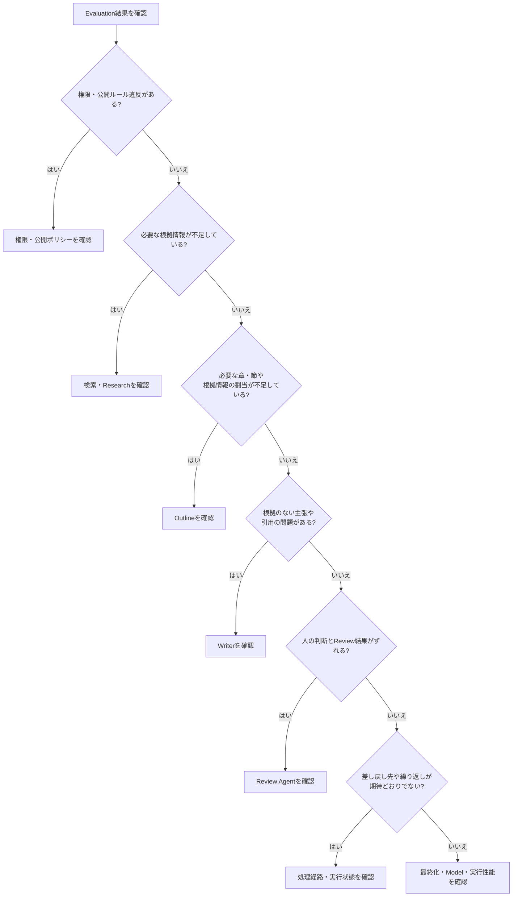
```mermaid
flowchart TD
    S["Evaluation結果を確認"] --> P{"権限・公開ルール違反がある?"}

    P -->|はい| P1["権限・公開ポリシーを確認"]
    P -->|いいえ| R{"必要な根拠情報が不足している?"}

    R -->|はい| R1["検索・Researchを確認"]
    R -->|いいえ| O{"必要な章・節や<br/>根拠情報の割当が不足している?"}

    O -->|はい| O1["Outlineを確認"]
    O -->|いいえ| W{"根拠のない主張や<br/>引用の問題がある?"}

    W -->|はい| W1["Writerを確認"]
    W -->|いいえ| V{"人の判断とReview結果がずれる?"}

    V -->|はい| V1["Review Agentを確認"]
    V -->|いいえ| G{"差し戻し先や繰り返しが<br/>期待どおりでない?"}

    G -->|はい| G1["処理経路・実行状態を確認"]
    G -->|いいえ| F["最終化・Model・実行性能を確認"]
```

この図は「原因を確定する図」ではなく、**次に開くべきTrace／Spanと比較実験を決める図**である。たとえば最終レポートの品質Scoreが低くても、期待根拠情報Recallが先に崩れていれば、Writer Promptより検索・Researchを先に調べる。

| Evaluationで見えた傾向 | 最初に疑う場所 | 次に確認するもの |
| --- | --- | --- |
| 期待根拠情報Recallが低い、根拠情報0件が多い | 検索・Research | 文書の存在、AI Search結果、Researchが生成した検索Query、調査メモ |
| 必須節Coverageが低い | Outline | Research結果に必要情報があるか、必須節、各節への根拠情報割当 |
| 引用網羅率が低い、根拠のない主張が多い | Writer | Outlineで指定した根拠情報、Writer Span、引用ID |
| HumanとReview Actionの一致率が低い | Review Agent | 同じ下書き・根拠情報に対するHuman判断とReview判断 |
| Review判断は正しいのに期待経路と一致しない | 処理経路 | LangGraphの分岐条件、繰り返し回数、停止条件 |
| 差し戻し後に古い内容が残る | 実行状態管理 | 差し戻し前後の実行状態、破棄対象Field |
| 品質は良いがLatency／Tokenが高い | 繰り返し・Model・実行基盤 | Agent Call回数、不要な差し戻し、Agent別Token／Latency |

#### 3.6.2 根拠情報・Researchが悪いときの切り分け

期待根拠情報Recallが低い場合は、最初からResearch Promptを変更しない。**文書がないのか、検索で拾えないのか、Researchが検索Queryを悪くしたのか、取得後の調査メモで落としたのか**を順に分ける。

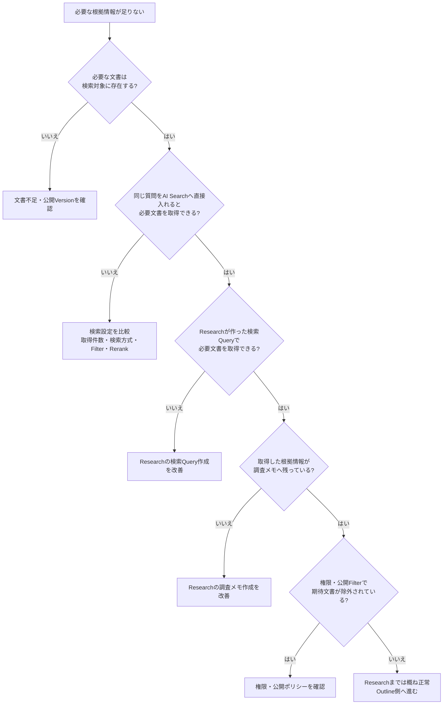
```mermaid
flowchart TD
    S["必要な根拠情報が足りない"] --> D{"必要な文書は<br/>検索対象に存在する?"}

    D -->|いいえ| D1["文書不足・公開Versionを確認"]
    D -->|はい| A{"同じ質問をAI Searchへ直接入れると<br/>必要文書を取得できる?"}

    A -->|いいえ| A1["検索設定を比較<br/>取得件数・検索方式・Filter・Rerank"]
    A -->|はい| Q{"Researchが作った検索Queryで<br/>必要文書を取得できる?"}

    Q -->|いいえ| Q1["Researchの検索Query作成を改善"]
    Q -->|はい| N{"取得した根拠情報が<br/>調査メモへ残っている?"}

    N -->|いいえ| N1["Researchの調査メモ作成を改善"]
    N -->|はい| P{"権限・公開Filterで<br/>期待文書が除外されている?"}

    P -->|はい| P1["権限・公開ポリシーを確認"]
    P -->|いいえ| OK["Researchまでは概ね正常<br/>Outline側へ進む"]
```

AI Search自体の取得件数、HYBRID、Embedding、Rerank等の細かな比較方法はRAG資料を参照する。本資料では、**AI Searchへ直接問い合わせると取れるのにResearch Agent経由では取れない場合**を、マルチエージェント固有のResearch問題として切り分ける。

#### 3.6.3 構成・本文が悪いときの切り分け

Researchが必要な根拠情報を揃えている場合は、次に「構成へ正しく反映できたか」「構成は正しいが本文生成で壊れたか」を分ける。

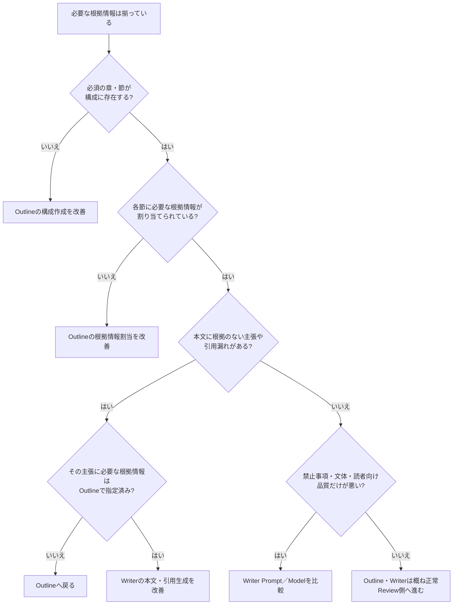
```mermaid
flowchart TD
    S["必要な根拠情報は揃っている"] --> O{"必須の章・節が<br/>構成に存在する?"}

    O -->|いいえ| O1["Outlineの構成作成を改善"]
    O -->|はい| M{"各節に必要な根拠情報が<br/>割り当てられている?"}

    M -->|いいえ| M1["Outlineの根拠情報割当を改善"]
    M -->|はい| C{"本文に根拠のない主張や<br/>引用漏れがある?"}

    C -->|はい| E{"その主張に必要な根拠情報は<br/>Outlineで指定済み?"}

    E -->|いいえ| E1["Outlineへ戻る"]
    E -->|はい| W1["Writerの本文・引用生成を改善"]

    C -->|いいえ| B{"禁止事項・文体・読者向け品質だけが悪い?"}

    B -->|はい| W2["Writer Prompt／Modelを比較"]
    B -->|いいえ| OK["Outline・Writerは概ね正常<br/>Review側へ進む"]
```

ここで重要なのは、**Writerへ渡された根拠情報とOutlineを固定してからWriterを評価すること**である。上流を固定せずにWriterだけの良し悪しを判断すると、ResearchやOutlineの不足をWriter原因として誤分類する。

#### 3.6.4 Review・処理経路・実行状態が悪いときの切り分け

下書きまで正しい場合は、Review Agentの意味判断と、LangGraphがその判断を実際の処理経路へ変換する部分を分ける。

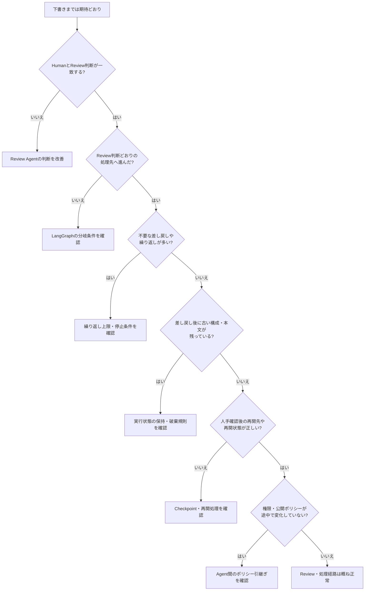
```mermaid
flowchart TD
    S["下書きまでは期待どおり"] --> V{"HumanとReview判断が一致する?"}

    V -->|いいえ| V1["Review Agentの判断を改善"]
    V -->|はい| G{"Review判断どおりの<br/>処理先へ進んだ?"}

    G -->|いいえ| G1["LangGraphの分岐条件を確認"]
    G -->|はい| L{"不要な差し戻しや<br/>繰り返しが多い?"}

    L -->|はい| L1["繰り返し上限・停止条件を確認"]
    L -->|いいえ| I{"差し戻し後に古い構成・本文が<br/>残っている?"}

    I -->|はい| I1["実行状態の保持・破棄規則を確認"]
    I -->|いいえ| H{"人手確認後の再開先や<br/>再開状態が正しい?"}

    H -->|いいえ| H1["Checkpoint・再開処理を確認"]
    H -->|はい| P{"権限・公開ポリシーが<br/>途中で変化していない?"}

    P -->|はい| P1["Agent間のポリシー引継ぎを確認"]
    P -->|いいえ| OK["Review・処理経路は概ね正常"]
```

Review Agentが`rewrite`を返したことと、Graphが実際にWriterへ戻ったことは別の評価対象である。同様に、正しい差し戻し先へ戻っても、古いOutlineやDraftを残していれば実行状態管理の問題になる。

#### 3.6.5 原因分類コードと主な改善先

以下の分類コードは、上の図で疑う場所を絞った後に、レビュー記録や集計で使う実装上の分類値である。初読ではコード名を覚える必要はない。

| 最初に確認できた問題 | 原因分類コード | 主な改善先 |
| --- | --- | --- |
| 必要文書自体がない | `DOCUMENT` | 文書集合整備。詳細はRAG資料参照 |
| 文書はあるがAI Searchで取得できない | `RETRIEVAL` | AI Search／Query／取得件数／Rerank。詳細はRAG資料参照 |
| AI Searchでは取れるがResearchの検索Query・調査メモが悪い | `RESEARCH` | Research Prompt／Node |
| 必須節・根拠情報対応が不適切 | `OUTLINE` | Outline Prompt／Node |
| 根拠情報と構成は正しいが本文・引用が誤る | `WRITER` | Writer Prompt／Node |
| 正しい下書きを誤承認・誤差し戻しする | `REVIEWER` | Review Prompt／Judge |
| Review判断は正しいが別のNodeへ進む | `ROUTING` | LangGraph Edge／ポリシー |
| 不要な往復が止まらない | `LOOP` | 繰り返し上限／停止条件 |
| 差し戻し後に古い成果物を再利用する | `STATE_INVALIDATION` | 実行状態の保持・破棄規則 |
| Checkpoint／人手確認後の再開が不正 | 人手確認 | Checkpointer／判断／再開 |
| 権限・公開範囲がAgent間で失われる | `POLICY_PROPAGATION` | 実行状態契約／Server側ポリシー |
| Agent間の受け渡しSchemaが不整合 | `CONTRACT` | 共通Pydantic Model／Schema Version |
| 入力・Prompt・推論設定を固定しても特定Agentだけ品質不足が再現し、Model変更で一貫して改善する | `MODEL` | Agent別Model比較。Model変更後はPromptも再評価する |

1 Caseを複数Agentの主原因として同時集計しない。上流の破綻が下流へ波及した場合は、最初の破綻を主原因とし、波及先は補足情報として残す。

`MODEL`は検索やPromptより原因特定が難しい。単に「出力が悪かった」だけではModel原因にせず、まず根拠情報、Agentへ渡した実行状態、Prompt Version、推論設定を固定した局所Evaluationを行う。そのうえでModelだけを変更し、複数Caseで再現性のある品質差が確認できた場合に限ってModel依存と判断する。

ModelとPromptには相互作用があるため、Model変更後は同じPromptが最適とは限らない。候補Modelの比較、Prompt再調整、Latency／Token Cost、Graph全体の回帰Evaluationまで必要になるため、**Model変更は局所的なPrompt修正より高Costな改善施策**として扱う。

したがって初期PoCでは「最適Modelを事前に当てる」ことを目標にせず、全Agentへ同じ十分強いBaseline Modelを設定する。ただし実行構成セットは最初からAgent別Model Serviceを保持し、Evaluationで必要性が確認されたAgentだけを別Modelへ差し替えられるようにする。

#### 3.6.6 PoCで最低限確認するマルチエージェントTest

1. Researchが期待根拠情報を取得できる。
2. Outlineが根拠情報IDを節へ正しく割り当てる。
3. WriterがOutlineで指定された根拠情報だけで本文を作る。
4. Reviewerが意図したActionを返す。
5. `research`（再調査へ戻す処理指定）、`reoutline`（構成作成へ戻す処理指定）、`rewrite`（文章作成へ戻す処理指定）がそれぞれ正しいNodeへ戻る。
6. 差し戻し時に不要になった実行状態が破棄される。
7. 繰り返し上限到達時に自動承認せず人手確認へ移る。
8. ポリシー、文書集合スナップショット、実行構成セットが全Nodeで同じ値のまま維持される。
9. Agentごとに割り当てたModel ServiceがRequest途中で変化しない。
10. AgentごとのSpanと処理経路履歴から、上記を後から再現できる。

この10点が成立して初めて、「複数LLMを順番に呼んでいる」状態ではなく、運用可能なマルチエージェントGraphとして評価する。

### 3.7 PoC完了判定と本番化の不足事項

PoC完了時には、KPI、Evaluation Run、代表Trace、失敗原因、未解決リスク、Latency／Token／繰り返し Cost、本番化の不足事項、Go／No-Goを簡易な意思決定記録へ残す。

| 判定軸 | 最低限確認すること |
| --- | --- |
| 機能成立 | Research→Outline→Writer→Review→Finalize／人手確認が期待経路で動く |
| Grounding | 期待根拠情報と引用が追跡でき、根拠情報 0件で自動本文を作らない |
| 処理経路 | `research`（再調査へ戻す処理指定）／`reoutline`（構成作成へ戻す処理指定）／`rewrite`（文章作成へ戻す処理指定）を区別し、繰り返し上限が効く |
| 評価可能性 | Agent別と全体の両方をEvaluationで比較できる |
| 可観測性 | 代表失敗をTraceから原因分類できる |
| Security | PoCで要求したACL／Publication条件を破らない |
| 実行時 | SSE完了、Error、Latency、TokenがPoC許容範囲 |
| 本番化の不足事項 | 4章で追加する統制が列挙され、Ownerが決まる |

本番化の不足事項には、少なくとも文書集合スナップショット管理、実行構成セットのリリース、認証／公開ポリシー、中断・再開可能な人手確認、改善用Dataset／最終評価用Dataset、Production Monitoring、ロールバックを含める。

### 3.8 PoCから本番へ持ち越すもの・置き換えるもの

PoCから本番への変更を、**RAG資料と共通するもの**と**マルチエージェントで追加するもの**に分ける。

| 分類 | PoCから本番への変更 | 本資料での扱い |
| --- | --- | --- |
| RAG共通 | 固定した開発用文書集合 → 文書集合スナップショット | 実装詳細はRAG資料を参照。レポートRequestでは`corpus_snapshot_id`（今回のRequestで使う文書集合の版を特定するID）を固定して使う |
| RAG共通 | 基準評価セット → 改善用／最終評価用Dataset | 分離・育成方法はRAG資料を参照。Agent別Expectationだけ本資料で追加する |
| RAG共通 | 手動Trace確認 → Production Monitoring | 登録・Sampling・AlertはRAG資料を参照。Agent／処理経路／繰り返し Signalを追加する |
| RAG共通 | Go／No-Go → リリース判定＋意思決定記録 | 共通判定へマルチエージェント固有条件を追加する |
| マルチエージェント固有 | 個別Prompt指定 → 実行構成台帳＋本番構成参照 | 複数Agent Prompt、Model、文書集合、Gitを1組で固定する |
| マルチエージェント固有 | 人手確認で終了 → 実行状態を永続保存するCheckpoint＋実行時人手確認記録 | 同じ実行状態から安全に再開する |
| マルチエージェント固有 | 暗黙の差し戻し → 実行状態の保持／破棄規則＋処理経路Version | 古い中間成果物の誤再利用を防ぐ |

#### 3.8.1 RAG資料と共通する管理資産は再実装しない

文書集合スナップショット、改善用Dataset／最終評価用Dataset、Production Monitoring、一般的なリリース判定、Production TraceのDevelopment／Staging還流は、**「社内技術文書検索システム（エージェント型RAG）_完成版.md」**を正とする。

マルチエージェント側では、これらの資産を新しく別方式で作るのではなく、次の参照情報をRequest 実行状態／Traceへ追加する。

- `corpus_snapshot_id`（今回のRequestで使う文書集合の版を特定するID）
- `prompt_bundle_id`（各エージェントで使うPrompt・Model等の固定組合せを特定するID）
- `source_git_commit`（評価したApplicationコードのGit Commit）
- `publication_policy_version`（成果物への掲載可否を決める業務ポリシーの版）
- AgentごとのPrompt Version／Model Service／実モデル経路
- `route_history`（実際に通ったAgent／処理経路の履歴）
- `review_loop_count`（差し戻しを行った回数）

Trace Tagは「そのRequestが何を使ったか」の証跡であり、構成の正本ではない。文書集合スナップショットのMember集合はRAG基盤、実行構成セットの構成は実行構成台帳、現在の本番実行構成セットは本番構成参照を正本とする。

#### 3.8.2 マルチエージェントで追加する管理資産

| 追加資産 | 物理的な実体 | 必要になる理由 |
| --- | --- | --- |
| 実行構成台帳 | `main.llmops.technical_report_prompt_bundles`（実行構成セットを不変な1組として保存する本番管理Table） | Research／Outline／Writer／Review等の不変Prompt Version、Model、文書集合、Gitを評価済みの1組として固定する |
| 本番構成参照 | `technical_report_release_channels`（production等が現在使う実行構成セットを指す管理Table） | `production`（本番で現在利用する参照先）が参照するBundleを1 参照先で切り替え、部分更新を防ぐ |
| 実行状態を永続保存するCheckpoint | LangGraph Checkpointer | 人手確認待ちを跨いで同じ実行状態を復元する |
| 実行時人手確認記録 | 人手確認記録保存先等 | `thread_id`（中断した同一Graph実行を再開するための識別子）、一時的な処理権、判断バージョン、再開状態を管理する |
| 実行状態／Contract Version | Git Commit＋共通Package Version | 古いCheckpointを互換性のない新Graphで再開する事故を防ぐ |

実行構成台帳と本番構成参照を分ける理由は、不変の「評価済み構成」と可変の「現在本番が指す構成」を分離するためである。ロールバック時は構成台帳を書き換えず、本番構成参照を前の実行構成セットへ戻す。

実行状態を永続保存するCheckpointと実行時人手確認記録も役割が異なる。Checkpointは**Graphの実行状態そのもの**を保持し、実行時人手確認記録は**誰が、どの判断で、どこへ再開するか**を管理する。
## 4. 本番導入時に実施するもの

### 4.1 本番導入の目的・完了条件

本番導入では、PoCのGraphを単にDeployするのではなく、**文書集合、Prompt、Model、Code、ポリシー、人手判断を不変IDと監査証跡で関連付け、外部公開・高リスク・長時間処理でも判定不能時に安全側へ倒せること**を完了条件とする。Production Monitoringは本番開始後に考える機能ではなく、この段階で設定しStagingで事前通し試験する。

| 完了領域 | 本番開始前に満たす状態 |
| --- | --- |
| Reproducibility | `corpus_snapshot_id`（今回のRequestで使う文書集合の版を特定するID）、`prompt_bundle_id`（各エージェントで使うPrompt・Model等の固定組合せを特定するID）、Model、Git、ポリシーVersionから実行条件を再現できる |
| Security／Publication | User入力ではなくServer側Identity／ポリシーで根拠情報 Filterを強制する |
| 人手確認 | 自動承認できないRequestを永続停止し、二重処理せず再開できる |
| Quality | 改善用Datasetと最終評価用Datasetを分離し、未使用Caseでリリース可否を判定できる |
| Observability | Agent別Trace、処理経路、繰り返し、Token、Latency、人手確認を本番開始時点から取得する |
| ロールバック | Codeだけでなく実行構成セット、モデル経路、文書集合スナップショットを前リリースへ戻せる |
| Operations | 事前通し試験、Alert、運用手順書、責任者、意思決定記録の入口が用意される |

### 4.2 本番導入時のデータモデル全体像

本番導入では、RAG資料ですでに定義された文書集合スナップショット、AI Search、改善用Dataset／最終評価用Dataset、Production Monitoringを共通基盤として利用し、その上にマルチエージェント固有の実行構成セット、実行状態、人手確認管理を追加する。

#### 4.2.1 まず理解する構成

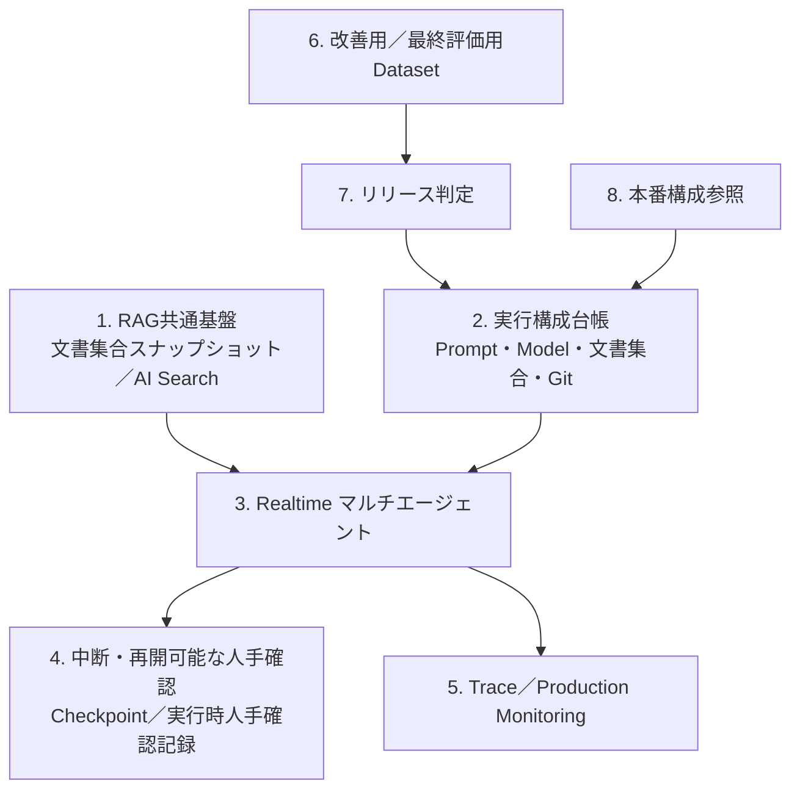
```mermaid
flowchart TD
    RAG["1. RAG共通基盤<br/>文書集合スナップショット／AI Search"] --> G["3. Realtime マルチエージェント"]
    PB["2. 実行構成台帳<br/>Prompt・Model・文書集合・Git"] --> G
    G --> 人手確認["4. 中断・再開可能な人手確認<br/>Checkpoint／実行時人手確認記録"]
    G --> TRACE["5. Trace／Production Monitoring"]
    HOLD["6. 改善用／最終評価用Dataset"] --> GATE["7. リリース判定"] --> PB
    REF["8. 本番構成参照"] --> PB
```

初読では、**RAG基盤そのものをこの資料で再構築するわけではない**ことを押さえる。マルチエージェント側の追加点は、実行構成セットの一括固定、実行状態の永続化、処理経路と繰り返しの評価である。

#### 4.2.2 本番導入時のTable／Dataset／Resource一覧

**RAG資料と共通して利用するもの**

| 分類 | 物理名／実体 | 本資料からの使い方 |
| --- | --- | --- |
| 文書集合 | `main.llmops.corpus_snapshot_manifest`（文書集合スナップショットを管理するRAG基盤側Table）／`registry`（文書集合スナップショットのIDと構成を参照する台帳） | Request開始時に検証済み`corpus_snapshot_id`（今回のRequestで使う文書集合の版を特定するID）を受け取り実行状態へ固定する |
| 検索 | AI Search Index／Index リリース | Research Agentだけがポリシー Filter付きで利用する |
| 評価 | `main.llmops.technical_report_train`（改善候補の探索に使う評価Dataset）／`holdout`（最終リリース判定に使う未使用評価Dataset） | 共通の改善用Dataset／最終評価用Datasetの規則を利用し、Agent別Expectationを追加する |
| Monitoring | MLflow Production Monitoring／Registered Scorer | 共通SignalにAgent、処理経路、繰り返し、人手確認を追加する |

**マルチエージェントで追加するもの**

| 分類 | 物理名／実体 | 主な役割 |
| --- | --- | --- |
| リリース | `main.llmops.technical_report_prompt_bundles`（実行構成セットを不変な1組として保存する本番管理Table） | 複数Prompt、Model Service、文書集合スナップショット、Git Commitを1 リリースへ固定 |
| リリース | `technical_report_release_channels`（production等が現在使う実行構成セットを指す管理Table） | `production`（本番で現在利用する参照先）等の現在の参照先を一括に切替 |
| 実行時 | 実行状態を永続保存するCheckpoint保存先 | `thread_id`（中断した同一Graph実行を再開するための識別子）単位でGraphの実行状態を永続化 |
| 実行時 | 実行時人手確認記録保存先 | 一時的な処理権、判断バージョン、再開状態を保持。物理製品はPlatform標準に従う |

#### 4.2.3 本番導入時の管理系ER図

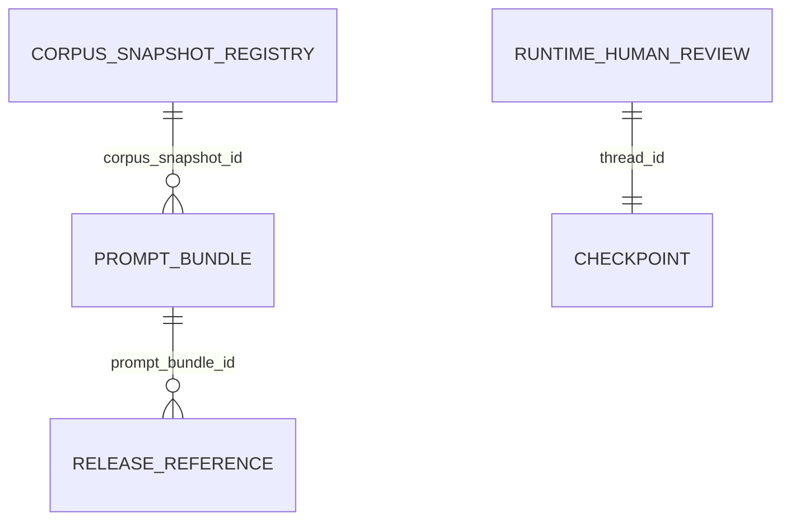
```mermaid
erDiagram
    CORPUS_SNAPSHOT_REGISTRY ||--o{ PROMPT_BUNDLE : corpus_snapshot_id
    PROMPT_BUNDLE ||--o{ RELEASE_REFERENCE : prompt_bundle_id
    RUNTIME_HUMAN_REVIEW ||--|| CHECKPOINT : thread_id
```

`CORPUS_SNAPSHOT_REGISTRY`（文書集合スナップショット台帳の参照先を指定する設定値）はRAG基盤側の正本を参照するだけで、本資料で別Tableを作らない。実行時人手確認記録／Checkpointの物理Schemaは組織のPlatform標準へ依存するため、ここでは論理関係だけを示す。品質改善用の`technical_report_review_cases`（完了済みTraceのレビュー結果と改善先を管理するTable）は完了済みTraceを扱う別目的のRecordであり、この実行時 ERへ混ぜない。

#### 4.2.4 本番導入時のデータフロー図

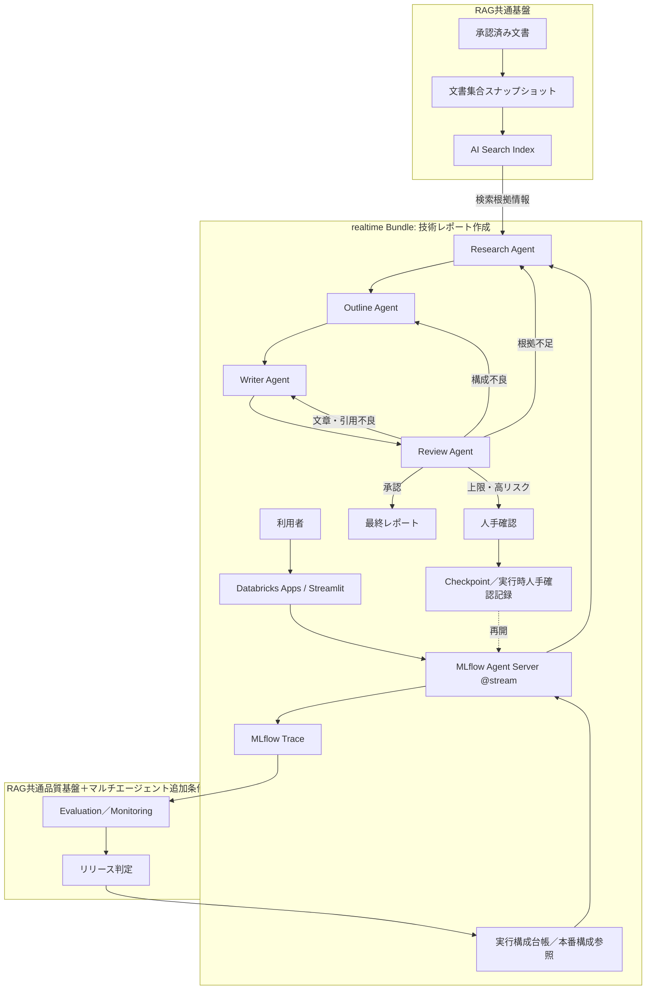
```mermaid
flowchart TB
    subgraph Knowledge["RAG共通基盤"]
        direction TB
        V["承認済み文書"] --> SNAP["文書集合スナップショット"]
        SNAP --> I["AI Search Index"]
    end

    subgraph Realtime["realtime Bundle: 技術レポート作成"]
        direction TB
        U["利用者"] --> UI["Databricks Apps / Streamlit"]
        UI --> AS["MLflow Agent Server @stream"]
        PB["実行構成台帳／本番構成参照"] --> AS
        AS --> RA["Research Agent"]
        I -->|検索根拠情報| RA
        RA --> OA["Outline Agent"]
        OA --> WA["Writer Agent"]
        WA --> RV["Review Agent"]
        RV -->|承認| FR["最終レポート"]
        RV -->|根拠不足| RA
        RV -->|構成不良| OA
        RV -->|文章・引用不良| WA
        RV -->|上限・高リスク| HR["人手確認"]
        HR --> CP["Checkpoint／実行時人手確認記録"]
        CP -.->|再開| AS
        AS --> T["MLflow Trace"]
    end

    subgraph Quality["RAG共通品質基盤＋マルチエージェント追加条件"]
        direction TB
        T --> EV["Evaluation／Monitoring"]
        EV --> G["リリース判定"]
        G --> PB
    end
```

文書集合スナップショットの発行、AI Search公開、改善用Dataset／最終評価用Dataset、Production Monitoringの共通実装はRAG資料を参照する。本資料では、Request開始時にその不変IDを固定し、複数Agentの処理途中で再解決しないことを追加要件とする。
### 4.3 本番開始前に構築する運用・統制機能

PoCで動いたGraphへ本番機能を一度に足さない。まず変更点を理解し、次に構築順序を確認し、その後でProject構成と個別Sourceへ進む。RAG資料と共通する基盤は参照へ寄せ、ここではマルチエージェント側で追加する実装を中心に扱う。

#### 4.3の読み方（章内ナビゲーション）

4.3は本資料で最も実装量が多い節である。初読ではコードを逐語的に読むのではなく、**「PoCとの差分 → 構築順序 → Project境界 → 個別Source」**の順で全体像を掴み、必要なSourceへ降りる。

| 読む順序 | 範囲 | ここで理解すること | 初読時の読み方 |
| --- | --- | --- | --- |
| 1 | 4.3.1 | PoCから本番へ何を追加・変更するか | 差分表を読む |
| 2 | 4.3.2 | 何をどの順序で構築するか | 依存関係だけ確認する |
| 3 | 4.3.3 | Bundle、Workspace Resource、MLflow、Model Serviceの境界 | Project構成を理解する |
| 4 | 4.3.4 | 実行構成セット、人手確認、処理経路評価等の実装 | 冒頭の実装ブロック表を読み、必要な節だけ詳細へ進む |

#### 4.3.1 PoCコードからの主な変更点

| PoC | 本番基準構成 | 変更理由 |
| --- | --- | --- |
| 固定した開発用文書集合ID | RAG基盤の文書集合スナップショット | 全文書Version集合を再現する |
| 個別Prompt Version指定 | 実行構成台帳 | 複数Agent Promptを一括にリリースする |
| 固定Tester | 認証済みUser／Group＋Server側ポリシー | Client入力による権限昇格を防ぐ |
| 人手確認で終了 | 実行状態を永続保存するCheckpoint＋実行時人手確認記録＋再開 | 長時間承認待ちから安全に再開する |
| 基準評価セット | 改善用／最終評価用Dataset | 探索と最終判定を分離する |
| 手動Trace確認 | Production Monitoring＋Alert | 本番開始直後から品質Driftを観測する |

ここでは「PoCを捨てて別システムを作る」のではない。**PoCの契約、Agent Node、Scorer、SSEを残し、再現性・権限・承認・監視を追加する**。

#### 4.3.2 本番版の構築順序

初読では、次の順序だけを把握する。

```text
1. Project／Bundle境界を分ける
        ↓
2. Workspace／MLflowの本番Resourceを準備する
        ↓
3. RAG基盤の文書集合スナップショットを参照する
        ↓
4. 実行構成セットでPrompt・Model・文書集合・Gitを固定する
        ↓
5. Identity／成果物公開ポリシーをServer側で解決する
        ↓
6. 中断・再開可能な人手確認で停止・再開を永続化する
        ↓
7. 改善用Dataset／最終評価用Datasetとリリース判定を用意する
        ↓
8. Production Monitoringを本番前に登録する
        ↓
9. Stagingで事前通し試験してからProductionへリリースする
```

詳細コードはこの順番で読めばよい。最初から4.3.4の全Sourceを読む必要はない。

#### 4.3.3 本番Project構成

本番基準構成は`knowledge`（文書取込・検索基盤を配備するDAB Bundle名）、`quality`（評価・Prompt管理・リリース判定を配備するDAB Bundle名）、`realtime`（レポート生成Applicationを配備するDAB Bundle名）を独立Deployし、共通の型だけを`technical-report-common`（Agent間で共有するデータ型・契約をまとめる共通Package）で共有する。PoCで使ったApplication Codeを捨てず、文書集合／リリース／人手確認／MonitoringのSourceを追加する。

```text
technical-report-agent/
├── packages/technical-report-common/
│   └── src/technical_report_common/report_contracts.py
├── bundles/knowledge/
│   ├── src/document_pipeline.py
│   ├── src/publish_corpus_snapshot.py
│   └── src/create_search_index.py
├── bundles/quality/
│   ├── prompts/
│   │   ├── research_plan.md
│   │   ├── research_notes.md
│   │   ├── outline.md
│   │   ├── writer.md
│   │   └── review.md
│   ├── src/register_prompts.py
│   ├── src/seed_evaluation_dataset.py
│   ├── src/evaluate_report.py
│   ├── src/release_gate.py
│   ├── src/publish_prompt_bundle.py
│   └── src/register_monitoring.py
└── bundles/realtime/
    ├── app/auth_context.py
    ├── app/evidence_search.py
    ├── app/prompt_bundle.py
    ├── app/report_graph.py
    ├── app/agent.py
    ├── app/start_server.py
    └── app/streamlit_app.py
```

| Bundle／Package | 本番基準構成での責務 |
| --- | --- |
| `technical-report-common`（Agent間で共有するデータ型・契約をまとめる共通Package） | 根拠情報、Outline、Review、実行状態、Resultの共通契約 |
| `knowledge`（文書取込・検索基盤を配備するDAB Bundle名） | 文書解析、文書集合スナップショット、AI Search Index |
| `quality`（評価・Prompt管理・リリース判定を配備するDAB Bundle名） | Prompt、改善用Dataset／最終評価用Dataset、リリース判定、Monitoring |
| `realtime`（レポート生成Applicationを配備するDAB Bundle名） | 認証コンテキスト、LangGraph、人手確認、Agent Server、Streamlit |

Prompt Optimization、Judge Alignment、定期レビュー待ちキュー、カナリアは本番開始条件にはせず、5章の高度化として追加する。

Prompt本文はPoCと同様に`bundles/quality/prompts/*.md`（AgentごとのPrompt Markdownファイル群）をGit上の編集元とする。本番でもPythonへPrompt本文を戻さず、Markdown → Prompt Registryの新Version登録 → 評価 → 実行構成への採用、という順序を維持する。

##### 4.3.3.1 本番Workspace・MLflow初期セットアップ

本番では、Realtime実行、オフラインEvaluation、Human Labelingを同じExperimentへ混在させない。目的ごとに入口を分けると、Trace検索、権限、Retention、Monitoring対象を説明しやすい。

| Resource | 主な用途 |
| --- | --- |
| Realtime Experiment | Production／限定試行の実Request Trace |
| Evaluation Experiment | 改善用Dataset／最終評価用Dataset、Candidate比較、リリース判定 |
| Labeling／Review | 専門家Assessment、Expectation、原因診断 |
| Prompt Registry | Research／Outline／Writer／Review Prompt Version |
| EvaluationDataset | `technical_report_train`（改善候補探索に使う評価Dataset名）／`technical_report_holdout`（最終リリース判定に使う未使用評価Dataset名） |

初期セットアップでは、Resource作成だけでなく、Service Principal／実行IdentityからTrace、Prompt、Dataset、Model Serviceへ必要最小限のアクセスができることを疎通確認する。

##### 4.3.3.2 AI Gateway／Model経路の事前設定

複数AgentがModelを呼ぶため、Model名を各Sourceへ直書きせず、リリース構成から解決できるようにする。Graph内部では`model_services`（Research／Outline／Writer／Reviewごとの生成AIモデル参照先を保持する設定）から、そのNodeに割り当てたModel Serviceを取得する。GatewayやServing側でUsage、Rate Limit、Fallback等を管理する場合も、Agentコードへ具体的なModel名を埋め込まない。

PoC開始時は4 Agentすべてへ同じModel Serviceを設定してよい。ただし、後から特定Agentだけ別Modelへ差し替えるEvaluationを行えるよう、PoCからAgent別設定構造を維持する。本番では少なくとも次をTraceで識別できるようにする。

- どのAgentが呼んだか
- どのModel Service／Variantを使ったか
- Token、Latency、Error
- 実行構成セットIDとGit Commit

#### 4.3.4 本番ソースファイル

4.3.4は実装リファレンスである。個別Sourceを読む前に、次の実装ブロックで**RAG共通部分とマルチエージェント固有部分**を分けて見る。

| 実装ブロック | 範囲 | 主目的 | 本資料での扱い |
| --- | --- | --- | --- |
| RAG共通基盤の参照 | 4.3.4.1、4.3.4.5 | 文書集合スナップショット、改善用／最終評価用Dataset | 実装詳細はRAG資料を参照 |
| 実行構成セット／リリース | 4.3.4.2、4.3.4.7 | 複数Prompt、Model、文書集合、GitをRequest単位で固定 | **マルチエージェント固有。重点的に読む** |
| Identity／公開ポリシー | 4.3.4.3 | 閲覧権限と成果物掲載可否を分離 | 共通ACLにレポート公開ポリシーを追加 |
| 中断・再開可能な人手確認 | 4.3.4.4 | 停止、Checkpoint、判断、再開 | **マルチエージェント固有。重点的に読む** |
| リリース判定／Monitoring | 4.3.4.6、4.3.4.8 | 共通品質GateへAgent／処理経路／繰り返し条件を追加 | 差分だけ説明 |
| Version追跡 | 4.3.4.9 | Graph／実行状態の契約をGitとTraceへ関連付け | 差分だけ説明 |
| 長文・統制 | 4.3.4.10〜4.3.4.11 | コンテキスト上限、節単位実行、金融向け統制 | マルチエージェント特有の運用論点 |

ここから個別Sourceへ進む。共通RAG実装を読み直す必要がある場合は、**「社内技術文書検索システム（エージェント型RAG）_完成版.md」**へ戻る。
##### 4.3.4.1 RAG共通の文書集合スナップショットを利用する

文書集合スナップショットの発行、構成台帳／Registry、AI Searchへの同期、ロールバック方法は、**「社内技術文書検索システム（エージェント型RAG）_完成版.md」**の実装をそのまま利用する。本資料では同じ`publish_corpus_snapshot.py`（文書集合スナップショットを発行する処理ファイル）を再掲しない。

マルチエージェント側で追加する契約は次の3点だけである。

1. Request開始時に、検証済み`corpus_snapshot_id`（今回のRequestで使う文書集合の版を特定するID）を実行構成台帳から取得する。
2. `ReportState.corpus_snapshot_id`（実行状態に固定した文書集合スナップショットIDのField）へ固定し、Researchを含む後続Nodeで現在の参照先を再解決しない。
3. Traceへ`corpus_snapshot_id`（今回のRequestで使う文書集合の版を特定するID）を残し、根拠情報の`document_version`（根拠文書の版を識別する値）と同じ文書集合スナップショットに属することを検証する。

```text
RAG基盤
  文書集合スナップショットを発行
        ↓ corpus_snapshot_id
実行構成台帳
        ↓ Request開始時に固定
Report実行状態
        ↓
Research → Outline → Writer → Review
```

これにより、長時間レポート生成中に文書が更新されても、Request途中で検索対象Version集合が変わらない。
##### 4.3.4.2 実行構成台帳を実行時で解決する

この実装では、`PROMPT_BUNDLE_ID`（利用する実行構成セットIDを指定する環境変数）からDelta表の構成台帳を1回取得し、5つの不変Prompt Version URI、AgentごとのModel Service、文書集合スナップショット、Git Commitを解決する。構成台帳は`quality`（評価・Prompt管理・リリース判定を配備するDAB Bundle名） Bundleが発行し、`realtime`（レポート生成Applicationを配備するDAB Bundle名） Bundleは読み取り専用で利用する。1 Requestの実行状態へ解決結果をコピーするため、処理中のリリース切替やAlias変更でPromptが混在しない。

`main.llmops.technical_report_prompt_bundles`（実行構成セットを不変な1組として保存する本番管理Table）は次のSchemaを持つ。

| 列 | 内容 |
| --- | --- |
| `prompt_bundle_id`（各エージェントで使うPrompt・Model等の固定組合せを特定するID） | 不変実行構成セットID |
| `research_plan_uri`（Research計画用Promptの不変Version URI）〜`review_uri`（Review用Promptの不変Version URI） | `prompts:/name/version`（MLflow Prompt Registryの不変Prompt Version URI形式）形式の不変URI |
| `research_model_service`（Research Agentが呼ぶ生成AIモデルの参照先）〜`review_model_service`（Review Agentが呼ぶ生成AIモデルの参照先） | AgentごとのFoundation Model APIs／Serving Endpoint名。初期構成では同じ値でもよい |
| `corpus_snapshot_id`（今回のRequestで使う文書集合の版を特定するID） | 同Bundleで検証済みの全文書Version集合 |
| `source_git_commit`（評価したApplicationコードのGit Commit） | 評価済みApplication Commit |
| `status`（管理Recordの現在状態） | `candidate`（評価中の候補状態）、`production`（本番で現在利用する参照先）、`retired`（利用終了済みの状態） |
| `created_at`（管理Recordを作成した時刻）、`approved_at`（本番利用を承認した時刻） | 監査時刻 |

`bundles/realtime/app/prompt_bundle.py`（実行構成セットを読み込むファイル）

```python
from __future__ import annotations

import os
import re
from functools import lru_cache

from databricks.sdk import WorkspaceClient
from pydantic import BaseModel, ConfigDict


BUNDLE_TABLE = "main.llmops.technical_report_prompt_bundles"


class PromptBundle(BaseModel):
    # 1 Requestで固定するPrompt・Model・文書集合・Codeの組を検証する。
    model_config = ConfigDict(extra="forbid", frozen=True)

    prompt_bundle_id: str
    prompt_uris: dict[str, str]
    model_services: dict[str, str]
    corpus_snapshot_id: str
    source_git_commit: str


# Python標準ライブラリの`@lru_cache(maxsize=32)`は、同じ`prompt_bundle_id`で取得した実行構成セットを
# 最大32種類までメモリへ保持して再利用する。同じ構成を使うRequestごとにSQL Warehouseへ再問い合わせしないために使う。
@lru_cache(maxsize=32)
def load_prompt_bundle(prompt_bundle_id: str) -> PromptBundle:
    # SQL InjectionとAlias参照を防ぎ、完全一致する不変な構成台帳だけを取得する。
    if not re.fullmatch(r"[A-Za-z0-9._-]{1,128}", prompt_bundle_id):
        raise ValueError("Invalid prompt_bundle_id")
    statement = f"""
        SELECT research_plan_uri, research_notes_uri, outline_uri,
               writer_uri, review_uri,
               research_model_service, outline_model_service,
               writer_model_service, review_model_service,
               corpus_snapshot_id, source_git_commit
        FROM {BUNDLE_TABLE}
        WHERE prompt_bundle_id = '{prompt_bundle_id}'
    """
    response = WorkspaceClient().statement_execution.execute_statement(
        warehouse_id=os.environ["SQL_WAREHOUSE_ID"],
        statement=statement,
        wait_timeout="10s",
    )
    rows = response.result.data_array if response.result else []
    if len(rows) != 1:
        raise RuntimeError(f"Runtime configuration must resolve to one row: {prompt_bundle_id}")
    row = rows[0]
    prompt_uris = dict(
        zip(
            ["research_plan", "research_notes", "outline", "writer", "review"],
            row[:5],
            strict=True,
        )
    )
    if any("@" in uri or not re.fullmatch(r"prompts:/[^/]+/[0-9]+", uri) for uri in prompt_uris.values()):
        raise RuntimeError("Runtime configuration must contain immutable version URIs")
    return PromptBundle(
        prompt_bundle_id=prompt_bundle_id,
        prompt_uris=prompt_uris,
        model_services={
            "research": row[5],
            "outline": row[6],
            "writer": row[7],
            "review": row[8],
        },
        corpus_snapshot_id=row[9],
        source_git_commit=row[10],
    )
```

Production切替は、品質管理ジョブが最終評価用Datasetとリリース判定を通過した候補構成台帳を新規Insertし、本番構成参照の`production`（本番で現在利用する参照先） 参照先を1 Transactionで新しい実行構成セットIDへ切り替える。Databricks Appへは解決済みの`PROMPT_BUNDLE_ID`（利用する実行構成セットIDを指定する環境変数）を設定するか、Request開始時に本番構成参照を解決する。ロールバックは前の実行構成セット IDへ参照先を戻すだけであり、構成台帳の行を上書きしない。オンライン比較実験では`request_id`（1回のレポート作成Requestを識別するID）または`session_id`（同一利用Sessionを識別するID）の安定Hashで実行構成セットIDを一度選び、実行状態とTraceへ固定する。`@production`（本番利用Promptを指すAlias） AliasはManifest作成時の候補選択にだけ利用し、実行時では利用しない。

Databricks SQL Statement Executionは標準機能だが、一括な本番構成参照更新、承認Workflow、Manifest不変性の制約は本資料で設計する運用実装である。

##### 4.3.4.3 認証済み利用者とServer側公開ポリシーを適用する

PoCで固定値としていた`reader_entitlements`（利用者が閲覧できる権限一覧）、`publication_scope`（成果物を内部向け／外部向けのどちらとして扱うか）、`data_classification_ceiling`（利用できる機密区分の上限）は、本番ではDatabricks Appsの認証コンテキストとServer側業務ポリシーから解決する。Clientが指定するAudienceは文体指定に限定し、権限や掲載範囲の決定に使わない。閲覧可能でも外部掲載不可の根拠情報は、外部向けRequestではLLM入力へ入れない。

##### 4.3.4.4 再開可能な中断・再開可能な人手確認を構築する

上の`human_review_node()`（人手確認へ送るための最小Node関数）は最小構成である。`review_case_id`（人手確認または品質レビューの対象を識別するID）を付けた未承認成果物を返し、自動公開せず、Graphを終了する。Agentは`review_case_id`（人手確認または品質レビューの対象を識別するID）をTrace Tagへ残し、品質管理ジョブが同じIDでレビュー待ちキューへ冪等登録する。人間の判断後に同じGraphを再開する機能ではない。

金融機関向け本番構成では、LangGraphのCheckpointer、`thread_id`（中断した同一Graph実行を再開するための識別子）、`interrupt()`（Graphを人手判断待ちで中断するLangGraph関数）、`Command(resume=...)`（LangGraphへ人手判断を渡して中断地点から再開する命令）を使い、Applicationの実行状態を永続化する。MLflow Agent ServerはTraceとResponses APIを提供するが、Application固有のLangGraph Checkpoint保存先、一時的な処理権、再開冪等性を自動提供するものとして扱わない。これらは`realtime`（レポート生成Applicationを配備するDAB Bundle名） Bundleと運用DBが責任を持つ。

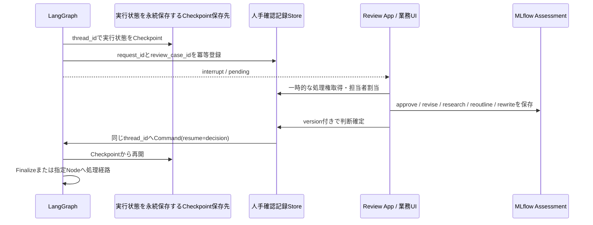
```mermaid
sequenceDiagram
    participant G as LangGraph
    participant C as 実行状態を永続保存するCheckpoint保存先
    participant Q as 人手確認記録Store
    participant U as Review App / 業務UI
    participant M as MLflow Assessment

    G->>C: thread_idで実行状態をCheckpoint
    G->>Q: request_idとreview_case_idを冪等登録
    G-->>U: interrupt / pending
    U->>Q: 一時的な処理権取得・担当者割当
    U->>M: approve / revise / research / reoutline / rewriteを保存
    U->>Q: version付きで判断確定
    Q->>G: 同じthread_idへCommand(resume=decision)
    G->>C: Checkpointから再開
    G->>G: Finalizeまたは指定Nodeへ処理経路
```

| 項目 | 本番実装の責務 |
| --- | --- |
| 関連付け | `request_id`（1回のレポート作成Requestを識別するID）、`review_case_id`（人手確認または品質レビューの対象を識別するID）、LangGraph `thread_id`（中断した同一Graph実行を再開するための識別子）、Trace IDを実行時人手確認記録へ保存する。 |
| 二重処理 | `review_case_id`（人手確認または品質レビューの対象を識別するID）と判断バージョンに一意制約を設け、一時的な処理権所有者だけが状態を遷移させる。 |
| 冪等性 | 実行時人手確認記録の登録、外部通知、公開処理へIdempotency Keyを渡し、`interrupt()`（Graphを人手判断待ちで中断するLangGraph関数）前の副作用を再実行可能にする。 |
| Timeout | SLA超過を監視し、担当者再割当、上位承認者Escalation、期限切れを記録する。 |
| 再開 | `approve`（承認して最終化する処理指定）はFinalizer、`research`（再調査へ戻す処理指定）はResearch、`reoutline`（構成作成へ戻す処理指定）は古いOutline・下書きを破棄してOutline、`rewrite`（文章作成へ戻す処理指定）はWriterへ戻す。 |
| 監査 | 人間の判断、理由、修正内容をMLflow Assessmentと業務Review表の両方へ保存する。 |

概念的には、同じ`thread_id`（中断した同一Graph実行を再開するための識別子）のConfigを使い、`Command(resume=decision)`（人手判断decisionを渡して中断地点から再開する命令）をGraphへ渡してCheckpointから再開する。実際のCheckpointer製品、暗号化、DR、保持期間は金融機関のPlatform標準に従うため、この最小サンプルへ特定実装を埋め込まない。

##### 4.3.4.5 改善用Datasetと最終評価用DatasetへマルチエージェントExpectationを追加する

改善用Dataset／最終評価用Datasetの分離方針、EvaluationDatasetの育成方法、Production TraceからのCase追加は、**「社内技術文書検索システム（エージェント型RAG）_完成版.md」**を参照する。本資料では分割ロジックを再実装しない。

追加するのは、最終レポートだけではなく**途中Agentと処理経路の期待値**である。

| 追加Expectation | 用途 |
| --- | --- |
| `expected_document_ids`（評価Caseで取得を期待する文書ID一覧） | Researchの根拠情報取得を評価 |
| `expected_sections`（評価Caseで必要とする章・節一覧） | Outlineの必須節を評価 |
| `expected_section_source_ids`（各節で利用を期待する根拠情報ID一覧） | Outlineの根拠情報割当を評価 |
| `prohibited_claims`（出力してはいけない主張の一覧） | WriterのGroundingを評価 |
| `expected_review_action`（評価Caseで期待するReview後の処理先） | Reviewer判断を評価 |
| `expected_routes`（評価Caseで期待する処理経路） | Graphの差し戻し先を評価 |
| `expected_human_review`（評価Caseで人手確認を期待するかどうか） | 自動停止条件を評価 |

同じTopicの言い換えや同じ失敗原因グループを改善用Datasetと最終評価用Datasetへ跨がせない点もRAG資料と同じである。
##### 4.3.4.6 共通のリリース判定へマルチエージェント固有条件を追加する

ACL、Groundedness、引用、Latency、Cost等の共通判定はRAG資料のリリース判定を利用する。本システムでは、そこへ次の条件を追加する。

| 追加判定 | Block条件の例 |
| --- | --- |
| Research | 期待根拠情報Recallが現行より悪化 |
| Outline | 必須節欠落、根拠情報未割当節が発生 |
| Writer | 根拠情報外Claim、未知の引用IDが発生 |
| Reviewer | 重大Caseを`approve`（承認して最終化する処理指定）、正常Caseを恒常的に差し戻す |
| 処理経路 | 期待Actionと実Edgeが不一致 |
| 繰り返し | 上限超過、同じ実行状態で同じNodeを反復 |
| 実行状態 | `reoutline`（構成作成へ戻す処理指定）後に旧下書きを再利用する等の無効実行状態利用 |
| 人手確認 | 確認待ちケースの二重判断、誤`thread_id`（中断した同一Graph実行を再開するための識別子）再開 |
| 実行構成セット | 1 Request内でPrompt／Model／文書集合Versionが変化 |

品質管理ジョブは共通判定とこれらのマルチエージェントSignalをまとめて**判定材料**を作る。最終的な採用／却下／リスク受容は人が決定し、意思決定記録へ残す。
##### 4.3.4.7 実行構成台帳をリリースする

マルチエージェントでは5つのPromptとAgentごとのModelが組み合わさるため、個別AliasやModel Service参照だけでは「本番でどの組合せだったか」を表しにくい。リリース時に各Promptの不変Version URI、Research／Outline／Writer／ReviewそれぞれのModel Service、文書集合スナップショット、Git Commitを`main.llmops.technical_report_prompt_bundles`（実行構成セットを不変な1組として保存する本番管理Table）へ1行の構成台帳Recordとして固定する。

```json
{
  "prompt_bundle_id": "report-bundle-2026-08-11-01",
  "research_plan_uri": "prompts:/main.llmops.report_research_plan/3",
  "research_notes_uri": "prompts:/main.llmops.report_research_notes/2",
  "outline_uri": "prompts:/main.llmops.report_outline/4",
  "writer_uri": "prompts:/main.llmops.report_writer/7",
  "review_uri": "prompts:/main.llmops.report_review/5",
  "research_model_service": "system.ai.claude-sonnet-4-5",
  "outline_model_service": "system.ai.claude-sonnet-4-5",
  "writer_model_service": "system.ai.claude-sonnet-4-5",
  "review_model_service": "system.ai.claude-sonnet-4-5",
  "corpus_snapshot_id": "corpus-2026-08-01",
  "source_git_commit": "<commit-sha>",
  "status": "candidate"
}
```

品質管理ジョブはAliasを解決して上記の不変URIへ変換し、最終評価用Datasetの合格後に構成台帳をInsertする。`technical_report_release_channels`（production等が現在使う実行構成セットを指す管理Table）表の`production`（本番で現在利用する参照先） 参照先だけをDelta Transactionで切り替えるため、5つのPromptが部分更新されない。ApplicationはRequest開始時に`PROMPT_BUNDLE_ID`（利用する実行構成セットIDを指定する環境変数）を解決し、実行状態へ固定する。ロールバックは前構成台帳IDを参照先またはApp設定へ戻す。オンライン比較実験では安定Hashで選んだ構成台帳IDをRequest／Session中固定し、Traceへ`report.prompt_bundle_id`（Trace上に記録する実行構成セットID）を残す。

##### 4.3.4.8 Production Monitoringへマルチエージェント固有Signalを追加する

Production Monitoringの登録方法、Sampling、Alert、Judge運用の共通設計は、**「社内技術文書検索システム（エージェント型RAG）_完成版.md」**を参照する。

本システムでは、通常のRAG Signalに次を追加する。

| 分類 | 原則 | マルチエージェント固有Signal |
| --- | --- | --- |
| Agent実行 | 全件 | Agent名、Call回数、Agent別Latency、Agent別Token |
| 処理経路制御 | 全件 | Review Action、実際の遷移先、処理経路履歴 |
| 繰り返し | 全件 | `research`（再調査へ戻す処理指定）／`reoutline`（構成作成へ戻す処理指定）／`rewrite`（文章作成へ戻す処理指定）回数、上限到達 |
| 実行状態 | 全件 | 実行状態 Version、破棄イベント、Checkpoint ID |
| 人手確認 | 全件 | 確認待ち時間、再開結果、判断バージョン |
| 実行構成セット | 全件 | Request開始時の実行構成セット／文書集合／Git Commit |
| 協調品質 | Sample | 根拠情報→Outline→下書き→Reviewの引継ぎが成立しているか |

Latency、Token、繰り返し回数、処理経路はLLM Judgeで判定せずTrace／Spanから集計する。LLM Judgeを使う場合も、単なる最終文章品質ではなく、根拠情報がOutlineと下書きへ正しく引き継がれたか等、意味理解が必要な協調品質へ限定する。


##### 4.3.4.9 GitコミットベースでVersionを追跡する

| 対象 | 正本 | Trace・実行との関連付け |
| --- | --- | --- |
| `knowledge`（文書取込・検索基盤を配備するDAB Bundle名） Bundle | Git | Pipeline Run、文書集合スナップショット、Index設定 |
| `quality`（評価・Prompt管理・リリース判定を配備するDAB Bundle名） Bundle | Git | Evaluation Run、Job Run、Scorer、Split Rule |
| `realtime`（レポート生成Applicationを配備するDAB Bundle名） Bundle | Git | Git-based LoggedModel、Trace |
| 共通Package | Git | Wheel Version、Git Commit |
| Prompt | Prompt Registry | 不変Prompt Version、構成台帳ID、Trace |
| Agent経路 | Git | LangGraph Node／Edge、繰り返し上限、Trace |
| 基盤モデル | Model Service／Serving Endpoint | Model Service名、実Variant、LLM Span |
| 自社Custom Model | Unity Catalog Model Registry | Model名、Version、Serving Endpoint |
| Judge | MLflow Scorer／Git | Judge ID、Version、Assessment、Git Commit |

Application CodeをModel Registryへ登録してVersion管理しない。Model Registryは自社Custom Modelの成果物とVersionを管理する場所であり、Agent CodeはGit、PromptはPrompt Registry、Databricks管理基盤モデルはModel Serviceで管理する。

##### 4.3.4.10 長文レポートのContext・Cost・再開設計

開発コードの一括生成方式は、小〜中規模レポート向け最小実装である。WriterとReviewerへ全根拠情報と全文下書きを毎回渡す方式は、長文でコンテキスト、Latency、Cost、中央部の見落としが増えるため、本番の長文経路は節単位へ分割する。

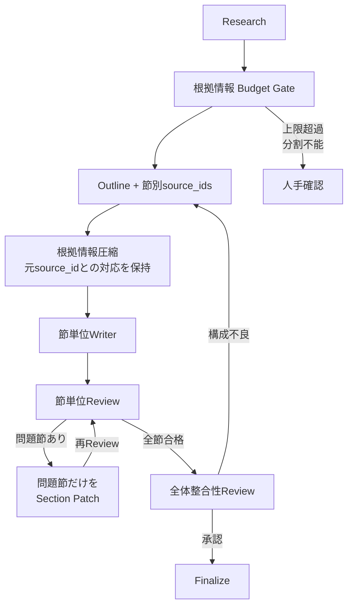
```mermaid
flowchart TB
    R["Research"] --> B["根拠情報 Budget Gate"]
    B --> O["Outline + 節別source_ids"]
    O --> C["根拠情報圧縮<br/>元source_idとの対応を保持"]
    C --> SW["節単位Writer"]
    SW --> SR["節単位Review"]
    SR -->|問題節あり| P["問題節だけを<br/>Section Patch"]
    P -->|再Review| SR
    SR -->|全節合格| CR["全体整合性Review"]
    CR -->|構成不良| O
    CR -->|承認| F["Finalize"]
    B -->|上限超過<br/>分割不能| H["人手確認"]
```

| 制御 | 本番方針 |
| --- | --- |
| 根拠情報上限 | 件数とModel TokenizerによるToken Budgetを節ごと・Request全体へ設定する。 |
| 圧縮 | 要約文ごとに元`source_ids`（各節や文章が利用する根拠情報を指すID一覧）を保持し、圧縮後IDから原文Chunkへ監査可能にする。 |
| Writer | Outline Sectionと割当根拠情報だけを入力し、節単位の下書き 成果物をCheckpointする。 |
| Review | 節単位でClaim・引用・禁止事項を確認し、問題節だけをPatchする。 |
| 全体Review | 重複、矛盾、用語、結論、節間参照、公開ポリシーを最後に横断確認する。 |
| 超過時 | 黙って末尾を切り捨てず、追加Research、Outline分割、バックグラウンドJob、人手確認へ処理経路する。 |
| Cost Gate | Agent別Input／Output Token、Latency、`research`（再調査へ戻す処理指定）／`reoutline`（構成作成へ戻す処理指定）／`rewrite`（文章作成へ戻す処理指定）ごとの追加CostをChampionと比較する。 |

同期SSEは、予測P95が組織のHTTP上限内で、切断後に同じRequestを再取得できる処理へ限定する。多数節、複数文書圧縮、数分超のレビューの繰り返し、外部承認待ちがある場合はバックグラウンドJobへ分離し、即時に`202 Accepted`（処理を受け付けたが完了は後であることを示すHTTP Status）相当の`request_id`（1回のレポート作成Requestを識別するID）を返す。状態、節成果物、実行構成セット、文書集合スナップショット、完了済みNodeをCheckpointし、再接続時は最後に確定したEvent Sequence以降だけを配信する。再実行で同じ節を二重公開しないよう、`request_id + section_id + attempt`（同じ節の再実行を一意に識別する冪等Key）を冪等Keyにする。

Agent Serverの`@stream`（Agent Serverで逐次応答を有効にするDecorator）はNode進捗をSSEへ送るが、未承認下書き、調査メモ、内部Review指摘は途中表示しない。SSE切断は処理Cancelと同義にせず、Clientは`request_id`（1回のレポート作成Requestを識別するID）で状態を再取得する。本資料の最小コードはdurable CheckpointとBackground Queueを含まないため、長文・承認待ちを扱う前に本番向け人手確認構成へ拡張する。

##### 4.3.4.11 金融機関向け統制・機密情報・ロールバック

- 検索、生成、公開、評価の各権限を分離し、Prompt／文書集合／Codeの変更者が単独でProduction承認できないようにする。
- 外部公開、高機密、根拠情報競合、ポリシー判定不能は安全側へ倒して人手確認へ送り、LLMの`approve`（承認して最終化する処理指定）で解除しない。
- 文書集合スナップショット、実行構成セット、Git Commit、Model Service、ポリシーVersion、Review承認を不変IDで監査証跡へ関連付ける。
- Trace、Checkpoint、実行時人手確認記録、EvaluationDatasetへ個人情報・顧客情報の分類、マスキング、保持、Legal Hold、削除ポリシーを個別に適用する。
- Foundation Model APIs、Reranker、Judgeを含む各Designated Serviceについて、データ所在地、越境、再学習、保持、委託先リスクの利用承認を取得する。
- Emergency停止、前の実行構成セット／文書集合へのロールバック、未処理の実行時人手確認記録の再割当を定期的に演習する。

- `corpus_snapshot_id`（今回のRequestで使う文書集合の版を特定するID）は取り込みRunではなく全文書Version集合とし、Manifestで文書IDとVersionを固定する。
- 文書ID、Version、文書集合スナップショット、Chunk、引用IDを実行状態へ保持する。
- 同じReport Request中に文書集合スナップショットを変更しない。
- 再調査で根拠情報を追加するときも、同じ文書集合スナップショット、`reader_entitlements`（利用者が閲覧できる権限一覧）、`publication_scope`（成果物を内部向け／外部向けのどちらとして扱うか）、機密上限を使用する。
- 外部公開では公開承認済み根拠情報だけを検索し、内部TitleとURIを成果物へ出さない。

- Traceへ文書全文を無条件に保存せず、環境ごとにマスキングと保存範囲を定義する。
- Review Datasetにはマスキング済みTopicと期待レポートを使用する。
- Trace、EvaluationDataset、Review App、Deltaテーブルの権限を別々に確認する。
- Secretや認証情報をPrompt、実行状態、Trace Tagへ保存しない。

- DAB、共通Wheel、実行構成台帳、文書集合スナップショットをリリース単位として記録する。
- Prompt Aliasを複数個順番に切り替えるだけの非一括 リリースを避ける。
- ロールバックではGit Commitだけでなく、実行構成セット、Model Variant、文書集合スナップショットも戻す。
- 文書集合スナップショット更新だけの場合もGolden Topicで期待根拠情報を検索できることを確認する。

### 4.4 本番開始前の事前通し試験・運用試験

本番開始前は正常系だけでなく、**止めるべき時に止まり、前リリースへ戻せること**を試験する。事前通し試験はApplicationの機能テストではなく、Identity、ポリシー、Checkpoint、リリース、Monitoring、運用手順書を含む運用試験である。

| 試験 | 実施内容 | 合格条件の例 | 主な証跡 |
| --- | --- | --- | --- |
| ACL／成果物公開ポリシー | 権限不足User、外部公開不可根拠情報を含むCase | 権限外・掲載不可根拠情報がLLM入力と成果物へ0件 | Trace Filter条件、Result |
| 文書集合スナップショット固定 | 実行途中に新文書集合スナップショットを発行 | Request中は開始時文書集合スナップショットを使い続ける | Trace `corpus_snapshot_id`（今回のRequestで使う文書集合の版を特定するID） |
| 実行構成セット固定 | 実行途中に本番構成参照を切替 | Request中のPrompt／Modelが変わらない | `prompt_bundle_id`（各エージェントで使うPrompt・Model等の固定組合せを特定するID）、Prompt URI |
| ロールバック | 前の実行構成セットへ参照を戻す | 前Code／Prompt／Model／文書集合組合せで再実行できる | リリース／意思決定記録 |
| 処理経路 | 代表的な`research`（再調査へ戻す処理指定）／`reoutline`（構成作成へ戻す処理指定）／`rewrite`（文章作成へ戻す処理指定） Case | 期待Edgeへ進み不要実行状態を破棄する | 処理経路履歴 |
| 繰り返し上限 | Reviewerが継続差し戻しするテスト用固定データ | 上限到達で人手確認へ安全側へ倒す | 繰り返し回数、実行時人手確認記録 |
| 中断・再開可能な人手確認 | interrupt→一時的な処理権→判断→再開 | 同じ`thread_id`（中断した同一Graph実行を再開するための識別子）で冪等に完了し二重確定しない | Checkpoint／判断バージョン |
| Search障害 | Retriever Timeout／Error | 未承認下書きを返さずError／Human経路へ進む | Error Span |
| Model障害 | Agent呼出し失敗 | 後段が誤って古い実行状態を承認しない | Agent Span、Graphの実行状態 |
| SSE切断 | Client切断／再接続 | Server側実行状態と最終結果が破損しない | Request／Trace ID |
| Monitoring | Scorer／Judge／AlertをStaging Traceへ適用 | 指定SignalがDashboard／Alertへ出る | Monitoring Run |
| Cost／Latency | 長文・最大繰り返しのテスト用固定データ | P95、Agent別Token、繰り返し Costが予算内 | Trace Usage |

事前通し試験で失敗した場合、単に閾値を緩めて合格させない。Security／Grounding／人手確認は本番利用範囲を縮小してでも判定不能時に安全側へ倒すことを優先する。

### 4.5 限定試行／本番開始時の監視・運用

限定試行では、Production Monitoringを「後から設定する」のではなく開始時点から有効化する。文書集合スナップショット、実行構成セット、実モデル経路、Git Commit、成果物公開ポリシーVersion、Agent経路、人手確認、Latency／Token／Costを同じTraceへ関連付ける。

| 運用対象 | 限定試行での確認 | しきい値超過時の扱い |
| --- | --- | --- |
| Security／Publication | 権限外根拠情報、掲載不可情報 | 即時停止／Incident候補 |
| Grounding | 根拠情報 0件、未知の引用、Unsupported Claim | 自動承認停止、Reviewへ |
| Reviewer | 誤承認、過剰差し戻し | Review Prompt／Judge Caseへ分類 |
| 処理経路制御 | 繰り返し増大、人手確認率、期待する処理経路 | Graph／ポリシーのケースへ分類 |
| 人手確認 | Review待ち件数、再開失敗 | 運用運用手順書／Platform確認 |
| 実行時 | Error、P95、SSE完了率 | SLOに応じてロールバック判断 |
| Cost | Request／Agent別Token、繰り返し Cost | 利用範囲／Budget見直し |
| Quality | 最終品質とAgent別Scorer | 改善用Dataset改善候補へ送る |

未承認下書き、Research Notes、内部Review指摘は、公開可否が確定する前に一般利用者向けSSEへ途中表示しない。進捗Eventと成果物本文を分ける。

### 4.6 リリース・ロールバック・利用拡大の判断基準

リリース継続、ロールバック、No-Go、利用範囲拡大は、最終評価用Dataset、Security、誤自動承認、期待根拠情報Recall、処理経路制御、Latency、Cost、人手確認再開成功率から判断する。単一の平均品質Scoreだけで判断しない。

| 判断 | 代表条件 | 操作 |
| --- | --- | --- |
| リリース継続 | 最終評価用Dataset合格、Security違反0、SLO／Cost内、重大人手確認失敗なし | 本番構成参照を維持 |
| 条件付き継続 | 品質は合格だが特定Audience／文書種でリスク | 利用範囲を限定しMonitoring強化 |
| ロールバック | 誤自動承認、Security違反、重大回帰テスト、Checkpoint障害 | 前実行構成セット／文書集合／Codeへ一体ロールバック |
| No-Go | 必須Control未実装、事前通し試験不合格 | 本番開始しない |
| 利用範囲拡大 | 限定試行で品質・Cost・運用負荷が安定 | 対象User／Audience／用途を段階拡大 |

ロールバックではGit Commitだけを戻さない。**実行構成セット、モデル経路、文書集合スナップショット、ポリシー参照を含む評価済みリリース構成**へ戻す。判断理由と証跡IDは意思決定記録へ残す。


## 5. 本番導入後の監視・運用・継続的改善

本番導入後は4章の基準構成を作り直さない。本番Trace、Assessment、Cost、Latency、人手確認実績から必要性が確認できたReview自動化、Dataset育成、Prompt Optimization、Judge Alignment、カナリアを外側へ追加する。

### 5.1 本番導入後のデータモデル全体像

本番導入後も4章の基準構成を作り直さない。文書集合スナップショット、改善用Dataset／最終評価用Dataset、Production Monitoring等のRAG共通資産はそのまま継続し、マルチエージェントでは**実行時人手確認記録、品質レビュー記録、実行状態／処理経路の再現資産**だけを追加・高度化する。

#### 5.1.1 まず理解する構成

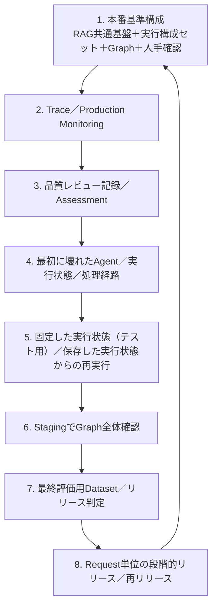
```mermaid
flowchart TD
    BASE["1. 本番基準構成<br/>RAG共通基盤＋実行構成セット＋Graph＋人手確認"] --> MON["2. Trace／Production Monitoring"]
    MON --> REV["3. 品質レビュー記録／Assessment"]
    REV --> CAUSE["4. 最初に壊れたAgent／実行状態／処理経路"]
    CAUSE --> FIX["5. 固定した実行状態（テスト用）／保存した実行状態からの再実行"]
    FIX --> STG["6. StagingでGraph全体確認"]
    STG --> GATE["7. 最終評価用Dataset／リリース判定"]
    GATE --> CAN["8. Request単位の段階的リリース／再リリース"] --> BASE
```

EvaluationDatasetの一般的な育成、Prompt Optimization、Judge Alignmentの順序はRAG資料を参照する。ここでは**何をマルチエージェント固有の評価Caseとして残すか**だけを扱う。

#### 5.1.2 本番導入後のTable／Dataset／Resource一覧

**本番導入時から継続する基準構成**

| 分類 | 物理名／実体 | 継続する役割 |
| --- | --- | --- |
| RAG共通 | `corpus_snapshot_manifest`（文書集合スナップショットの構成を管理する台帳）／`registry`（文書集合スナップショットのIDと構成を参照する台帳）、AI Search、改善用Dataset／最終評価用Dataset、Production Monitoring | 文書集合、検索、共通評価・監視。実装はRAG資料を正とする |
| リリース | `technical_report_prompt_bundles`（実行構成セットを不変な1組として保存する管理Table） | Agent Prompt、Model、文書集合、Gitを不変な実行構成セットへ固定 |
| リリース | `technical_report_release_channels`（production等が現在使う実行構成セットを指す管理Table） | `production`（本番で現在利用する参照先）等の現在の実行構成セット参照 |
| 実行時 | 実行状態を永続保存するCheckpoint保存先 | `thread_id`（中断した同一Graph実行を再開するための識別子）単位のGraphの実行状態永続化 |
| 実行時 | 実行時人手確認記録保存先 | 人手判断待ち、一時的な処理権、判断、再開状態 |
| Trace | MLflow Experiment／UC Trace | Agent Span、根拠情報、処理経路、Token、結果 |

**本番導入後に追加・高度化するもの**

| 分類 | 物理名／実体 | 役割 | 導入条件 |
| --- | --- | --- | --- |
| Quality Review | `technical_report_review_cases`（完了済みTraceのレビュー結果と改善先を管理するTable） | Trace、Expectation、原因Agent、改善先、Split、承認、配送状態 | Review件数と担当者が増えた場合 |
| 固定した実行状態（テスト用） | マスキング済み実行状態／根拠情報／下書きのテスト用固定データ | Agent単体回帰テスト、実行状態の破棄規則の再現 | 原因Agentを局所検証したい場合 |
| 保存した実行状態からの再実行 | Graph／ポリシーVersion＋保存実行状態 | 処理経路、繰り返し、再開先の再現 | 処理経路制御／人手確認 失敗が確認された場合 |
| Experiment | Request固定Variant／Assignment | Prompt／Modelの実行構成セットの限定本番比較 | オフライン最終評価用Datasetの合格後に必要な場合 |
| Operations | Review SLA／再割当／Quality Alert | 滞留を運用可能にする | Review件数・SLA要求が増えた場合 |

#### 5.1.3 本番導入後の管理系ER図

実行時とQualityは目的が違うため、同じCase Tableへ統合しない。

##### 実行時／リリース ER図

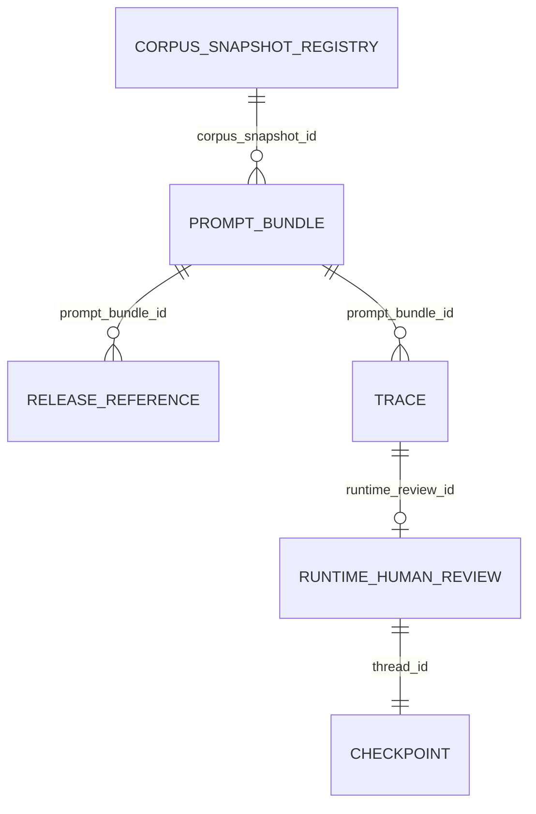
```mermaid
erDiagram
    CORPUS_SNAPSHOT_REGISTRY ||--o{ PROMPT_BUNDLE : corpus_snapshot_id
    PROMPT_BUNDLE ||--o{ RELEASE_REFERENCE : prompt_bundle_id
    PROMPT_BUNDLE ||--o{ TRACE : prompt_bundle_id
    TRACE ||--o| RUNTIME_HUMAN_REVIEW : runtime_review_id
    RUNTIME_HUMAN_REVIEW ||--|| CHECKPOINT : thread_id
```

##### Quality／再実行 ER図

```mermaid
erDiagram
    TRACE ||--o| QUALITY_REVIEW : trace_id
    QUALITY_REVIEW ||--o{ ASSESSMENT : quality_review_id
    QUALITY_REVIEW ||--o| STATE_FIXTURE : fixture_id
    STATE_FIXTURE ||--o{ STATE_REPLAY_RUN : fixture_id
    QUALITY_REVIEW }o--|| EVALUATION_CASE : approved_case
```

実行時人手確認記録は**今止まっているRequestを再開するための運用実行状態**、品質レビュー記録は**完了済みTraceを改善へ配送するための品質Record**である。固定した実行状態（テスト用）／保存した実行状態からの再実行は後者にだけ紐付ける。

#### 5.1.4 本番導入後のデータフロー図

```mermaid
flowchart TD
    P["本番Request"] --> T["MLflow Trace"]
    T --> M["Production Monitoring"]
    M --> Q["品質レビュー候補"]
    Q --> R["専門家Review<br/>原因Agent／期待処理経路／Expectation"]
    R --> F["固定した実行状態（テスト用）"]
    F --> D["Development<br/>対象Agent／実行状態／処理経路を局所検証"]
    D --> S["Staging<br/>Graph全体・人手確認・繰り返しを確認"]
    S --> G["共通最終評価用Dataset＋マルチエージェント判定"]
    G -->|合格| C["Request単位の段階的リリース／リリース"]
    G -->|不合格| D
```

Production TraceからEvaluationDatasetへ追加する一般的な手順はRAG資料を参照する。本資料では、Review済みCaseに`root_cause_agent`（最初に品質を崩したと判定したAgent）、`expected_routes`（評価Caseで期待する処理経路）、固定した実行状態（テスト用）等を追加して再現可能にする。

### 5.2 本番Traceからマルチエージェント固有の問題だけを切り出す

Production TraceのReview、EvaluationDatasetへの追加、Development／Stagingへの還流そのものは、**「社内技術文書検索システム（エージェント型RAG）_完成版.md」**の改善ライフサイクルをそのまま利用する。

本資料で追加するのは、Review時に**Agent／処理経路／実行状態のどこで最初に破綻したか**を残し、その時点の実行状態を再現可能なテスト用固定データへ変えることである。

原因を切り分ける順序はPoCと本番で変えない。まず**3.6の全体図で疑う場所を絞り、該当する詳細図でTrace／Spanを確認する**。本番ではProduction Monitoringや専門家Reviewで見つかったCaseに対して同じ判断手順を適用する。

#### 5.2.1 実行時人手確認と品質レビューを分ける

この2つは目的が異なるため、同じCaseとして扱わない。

| 種類 | 目的 | 必要な実行状態 |
| --- | --- | --- |
| 実行時人手確認 | 今止まっているRequestを安全に再開する | `thread_id`（中断した同一Graph実行を再開するための識別子）、Checkpoint、判断バージョン、現在実行状態 |
| 品質レビュー | 完了済みTraceを将来の改善へ使う | Trace ID、根本原因、期待値、改善対象 |

実行時人手確認の判断をそのままEvaluationDatasetの正解へ自動採用しない。品質レビューでは専門家が改めて期待根拠情報、期待処理経路、最初の破綻箇所を確認する。

#### 5.2.2 品質レビュー記録へ追加するマルチエージェント固有項目

RAG資料で定義する一般的なReview／Assessment項目に加えて、次を保持する。

| 項目 | 内容 |
| --- | --- |
| `source_prompt_bundle_id`（問題発生時に使われていた実行構成セットID） | 問題発生時に固定されていたAgent構成 |
| `source_git_commit`（評価したApplicationコードのGit Commit） | Graph／実行状態の契約／ポリシーのCode Version |
| `expected_routes`（評価Caseで期待する処理経路） | 本来通るべき差し戻しAction |
| `actual_route_history`（評価実行で実際に通った処理経路） | 実際に通ったNode／Edge |
| `root_cause_agent`（最初に品質を崩したと判定したAgent） | 最初に期待状態から外れたAgent |
| `state_invalidation_error`（差し戻し時に古い実行状態が残ったことを示すエラー） | 古い実行状態再利用の有無 |
| `loop_count_by_action`（差し戻し種類ごとのLoop回数） | 差し戻し種別ごとの回数 |
| `checkpoint_id`（保存した実行状態を識別するID） | 人手確認問題時の再現対象 |
| `resume_decision`（人手確認後にGraphへ渡す再開判断） | 人が返した判断 |
| `improvement_target`（問題を修正すべきAgent／機能の分類） | Agent Prompt／処理経路／実行状態／人手確認等の改善先 |

一般的な`expected_answer`（評価Caseで期待する最終回答／レポート内容）だけでは、正しいレポートが偶然生成されたが途中処理経路は誤っていたCaseを検出できない。そのため、**中間実行状態と処理経路を評価資産として残す**。

#### 5.2.3 Agent変更は固定した実行状態（テスト用）から始める

Productionの全文書や全GraphをDevelopmentへ毎回持ち込まず、原因Agentの入力実行状態をテスト用固定データ化する。

| 改善対象 | Developmentへ戻す最小テスト用固定データ | Stagingで追加確認するもの |
| --- | --- | --- |
| Research | Request、前回Review指摘、期待根拠情報 | 本番相当AI Search／Filter |
| Outline | 固定根拠情報、Research Notes、必須節 | Researchからの実行状態受け渡し |
| Writer | 固定根拠情報、Outline、禁止Claim | コンテキスト上限、Graph全体 |
| Reviewer | 根拠情報、Outline、下書き、期待Action | 実Edgeと繰り返し |
| 処理経路 | Review判断、繰り返し回数、実行状態 | LangGraph全体 |
| 実行状態の破棄 | 差し戻し前実行状態、期待残存Field | Checkpointからの再開 |
| 人手確認 | Checkpoint、判断、期待再開先 | 一時的な処理権、冪等再開、Timeout |

これにより、Writer Prompt問題を調べるためにResearch／AI Searchまで毎回再実行する必要がなくなる。一方、最終採用前はStagingでGraph全体を通し、局所改善が別Agentへ悪影響を与えていないことを確認する。

#### 5.2.4 Agent間の入出力契約を回帰テストする

Promptの自然言語品質だけでなく、構造化出力のSchema互換性も回帰テストする。

- `Evidence`（検索で取得した根拠情報を表すデータ型）に必要Fieldが欠けていないか
- Outlineの全`source_ids`（各節や文章が利用する根拠情報を指すID一覧）が現在の根拠情報に存在するか
- Writerが未知の引用IDを生成していないか
- `ReviewDecision.action`（Review Agentの次処理先を表すField）が定義済みEnum以外になっていないか
- Graphの実行状態の必須FieldがNode遷移ごとに維持されるか
- ポリシー／リリース IDがNode更新で上書きされていないか

LLMの出力検証はPydantic等で安全側へ倒すようにし、Schema違反を「文章品質が少し悪い」Caseとして扱わない。

#### 5.2.5 保存した実行状態からの再実行で処理経路と繰り返しを再現する

処理経路の問題は最終レポートだけを保存しても再現できない。問題発生直前の実行状態をマスキングしてテスト用固定データ化し、同じReview判断からどのEdgeへ進むかを再実行できるようにする。

```text
保存済み固定した実行状態（テスト用）
  + Review判断
  + Graph／ポリシーVersion
        ↓
処理経路を再実行
        ↓
期待Node、実行状態の破棄、繰り返し回数を比較
```

特に`reoutline`（構成作成へ戻す処理指定）と`rewrite`（文章作成へ戻す処理指定）は混同しやすいため、処理経路だけでなく**どの実行状態が消えたか**までTestする。

#### 5.2.6 段階的リリースでもRequest単位で実行構成セットを固定する

Prompt Registry AliasやModel Serving側のCall単位Traffic Splitだけに依存すると、1 Request内でAgentごとにVariantが混在し得る。

マルチエージェントの段階的リリース（カナリア）では`request_id`（1回のレポート作成Requestを識別するID）または`session_id`（同一利用Sessionを識別するID）を安定Hashし、Prompt、Model、文書集合、Graph Versionを含むBundleをRequest開始時に一度だけ選択する。

```text
request_id
   ↓ stable hash
現行構成／候補構成を1つ選択
   ↓
Research → Outline → Writer → Review
   ↓
Request終了まで同じBundle
```

モデルだけを比較するときはPrompt／文書集合／Graphを固定し、Promptだけを比較するときはModel／文書集合／Graphを固定する。複数要素を同時変更した場合は「組合せVariant」の比較として扱い、どの要素が効いたかを単独では断定しない。

#### 5.2.7 中断・再開可能な人手確認は再開後の実行状態の整合性まで評価する

人手確認の高度化では、SLAや再割当だけでなく、再開後に正しいNodeへ戻り、実行状態の破棄規則が適用されたかを確認する。

| 判断 | 期待再開先 | 追加確認 |
| --- | --- | --- |
| `approve`（承認して最終化する処理指定） | Finalizer | 下書き内容を勝手に変更しない |
| `research`（再調査へ戻す処理指定） | Research | 根拠情報以降を再生成 |
| `reoutline`（構成作成へ戻す処理指定） | Outline | 旧Outline／下書きを破棄 |
| `rewrite`（文章作成へ戻す処理指定） | Writer | 根拠情報／Outlineを保持 |
| `reject`（承認せず終了する処理指定） | END | 自動公開しない |

古いCheckpointを新しい互換性のないGraph Versionで再開しない。長時間の確認待ちがあり得る場合は、リリース切替時に「旧Graphで完了」「実行状態 Migration」「Case再開始」のどれを許可するかを事前に決める。

#### 5.2.8 Agent分離は運用境界が生じた後に行う

Research、Outline、Writer、Reviewを最初から別Application／Endpointへ分離しない。次のいずれかが必要になったAgentだけを分離する。

- 別Teamが独立リリースする
- 権限境界を分ける必要がある
- Scaling特性が大きく異なる
- 他Applicationから再利用する
- 独立SLO／Cost責任を持たせる

分離後はNetwork Call、Timeout、Retry、Schema Version、分散Traceコンテキストが新たな障害点になるため、単純な「高度化」とはみなさない。


### 5.3 定常監視

4章で開始したProduction Monitoringを継続し、**全件で取る決定論的Signal**と**Samplingする意味評価**を分ける。Judgeを全件に適用すること自体を目的にしない。

| Signal | 原則 | 例 |
| --- | --- | --- |
| 全件 | 安価で決定論的に取れる | Error、Latency、Token、繰り返し、根拠情報件数、引用ID、処理経路、人手確認、ポリシーVersion |
| Sampling | LLM Judge等のCostがある | Groundedness、構成品質、読者適合、Reviewer品質 |
| 専門家Review | 高リスク／代表Case／Judge不一致 | 外部公開、高機密、誤承認候補、新失敗パターン |

#### 5.3.1 Workspace／MLflow Resourceの継続運用

- Realtime／Evaluation／LabelingのExperimentを混在させず、用途別のTraceを追跡できる状態を維持する。
- Registered ScorerのVersion変更をリリース構成へ記録する。
- Review App／Labeling SessionのReviewer権限を定期確認する。
- Prompt Registry Aliasだけを本番構成の正本にせず、実行構成セットの不変VersionをTraceへ記録する。
- MonitoringのSampling Rate、Judge Cost、Alert閾値は運用実績から調整し、変更理由を意思決定記録へ残す。

### 5.4 Alert・障害・品質問題への対応

根拠情報 0件、ACL／成果物公開ポリシー違反、誤自動承認、繰り返し上限、Checkpoint再開失敗、Latency／Cost超過は、通常の文章品質改善と同列に扱わない。

| 種別 | 例 | 初動 | 改善経路 |
| --- | --- | --- | --- |
| Security／Publication | 権限外根拠情報、掲載不可情報 | 利用停止／Incident判断 | ポリシー／Identity修正＋回帰Test |
| Grounding | 根拠情報 0件なのに承認、未知の引用 | 自動承認停止 | Research／Writer／Reviewer原因分類 |
| 実行時 | Search／Model／Checkpoint障害 | 安全側へ倒す、運用手順書 | Platform／Graph修正 |
| 人手確認 | Review待ち滞留、二重判断、再開失敗 | ケース凍結／再割当 | レビューワークフロー改善 |
| Quality | 構成不良、読者不適合 | 品質レビュー記録化 | Prompt／Retrieval等へ配送 |
| Cost／Performance | 繰り返し増大、P95超過 | Scope／Budget確認 | コンテキスト、Model、処理経路の最適化 |

Security・可用性へ即時影響する事象はWeekly Quality Reviewを待たずIncident経路を開始し、再発防止の品質Caseだけを後から関連付ける。

### 5.5 マルチエージェント固有の品質レビュー項目

Assessment、Review App、Labeling Session、EvaluationDatasetへの反映方法は、**「社内技術文書検索システム（エージェント型RAG）_完成版.md」**を参照する。

本資料では、専門家Review時に次のマルチエージェント項目を追加する。

- 最初に期待状態から外れたAgentはどこか
- 上流Agentの失敗が下流へ波及しただけではないか
- Review Action自体は正しかったか
- Review Actionと実際のGraph Edgeは一致したか
- 差し戻し後に古いOutline／下書きを再利用していないか
- 繰り返しは必要だったか、同じ状態を往復していないか
- 人手確認へ送る条件と再開先は正しかったか
- AgentごとのPrompt／Model／文書集合／Graph VersionはRequest中に固定されていたか

End Userの👍／👎だけでこれらを判定できないため、処理経路や実行状態を読めるマルチエージェント／LLMOps担当者が技術原因を確定する。

### 5.6 本番証跡に基づくマルチエージェント改善

共通の「Production TraceをReviewして改善用Datasetへ追加し、最終評価用Dataset／Stagingを通してリリースする」CycleはRAG資料を参照する。

本番で改善対象を決めるときも、まず3.6の診断フローで**最初に崩れた場所**を確認し、数値だけで下流Agentを原因にしない。

マルチエージェント側では、改善対象を次のいずれか1つへ絞る。

| 改善対象 | 変更例 | まず固定するもの |
| --- | --- | --- |
| `RESEARCH_PROMPT`（Research Agent用Prompt参照） | Query計画、調査メモ | Request、文書集合結果 |
| `OUTLINE_PROMPT`（Outline Agent用Prompt参照） | 必須節、根拠情報割当 | 根拠情報 |
| `WRITER_PROMPT`（Writer Agent用Prompt参照） | Grounding、引用、文体 | 根拠情報、Outline |
| `REVIEW_PROMPT`（Review Agent用Prompt参照） | 誤承認、過剰差し戻し | 根拠情報、下書き |
| `ROUTING`（処理経路に関する評価分類） | Edge条件、停止条件 | Review判断、実行状態 |
| `STATE_CONTRACT`（Agent間で共有する実行状態契約のVersion） | Field、破棄規則 | Prompt／Model |
| 人手確認 | Checkpoint、再開 | Agent Prompt |
| `BUNDLE`（実行構成セットのVersion／ID） | AgentごとのModel組合せ | 文書集合、Graph |

一度にResearch PromptとReviewer Promptと処理経路を同時変更すると、改善理由を追えなくなる。まず局所テスト用固定データで1要素を改善し、その後にGraph全体で副作用を確認する。

### 5.7 マルチエージェントで追加する高度化

Judge Alignment、Prompt Optimization自体の一般的な方法はRAG資料を参照する。本資料で追加する高度化は次である。

#### 5.7.1 Agent別モデル経路

Agentごとに必要能力が異なるため、実行構成セットはPoC時点からResearch／Outline／Writer／ReviewごとのModel Serviceを別々に保持できる構造とする。初期構成では全Agentへ同じBaseline Modelを設定し、Evaluationで品質・Latency・Token Costの差が確認されたAgentだけを別Modelへ変更する。例えばResearch／Outlineは小型Model、Writer／Reviewは高性能Modelという構成も選べる。Model選択は実行構成セットへ含め、Request途中で変えない。

ただし、ModelはRetrieverやPromptより原因特定が難しい。出力不良だけでModelを原因とせず、対象Agent直前の実行状態、根拠情報、Prompt Version、推論設定を固定した局所EvaluationでModelだけを変更し、複数Caseで再現性のある差が出るか確認する。またModelを変えると最適Promptも変わり得るため、候補Modelを手当たり次第に総当たりせず、問題Agentへ絞って少数候補を比較し、上位候補だけPrompt再調整とGraph全体の回帰Evaluationへ進める。

#### 5.7.2 Parallel Agentを導入する場合のMerge ポリシー

将来Researchを複数Agentへ並列化する場合は、単純に結果を結合しない。追加で次を定義する。

- 根拠情報重複排除Key
- 競合根拠情報の表現方法
- どのAgent結果を優先するか
- 実行状態 Mergeの決定論的Rule
- 並列Agentの一部失敗時に全体を続行する条件
- Fan-out数とToken／Latency Budget

並列化はLatency短縮になる場合もあるが、根拠情報競合とCostを増やすため、必要性が確認できるまでは直列Graphを基本とする。

#### 5.7.3 Request単位の段階的リリース

Call単位ではなく実行構成セット単位で比較候補を固定する。1つのReport内でResearchだけchallenger、Writerはchampionという混在を避ける。

#### 5.7.4 Agent分離後の分散Trace

Agentを別Endpointへ分離した場合は、`request_id`（1回のレポート作成Requestを識別するID）、`trace_id`（1回の実行Traceを識別するID）、`parent_span_id`（親となるTrace Spanを識別するID）、実行構成セットIDをサービス間で引き継ぎ、1 Reportを全体で追跡できるようにする。


### 5.8 本番運用上の設計判断

#### 5.8.1 エージェント実行状態と差し戻し

- 再調査、再構成、改稿を合算した繰り返し上限を設ける。
- `research`（再調査へ戻す処理指定）では新根拠情報を追加した後、古いOutline／下書きを再評価する。
- `reoutline`（構成作成へ戻す処理指定）では古いOutlineと下書きを破棄し、根拠情報とResearch Notesを維持する。
- `rewrite`（文章作成へ戻す処理指定）では根拠情報とOutlineを固定し、下書きだけを作り直す。
- 実行状態の破棄RuleをPromptへ任せずApplication Codeで実装する。

#### 5.8.2 Retrieval・根拠情報

- Topic文字列だけでなくReview指摘、Audience、要件、閲覧権限、成果物公開範囲、文書集合スナップショットを検索条件へ反映する。
- 根拠情報 0件ではWriterへ進めない。
- 引用IDは文書VersionとChunkを追跡できる安定IDとする。
- 根拠情報競合が解消できない場合は自動承認しない。

#### 5.8.3 アクセス制御・公開ポリシー

- AudienceをIdentityの代用にしない。
- Clientが`publication_scope=external`（外部向け成果物として処理する指定）等を自由指定して権限を拡張できないようServer側ポリシーで決める。
- 閲覧可能と成果物掲載可能を分離する。
- 外部公開では内部URI、内部タイトル、高機密根拠情報を成果物へ出さない。

#### 5.8.4 Review、処理経路、人手確認

- Reviewerの意味判断と決定論的ポリシーを分離する。
- 根拠情報 0件、繰り返し上限、Security条件等はLLM ActionよりApplication Codeを優先する。
- 人手確認へ送る下書きは未承認状態を明示し通常成果物として扱わない。
- 実行時人手確認記録には一時的な処理権／判断バージョン／冪等再開を持たせる。

#### 5.8.5 EvaluationDatasetで追加するマルチエージェント項目

改善用Dataset／最終評価用Datasetの一般的な品質管理はRAG資料を参照する。本資料では、Topicや期待回答に加えて、**期待根拠情報、必須節、期待処理経路、人手確認条件、実行状態／繰り返し条件**を保存し、Agent別・処理経路制御別の回帰テストを可能にする。

#### 5.8.6 Assessmentで追加するマルチエージェント診断

Assessment／Judge Alignmentの一般的な運用はRAG資料を参照する。マルチエージェントでは、Application全体の良否だけでなく、**最初に破綻したAgent、Review Action、実処理経路、実行状態の破棄、人手確認 再開**を診断項目へ追加する。

#### 5.8.7 ストリーミング

- SSEで進捗を返しても、未承認下書きや機密Review Notesを一般利用者へ流さない。
- EventにはRequest／Trace IDを含め、Client再接続時に重複成果物を作らない設計にする。
- 長時間処理ではUI接続とGraph実行状態を同一視しない。

#### 5.8.8 機密情報とTrace

- Traceへ必要以上の文書本文、Credential、個人情報を残さない。
- 根拠情報本文を残す場合は保持期間、マスキング、Reviewer権限を定義する。
- 外部公開用途では、内部用Traceと利用者へ返すReference情報を分ける。

#### 5.8.9 品質・安定性・性能・コスト

- 最終品質だけでなくAgent別品質を測る。
- 繰り返し増加による品質向上とLatency／Cost増加を同じリリース判断で評価する。
- コンテキスト上限超過は長文根拠情報を無条件に削るのではなく、節分割、根拠情報選択、再調査単位を見直す。
- Model変更時はPrompt／文書集合を固定し、単独効果を測る。

#### 5.8.10 デプロイとロールバック

- DAB、共通Wheel、実行構成台帳、文書集合スナップショット、ポリシーVersionをリリース証跡へ関連付ける。
- Prompt Aliasを複数個順番に切り替えるだけの非一括 リリースを避ける。
- ロールバックではGit Commitだけでなく実行構成セット、Model Variant、文書集合スナップショットを戻す。
- 文書集合スナップショットだけを更新するリリースでもGolden Topicで期待根拠情報を検索できることを確認する。

#### 5.8.11 Agent分離の判断

Research、Outline、Writer、Reviewを最初からMicroservice化しない。同じTeam、権限、リリース周期であれば1 Application内のNodeの方が実行状態、Trace、リリースを一貫させやすい。別権限、独立Scaling、別Owner、他Applicationからの再利用、独立SLOが必要になったAgentだけを分離する。

本資料のサンプルコードは、文書集合スナップショット、Server側公開ポリシー、実行構成セット、`reoutline`（構成作成へ戻す処理指定）を含むLangGraph、最小エスカレーション、SSE、評価・改善繰り返しまでを一貫して示す。一方、金融機関ごとの認証Adapter、Checkpoint保存先製品選定、人手確認記録の処理権管理API、SIEM／DLP等はPlatform標準へ依存するためInterfaceと責務までを示す。


## 6. 本番チェックリスト

### 6.1 Identity／初期セットアップ

- [ ] Realtime、Quality、Knowledgeの実行Identityと人のReviewer権限が定義されている。
- [ ] 認証済みUser／Groupから`reader_entitlements`（利用者が閲覧できる権限一覧）をServer側で解決する。
- [ ] `publication_scope`（成果物を内部向け／外部向けのどちらとして扱うか）、`data_classification_ceiling`（利用できる機密区分の上限）をClient入力だけで決めない。
- [ ] Secret、Token、CredentialをTraceやSSEへ出さない。
- [ ] 本番Resourceへの最小Read／Write／Inferenceを限定試行前に検証している。

### 6.2 プロジェクト境界

- [ ] `knowledge`（文書取込・検索基盤を配備するDAB Bundle名）、`quality`（評価・Prompt管理・リリース判定を配備するDAB Bundle名）、`realtime`（レポート生成Applicationを配備するDAB Bundle名）を別BundleとしてDeployできる。
- [ ] 共通Packageは型と定数を中心に共有し、実行基盤を密結合させていない。
- [ ] Agent分離の条件が権限、Owner、Scaling、再利用、独立SLOで定義されている。

### 6.3 文書集合・根拠情報・AI Search

- [ ] 文書集合スナップショット構成台帳が全文書IDとVersionを含み、取り込みRun IDと分離されている。
- [ ] 文書集合スナップショット更新時に未更新文書が集合から消えない。
- [ ] 閲覧Entitlement、公開範囲、機密上限、文書集合スナップショットが検索前にFilterされる。
- [ ] 引用IDが文書版とChunkから追跡可能である。
- [ ] 根拠情報 0件で本文を自動生成しない。
- [ ] 外部成果物へ内部URI、掲載不可根拠情報を出さない。

### 6.4 マルチエージェント／処理経路

- [ ] Research、Outline、Writer、Reviewの入出力が構造化されている。
- [ ] Outline各節が根拠情報 `source_ids`（各節や文章が利用する根拠情報を指すID一覧）を持つ。
- [ ] `research`（再調査へ戻す処理指定）、`reoutline`（構成作成へ戻す処理指定）、`rewrite`（文章作成へ戻す処理指定）、`human_review`（人手確認へ送る処理指定）を区別する。
- [ ] `reoutline`（構成作成へ戻す処理指定）等の実行状態の破棄RuleをApplication Codeで実装している。
- [ ] 繰り返し上限が全差し戻しに対して機能する。
- [ ] Reviewer自身の誤判定を独立評価できる。

### 6.5 人手確認／リアルタイム処理

- [ ] 本番では実行状態を永続保存するCheckpointを利用する。
- [ ] `thread_id`（中断した同一Graph実行を再開するための識別子）、一時的な処理権、判断バージョン、再開の冪等性を確認している。
- [ ] 人手確認待ち下書きを通常成果物として公開しない。
- [ ] 未承認下書き／内部Review Notesを一般利用者向けSSEへ出さない。
- [ ] Client切断とGraphの実行状態を分離している。

### 6.6 マルチエージェント評価の追加項目

EvaluationDataset／Scorerの一般項目はRAG資料の本番チェックリストを参照する。ここでは次だけ追加確認する。

- [ ] 期待根拠情報、必須節、期待Review Action、期待処理経路を保存する。
- [ ] Agent別Scorerと全体Scorerを分ける。
- [ ] 処理経路制御／繰り返し／実行状態の破棄を決定論的にTestできる。
- [ ] 上流Agentの失敗を下流Agentの失敗として二重計上しない。

### 6.7 マルチエージェント Review／Judgeの追加項目

Assessment／Judgeの一般項目はRAG資料を参照する。ここでは次だけ追加確認する。

- [ ] Reviewerの意味判断とGraph Edgeの正しさを別々に評価する。
- [ ] 最初に破綻したAgent／処理経路を専門家が診断できる。
- [ ] 人手確認後の再開先と実行状態の破棄を確認できる。
- [ ] 協調品質Judgeを使う場合、最終文章だけでなく根拠情報→Outline→下書きの引継ぎを見る。

### 6.8 Production Monitoring／運用

- [ ] 本番開始前にProduction Monitoringを登録しStagingで事前通し試験した。
- [ ] 全件SignalとSampling Judgeを分ける。
- [ ] 根拠情報 0件、誤承認、繰り返し上限、人手確認失敗、Latency／Costを監視する。
- [ ] Security／Publication違反は通常品質Reviewより優先する。
- [ ] レビュー待ちキューの滞留と再割当条件を必要に応じて監視する。

### 6.9 Version・リリース・ロールバック

- [ ] 実行構成台帳がAgent Prompt、Model、文書集合、Gitを不変Versionで固定する。
- [ ] Request開始後にAliasや参照を再解決しない。
- [ ] 最終評価用DatasetとSecurity／Latency／Cost／人手確認からリリース判断する。
- [ ] 意思決定記録に採否理由と証跡IDを残す。
- [ ] ロールバックでCodeだけでなく実行構成セット、Model、文書集合スナップショットを前構成へ戻す。
- [ ] 段階的リリースではRequest／Session単位でVariantを固定する。

### 6.10 長文・Cost・設計書整合性

- [ ] Agent別Token、Latency、繰り返し CostをTraceで確認できる。
- [ ] コンテキスト上限超過時の節分割／根拠情報選択方針がある。
- [ ] 長時間処理ではCheckpoint／再開とUI接続を分離する。
- [ ] 各フェーズでTable／Dataset／Resource一覧、ER、データフローがコードより前にある。
- [ ] PoC、本番導入、本番導入後のどこでResourceが追加されるか説明できる。
- [ ] 本資料独自用語とMLflow／Databricks公式Resourceを区別している。
- [ ] 初見の担当者が、各フェーズで何を作り、何を保存し、何を人が判断するか説明できる。

## 7. 参考資料

### 7.1 関連する社内設計資料

- **社内技術文書検索システム（エージェント型RAG）_完成版.md**：RAG／LLMOps共通のEvaluationDataset育成、Judge Alignment、Prompt Optimization、Production Monitoring、Development／Staging／Production間のデータ還流はこの資料を参照する。

### 7.2 公式資料

- [MLflow Agent Server](https://mlflow.org/docs/latest/genai/serving/agent-server/)
- [MLflow Prompt Registry](https://mlflow.org/docs/latest/genai/prompt-registry/)
- [MLflow EvaluationDataset](https://mlflow.org/docs/latest/genai/datasets/)
- [MLflowでTraceを評価する](https://www.mlflow.org/docs/latest/genai/eval-monitor/running-evaluation/traces/)
- [MLflow Promptの不変Version](https://mlflow.org/docs/latest/genai/prompt-registry/create-and-edit-prompts/)
- [LangGraph Persistence](https://docs.langchain.com/oss/python/langgraph/persistence)
- [LangGraph Interrupts](https://docs.langchain.com/oss/python/langgraph/interrupts)
- [Databricks Appsでマルチエージェントを構築する](https://docs.databricks.com/aws/en/generative-ai/agent-framework/multi-agent-apps)
- [Databricks Supervisor Agent](https://docs.databricks.com/aws/en/agents/agent-bricks/multi-agent-supervisor)
- [Databricks AI SearchをQueryする](https://docs.databricks.com/aws/en/ai-search/query-ai-search)
- [Databricks Apps Resource](https://docs.databricks.com/aws/en/dev-tools/databricks-apps/resources)

## 8. 用語・物理実体索引

この付録は本文を読む前の前提知識ではなく、正式名称、物理的な実体、導入段階を後から確認するための索引である。RAG資料と共通する用語は、詳細定義を**「社内技術文書検索システム（エージェント型RAG）_完成版.md」**へ委ねる。

| 用語 | 短い定義 | 物理的な実体 | 主な導入段階 |
| --- | --- | --- | --- |
| 根拠情報 | 検索根拠を引用・評価・監査へ共通利用する型 | `Evidence`（検索で取得した根拠情報を表すデータ型） Pydantic Model＋Retriever出力 | PoC |
| レポート実行状態 | Agent間で共有する実行状態 | `ReportState`（Agent間で引き継ぐレポート実行状態の型） TypedDict／LangGraphの実行状態 | PoC |
| 文書集合スナップショット | 全文書Version集合を固定した検索対象版。詳細はRAG資料参照 | `corpus_snapshot_manifest`（文書集合スナップショットの構成を管理する台帳）／`registry`（文書集合スナップショットのIDと構成を参照する台帳） | 本番導入 |
| Prompt Registry | Agent PromptをVersion管理するMLflow Resource | UC-backed Prompt | PoC |
| 実行構成台帳 | 複数Prompt、Model、文書集合、Gitを一体固定した本資料独自Record | `technical_report_prompt_bundles`（実行構成セットを不変な1組として保存する管理Table） | 本番導入 |
| 本番構成参照 | Production等が現在参照する実行構成セット参照 | `technical_report_release_channels`（production等が現在使う実行構成セットを指す管理Table） | 本番導入 |
| LangGraph | Node、実行状態、差し戻しEdgeを制御するGraph | `report_graph.py`（ResearchからReviewまでのLangGraph処理経路を定義するファイル） | PoC |
| 人手確認 | 人の判断へ停止・再開する実行方式 | Checkpointer、`thread_id`（中断した同一Graph実行を再開するための識別子）、`interrupt()`（Graphを人手判断待ちで中断するLangGraph関数）／`Command(resume=...)`（LangGraphへ人手判断を渡して中断地点から再開する命令） | 本番導入 |
| 実行時人手確認記録 | 実行中Requestの人手確認停止・再開状態 | 人手確認記録保存先等＋Checkpoint参照 | 本番導入 |
| EvaluationDataset | Topic、入力条件、Expectationを保持する評価Dataset。一般運用はRAG資料参照 | MLflow EvaluationDataset | PoC〜 |
| 改善用Dataset | 改善候補探索に使う評価Case集合 | `main.llmops.technical_report_train`（改善候補の探索に使う評価Dataset） | 本番導入〜 |
| 最終評価用Dataset | 最終リリース判定専用の未使用Case集合 | `main.llmops.technical_report_holdout`（最終リリース判定に使う未使用評価Dataset） | 本番導入〜 |
| Assessment | Traceへ付与するFeedback／Expectation等 | MLflow Assessment Record | PoC〜 |
| Production Monitoring | 本番Traceを登録Scorerで継続評価する機能。共通運用はRAG資料参照 | Registered Scorer、Monitoring実行 | 本番導入〜 |
| 品質レビュー記録 | 完了済みTraceの期待値、原因Agent、改善先、承認、配送を追跡する本資料独自Record | `technical_report_review_cases`（完了済みTraceのレビュー結果と改善先を管理するTable） | 本番導入後 |
| 固定した実行状態（テスト用） | 特定Agent／処理経路を再現するために固定・マスキングした実行状態 | テスト用固定データ／Evaluation 成果物 | 本番導入後 |
| 保存した実行状態からの再実行 | 保存実行状態とGraph／ポリシーVersionから処理経路・繰り返しを再実行する検証 | 再実行テスト／MLflow Run | 本番導入後 |
| Prompt Optimization | 改善用CaseからPrompt候補を探索する改善処理。一般手順はRAG資料参照 | Optimization Run＋Prompt Version候補 | 本番導入後 |
| Judge Alignment | 人間FeedbackへJudge定義を合わせる処理。一般手順はRAG資料参照 | Alignment Run＋候補Judge | 本番導入後 |
| Request単位の段階的リリース | 候補実行構成セット／ModelをRequest単位で固定して限定本番確認する方式 | Assignment＋Trace Variant | 本番導入後 |
| 意思決定記録 | リリース／ロールバック／Go-No-Go等の人の意思決定を証跡IDと共に残す追記Record | Delta Table／外部Change Record等 | PoC〜 |
| 処理経路履歴 | Research／Reoutline／Rewrite／人手確認等の実処理経路履歴 | `ReportState.route_history`（実行状態に保存した処理経路履歴Field）＋MLflow Trace | PoC〜 |
| 成果物公開ポリシー | 閲覧可否とは別に成果物への掲載可否を決めるServer側ポリシー | ポリシーVersion＋Retriever Filter／Finalizer | PoC〜 |
| コンテキスト上限 | 1 Requestで根拠情報／中間成果物／LLM Callへ許容するコンテキスト量 | Application設定＋Trace Usage | PoC〜 |
## 9. 付録：資料作成・レビュー用チェックリスト

### 9.1 フェーズ別データモデルのセルフレビュー

- PoCにTable／Dataset／Resource一覧があり、本番用文書集合スナップショット／リリース／人手確認管理を実装済みのように描いていない。
- 本番導入時に文書集合スナップショット、実行構成セット、改善用Dataset／最終評価用Dataset、人手確認、Monitoringの全体像がある。
- 本番導入後はRAG資料と同じDataset育成／Optimization／Alignmentを再掲せず、Agent／処理経路／実行状態／人手確認／Request単位の段階的リリースの追加点を中心に説明している。
- 各フェーズで個別コードより先に「まず理解する構成」とデータフローがある。
- PoC→本番導入→本番導入後で、何を持ち越し、何を置き換え、何を後から高度化するかを2章だけで説明できる。
- RAG／LLMOps共通の改善ライフサイクルはRAG資料へ参照を寄せ、第2章では実行状態の破棄、Agent間契約、Request単位Bundle固定などマルチエージェント固有の変更順序だけを説明している。
- 実行時人手確認記録と品質レビュー記録、公式Resourceと本資料独自Workflowの境界が混ざっていない。

### 9.2 資料だけで答えられるべき最終確認

1. **PoC**：固定した開発用文書集合とPromptで、どの実行状態がResearch→Outline→Writer→Reviewを流れ、どこで差し戻され、どのTrace／Scorerで原因を切り分けるか。
2. **本番導入**：文書集合、Prompt、Model、Code、ポリシー、人手判断をどの不変ID／Storeで固定し、どの条件で安全側へ倒すようにし、どうロールバックするか。
3. **本番導入後**：RAG資料の共通改善Cycleに対し、Agent／処理経路／実行状態／人手確認のどの追加情報を残し、どのテスト用固定データで再現するか。
4. **環境間還流**：RAG資料の環境間還流を前提に、Agent単体のテスト用固定データで済む確認と、Graph／Checkpointまで必要なStaging確認をどう分けるか。
5. **責務境界**：MLflow／Databricks公式Resource、本資料独自Workflow、外部Issue／Change管理の境界を説明できるか。
