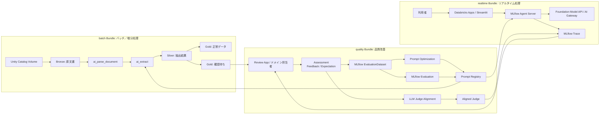

# 非構造文書からの情報抽出アプリケーション（完全版）

本章では、契約書、申込書、請求書などの非構造文書から、会社名、契約期間、料金、プラン名を抽出し、業務で利用できる構造化データとして保存するアプリケーションを構築する。

開発初期からすべての運用機能を同時に作るのではなく、次の順序で段階的に構築する。

1. 共通Packageで抽出仕様とデータモデルを確立する。
2. `quality` Bundleから初期PromptをPrompt Registryへ登録する。
3. `batch` Bundleでバッチ／増分抽出を構築する。
4. 正解データ、Scorer、品質ゲートを用意し、変更を定量評価できるようにする。
5. `realtime` BundleでStreamlitとAgent Serverを構築する。
6. 本番Traceへ人間のAssessmentを付与し、MLflow EvaluationDatasetを育てる。
7. Assessmentを使ってPromptとLLM Judgeの両方を改善する。
8. Production MonitoringとGitコミットベースのVersion Trackingで本番を監視する。

実装は1つのGitリポジトリで管理するが、デプロイ単位は`batch`、`quality`、`realtime`の3つのDatabricks Bundleへ分割する。抽出スキーマなどの共通契約だけを`extraction-common` Pythonパッケージとして共有し、各Bundleの依存関係、権限、リリース、ロールバックを独立させる。

## アプリケーションの処理の流れ

### 全体構成

バッチ処理とリアルタイム処理は実行基盤が異なるが、抽出スキーマ、評価データ、Scorer、プロンプトのライフサイクルを共有する。



### バッチ処理の流れ

| 手順 | 処理 | 保存するもの |
| --- | --- | --- |
| 1 | PDFや画像をUnity Catalog Volumeへ格納する | 原文書、ファイルパス、更新時刻 |
| 2 | Auto LoaderでBronzeへ増分取り込みする | 文書ID、内容ハッシュ、バイナリ |
| 3 | `ai_parse_document`で本文、表、ページ、レイアウトを解析する | 解析済み`VARIANT` |
| 4 | `ai_extract` 2.1で項目を抽出する | 抽出値、引用位置、信頼度、エラー |
| 5 | 必須項目、日付、料金、信頼度を検証する | 正常判定、確認理由 |
| 6 | 正常データと確認待ちデータへ分岐する | Goldテーブル、確認待ちテーブル |

### リアルタイム処理の流れ

| 手順 | 処理 | 実装 |
| --- | --- | --- |
| 1 | 利用者がStreamlitへ文書本文を入力する | `st.text_area`またはファイルアップロード |
| 2 | StreamlitがAgent ServerへResponses API形式でリクエストする | `POST /invocations`、`stream=true` |
| 3 | Agent ServerがPrompt Registryの`@production`をロードする | `mlflow.genai.load_prompt()` |
| 4 | 基盤モデルへ構造化抽出を依頼する | Function CallingまたはStructured Output |
| 5 | `@stream()`が進捗と抽出結果をSSEで返す | `response.output_text.delta` |
| 6 | Streamlitがチャンクを逐次表示する | `st.write_stream()` |
| 7 | Agent Serverが実行をMLflow Traceへ集約する | 入出力、時間、Prompt Version、Gitバージョン |

構造化抽出そのものは1回のモデル呼び出しで完了するため、フィールド値がモデルから確定する前に部分JSONを業務データとして採用しない。画面には「抽出中」などの進捗と、確定後の結果を行単位でストリーミング表示する。

### 各機能の責務

| 機能 | 所有Bundle | 責務 |
| --- | --- | --- |
| AI Functions | `batch`、`quality` | 非構造文書の解析とバッチ抽出を実行する。 |
| Lakeflow Spark Declarative Pipelines／Jobs | `batch`、`quality` | 増分処理、依存関係、再試行、スケジュールを管理する。 |
| Deltaテーブル | `batch`、`quality` | 原文書、抽出結果、確認待ち、人手修正結果を保持する。 |
| MLflow Evaluation | `quality` | 同じデータとScorerで候補実装を比較する。 |
| MLflow EvaluationDataset | `quality` | 開発時のGolden Setと本番で得た失敗・修正ケースをUnity Catalogで管理する。 |
| MLflow Assessment／Review App | `quality` | Traceへ人間のFeedbackとExpectationを付与し、専門家レビューを管理する。 |
| MLflow Judge Alignment | `quality` | LLM Judgeの判定をドメイン担当者の判断基準へ継続的に合わせる。 |
| MLflow Prompt Registry | `quality` | プロンプトを不変なバージョンとして保存し、Aliasで段階的に昇格する。 |
| MLflow Prompt Optimization | `quality` | `train_data`とScorerから候補Prompt Versionを作成する。 |
| MLflow Agent Server | `realtime` | Responses API準拠のエンドポイント、`@stream`、Tracingを提供する。 |
| Streamlit | `realtime` | 文書入力、ストリーミング結果、人手確認のUIを提供する。 |
| GitベースVersion Tracking | 3 Bundle共通 | Gitコミットと各実行、Prompt Version、共通Wheelを関連付ける。 |

## 開発段階で構築しておくべきもの

### 現実的な実装順序

開発段階では、次の順番で構築する。

1. 抽出対象フィールドと型を決める。
2. 共通Packageを作成し、3 Bundleから利用可能にする。
3. `quality` Bundleから初期Promptを登録する。
4. `batch` BundleでAI Functionsによる最小処理を作る。
5. 正常データと確認待ちデータを分ける。
6. `quality` Bundleで少数の正解データ、Scorer、品質ゲートを作る。
7. Agent Serverの`@stream`を実装する。
8. StreamlitからAgent ServerのSSEを表示する。

リアルタイムアプリケーションから着手すると、抽出仕様が固まっていない状態でUI、API、監視を同時に変更することになる。最初にバッチ処理と評価を成立させ、その後に同じスキーマとプロンプトをリアルタイム処理へ展開する方が現実的である。

### 開発段階で必要な成果物

プロジェクトを別々のGitリポジトリへ分けるのではなく、モノレポ内に3つのBundleを配置する。`batch`はLakeflow Pipeline、`quality`はEvaluationとPromptライフサイクル、`realtime`はDatabricks Appsを所有する。共通コードはコピーせずWheel化可能な`extraction-common`へ集約し、共通仕様の変更時には3 Bundleすべてのテストを実行する。

```text
document-extraction/
├── packages/
│   └── extraction-common/
│       ├── pyproject.toml
│       ├── src/
│       │   └── document_extraction_common/
│       │       ├── __init__.py
│       │       └── extraction_spec.py
│       └── tests/
├── bundles/
│   ├── batch/
│   │   ├── databricks.yml
│   │   ├── resources/
│   │   │   └── extraction_pipeline.yml
│   │   ├── src/
│   │   │   └── batch_pipeline.py
│   │   └── tests/
│   ├── quality/
│   │   ├── databricks.yml
│   │   ├── resources/
│   │   │   ├── evaluation_job.yml
│   │   │   ├── optimization_job.yml
│   │   │   ├── promotion_job.yml
│   │   │   ├── review_queue_job.yml
│   │   │   └── judge_alignment_job.yml
│   │   ├── src/
│   │   │   ├── register_prompt.py
│   │   │   ├── seed_evaluation_dataset.py
│   │   │   ├── ai_functions_predict.py
│   │   │   ├── evaluate_quality.py
│   │   │   ├── sync_evaluation_dataset.py
│   │   │   ├── optimize_prompt.py
│   │   │   ├── release_gate.py
│   │   │   ├── promote_prompt.py
│   │   │   ├── register_monitoring.py
│   │   │   ├── create_review_queue.py
│   │   │   └── align_judge.py
│   │   └── tests/
│   │       └── seed_evaluation_cases.json
│   └── realtime/
│       ├── databricks.yml
│       ├── resources/
│       │   └── realtime_app.yml
│       ├── app/
│       │   ├── agent.py
│       │   ├── start_server.py
│       │   ├── streamlit_app.py
│       │   ├── start.sh
│       │   ├── app.yaml
│       │   ├── requirements.txt
│       │   └── wheels/                   # CIで共通Wheelを配置
│       └── tests/
└── tests/
    └── integration/
```

| Bundle／Package | 主な責務 | 独立させる理由 |
| --- | --- | --- |
| `extraction-common` | 抽出項目、型、Prompt名、正規化規則 | 3経路の入出力契約を一致させる |
| `batch` | PDF増分取り込み、AI Functions、Bronze／Silver／Gold | Spark依存、再処理、Pipeline更新を独立させる |
| `quality` | Prompt登録、Assessment、EvaluationDataset、評価、最適化、Judge Alignment、昇格 | Prompt・Judge更新権限と定期Jobの実行頻度を分離する |
| `realtime` | Agent Server、Streamlit、Databricks Apps | App固有の依存関係、ID、低遅延リリースを分離する |

初回構築では、共通Packageをビルドした後、`quality`で初期Promptを登録し、`batch`、`realtime`の順にデプロイする。運用開始後のEvaluation、最適化、昇格Jobは`quality`から実行する。各Bundleは同じGitコミットを参照できるが、障害時には影響のあるBundleだけを直前の安定コミットへ戻せる。

`extraction-common`はCIでWheel化する。`batch`と`quality`は各BundleのArtifact／Libraryとして同じWheelをインストールし、`realtime`はデプロイ前にWheelをAppソースへ含めて`requirements.txt`からインストールする。共通Packageを変更した場合は、契約テストと3 Bundleの回帰テストに合格した後、影響するBundleを明示的に再デプロイする。

### 実装例

#### 1. 共通の抽出仕様

この実装では、バッチ版とリアルタイム版が返す項目名、データ型、必須条件、業務ルールを共通Packageの`extraction_spec.py`へ集約する。`AI_EXTRACT_SCHEMA`は`batch`と`quality`のAI Functions処理で使用し、`ContractExtraction`と`REALTIME_TOOL`は`realtime`のFunction Callingと出力検証で使用する。同じPackageを3 Bundleから参照することで、実行方式によって抽出結果の形式や検証基準が変わることを防ぎ、評価コードでも`EXTRACTION_FIELDS`を共通利用できるようにする。

`packages/extraction-common/src/document_extraction_common/extraction_spec.py`

```python
from __future__ import annotations

from pydantic import BaseModel, ConfigDict, Field, model_validator


EXTRACTION_FIELDS = (
    "company_name",
    "contract_start_date",
    "contract_end_date",
    "monthly_fee_jpy",
    "plan_name",
)

AI_EXTRACT_SCHEMA = {
    "company_name": {
        "type": "string",
        "description": "契約者の正式な会社名。原文の法人格を保持する",
    },
    "contract_start_date": {
        "type": "string",
        "description": "契約開始日。YYYY-MM-DD形式。記載がなければnull",
    },
    "contract_end_date": {
        "type": "string",
        "description": "契約終了日。YYYY-MM-DD形式。記載がなければnull",
    },
    "monthly_fee_jpy": {
        "type": "number",
        "description": "月額料金。単位は円。年額や初期費用と混同しない",
    },
    "plan_name": {
        "type": "string",
        "description": "契約したサービスまたはプランの正式名称",
    },
}


class ContractExtraction(BaseModel):
    model_config = ConfigDict(extra="forbid")

    company_name: str | None = None
    contract_start_date: str | None = None
    contract_end_date: str | None = None
    monthly_fee_jpy: float | None = Field(default=None, ge=0)
    plan_name: str | None = None

    @model_validator(mode="after")
    def validate_contract_period(self):
        # 開始日と終了日の両方がある場合だけ、契約期間の前後関係を検証する。
        if (
            self.contract_start_date
            and self.contract_end_date
            and self.contract_start_date > self.contract_end_date
        ):
            raise ValueError("契約終了日は契約開始日以降である必要があります")
        return self


REALTIME_TOOL = {
    "type": "function",
    "function": {
        "name": "emit_contract_extraction",
        "description": "契約書から抽出した構造化項目を返す",
        "strict": True,
        "parameters": {
            "type": "object",
            "additionalProperties": False,
            "properties": {
                "company_name": {"type": ["string", "null"]},
                "contract_start_date": {"type": ["string", "null"]},
                "contract_end_date": {"type": ["string", "null"]},
                "monthly_fee_jpy": {"type": ["number", "null"]},
                "plan_name": {"type": ["string", "null"]},
            },
            "required": list(EXTRACTION_FIELDS),
        },
    },
}
```

#### 2. 初期プロンプトの登録

この実装では、抽出指示をMLflow Prompt Registryへ登録し、コードから分離してVersionとAliasで管理する。Promptの登録とAlias更新は`quality` Bundleだけが担当し、`INSTRUCTIONS_PROMPT_NAME`は後続の`batch`と`quality`、`REALTIME_PROMPT_NAME`は`realtime`から参照する。両Promptの初版に`development` Aliasを設定することで、開発中の呼び出し先を固定しつつ、修正時には既存Versionを上書きせず新しいVersionを発行できるようにする。

`bundles/quality/src/register_prompt.py`

```python
import mlflow


INSTRUCTIONS_PROMPT_NAME = "main.llmops.contract_extract_instructions"
REALTIME_PROMPT_NAME = "main.llmops.contract_extract_realtime"

instructions_prompt = mlflow.genai.register_prompt(
    name=INSTRUCTIONS_PROMPT_NAME,
    template="""
日本語の契約書から契約情報を抽出する。
原文に明示されていない値は推測せずnullとする。
日付はYYYY-MM-DD形式に正規化する。
月額料金だけを抽出し、年額、初期費用、従量課金と混同しない。
会社名とプラン名は原文の正式表記を保持する。
""".strip(),
    commit_message="AI Functions用抽出指示の初版",
    tags={"task": "document-extraction", "runtime": "ai-functions"},
)

realtime_prompt = mlflow.genai.register_prompt(
    name=REALTIME_PROMPT_NAME,
    template="""
あなたは日本語の契約書から構造化情報を抽出するアプリケーションです。

規則:
- 原文に明示されていない値は推測せずnullにする
- 日付はYYYY-MM-DD形式に正規化する
- 月額料金だけを抽出し、年額、初期費用、従量課金と混同しない
- 会社名とプラン名は原文の正式表記を保持する
- 必ずemit_contract_extractionを呼び出す

対象文書:
{{document_text}}
""".strip(),
    commit_message="リアルタイム抽出プロンプトの初版",
    tags={"task": "document-extraction", "runtime": "agent-server"},
)

for prompt in (instructions_prompt, realtime_prompt):
    mlflow.genai.set_prompt_alias(
        name=prompt.name,
        alias="development",
        version=prompt.version,
    )
```

Prompt Versionは不変である。修正時は同じ名前で`register_prompt()`を再実行し、新しいVersionを作成する。

#### 3. AI Functionsによるバッチ／増分処理

この実装では、Volumeへ配置されたPDFをAuto Loaderで増分取得し、Lakeflow Spark Declarative PipelinesでBronzeとSilverへ処理する。`contracts_bronze()`は原本、ファイルメタデータ、内容ハッシュによる`document_id`を保存し、`contracts_silver()`は`ai_parse_document`でPDFを解析した後、Prompt Registryから取得した指示と`AI_EXTRACT_SCHEMA`を`ai_extract`へ渡して構造化情報を抽出する。Silverには抽出結果だけでなく、解決済みPrompt Version、AI Functions Version、解析済み文書も保存し、後続の品質判定、再処理、障害調査で実行条件を再現できるようにする。

`bundles/batch/src/batch_pipeline.py`

```python
from __future__ import annotations

import json
import os

import mlflow
from pyspark import pipelines as dp
from pyspark.sql import DataFrame
from pyspark.sql import functions as F

from document_extraction_common.extraction_spec import AI_EXTRACT_SCHEMA


SOURCE_PATH = "/Volumes/main/llmops/contracts/"
IMAGE_OUTPUT_PATH = "/Volumes/main/llmops/parsed_images/"
PROMPT_URI = os.getenv(
    "EXTRACTION_INSTRUCTIONS_PROMPT_URI",
    "prompts:/main.llmops.contract_extract_instructions@development",
)


def sql_string(value: str) -> str:
    # Spark SQL式へ安全に埋め込めるよう、単一引用符をSQL標準の方法でエスケープする。
    return "'" + value.replace("'", "''") + "'"


prompt = mlflow.genai.load_prompt(PROMPT_URI, cache_ttl_seconds=0)
instructions = prompt.format()
schema_json = json.dumps(AI_EXTRACT_SCHEMA, ensure_ascii=False)


@dp.table(
    name="contracts_bronze",
    comment="契約書原本とファイルメタデータ",
    table_properties={"quality": "bronze"},
)
def contracts_bronze() -> DataFrame:
    # Auto LoaderでPDFを増分取り込みし、原本と追跡用メタデータをBronzeへ保存する。
    return (
        spark.readStream.format("cloudFiles")
        .option("cloudFiles.format", "binaryFile")
        .option("pathGlobFilter", "*.pdf")
        .load(SOURCE_PATH)
        .select(
            # 内容ハッシュを文書IDにして、ファイル名変更の影響を受けにくくする。
            F.sha2(F.col("content"), 256).alias("document_id"),
            F.col("path").alias("source_path"),
            F.col("modificationTime").alias("source_modified_at"),
            F.col("length").alias("source_size_bytes"),
            "content",
            F.current_timestamp().alias("ingested_at"),
        )
    )


@dp.table(
    name="contracts_silver",
    comment="AI Functionsで解析・抽出した契約情報",
    table_properties={"quality": "silver"},
)
def contracts_silver() -> DataFrame:
    # PDF解析と構造化抽出を同じストリーミング処理内で実行し、Silverへ保存する。
    parsed = spark.readStream.table("contracts_bronze").withColumn(
        "parsed_document",
        F.expr(
            "ai_parse_document("
            "content, "
            f"map('version', '2.0', 'imageOutputPath', {sql_string(IMAGE_OUTPUT_PATH)}))"
        ),
    )

    # スキーマとPromptを動的なSpark SQL式へ組み込み、AI Functionsを呼び出す。
    extraction_expression = (
        "ai_extract("
        "parsed_document, "
        f"{sql_string(schema_json)}, "
        "map("
        "'version', '2.1', "
        f"'instructions', {sql_string(instructions)}, "
        "'enableCitations', 'true', "
        "'enableConfidenceScores', 'true'"
        ")"
        ")"
    )

    return (
        parsed.withColumn("extraction", F.expr(extraction_expression))
        .withColumn("processed_at", F.current_timestamp())
        .withColumn("ai_extract_version", F.lit("2.1"))
        # Aliasだけでなく解決済みVersionも保存し、後から同じ条件を再現できるようにする。
        .withColumn("prompt_name", F.lit(prompt.name))
        .withColumn("prompt_version", F.lit(str(prompt.version)))
        .withColumn("prompt_uri", F.lit(prompt.uri))
        .select(
            "document_id",
            "source_path",
            "source_modified_at",
            "source_size_bytes",
            "ingested_at",
            "processed_at",
            "ai_extract_version",
            "prompt_name",
            "prompt_version",
            "prompt_uri",
            "parsed_document",
            "extraction",
        )
    )
```

Aliasを保存するだけでは再現できないため、Aliasを解決した後の`prompt.version`と`prompt.uri`をSilverへ保存する。

#### 4. 正常データと確認待ちデータへの分岐

この実装では、SilverのVARIANT形式の応答を業務で利用しやすい列へ展開し、自動確定できるデータと人手確認が必要なデータへ分岐する。`add_business_columns()`は値と信頼度を取り出し、AI Functionsのエラー、必須項目の欠損、契約期間の矛盾、低信頼度を優先順に判定する。正常な行は`contract_extraction_gold`へ、問題のある行は原文と抽出応答を保持した`contract_extraction_review_queue`へ保存し、後続の人手修正とEvaluationDataset作成につなげる。このコードは前節と同じ`bundles/batch/src/batch_pipeline.py`へ追記する。

```python
def add_business_columns(df: DataFrame) -> DataFrame:
    # AI FunctionsのVARIANT応答を業務列へ展開し、人手確認の要否も同時に判定する。
    return (
        df.withColumn(
            "company_name",
            F.expr(
                "try_variant_get(extraction, '$.response.company_name.value', 'string')"
            ),
        )
        .withColumn(
            "contract_start_date",
            F.to_date(
                F.expr(
                    "try_variant_get("
                    "extraction, '$.response.contract_start_date.value', 'string')"
                )
            ),
        )
        .withColumn(
            "contract_end_date",
            F.to_date(
                F.expr(
                    "try_variant_get("
                    "extraction, '$.response.contract_end_date.value', 'string')"
                )
            ),
        )
        .withColumn(
            "monthly_fee_jpy",
            F.expr(
                "try_variant_get("
                "extraction, '$.response.monthly_fee_jpy.value', 'double')"
            ),
        )
        .withColumn(
            "plan_name",
            F.expr(
                "try_variant_get(extraction, '$.response.plan_name.value', 'string')"
            ),
        )
        .withColumn(
            "minimum_confidence",
            # 必須項目のうち最も低い信頼度を採用し、楽観的な判定を避ける。
            F.least(
                F.expr(
                    "try_variant_get("
                    "extraction, '$.response.company_name.confidence_score', 'double')"
                ),
                F.expr(
                    "try_variant_get("
                    "extraction, '$.response.contract_start_date.confidence_score', 'double')"
                ),
            ),
        )
        .withColumn(
            "review_reason",
            # 優先度の高い異常から評価し、各文書に代表的な確認理由を一つ付与する。
            F.when(
                F.expr("extraction:error_message IS NOT NULL"),
                F.lit("AI_FUNCTION_ERROR"),
            )
            .when(
                F.col("company_name").isNull()
                | F.col("contract_start_date").isNull(),
                F.lit("REQUIRED_FIELD_MISSING"),
            )
            .when(
                F.col("contract_end_date").isNotNull()
                & (F.col("contract_end_date") < F.col("contract_start_date")),
                F.lit("INVALID_CONTRACT_PERIOD"),
            )
            .when(
                F.col("minimum_confidence").isNull()
                | (F.col("minimum_confidence") < 0.80),
                F.lit("LOW_CONFIDENCE"),
            ),
        )
        .withColumn("is_valid", F.col("review_reason").isNull())
    )


@dp.table(
    name="contract_extraction_gold",
    comment="品質条件を満たした契約情報",
    table_properties={"quality": "gold"},
)
@dp.expect_or_drop("valid_contract_extraction", "is_valid = true")
def contract_extraction_gold() -> DataFrame:
    # 品質条件を満たした行だけを、業務利用向けのGoldテーブルへ公開する。
    return add_business_columns(
        spark.readStream.table("contracts_silver")
    ).select(
        "document_id",
        "source_path",
        "processed_at",
        "company_name",
        "contract_start_date",
        "contract_end_date",
        "monthly_fee_jpy",
        "plan_name",
        "prompt_version",
        "ai_extract_version",
    )


@dp.table(
    name="contract_extraction_review_queue",
    comment="人手確認が必要な契約情報",
    table_properties={"quality": "gold"},
)
def contract_extraction_review_queue() -> DataFrame:
    # 自動確定できない行を、原文とAI応答を含む人手確認キューへ分離する。
    return (
        add_business_columns(spark.readStream.table("contracts_silver"))
        .filter(~F.col("is_valid"))
        .select(
            "document_id",
            "source_path",
            "processed_at",
            "company_name",
            "contract_start_date",
            "contract_end_date",
            "monthly_fee_jpy",
            "plan_name",
            "minimum_confidence",
            "review_reason",
            "prompt_version",
            "parsed_document",
            "extraction",
        )
    )
```

#### 5. 評価と最適化で共通利用する予測関数

この実装では、指定されたPrompt URIを使って1件の文書を抽出する`predict_fn`を生成し、開発評価、プロンプト最適化、ホールドアウト比較から共通利用する。`make_predict_fn()`はPromptをロードして本番バッチと同じ`ai_extract`式を組み立て、VARIANT応答を通常のPython辞書へ変換する。評価時だけ別の抽出ロジックを使うことを避けることで、評価対象と実際に運用する処理の差異をなくし、`prompt_uri`を切り替えるだけでcandidateとproductionを同じ条件で比較できるようにする。

`bundles/quality/src/ai_functions_predict.py`

```python
from __future__ import annotations

import json

import mlflow
from mlflow.entities import SpanType
from pyspark.sql import functions as F

from document_extraction_common.extraction_spec import AI_EXTRACT_SCHEMA


SCHEMA_JSON = json.dumps(AI_EXTRACT_SCHEMA, ensure_ascii=False)


def sql_string(value: str) -> str:
    # PromptやJSONをSpark SQL式へ埋め込むため、単一引用符をエスケープする。
    return "'" + value.replace("'", "''") + "'"


def make_predict_fn(prompt_uri: str):
    # 評価対象のPrompt URIを固定した予測関数を生成し、評価と最適化で実行経路を共通化する。
    @mlflow.trace(
        name="ai_functions_extract",
        span_type=SpanType.CHAIN,
    )
    def predict_fn(document_id: str, document_text: str, **_: object) -> dict:
        # 実行時にPromptをロードし、利用VersionをMLflow Traceへ自動的に関連付ける。
        prompt = mlflow.genai.load_prompt(prompt_uri)
        instructions = prompt.format()
        # 本番バッチと同じai_extract式を組み立て、評価専用ロジックとの差異をなくす。
        expression = (
            "ai_extract("
            "document_text, "
            f"{sql_string(SCHEMA_JSON)}, "
            "map("
            "'version', '2.1', "
            f"'instructions', {sql_string(instructions)}"
            ")"
            ")"
        )

        extraction = (
            spark.createDataFrame([(document_text,)], ["document_text"])
            .select(F.expr(expression).alias("extraction"))
        )
        field_types = {
            "company_name": "string",
            "contract_start_date": "string",
            "contract_end_date": "string",
            "monthly_fee_jpy": "double",
            "plan_name": "string",
        }
        # VARIANT内の各valueを期待するSpark型で安全に取り出し、通常のdictへ変換する。
        row = extraction.select(
            *[
                F.expr(
                    "try_variant_get("
                    f"extraction, '$.response.{field}.value', '{field_type}')"
                ).alias(field)
                for field, field_type in field_types.items()
            ]
        ).first()
        return row.asDict()

    return predict_fn
```

この予測関数が呼び出す`ai_extract`はSpark SQLのAI Functionsであり、OpenAI SDKのAutologging対象ではない。そのため、この経路では`@mlflow.trace(span_type=SpanType.CHAIN)`を残し、PromptのロードからVARIANT応答の変換までを1つの`CHAIN` Spanとして記録する。`CHAT_MODEL`を手動指定すると実際のSDK呼び出しと意味がずれるため、この関数にはアプリケーション処理を表す`CHAIN`を使用する。

#### 6. 開発用EvaluationDatasetとScorer

この実装では、開発開始時点で期待する入力と正解出力をGolden Setとして定義し、Unity Catalog上のMLflow EvaluationDatasetへ登録する。`quality` Bundleの`tests/seed_evaluation_cases.json`は再現可能な初期評価ケース、Dataset作成コードはそのケースを共有可能な評価資産へ変換する役割を持つ。`evaluate_quality.py`では表記を正規化したフィールド正解率、全文書の完全一致、日付や金額の業務ルールをScorerとして実装し、前節の`predict_fn`を評価する。これにより、Prompt変更前後の品質を同じデータと指標で比較し、後続の品質ゲートの基準値を開発段階から蓄積できるようにする。

`bundles/quality/tests/seed_evaluation_cases.json`

```json
[
  {
    "inputs": {
      "document_id": "contract-001",
      "document_type": "new_contract",
      "document_text": "株式会社サンプルは2025年1月1日からプレミアムプランを月額120,000円で利用する。契約終了日は2025年12月31日とする。"
    },
    "expectations": {
      "expected_output": {
        "company_name": "株式会社サンプル",
        "contract_start_date": "2025-01-01",
        "contract_end_date": "2025-12-31",
        "monthly_fee_jpy": 120000,
        "plan_name": "プレミアム"
      }
    },
    "tags": {
      "source": "development-seed",
      "difficulty": "normal"
    }
  }
]
```

EvaluationDatasetの作成コードは次のとおりである。

`bundles/quality/src/seed_evaluation_dataset.py`

```python
import json
from pathlib import Path

import mlflow
from mlflow.exceptions import MlflowException
from mlflow.genai.datasets import create_dataset, get_dataset


mlflow.set_tracking_uri("databricks")
experiment = mlflow.set_experiment(
    "/Shared/llmops/document-extraction-evaluation"
)

dataset_name = "main.llmops.contract_extraction_golden"
try:
    dataset = get_dataset(name=dataset_name)
except MlflowException:
    dataset = create_dataset(
        name=dataset_name,
        experiment_id=experiment.experiment_id,
    )
records = json.loads(Path("tests/seed_evaluation_cases.json").read_text())
dataset.merge_records(records)

print(dataset.name)
print(dataset.to_df())
```

Scorerは決定論的な比較を優先する。

`bundles/quality/src/evaluate_quality.py`

```python
from __future__ import annotations

import re
import unicodedata
from typing import Any

import mlflow
from mlflow.entities import Feedback
from mlflow.genai.datasets import get_dataset
from mlflow.genai.scorers import scorer

from ai_functions_predict import make_predict_fn
from document_extraction_common.extraction_spec import EXTRACTION_FIELDS


def normalize_text(value: Any) -> str | None:
    # 表記揺れだけで不一致にしないよう、Unicodeと連続空白を正規化する。
    if value is None:
        return None
    normalized = unicodedata.normalize("NFKC", str(value)).strip()
    return re.sub(r"\s+", " ", normalized)


def normalize_value(field: str, value: Any) -> Any:
    # 金額は数値、それ以外は文字列として比較できる共通表現へ変換する。
    if value is None:
        return None
    if field == "monthly_fee_jpy":
        return float(value)
    return normalize_text(value)


@scorer
def field_accuracy(outputs: dict, expectations: dict) -> Feedback:
    # 全抽出項目のうち正解と一致した項目の割合を算出する。
    expected = expectations["expected_output"]
    # 項目ごとの型と表記を正規化してから比較し、本質的でない差異を除外する。
    matched = [
        field
        for field in EXTRACTION_FIELDS
        if normalize_value(field, outputs.get(field))
        == normalize_value(field, expected.get(field))
    ]
    return Feedback(
        value=len(matched) / len(EXTRACTION_FIELDS),
        rationale=f"一致項目={matched}",
    )


@scorer
def document_exact_match(outputs: dict, expectations: dict) -> bool:
    # すべての項目が一致した文書だけを成功とする厳格な回帰指標を返す。
    expected = expectations["expected_output"]
    return all(
        normalize_value(field, outputs.get(field))
        == normalize_value(field, expected.get(field))
        for field in EXTRACTION_FIELDS
    )


@scorer
def business_rule_valid(outputs: dict) -> Feedback:
    # 正解データがなくても検出できる、日付順序と金額の業務ルールを検証する。
    errors = []
    start = outputs.get("contract_start_date")
    end = outputs.get("contract_end_date")
    fee = outputs.get("monthly_fee_jpy")

    if start and end and start > end:
        errors.append("contract_start_date > contract_end_date")
    if fee is not None and float(fee) < 0:
        errors.append("monthly_fee_jpy < 0")

    return Feedback(
        value=not errors,
        rationale="; ".join(errors) if errors else "業務ルール違反なし",
    )


dataset = get_dataset(name="main.llmops.contract_extraction_golden")
predict_fn = make_predict_fn(
    "prompts:/main.llmops.contract_extract_instructions@development"
)

results = mlflow.genai.evaluate(
    data=dataset,
    predict_fn=predict_fn,
    scorers=[field_accuracy, document_exact_match, business_rule_valid],
)
```

ここで`predict_fn`は候補Prompt Versionをロードし、AI Functionsまたはリアルタイム抽出関数を実行する関数である。品質ゲートでは、少なくともフィールド正解率、文書完全一致率、必須項目再現率、業務ルール適合率を確認する。

#### 7. Agent Serverによるストリーミング抽出

この実装では、MLflow 3.6以上のAgent Serverをリアルタイム抽出APIとして使用し、`@stream()`を主経路にする。現在の処理は1回のLLM呼び出しと構造化検証で完結するため、LangChainなどの追加フレームワークは導入せず、`DatabricksOpenAI`を直接利用する。`get_user_text()`はResponses API形式から文書本文を取得し、`extract_structured()`はリアルタイム用PromptとFunction Callingで`ContractExtraction`を生成し、`render_result()`は結果を画面表示用Markdownへ変換する。`stream_extraction()`は処理開始メッセージと抽出結果を`response.output_text.delta`として順次返し、最後に集約済みの`response.output_item.done`を返す。後続のStreamlitは常に`stream=true`でこのAPIを呼び出し、同じTraceへPrompt Version、モデルサービス、Gitコミットを記録する。

`bundles/realtime/app/agent.py`

```python
from __future__ import annotations

import asyncio
import os
import uuid
from collections.abc import AsyncGenerator

import mlflow
from databricks_openai import DatabricksOpenAI
from mlflow.entities import SpanType
from mlflow.genai.agent_server import stream
from mlflow.types.responses import (
    ResponsesAgentRequest,
    ResponsesAgentStreamEvent,
)

from document_extraction_common.extraction_spec import (
    ContractExtraction,
    REALTIME_TOOL,
)


MODEL_SERVICE = os.environ["MODEL_SERVICE_NAME"]
PROMPT_URI = os.getenv(
    "REALTIME_EXTRACTION_PROMPT_URI",
    "prompts:/main.llmops.contract_extract_realtime@development",
)

# DatabricksOpenAIのモデル呼び出し、トークン数、レイテンシ、Function Callingを自動記録する。
mlflow.openai.autolog()
client = DatabricksOpenAI()


def get_user_text(request: ResponsesAgentRequest) -> str:
    # Responses API入力を末尾から走査し、直近のユーザーメッセージ本文を取得する。
    for item in reversed(request.input):
        message = item.model_dump() if hasattr(item, "model_dump") else item
        if message.get("role") != "user":
            continue
        content = message.get("content", "")
        if isinstance(content, str):
            return content
        # contentが配列形式の場合はinput_textだけを連結し、画像など他の要素を除外する。
        return "\n".join(
            part.get("text", "")
            for part in content
            if isinstance(part, dict) and part.get("type") == "input_text"
        )
    raise ValueError("抽出対象の文書本文がありません")


@mlflow.trace(
    name="extract_structured",
    span_type=SpanType.CHAIN,
)
def extract_structured(document_text: str) -> ContractExtraction:
    # 登録済みPromptとFunction Callingを使い、文書本文を厳密な契約情報型へ変換する。
    prompt = mlflow.genai.load_prompt(PROMPT_URI)
    formatted_prompt = prompt.format(document_text=document_text)

    mlflow.update_current_trace(
        # Prompt Version、モデル、Gitコミットを残し、結果を生成した構成を追跡可能にする。
        tags={
            "application": "contract-extraction-agent",
            "prompt.name": prompt.name,
            "prompt.version": str(prompt.version),
            "model.service": MODEL_SERVICE,
            "app.git.commit": os.getenv("APP_GIT_COMMIT", "unknown"),
        }
    )

    response = client.chat.completions.create(
        model=MODEL_SERVICE,
        messages=[{"role": "user", "content": formatted_prompt}],
        tools=[REALTIME_TOOL],
        # 自由文ではなく、指定した抽出関数を必ず呼び出させて出力形式を固定する。
        tool_choice={
            "type": "function",
            "function": {"name": "emit_contract_extraction"},
        },
        temperature=0,
        max_tokens=1000,
    )

    tool_calls = response.choices[0].message.tool_calls or []
    if not tool_calls:
        raise RuntimeError("構造化抽出のFunction Callが返されませんでした")

    # LLMの引数JSONをPydanticで再検証し、不正な型や契約期間をアプリ層で拒否する。
    extraction = ContractExtraction.model_validate_json(
        tool_calls[0].function.arguments
    )
    return extraction


def render_result(extraction: ContractExtraction) -> str:
    # 構造化結果をStreamlitで読みやすいMarkdownへ整形する。
    values = extraction.model_dump()
    labels = {
        "company_name": "会社名",
        "contract_start_date": "契約開始日",
        "contract_end_date": "契約終了日",
        "monthly_fee_jpy": "月額料金（円）",
        "plan_name": "プラン名",
    }
    lines = ["### 抽出結果", ""]
    lines.extend(
        f"- **{labels[field]}**: {values[field] if values[field] is not None else '未記載'}"
        for field in labels
    )
    return "\n".join(lines)


@stream()
async def stream_extraction(
    request: ResponsesAgentRequest,
) -> AsyncGenerator[ResponsesAgentStreamEvent, None]:
    # 抽出の進捗と結果をResponses API互換イベントとして段階的に返す。
    document_text = get_user_text(request)
    # deltaと完了イベントに同じIDを使い、Agent Serverが一つの出力へ集約できるようにする。
    item_id = f"msg_{uuid.uuid4().hex}"

    progress = "文書を解析し、契約情報を抽出しています...\n\n"
    yield ResponsesAgentStreamEvent(
        type="response.output_text.delta",
        item_id=item_id,
        delta=progress,
    )

    # 同期OpenAI SDK呼び出しを別スレッドへ逃がし、asyncイベントループの停止を防ぐ。
    extraction = await asyncio.to_thread(
        extract_structured,
        document_text,
    )
    result_text = render_result(extraction)

    # 改行を保持した小さなdeltaとして送り、Streamlit側で逐次描画できるようにする。
    for line in result_text.splitlines(keepends=True):
        yield ResponsesAgentStreamEvent(
            type="response.output_text.delta",
            item_id=item_id,
            delta=line,
        )

    # 最後に全文をdoneイベントへ格納し、Traceには断片ではなく完成結果を記録する。
    completed_text = progress + result_text
    yield ResponsesAgentStreamEvent(
        type="response.output_item.done",
        item={
            "id": item_id,
            "type": "message",
            "role": "assistant",
            "content": [
                {
                    "type": "output_text",
                    "text": completed_text,
                    "annotations": [],
                }
            ],
        },
    )
```

`response.output_text.delta`には同じ`item_id`を使用し、最後に`response.output_item.done`で集約済みの全文を返す。Agent Serverはこのイベント群を1つのTrace出力へ集約する。`mlflow.openai.autolog()`はその配下に`CHAT_MODEL` Spanを自動生成し、`@mlflow.trace(span_type=SpanType.CHAIN)`はPromptのロード、LLM呼び出し、Pydantic検証を含むアプリケーション固有の抽出処理を`CHAIN` Spanとして記録する。両者を併用することで、モデル呼び出しの詳細と業務処理全体の境界を重複なく確認できる。

#### 8. Agent Serverの起動とGitベースVersion Tracking

この実装では、Agent Serverを起動する前にGitコミットを取得し、MLflowのGitベースVersion Trackingを有効化する。アプリケーションコードはModel Registryへ登録せず、`setup_mlflow_git_based_version_tracking()`によってTraceと実行時のGitコミットを関連付ける。`APP_GIT_COMMIT`は前節のAgentがTraceタグへ記録し、`MLFLOW_EXPERIMENT_NAME`はDatabricks Appsの環境変数から受け取る。Git情報を取得できない場合は起動を失敗させ、どのコードが結果を生成したか追跡できない状態で本番処理が動くことを防ぐ。

`bundles/realtime/app/start_server.py`

```python
import os
import subprocess

import mlflow
from mlflow.genai.agent_server import (
    AgentServer,
    setup_mlflow_git_based_version_tracking,
)


# Git管理外やコミット不能な状態では起動を失敗させ、追跡不能な本番実行を防ぐ。
git_commit = subprocess.check_output(
    ["git", "rev-parse", "HEAD"],
    text=True,
).strip()
os.environ["APP_GIT_COMMIT"] = git_commit

mlflow.set_tracking_uri("databricks")
mlflow.set_experiment(os.environ["MLFLOW_EXPERIMENT_NAME"])
setup_mlflow_git_based_version_tracking()

import agent  # noqa: E402,F401


agent_server = AgentServer("ResponsesAgent")
app = agent_server.app


def main() -> None:
    # Databricks Apps内でResponsesAgent対応のAgent Serverを起動する。
    agent_server.run(app_import_string="start_server:app")


if __name__ == "__main__":
    main()
```

`setup_mlflow_git_based_version_tracking()`は、現在のGitコミットに対応するLoggedModelを作成または再利用し、Agent ServerのTraceをそのコード版へ関連付ける。例では`git rev-parse HEAD`に失敗した場合に起動を失敗させ、`no-git`のまま本番稼働することを防いでいる。Model RegistryのVersionやAliasはアプリケーションコードの切り替えには使用しない。

#### 9. StreamlitからSSEを逐次表示する

この実装では、Databricks Apps上のStreamlitを利用者向けUIとし、内部のAgent ServerへResponses API形式のストリーミング要求を送信する。`stream_agent()`はSSEの`data:`行を解析し、`response.output_text.delta`だけをPythonジェネレーターとして返すため、`st.write_stream()`が受信した断片をそのまま逐次描画できる。Agent Serverから返されたTrace IDは`st.session_state`へ保持して画面に表示し、利用者からの問い合わせや障害調査をMLflow Traceへ結び付けられるようにする。

`bundles/realtime/app/streamlit_app.py`

```python
from __future__ import annotations

import json

import requests
import streamlit as st


AGENT_SERVER_URL = "http://127.0.0.1:8001/invocations"


def stream_agent(document_text: str):
    # Agent Serverへストリーミング要求を送り、表示対象のテキスト断片だけを順次返す。
    payload = {
        "input": [
            {
                "role": "user",
                "content": document_text,
            }
        ],
        "stream": True,
    }

    with requests.post(
        AGENT_SERVER_URL,
        json=payload,
        headers={"x-mlflow-return-trace-id": "true"},
        stream=True,
        timeout=300,
    ) as response:
        response.raise_for_status()
        # Agent ServerのSSEを1行ずつ読み、dataフィールド以外の行は無視する。
        for line in response.iter_lines(decode_unicode=True):
            if not line or not line.startswith("data: "):
                continue

            payload_text = line.removeprefix("data: ")
            # SSE終端マーカーをJSONとして解釈せず、ジェネレーターを正常終了する。
            if payload_text == "[DONE]":
                break

            event = json.loads(payload_text)
            if "error" in event:
                raise RuntimeError(event["error"])
            if event.get("type") == "response.output_text.delta":
                yield event.get("delta", "")
            # レスポンスヘッダー由来のTrace IDイベントを、画面表示用にセッションへ保持する。
            if trace_id := event.get("trace_id"):
                st.session_state["last_trace_id"] = trace_id


st.set_page_config(page_title="契約情報抽出", layout="wide")
st.title("契約情報抽出")
st.caption("Agent Serverの@streamを使用して結果を逐次表示します。")

document_text = st.text_area(
    "契約書本文",
    height=320,
    placeholder="契約書の本文を入力してください。",
)

if st.button("抽出する", type="primary", disabled=not document_text.strip()):
    try:
        with st.chat_message("assistant"):
            st.write_stream(stream_agent(document_text))
        if trace_id := st.session_state.get("last_trace_id"):
            st.caption(f"MLflow Trace ID: {trace_id}")
    except Exception as error:
        st.error(f"抽出に失敗しました: {error}")
```

#### 10. Databricks Appsで2プロセスを起動する

この実装では、同一Databricks App内でAgent ServerとStreamlitを別プロセスとして起動し、API処理と画面表示の責務を分離する。`start.sh`はAgent Serverを内部ポート8001でバックグラウンド起動し、Streamlitを公開ポート8000のメインプロセスとして起動する。`app.yaml`はモデルサービス、MLflow Experiment、利用するPrompt Aliasを環境変数として注入し、`requirements.txt`は両プロセスに必要な依存関係を固定する。StreamlitからAgent Serverへはlocalhostで接続するため、ブラウザーへAgent Serverの内部エンドポイントを公開せずにストリーミング処理を利用できる。

`bundles/realtime/app/start.sh`

```bash
#!/usr/bin/env bash
set -euo pipefail

python start_server.py --port 8001 &
exec streamlit run streamlit_app.py \
  --server.address 0.0.0.0 \
  --server.port 8000 \
  --server.headless true
```

`bundles/realtime/app/app.yaml`

```yaml
command: ["bash", "start.sh"]

env:
  - name: MODEL_SERVICE_NAME
    valueFrom: extraction_model
  - name: MLFLOW_EXPERIMENT_NAME
    value: /Shared/llmops/document-extraction-realtime
  - name: REALTIME_EXTRACTION_PROMPT_URI
    value: prompts:/main.llmops.contract_extract_realtime@development
```

`bundles/realtime/app/requirements.txt`

```text
./wheels/document_extraction_common-0.1.0-py3-none-any.whl
databricks-openai
databricks-sdk
mlflow>=3.6
pydantic>=2
requests
streamlit
```

共通WheelのVersionは例示であり、CIで`extraction-common`をビルドしたVersionに合わせて更新する。Databricks AppsのResourceとしてModel Serving endpointを`extraction_model`キーで追加し、`CAN QUERY`を付与する。認証情報をコードや`app.yaml`へ直接記載しない。

## 運用段階で構築しておくべきもの

### 現実的な実装順序

運用開始後は、次の順番で改善ループを構築する。

1. 確認待ち結果と利用者修正をDeltaテーブルへ保存する。
2. TraceをReview Appへ送り、ドメイン担当者がFeedbackとExpectationを付与できるようにする。
3. 承認済みExpectationをMLflow EvaluationDatasetへ追加する。
4. `train_data`用とホールドアウト評価用のDatasetを分ける。
5. `optimize_prompts()`で候補Prompt Versionを作る。
6. ホールドアウトDatasetで現行版と候補版を回帰比較する。
7. 合格したPrompt Versionだけを段階的に昇格する。
8. Agent ServerのTraceへProduction Monitoringと初期LLM Judgeを設定する。
9. LLM Judgeと人間が同じ名前で評価したTraceを蓄積し、Judgeを`align()`する。
10. Aligned JudgeをホールドアウトしたAssessmentで検証してから監視へ反映する。
11. Gitコミット、Prompt Version、Judge Version、モデルサービスの組み合わせを監視する。

運用品質は、アプリケーションを改善するループと評価器を改善するループに分ける。Expectationは正しい抽出結果としてEvaluationDatasetとPrompt Optimizationへ使用し、Feedbackは実際の出力に対する評価としてLLM Judge Alignmentへ使用する。両方を同じTraceから収集することで、Promptだけを改善して評価基準が古いまま残る状態を防ぐ。

### 運用段階で必要な成果物

| 成果物 | 所有Bundle | 用途 |
| --- | --- | --- |
| `contract_extraction_human_corrections` | `quality` | 人手修正値、承認状態、修正理由を保存する。 |
| Assessment Schema／Review Queue | `quality` | Traceに対する専門家のFeedbackとExpectationを同じ基準で収集する。 |
| Training EvaluationDataset | `quality` | プロンプト最適化の`train_data`として使用する。 |
| Holdout EvaluationDataset | `quality` | リリース判定専用。最適化には使用しない。 |
| Prompt Optimization Job | `quality` | 候補Prompt Versionを生成する。 |
| Prompt Promotion Job | `quality` | Aliasの昇格とロールバックを実行する。 |
| Production Monitoring設定 | `quality` | `realtime`の本番Traceをサンプリング評価する。 |
| Judge Alignment Job | `quality` | 人間とLLM JudgeのAssessment差分からAligned Judgeを生成する。 |
| GitベースLoggedModel | `realtime` | GitコミットとAgent ServerのTraceを対応付ける。 |

### 実装例

#### 1. 人手修正を保存する

この実装では、開発段階で作成した`contract_extraction_review_queue`に対する担当者の確認結果を、`contract_extraction_human_corrections` Deltaテーブルへ継続的に保存する。AIの出力を直接正解扱いせず、承認状態、修正理由、担当者、処理時のPrompt VersionとTrace IDを併せて記録することで、誰がどの根拠で正解値を確定したかを追跡可能にする。`dataset_split`はこの時点で`train`、`holdout`、`excluded`へ分類し、次節のEvaluationDataset作成でデータリークが起きないようにする。

確認待ちテーブルに対する修正を、次の列を持つDeltaテーブルへ保存する。

| 列 | 内容 |
| --- | --- |
| `document_id` | 原文書の識別子 |
| `document_text_redacted` | 評価・最適化用にマスキングした本文 |
| `expected_output` | ドメイン担当者が確定した正解値 |
| `failure_category` | OCR不良、料金誤認、日付誤認など |
| `review_status` | `pending`、`approved`、`rejected` |
| `dataset_split` | `train`、`holdout`、`excluded` |
| `reviewed_by` | 承認者 |
| `reviewed_at` | 承認時刻 |
| `source_trace_id` | リアルタイム処理のTrace ID |
| `source_prompt_version` | 問題を生成したPrompt Version |

契約書全文をEvaluationDatasetへ無条件に保存せず、目的に応じてマスキング済み本文、文書ID、参照可能な安全な文書URIを使用する。

#### 2. MLflow EvaluationDatasetをtrain_dataとして育てる

この実装では、承認済みの人手修正をMLflow EvaluationDataset形式へ変換し、Prompt Optimizerへ渡すTraining Datasetとリリース判定専用のHoldout Datasetを別々に育てる。`get_or_create_dataset()`は定期Jobを再実行しても同じDatasetを再利用し、変換コードはDeltaテーブルの`document_text_redacted`を`inputs`、確定値を`expectations`、失敗分類やTrace情報を`tags`へ格納する。`merge_records()`を利用して同一入力の重複を抑えながら継続追加し、次節の`optimize_prompts(train_data=...)`にはTrainingだけを渡す。Holdoutは最適化処理から隔離し、候補Promptを公平に評価するために使用する。

プロンプト最適化には、最適化用とリリース判定用を分けて用意する。

| Dataset | 用途 | 更新方針 |
| --- | --- | --- |
| `main.llmops.contract_extraction_train` | `optimize_prompts(train_data=...)`へ渡す | 本番の失敗ケースと代表的な正常ケースを継続追加する |
| `main.llmops.contract_extraction_holdout` | 候補版の最終回帰評価 | 頻繁に内容を変更せず、最適化処理から隔離する |

最初にDatasetを作成する。

DatabricksでEvaluationDatasetを使用するには、保存先Unity Catalog Schemaへの`CREATE TABLE`権限と`databricks-agents`パッケージが必要である。

`bundles/quality/src/sync_evaluation_dataset.py`

```python
import mlflow
from mlflow.exceptions import MlflowException
from mlflow.genai.datasets import create_dataset, get_dataset


experiment = mlflow.set_experiment(
    "/Shared/llmops/document-extraction-evaluation"
)

def get_or_create_dataset(name: str):
    # Unity Catalog上のEvaluationDatasetを取得し、未作成の場合だけ新規作成する。
    try:
        return get_dataset(name=name)
    except MlflowException:
        return create_dataset(
            name=name,
            experiment_id=experiment.experiment_id,
        )


train_dataset = get_or_create_dataset(
    "main.llmops.contract_extraction_train"
)
holdout_dataset = get_or_create_dataset(
    "main.llmops.contract_extraction_holdout"
)
```

承認済みの人手修正結果をTraining Datasetへ追加する。

同じ`bundles/quality/src/sync_evaluation_dataset.py`へ追記する。

```python
from mlflow.genai.datasets import get_dataset


rows = (
    spark.table("main.llmops.contract_extraction_human_corrections")
    .filter("review_status = 'approved' AND dataset_split = 'train'")
    .select(
        "document_id",
        "document_text_redacted",
        "expected_output",
        "failure_category",
        "source_trace_id",
        "source_prompt_version",
    )
    .collect()
)

# 承認済みDelta行をEvaluationDatasetのinputs・expectations・tags形式へ変換する。
records = [
    {
        "inputs": {
            "document_id": row.document_id,
            "document_text": row.document_text_redacted,
        },
        "expectations": {
            "expected_output": row.expected_output.asDict(recursive=True),
        },
        "tags": {
            "source": "production-human-correction",
            "failure_category": row.failure_category,
            "source_trace_id": row.source_trace_id,
            "source_prompt_version": row.source_prompt_version,
        },
    }
    for row in rows
]

train_dataset = get_dataset(
    name="main.llmops.contract_extraction_train"
)
train_dataset.merge_records(records)
```

Holdoutへ割り当てたケースは、同じ変換処理を使って`main.llmops.contract_extraction_holdout`へ追加する。`dataset_split`はプロンプト最適化を実行する前に確定し、一度評価結果を見た後で都合よくTrainingとHoldoutを入れ替えない。

`merge_records()`は同じ`inputs`のレコードを入力ハッシュで照合し、期待値やタグをマージする。定期Jobでは、すでに取り込んだ修正を再度追加しても重複しにくい。

本番TraceからDatasetへ追加する方法もある。

1. MLflow ExperimentのTraces画面で失敗Traceを選択する。
2. `Actions`から`Add to evaluation dataset`を選ぶ。
3. Unity Catalog上のTraining Datasetへ追加する。
4. ドメイン担当者が`expected_output`を追加する。

Traceから追加しただけでは正解値が存在しないことがあるため、プロンプト最適化へ使う前に期待値と利用可否をレビューする。

Training Datasetには次の比率を目安にケースを入れる。

- 既存の正常ケース: 40〜60%
- 本番の失敗・修正ケース: 30〜40%
- OCR不良、複数料金、更新契約などの境界ケース: 10〜20%

失敗ケースだけで最適化すると、既存の正常ケースを壊す可能性がある。正常ケースを残して回帰を防ぐ。

EvaluationDatasetには全本番データを無条件に投入せず、重複を除き、代表性と正解値の信頼性を確認したケースだけを残す。現在のDatabricks EvaluationDatasetには行数などの上限もあるため、長期保存用のDeltaテーブルと、評価に使う厳選Datasetを分ける。

#### 3. EvaluationDatasetを使ったプロンプト最適化

この実装では、前節で作成したTraining EvaluationDatasetを`train_data`へ渡し、MLflow Prompt Optimizerでcandidate Promptを改善する。`TARGET_PROMPT_URI`は最適化対象のPrompt Aliasを示し、`make_predict_fn()`はそのPromptを実際のAI Functions経路で評価する。`optimization_field_accuracy()`はOptimizerが最大化する目的関数であり、`GepaPromptOptimizer`は誤りの傾向を分析して新しいPrompt Version候補を生成する。生成結果は直ちにproductionへ反映せず、URIとテンプレートを保存して次節のホールドアウト評価へ渡す。

`bundles/quality/src/optimize_prompt.py`

```python
from __future__ import annotations

import mlflow
from mlflow.genai.datasets import get_dataset
from mlflow.genai.optimize import GepaPromptOptimizer
from mlflow.genai.scorers import scorer

from ai_functions_predict import make_predict_fn
from document_extraction_common.extraction_spec import EXTRACTION_FIELDS


TARGET_PROMPT_URI = (
    "prompts:/main.llmops.contract_extract_instructions@candidate"
)
predict_fn = make_predict_fn(TARGET_PROMPT_URI)


@scorer
def optimization_field_accuracy(outputs: dict, expectations: dict) -> float:
    # Prompt Optimizerが最大化する、項目単位の単純一致率を返す。
    expected = expectations["expected_output"]
    matches = [
        outputs.get(field) == expected.get(field)
        for field in EXTRACTION_FIELDS
    ]
    return sum(matches) / len(matches)


train_dataset = get_dataset(
    name="main.llmops.contract_extraction_train"
)

result = mlflow.genai.optimize_prompts(
    predict_fn=predict_fn,
    train_data=train_dataset,
    prompt_uris=[TARGET_PROMPT_URI],
    optimizer=GepaPromptOptimizer(
        reflection_model="databricks:/system.ai.claude-sonnet-4-5",
        max_metric_calls=100,
        display_progress_bar=False,
    ),
    scorers=[optimization_field_accuracy],
)

for optimized_prompt in result.optimized_prompts:
    print(optimized_prompt.uri)
    print(optimized_prompt.template)
```

`predict_fn`の中で対象Promptをロードし、`format()`を呼ぶ必要がある。ハードコードした指示を使うと、Prompt Optimizerがどのテンプレートを変更すべきか追跡できない。

#### 4. ホールドアウト評価と品質ゲート

この実装では、最適化で生成されたcandidate Promptと現在のproduction Promptを、Training Datasetではなく同一のHoldout Datasetで比較する。両者に同じ`predict_fn`とScorerを適用し、フィールド正解率、文書完全一致率、業務ルール適合率に加えて、文書種別別の劣化、推論時間、費用もリリース条件として確認する。Trainingで高得点でも未知データで品質が低下するPromptを除外し、定義した品質ゲートをすべて通過したVersionだけを次節のAlias昇格対象にする。

`bundles/quality/src/release_gate.py`

```python
import os

import mlflow
from mlflow.genai.datasets import get_dataset

from ai_functions_predict import make_predict_fn
from evaluate_quality import (
    business_rule_valid,
    document_exact_match,
    field_accuracy,
)


holdout_dataset = get_dataset(
    name="main.llmops.contract_extraction_holdout"
)
candidate_predict_fn = make_predict_fn(os.environ["CANDIDATE_PROMPT_URI"])
production_predict_fn = make_predict_fn(
    "prompts:/main.llmops.contract_extract_instructions@production"
)

candidate_results = mlflow.genai.evaluate(
    data=holdout_dataset,
    predict_fn=candidate_predict_fn,
    scorers=[field_accuracy, document_exact_match, business_rule_valid],
)

production_results = mlflow.genai.evaluate(
    data=holdout_dataset,
    predict_fn=production_predict_fn,
    scorers=[field_accuracy, document_exact_match, business_rule_valid],
)
```

リリース条件の例は次のとおりである。

- 候補版のフィールド正解率が0.95以上
- 必須項目再現率が0.98以上
- 業務ルール適合率が1.00
- 文書種別ごとの最低スコアが現行版を下回らない
- 推論時間と費用が許容範囲内

#### 5. Prompt Aliasの昇格とロールバック

この実装では、Prompt Versionそのものを変更せず、Aliasの参照先を切り替えて環境ごとの昇格とロールバックを行う。`promote()`は品質ゲートを通過したVersionを`development`、`staging`、`production`などのAliasへ割り当てるために使用し、バッチ処理とリアルタイム処理は環境変数で指定されたAliasを参照する。最適化結果を自動で`production`へ割り当てず、承認履歴と評価結果を確認して段階的に昇格する。問題が発生した場合はコードを再デプロイせず、`production` Aliasを直前の安定Versionへ戻して復旧する。

`bundles/quality/src/promote_prompt.py`

```python
import mlflow


def promote(prompt_name: str, version: int, alias: str) -> None:
    # 品質ゲートを通過したPrompt Versionだけを、指定環境のAliasへ昇格する。
    mlflow.genai.set_prompt_alias(
        name=prompt_name,
        alias=alias,
        version=version,
    )


promote(
    prompt_name="main.llmops.contract_extract_instructions",
    version=5,
    alias="staging",
)
```

昇格順序は`candidate`、`development`、`staging`、`production`とする。問題発生時は、`production` Aliasを直前の安定Versionへ戻す。

バッチ版ではAliasの変更後にPipelineを更新または再起動する。リアルタイム版はAliasキャッシュのTTL後に新しいVersionを読み込む。

#### 6. Production Monitoring

この実装では、リアルタイム処理のシステム健全性と抽出内容の妥当性を別の指標として監視する。エラー率、レイテンシ、トークン数、Prompt Version、Gitコミットは全Traceで収集し、入力に対する根拠性や推測の有無は登録したLLM Judgeでサンプリング評価する。`grounded_extraction.register()`でJudgeを対象Experimentへ登録し、`sample_rate=0.10`で継続評価することで、全件にJudge費用を掛けず品質劣化を早期検知する。検知した失敗Traceは人手確認へ送り、正解値が確定したものを前節までのTraining Dataset更新サイクルへ戻す。

リアルタイム処理では、運用監視と内容品質を分ける。

| 種類 | 全件／サンプル | 指標 |
| --- | --- | --- |
| 運用監視 | 全件 | エラー率、レイテンシ、トークン数、Prompt Version、Gitバージョン |
| 内容品質 | サンプル | 根拠性、推測の有無、抽出仕様への準拠 |
| 正解率 | 人手修正後 | フィールド正解率、文書完全一致率、人手修正率 |

マスキング済み入力と出力をTraceへ記録できる環境では、LLM Judgeを登録して自動評価する。

`bundles/quality/src/register_monitoring.py`

```python
from typing import Literal

import mlflow
from mlflow.genai.judges import make_judge
from mlflow.genai.scorers import ScorerSamplingConfig


def build_grounded_extraction_judge():
    # 監視とAlignmentで同じ名前・評価基準を再利用できる初期Judgeを生成する。
    return make_judge(
        name="grounded_extraction",
        instructions="""
入力文書は{{ inputs }}、抽出結果は{{ outputs }}です。
抽出結果の各非null値が入力文書に明示され、推測で補完されていないか評価してください。
すべてに根拠があればyes、1つでも根拠がなければnoを返してください。
""".strip(),
        model="databricks:/system.ai.claude-sonnet-4-5",
        feedback_value_type=Literal["yes", "no"],
    )


def main() -> None:
    # 初期Judgeを登録し、本番Traceの10%に対する継続評価を開始する。
    experiment = mlflow.set_experiment(
        "/Shared/llmops/document-extraction-realtime"
    )
    grounded_extraction = build_grounded_extraction_judge()
    registered = grounded_extraction.register(
        experiment_id=experiment.experiment_id,
    )
    registered.start(
        experiment_id=experiment.experiment_id,
        sampling_config=ScorerSamplingConfig(sample_rate=0.10),
    )


if __name__ == "__main__":
    main()
```

コードベースScorerはオフライン評価に使用する。Production Monitoringでは登録可能なLLM Judgeを使い、金額や日付の厳密な正解率は人手確定後のオフライン評価で測定する。

#### 7. TraceにAssessmentを収集する

この実装では、Production Monitoringで問題が疑われたTraceをMLflow Review Appのレビュー対象へ送り、ドメイン担当者が同じ画面でFeedbackとExpectationを入力できるようにする。`grounded_extraction`は実際の抽出結果が原文に根拠を持つかを`yes`／`no`で評価するFeedbackであり、名前を前節のLLM Judge名と完全に一致させる。`expected_output`は本来返すべき構造化JSONを入力するExpectationであり、承認後にEvaluationDatasetへ追加する。`create_assessment_schemas()`はレビュー項目を定義し、`create_review_session()`は対象Traceと担当者をまとめたレビューキューを作成する。

AssessmentはTrace全体または特定Spanへ付与できる。このアプリケーションでは、抽出結果全体の根拠性はTraceへ付与し、将来フィールド別の評価が必要になった場合だけ抽出Spanへ個別Feedbackを付与する。

| Assessment | 種類 | 質問 | 改善先 |
| --- | --- | --- | --- |
| `grounded_extraction` | Feedback | 実際の抽出値は原文に根拠があるか | LLM Judge Alignment |
| `expected_output` | Expectation | 本来返すべき正しい構造化結果は何か | EvaluationDataset、Prompt Optimization |
| `review_comment` | Feedbackのコメント | なぜその判定・修正になったか | エラー分析、Alignmentの`rationale` |

`bundles/quality/src/create_review_queue.py`

```python
from __future__ import annotations

import mlflow
from mlflow.genai.label_schemas import (
    InputCategorical,
    InputText,
    create_label_schema,
)
from mlflow.genai.labeling import create_labeling_session


SOURCE_EXPERIMENT_NAME = "/Shared/llmops/document-extraction-realtime"


def create_assessment_schemas():
    # Judge Alignment用Feedbackと、正解データ用Expectationの入力形式を定義する。
    grounded_feedback = create_label_schema(
        name="grounded_extraction",
        type="feedback",
        title="抽出結果のすべての非null値に原文上の根拠がありますか？",
        input=InputCategorical(options=["yes", "no"]),
        instruction="判定理由と、根拠がないフィールド名をコメントしてください。",
        enable_comment=True,
        overwrite=True,
    )
    expected_output = create_label_schema(
        name="expected_output",
        type="expectation",
        title="正しい抽出結果をJSONで入力してください。",
        input=InputText(),
        overwrite=True,
    )
    return grounded_feedback, expected_output


def load_review_candidates(experiment_id: str):
    # Monitoringやルール判定で要確認タグが付いたTraceだけをレビュー候補にする。
    return mlflow.search_traces(
        experiment_ids=[experiment_id],
        filter_string="tag.needs_review = 'true'",
        max_results=100,
    )


def create_review_session(assigned_users: list[str]):
    # 1回のレビューサイクルで使用するSchema、担当者、Traceを1つにまとめる。
    grounded_feedback, expected_output = create_assessment_schemas()
    session = create_labeling_session(
        name="contract-extraction-weekly-review",
        assigned_users=assigned_users,
        label_schemas=[grounded_feedback.name, expected_output.name],
    )

    source_experiment = mlflow.get_experiment_by_name(SOURCE_EXPERIMENT_NAME)
    if source_experiment is None:
        raise ValueError(f"Experiment not found: {SOURCE_EXPERIMENT_NAME}")

    # 元Traceの入出力と自動Assessmentを保ったままReview Appへコピーする。
    review_candidates = load_review_candidates(source_experiment.experiment_id)
    session.add_traces(review_candidates)
    return session


def main() -> None:
    # 担当者向けReview Sessionを作成し、共有URLと追跡用Run IDを出力する。
    review_session = create_review_session(
        assigned_users=["contract-reviewers@example.com"]
    )
    print(review_session.url)
    print(review_session.mlflow_run_id)


if __name__ == "__main__":
    main()
```

`overwrite=True`はSchema定義をJob再実行時に同期するための例である。本番ではSchema変更をGitレビュー対象とし、選択肢や意味を変更する場合は既存Assessmentとの互換性を確認する。Review Sessionは毎週などのレビュー単位で作成し、`mlflow_run_id`をDeltaテーブルまたはJob出力へ保存する。

利用者の👍／👎も`mlflow.log_feedback()`で元Traceへ保存できるが、それだけをAlignmentの正解として扱わない。エンドユーザーFeedbackはレビュー候補の優先順位付けに使い、Judge Alignmentには評価基準を理解したドメイン担当者のFeedbackを使用する。特に`no`の判定では、誤ったフィールドと判断理由をコメントへ残す。

Review AppのLabeling Sessionでは、対象TraceがSession内へコピーされ、レビュー結果もSession側TraceのAssessmentとして保存される。そのため、定期Jobは`mlflow.search_traces(run_id=review_session.mlflow_run_id)`でレビュー済みTraceを読み出し、`expected_output`を`contract_extraction_human_corrections`へ同期してから、実装例2のEvaluationDataset更新処理へ渡す。元の本番Traceだけを検索しても、Sessionで付与したAssessmentを取得できない点に注意する。

参考: [Databricks「Collect feedback and expectations by labeling existing traces」](https://docs.databricks.com/aws/en/mlflow3/genai/human-feedback/expert-feedback/label-existing-traces)

#### 8. AssessmentでLLM JudgeをAlignmentする

この実装では、前節のReview Appで収集したAssessmentから、LLM Judgeと人間が同じTraceを同じ名前で評価したケースだけを抽出し、`Judge.align()`へ渡す。`has_alignment_pair()`は`grounded_extraction`という同一名に対して`LLM_JUDGE`と`HUMAN`の両方が存在することを確認し、片方だけのTraceが学習へ混ざることを防ぐ。`MemAlignOptimizer`は人間の判定と理由から評価基準や代表的な失敗例を取り込み、Aligned Judge候補を生成する。生成したJudgeは直ちに本番監視へ反映せず、人間のAssessmentをホールドアウトした検証セットで一致率と誤判定を確認する。

ここで改善する対象は抽出アプリケーションではなく、抽出品質を判定するLLM Judgeである。Prompt Optimization用の`train_data`とJudge Alignment用Traceは別資産として分離し、同じケースをAlignmentと最終Judge検証の両方に使わない。

Alignmentが成立するための条件は次のとおりである。

- LLM Judgeの名前、LLM Judgeが付けたFeedback名、人間が付けたFeedback名を`grounded_extraction`へ統一する。
- 各TraceにLLM Judgeと人間のFeedbackが両方存在する。
- `yes`と`no`の両方を含め、判定理由を可能な限り記録する。
- Alignment用とJudge検証用のTraceをレビュー開始前に分割する。
- 業務ルール変更後の古いAssessmentを無条件に再利用しない。

`bundles/quality/src/align_judge.py`

```python
from __future__ import annotations

import os

import mlflow
from mlflow.entities import AssessmentSourceType
from mlflow.genai.judges.optimizers import MemAlignOptimizer

from register_monitoring import build_grounded_extraction_judge


JUDGE_NAME = "grounded_extraction"
MIN_ALIGNMENT_TRACES = 10


def has_alignment_pair(trace) -> bool:
    # 同名AssessmentにLLM Judgeと人間の判定が揃ったTraceだけを選択する。
    assessments = trace.search_assessments(name=JUDGE_NAME)
    source_types = {
        assessment.source.source_type
        for assessment in assessments
        if assessment.source is not None
    }
    return {
        AssessmentSourceType.LLM_JUDGE,
        AssessmentSourceType.HUMAN,
    }.issubset(source_types)


def load_alignment_traces(labeling_session_run_id: str):
    # Review Appの完了済みSessionからAssessment付きTraceを取得する。
    reviewed_traces = mlflow.search_traces(
        run_id=labeling_session_run_id,
        return_type="list",
    )
    return [
        trace for trace in reviewed_traces if has_alignment_pair(trace)
    ]


def align_judge(labeling_session_run_id: str):
    # 人間との不一致理由を学習し、本番候補となるAligned Judgeを生成する。
    alignment_traces = load_alignment_traces(labeling_session_run_id)
    if len(alignment_traces) < MIN_ALIGNMENT_TRACES:
        raise ValueError(
            "Judge Alignment requires at least "
            f"{MIN_ALIGNMENT_TRACES} reviewed traces; "
            f"found {len(alignment_traces)}"
        )

    initial_judge = build_grounded_extraction_judge()
    optimizer = MemAlignOptimizer(
        reflection_lm="databricks:/system.ai.claude-sonnet-4-5"
    )
    return initial_judge.align(
        traces=alignment_traces,
        optimizer=optimizer,
    )


def main() -> None:
    # Aligned Judge候補を登録し、検証工程で参照できる識別子を出力する。
    experiment = mlflow.set_experiment(
        "/Shared/llmops/document-extraction-realtime"
    )
    aligned_judge = align_judge(os.environ["LABELING_SESSION_RUN_ID"])

    # 候補を登録するが、検証が終わるまでProduction Monitoringは開始しない。
    registered_candidate = aligned_judge.register(
        experiment_id=experiment.experiment_id,
    )
    print(registered_candidate)


if __name__ == "__main__":
    main()
```

Alignment JobはReview Session完了後に手動承認またはスケジュールで実行する。MLflowの現行仕様ではAlignment用Traceは最低10件が必要だが、10件は実行条件の下限であり、業務上十分な代表性を保証する件数ではない。文書種別、難易度、`yes`／`no`、失敗分類の偏りを確認しながら継続的に追加する。`MemAlignOptimizer`はExperimental APIであるため、`quality` Jobでは対応するMLflow、DSPy、Jinja2、tqdmのVersionを固定し、RuntimeまたはMLflow更新時にAlignmentとJudge検証を再実行する。

Aligned Judgeのリリースゲートでは、Alignmentに使わなかったTraceについて次を確認する。

- 人間のFeedbackとの一致率が現行Judge以上である。
- 危険な誤りを`yes`とするFalse Positiveが増えていない。
- 文書種別別の一致率が許容値を下回らない。
- 判定理由が業務ルールと矛盾していない。
- 評価レイテンシとJudge費用が許容範囲内である。

合格後にだけ、前節の`registered.start()`と同じ方法で新しいRegistered JudgeをProduction Monitoringへ反映し、旧Judgeを停止する。Judge定義、Alignment条件、採用したRegistered Judgeの識別子は`quality` BundleのGit管理対象へ記録する。これはModel Registryによるアプリケーションモデル管理ではなく、GitコミットベースのVersion TrackingとMLflow上のJudge実行履歴を対応付ける運用である。

参考: [MLflow「Judge Alignment」](https://mlflow.org/docs/latest/genai/eval-monitor/scorers/llm-judge/alignment/)

#### 9. GitコミットベースのVersion Tracking

この実装では、3 Bundle、共通Package、JSON Schema、デプロイ設定の正本を同じGitリポジトリとし、PromptだけをMLflow Prompt RegistryのVersionとAliasで管理する。Agent Server起動時の`setup_mlflow_git_based_version_tracking()`とTraceタグによって、リアルタイム推論を`realtime` BundleのGitコミット、Prompt Version、モデルサービスへ関連付ける。`batch`と`quality`もJob／Pipelineの実行タグとデプロイ情報へ同じGitコミットを保存し、使用した共通Wheel Versionを記録する。Model Registryはアプリケーションコードのバージョン管理には使用せず、本番デプロイは未コミット変更のないGitコミットから実行する。

アプリケーションのバージョンは次のように分ける。

| 対象 | 正本 | 追跡方法 |
| --- | --- | --- |
| `batch` Bundle | Git | Pipeline設定、実行タグ、Gitコミット |
| `quality` Bundle | Git | Job設定、MLflow Run／Trace、Gitコミット |
| `realtime` Bundle | Git | `setup_mlflow_git_based_version_tracking()` |
| `extraction-common` | Git | Wheel VersionとGitコミット |
| プロンプト | Prompt Registry | Prompt VersionとAlias |
| LLM Judge定義・Alignment条件 | Git | `quality` Bundleのソース、採用Judge ID、Gitコミット |
| 基盤モデル | Model Service／AI Gateway設定 | Traceタグとエンドポイント設定 |
| JSON Schema、各Bundle設定 | Git | Gitコミット |

Model Registryはアプリケーションコードのバージョン管理には使用しない。Agent Server起動時にGitベースVersion Trackingを設定し、次の情報を関連付ける。

- Gitコミットハッシュ
- ブランチ名
- 未コミット変更の有無
- Trace
- Prompt Version
- モデルサービス名
- 評価結果

本番デプロイはクリーンなGitコミットから実行する。未コミット状態のデプロイを許すと、同じコミットをチェックアウトしても本番挙動を再現できない。

## 本番運用に向けた工夫

### 冪等性と再処理

- 原文書のSHA-256を`document_id`として保持する。
- 同一文書と同一抽出仕様の重複処理を避ける。
- Prompt Version、AI Functions Version、Gitコミットが変わった場合は再処理対象にできるようにする。
- 失敗文書だけを再処理できる状態列とJobを用意する。

### 人手確認経路

- 低信頼度、必須項目欠落、日付不整合を自動採用しない。
- Streamlitに原文の引用位置と抽出値を並べて表示する。
- 修正値だけでなく修正理由を保存する。
- 承認済み修正をEvaluationDatasetへ定期反映する。

### EvaluationDatasetの品質管理

- TrainingとHoldoutを分離する。
- Holdoutをプロンプト最適化へ渡さない。
- 文書種別、OCR品質、難易度、失敗分類をタグへ保存する。
- 本番失敗だけでなく正常ケースもTrainingへ残す。
- 重複、誤ラベル、古い業務ルールを定期レビューする。
- Datasetの更新件数とレビュー担当者を監査できるようにする。

### AssessmentとJudge Alignmentの品質管理

- FeedbackとExpectationの意味を混同しない。
- Judge名とAlignment用Feedback名を完全に一致させる。
- エンドユーザー評価とドメイン担当者評価の`source_type`を区別する。
- Judgeの`yes`／`no`と人間の`yes`／`no`が両方あるTraceだけをAlignmentへ使用する。
- `rationale`またはレビューコメントを残し、判定理由から業務基準を学習できるようにする。
- Alignment用TraceとJudge検証用Traceを分離する。
- Aligned Judgeを自動で本番へ反映せず、人間との一致率とFalse Positiveを品質ゲートで確認する。
- 業務ルール変更時は古いAssessmentの有効性を再確認する。

### ストリーミングの設計

- `@stream`では同じ`item_id`でdeltaを返す。
- 最後に`response.output_item.done`を返し、Traceへ完全な出力を残す。
- 部分JSONを業務データとして保存しない。
- Streamlit側でSSEの`[DONE]`、エラーイベント、タイムアウトを処理する。
- Agent ServerとStreamlitのヘルスチェックを分ける。

### 機密情報とTrace

Agent ServerはリクエストとレスポンスをTraceへ記録するため、契約書本文や個人情報の扱いを事前に決める。

- 開発データは匿名化する。
- 本番では文書IDまたはマスキング済み本文を記録する。
- 原文が必要な場合はUnity Catalog権限で保護された文書URIを記録する。
- Traceの保存先、閲覧権限、保持期間を明示する。
- EvaluationDatasetへ追加する前に機密情報を再確認する。

### 品質・安定性・コストの監視

| 分類 | 監視項目 |
| --- | --- |
| 品質 | フィールド正解率、必須項目再現率、人手修正率、Judgeと人間の一致率、False Positive率、文書種別ごとの品質差 |
| 安定性 | 文書解析失敗率、Agent Serverエラー率、再試行回数、処理遅延 |
| 性能 | バッチ処理時間、リアルタイムp50／p95レイテンシ、SSE開始時間 |
| コスト | AI Functions利用量、モデルサービスのトークン数、Judge評価費用 |
| 来歴 | Gitコミット、Prompt Version、AI Functions Version、モデルサービス名 |

### デプロイとロールバック

| 変更対象 | デプロイ方法 | ロールバック |
| --- | --- | --- |
| 共通Package | Wheelをビルドし、影響する3 Bundleを検証・再デプロイ | 直前Wheelを参照して影響Bundleを再デプロイ |
| `batch` Bundle | BundleからLakeflow Pipelineをデプロイ | `batch`だけを直前コミットから再デプロイ |
| `quality` Bundle | BundleからEvaluation／Optimization Jobをデプロイ | `quality`だけを直前コミットから再デプロイ |
| `realtime` Bundle | BundleからDatabricks Appをデプロイ | `realtime`だけを直前コミットから再デプロイ |
| プロンプト | Prompt Aliasを更新 | Aliasを直前Versionへ戻す |
| 基盤モデル | AI Gateway／Model Service設定を変更 | 直前のエンドポイント設定へ戻す |

3 Bundleを一括リリースする必要はない。変更が閉じているBundleだけをデプロイして障害範囲を限定する。ただし、共通Packageの入出力契約を変更する場合は3 Bundleを同じPackage Versionへ更新し、結合テスト後に`quality`、`batch`、`realtime`の順で段階的に展開する。コードとPromptを同時に変更すると原因分析が難しくなるため、原則として1回のリリースでは1つの主要要素だけを変更し、同じHoldout Datasetで比較する。

### 本番チェックリスト

#### プロジェクト境界

- `batch`、`quality`、`realtime`が別々の`databricks.yml`を持っている
- 各Bundleを独立してvalidate、deploy、rollbackできる
- 共通仕様をコピーせず`extraction-common` Wheelから利用している
- 共通Package変更時に3 Bundleの回帰テストを実行している
- Bundleごとのサービスプリンシパルへ最小権限を付与している

#### バッチ処理

- 原文書をBronzeへ保持している
- `ai_parse_document`と`ai_extract`のVersionを固定している
- 解決済みPrompt VersionをSilverへ保存している
- 確認待ち結果を破棄していない
- 再実行時の重複を防いでいる

#### 抽出品質

- TrainingとHoldoutのEvaluationDatasetがある
- コードベースScorerと品質ゲートがある
- 文書種別ごとの品質を確認している
- 本番修正をDatasetへ戻すJobがある
- 最適化前に期待値を人が承認している
- TraceにFeedbackとExpectationを付与するAssessment Schemaがある
- ドメイン担当者がReview AppでTraceを確認できる
- Judgeと人間のFeedback名が同じJudge名に統一されている
- Alignment用とJudge検証用のTraceを分離している
- Aligned Judgeの人間一致率とFalse Positiveを確認している

#### リアルタイム処理

- Agent Serverの`@stream`を使用している
- StreamlitがSSEを逐次表示している
- `response.output_item.done`を返している
- 入力サイズ、タイムアウト、エラーを制御している
- 機密情報のTrace保存方針がある

#### バージョン管理

- コードはGitコミットベースVersion Trackingを使用している
- Model Registryをアプリケーションコード管理に使用していない
- Prompt VersionをTraceへ記録している
- 基盤モデルのサービス名をTraceへ記録している
- クリーンなGitコミットからデプロイしている

### 参考資料

- [Databricks `ai_extract` function](https://docs.databricks.com/aws/en/sql/language-manual/functions/ai_extract)
- [Databricks `ai_parse_document` function](https://docs.databricks.com/aws/en/sql/language-manual/functions/ai_parse_document)
- [Building MLflow evaluation datasets](https://docs.databricks.com/aws/en/mlflow3/genai/eval-monitor/build-eval-dataset)
- [MLflow Evaluation Datasets SDK](https://mlflow.org/docs/latest/genai/datasets/sdk-guide/)
- [MLflow Prompt Optimization](https://mlflow.org/docs/latest/genai/prompt-registry/optimize-prompts)
- [MLflow Agent Server](https://mlflow.org/docs/latest/genai/serving/agent-server/)
- [MLflow ResponsesAgent streaming](https://mlflow.org/docs/latest/genai/serving/responses-agent/)
- [Databricks Apps with Streamlit](https://docs.databricks.com/aws/en/dev-tools/databricks-apps/tutorial-streamlit)
